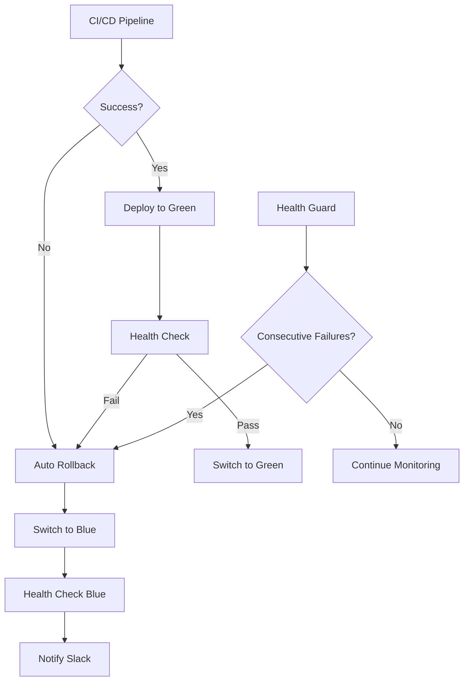

# 원터치 자동 롤백 시스템

이 문서는 Alert Threader 프로젝트의 완전 자동화된 롤백 시스템에 대한 가이드입니다.

## 🎯 개요

원터치 자동 롤백 시스템은 배포 실패 시 자동으로 안전한 상태(Blue upstream)로 복구하는 완전 자동화된 시스템입니다.

### 주요 기능

- **자동 롤백**: CI/CD 파이프라인 실패 시 자동으로 Blue upstream으로 전환
- **헬스 가드**: 연속 실패 감지 시 자동 롤백 실행
- **Slack 통합**: 롤백 명령과 URL을 자동으로 제공
- **로깅**: 모든 롤백 이벤트를 상세히 기록

## 🏗️ 아키텍처



## 📁 파일 구조

```
alert-threader/
├── ops/
│   ├── scripts/
│   │   ├── nginx_switch_blue.sh          # Blue로 즉시 전환
│   │   ├── dreamseed_upstream_switch.sh  # Blue/Green 전환
│   │   └── health_guard_blue.sh          # 연속 실패 감지
│   ├── services/
│   │   ├── threader-health@.service      # 헬스체크 서비스
│   │   └── threader-health@.timer        # 헬스체크 타이머
│   └── nginx/
│       └── dreamseed.conf.tpl            # Nginx 설정 템플릿
├── ansible/
│   └── playbooks/
│       ├── auto_rollback_on_failure.yaml # 자동 롤백 플레이북
│       ├── bluegreen_deploy.yaml         # Blue-Green 배포
│       └── bluegreen_rollback.yaml       # 수동 롤백
└── .github/workflows/
    └── _slack_thread_reply.yml           # Slack 롤백 명령 포함
```

## 🔧 설정 방법

### 1. Nginx 업스트림 설정

```bash
# 업스트림 디렉터리 생성
sudo mkdir -p /etc/nginx/upstreams

# Blue 업스트림 (안정 버전)
sudo tee /etc/nginx/upstreams/threader_blue.conf > /dev/null << 'EOF'
upstream threader_blue {
    server 127.0.0.1:9009 max_fails=3 fail_timeout=30s;
    keepalive 32;
}
EOF

# Green 업스트림 (신규 버전)
sudo tee /etc/nginx/upstreams/threader_green.conf > /dev/null << 'EOF'
upstream threader_green {
    server 127.0.0.1:9010 max_fails=3 fail_timeout=30s;
    keepalive 32;
}
EOF

# 활성 업스트림 (심볼릭 링크)
sudo ln -sfn /etc/nginx/upstreams/threader_blue.conf /etc/nginx/upstreams/threader_active.conf
```

### 2. 스크립트 설치

```bash
# 스크립트들을 시스템에 설치
sudo cp ops/scripts/*.sh /usr/local/sbin/
sudo chmod +x /usr/local/sbin/*.sh

# 헬스 가드 설정
sudo cp ops/services/threader-health@.* /etc/systemd/system/
sudo systemctl daemon-reload
```

### 3. Nginx 설정 적용

```bash
# Nginx 설정 템플릿 적용
sudo ./ops/scripts/deploy_proxy_and_tls.sh dreamseedai.com /var/www/dreamseed/static http://127.0.0.1:8000/ on

# Nginx 설정 검증
sudo nginx -t && sudo systemctl reload nginx
```

## 🚀 사용법

### 자동 롤백 (CI/CD 통합)

#### GitHub Actions
```yaml
# 파이프라인 실패 시 자동 실행
auto-rollback:
  if: failure()
  steps:
    - name: Execute auto rollback
      run: ansible-playbook -i ansible/inventory/hosts.yaml ansible/playbooks/auto_rollback_on_failure.yaml
```

#### GitLab CI
```yaml
# 실패 시 자동 실행
auto_rollback:
  stage: rollback
  rules:
    - when: on_failure
  script:
    - ansible-playbook -i ansible/inventory/hosts.yaml ansible/playbooks/auto_rollback_on_failure.yaml
```

### 수동 롤백

```bash
# 즉시 Blue로 전환
sudo /usr/local/sbin/nginx_switch_blue.sh

# Ansible을 통한 롤백
ansible-playbook -i ansible/inventory/hosts.yaml ansible/playbooks/bluegreen_rollback.yaml

# Blue-Green 전환
sudo /usr/local/sbin/dreamseed_upstream_switch.sh blue   # Blue로
sudo /usr/local/sbin/dreamseed_upstream_switch.sh green  # Green으로
```

### 헬스 가드 설정

```bash
# 특정 인스턴스에 헬스 가드 활성화
sudo systemctl enable --now threader-health@py-a.timer

# 헬스 가드 수동 실행
sudo /usr/local/sbin/health_guard_blue.sh 5 http://127.0.0.1:9009/healthz
```

## 📊 모니터링

### 로그 확인

```bash
# 롤백 이벤트 로그
sudo tail -f /var/log/nginx-rollback.log

# 배포 이벤트 로그
sudo tail -f /var/log/nginx-deploy.log

# 헬스체크 로그
sudo journalctl -u threader-health@py-a.timer -f
```

### 상태 확인

```bash
# 현재 활성 업스트림 확인
ls -la /etc/nginx/upstreams/threader_active.conf

# Nginx 상태 확인
sudo nginx -t && systemctl status nginx

# 서비스 상태 확인
systemctl status alert-threader-python alert-threader-node alert-threader-go
```

## 🔔 Slack 통합

### 롤백 명령 자동 제공

실패 시 Slack 스레드에 다음이 자동으로 포함됩니다:

```
❌ Deployment Failed

*Rollback:*
```bash
ansible-playbook -i ansible/inventory/hosts.yaml ansible/playbooks/bluegreen_rollback.yaml
```
<https://github.com/your-repo/actions|Open rollback playbook>
```

### 환경별 채널 라우팅

- **Staging**: `#deployments-staging`
- **Production**: `#deployments-production`
- **Default**: `#deployments`

## 🛡️ 안전 장치

### 1. 헬스체크 검증
- 롤백 전후 헬스체크 실행
- 연속 실패 시에만 롤백 실행
- 롤백 후 서비스 재시작

### 2. 설정 검증
- Nginx 설정 문법 검사
- 롤백 전 설정 백업
- 실패 시 이전 설정 복원

### 3. 로깅 및 감사
- 모든 롤백 이벤트 기록
- 실행자 및 시간 추적
- 상세한 실패 원인 로깅

## 🔧 문제 해결

### 일반적인 문제

1. **롤백이 실행되지 않음**
   ```bash
   # 스크립트 권한 확인
   ls -la /usr/local/sbin/nginx_switch_blue.sh
   
   # 수동 실행 테스트
   sudo /usr/local/sbin/nginx_switch_blue.sh
   ```

2. **헬스체크 실패**
   ```bash
   # 서비스 상태 확인
   systemctl status alert-threader-python
   
   # 포트 확인
   netstat -tlnp | grep :9009
   
   # 헬스체크 수동 실행
   curl -f http://127.0.0.1:9009/healthz
   ```

3. **Nginx 설정 오류**
   ```bash
   # 설정 검증
   sudo nginx -t
   
   # 설정 파일 확인
   sudo cat /etc/nginx/upstreams/threader_active.conf
   ```

### 디버깅 명령어

```bash
# 전체 롤백 시스템 상태 확인
sudo /usr/local/sbin/nginx_switch_blue.sh && \
curl -f http://127.0.0.1:9009/healthz && \
echo "✅ Rollback system working"

# 헬스 가드 테스트
sudo /usr/local/sbin/health_guard_blue.sh 1 http://127.0.0.1:9999/healthz

# Ansible 롤백 테스트
ansible-playbook -i ansible/inventory/hosts.yaml ansible/playbooks/auto_rollback_on_failure.yaml --check
```

## 📈 성능 최적화

### 롤백 시간 단축

1. **사전 준비된 스크립트**: 모든 스크립트를 사전 설치
2. **병렬 실행**: 여러 서비스 동시 재시작
3. **캐시 활용**: Nginx 설정 캐시 활용

### 모니터링 개선

1. **메트릭 수집**: 롤백 빈도 및 성공률 추적
2. **알림 최적화**: 중요한 이벤트만 알림
3. **대시보드**: 롤백 상태 시각화

## 🔄 업그레이드 가이드

### 새 버전 배포 시

1. **Blue-Green 배포**: Green에 새 버전 배포
2. **헬스체크**: Green 상태 검증
3. **전환**: Green으로 트래픽 전환
4. **롤백 준비**: Blue를 이전 안정 버전으로 유지

### 롤백 시스템 업데이트

1. **스크립트 백업**: 기존 스크립트 백업
2. **새 스크립트 배포**: 새 버전 스크립트 설치
3. **테스트**: 스테이징에서 롤백 테스트
4. **프로덕션 적용**: 검증 후 프로덕션 적용

## 📞 지원

문제가 발생하면:

1. **로그 수집**: 관련 로그 파일 수집
2. **상태 확인**: 시스템 상태 점검
3. **롤백 실행**: 수동 롤백 실행
4. **이슈 생성**: GitHub/GitLab에 이슈 생성

---

이 원터치 자동 롤백 시스템으로 배포 실패 시 즉시 안전한 상태로 복구할 수 있어 서비스 가용성이 크게 향상됩니다.


