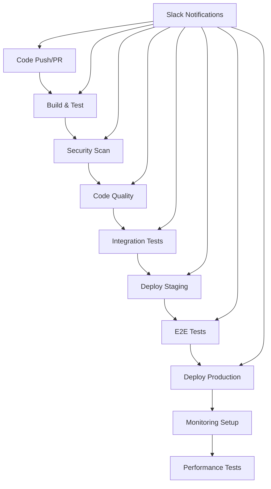

# Alert Threader CI/CD Pipeline

이 문서는 Alert Threader 프로젝트의 완전한 CI/CD 파이프라인에 대한 포괄적인 가이드입니다.

## 📋 목차

- [개요](#개요)
- [아키텍처](#아키텍처)
- [GitHub Actions 워크플로우](#github-actions-워크플로우)
- [GitLab CI/CD](#gitlab-cicd)
- [배포 전략](#배포-전략)
- [모니터링 및 알림](#모니터링-및-알림)
- [보안](#보안)
- [사용법](#사용법)
- [문제 해결](#문제-해결)

## 🎯 개요

Alert Threader CI/CD 파이프라인은 다음과 같은 기능을 제공합니다:

- **멀티 플랫폼 지원**: Python, Node.js, Go 구현체
- **다단계 배포**: Staging → Production
- **다양한 배포 전략**: Rolling, Canary, Blue-Green
- **자동화된 테스트**: Unit, Integration, E2E, Performance
- **보안 스캔**: Trivy, Bandit, Safety
- **모니터링**: Prometheus, Grafana, Alertmanager
- **Slack 스레드 알림**: 배포 과정 추적 및 승인 요청
- **GitHub Environments**: 프로덕션 배포 승인 게이트
- **Browser Compatibility**: Nginx 템플릿, Playwright 테스트
- **Auto-Retry Mechanism**: 지수 백오프를 사용한 자동 재시도
- **QoS Guard-Window**: 롤백 후 시스템 안정성 모니터링

## 🏗️ 아키텍처



## 🔧 GitHub Actions 워크플로우

### 주요 워크플로우

1. **Main CI/CD Pipeline** (`.github/workflows/ci_cd_main.yml`)
   - 전체 파이프라인 오케스트레이션
   - Slack 스레드 알림 통합
   - 환경별 배포 전략

2. **Security Scan** (`.github/workflows/security_scan.yml`)
   - Trivy 취약점 스캔
   - Bandit 보안 린팅
   - Safety 의존성 검사

3. **Performance Test** (`.github/workflows/performance_test.yml`)
   - Locust를 사용한 부하 테스트
   - 성능 메트릭 수집

4. **End-to-End Tests** (`.github/workflows/end_to_end_test.yml`)
   - Playwright를 사용한 브라우저 테스트
   - 사용자 시나리오 검증

5. **Monitoring Setup** (`.github/workflows/monitoring_setup.yml`)
   - Prometheus, Grafana 설정
   - Alertmanager 규칙 구성

### 재사용 가능한 워크플로우

- `_slack_thread_open.yml`: Slack 스레드 시작
- `_slack_thread_reply.yml`: Slack 스레드 답변 (롤백 명령 포함)
- `_slack_notify.yml`: Slack 알림 전송
- `_ansible-runner.yml`: Ansible 플레이북 실행

## 🚀 GitLab CI/CD

### 파이프라인 단계

1. **Build**: 멀티 플랫폼 빌드
2. **Test**: 단위 테스트 실행
3. **Security**: 보안 스캔
4. **Deploy**: 환경별 배포
5. **Canary**: 카나리 배포
6. **Guard**: 가드 검증
7. **Switch**: Blue-Green 전환
8. **Monitor**: 모니터링 설정

### 환경별 배포

- **Staging**: `staging` 브랜치
- **Production**: `main` 브랜치
- **Canary**: 선택된 인스턴스에만 배포

## 📊 배포 전략

### 1. Rolling Update
```yaml
strategy: rolling
max_unavailable: 1
max_surge: 1
```

### 2. Canary Deployment
```yaml
canary_instances: ['py-a']
traffic_percentage: 10
```

### 3. Blue-Green Deployment
```yaml
blue_green:
  active_color: blue
  inactive_color: green
```

## 🔔 모니터링 및 알림

### Slack 통합

- **스레드 기반 알림**: 배포 과정을 하나의 스레드로 추적
- **롤백 명령**: 실패 시 자동으로 롤백 명령 제공
- **환경별 채널**: Staging, Production 별도 채널

### 모니터링 스택

- **Prometheus**: 메트릭 수집
- **Grafana**: 대시보드 및 시각화
- **Alertmanager**: 알림 규칙 및 라우팅

## 🔒 보안

### 보안 스캔 도구

- **Trivy**: 컨테이너 및 파일 시스템 취약점 스캔
- **Bandit**: Python 보안 린팅
- **Safety**: Python 의존성 취약점 검사

### 시크릿 관리

- **SOPS**: 파일 기반 암호화
- **Vault**: 중앙화된 시크릿 관리
- **GitHub Secrets**: CI/CD 시크릿

## 🛡️ 복원력 시스템

### Auto-Retry 메커니즘

- **지수 백오프**: 실패한 작업을 점진적으로 증가하는 지연 시간으로 재시도
- **설정 가능한 재시도**: 최대 시도 횟수와 기본 지연 시간 조정 가능
- **명확한 로깅**: 각 재시도 시도와 지연 시간을 명확히 기록

### QoS Guard-Window

- **안정성 모니터링**: 롤백 후 시스템 안정성을 모니터링
- **SLO 검증**: 5xx 오류 비율, 헬스 비율, 오류 로그 비율 확인
- **자동 잠금/해제**: 안정성 기준에 따라 자동으로 잠금/해제

### 통합 지점

- **GitHub Actions**: `auto-rollback` 작업에서 재시도 메커니즘 사용
- **GitLab CI**: `auto_rollback` 작업에서 재시도 메커니즘 사용
- **Ansible 플레이북**: 롤백 후 QoS 가드 윈도우 자동 잠금

## 🛠️ 사용법

### 1. 환경 설정

```bash
# GitHub Secrets 설정
SLACK_BOT_TOKEN=your_slack_bot_token
SLACK_CHANNEL_ID=your_channel_id
SSH_PRIVATE_KEY=your_ssh_private_key
VAULT_ADDR=your_vault_address
VAULT_ROLE_ID=your_vault_role_id
VAULT_SECRET_ID=your_vault_secret_id
```

### 2. GitLab Variables 설정

```bash
# GitLab CI/CD Variables
SLACK_WEBHOOK_URL=your_slack_webhook_url
SLACK_CHANNEL_ID=your_channel_id
SLACK_CHANNEL_ID_STG=your_staging_channel_id
SLACK_CHANNEL_ID_PROD=your_production_channel_id
SSH_PRIVATE_KEY=your_ssh_private_key
```

### 3. 배포 실행

#### GitHub Actions
```bash
# 수동 배포
gh workflow run ci_cd_main.yml -f environment=staging -f deployment_strategy=canary
```

#### GitLab CI
```bash
# 파이프라인 트리거
curl -X POST \
  -F token=$CI_JOB_TOKEN \
  -F ref=main \
  -F "variables[DEPLOY_ENV]=production" \
  https://gitlab.com/api/v4/projects/$CI_PROJECT_ID/trigger/pipeline
```

### 4. 복원력 시스템 테스트

#### 개별 컴포넌트 테스트
```bash
# 재시도 메커니즘 테스트
./ops/scripts/test_retry_backoff.sh

# QoS 가드 메커니즘 테스트
./ops/scripts/test_qos_guard.sh

# 통합 테스트
./ops/scripts/test_resilience_system.sh
```

#### 수동 테스트
```bash
# 재시도 메커니즘 수동 테스트
/usr/local/sbin/retry_backoff.sh 3 5 -- echo "test"

# QoS 가드 상태 확인
/usr/local/sbin/qos_guard.sh status

# QoS 가드 잠금/해제
/usr/local/sbin/qos_guard.sh lock 5
/usr/local/sbin/qos_guard.sh unlock
```

## 🔧 문제 해결

### 일반적인 문제

1. **Slack 알림 실패**
   - Bot Token 권한 확인
   - 채널 ID 유효성 검사
   - 웹훅 URL 형식 확인

2. **Ansible 배포 실패**
   - SSH 키 권한 확인
   - 인벤토리 파일 검증
   - 플레이북 문법 검사

3. **테스트 실패**
   - 의존성 설치 확인
   - 테스트 환경 설정 검증
   - 로그 파일 분석

4. **복원력 시스템 문제**
   - 재시도 스크립트 권한 확인
   - QoS 가드 잠금 파일 상태 검사
   - SLO 메트릭 수집 확인

### 디버깅 명령어

```bash
# Ansible 디버깅
ansible-playbook -i inventory/hosts.yaml playbook.yaml -vvv

# GitLab CI 디버깅
gitlab-ci-multi-runner exec shell --job build

# GitHub Actions 디버깅
act -j build-and-test

# 복원력 시스템 디버깅
/usr/local/sbin/qos_guard.sh status
ls -la /run/threader.qos.guard
tail -f /var/log/nginx-rollback.log
```

## 📚 추가 리소스

- [GitHub Actions 문서](https://docs.github.com/en/actions)
- [GitLab CI/CD 문서](https://docs.gitlab.com/ee/ci/)
- [Ansible 문서](https://docs.ansible.com/)
- [Prometheus 문서](https://prometheus.io/docs/)
- [Slack API 문서](https://api.slack.com/)
- [Auto-Retry & QoS Guard-Window 가이드](README-Auto-Retry-QoS.md)

## 🤝 기여

CI/CD 파이프라인 개선에 기여하려면:

1. 이슈 생성
2. 브랜치 생성
3. 변경사항 커밋
4. Pull Request 생성
5. 코드 리뷰 및 승인
6. 메인 브랜치 병합

## 📄 라이선스

이 프로젝트는 MIT 라이선스 하에 배포됩니다.