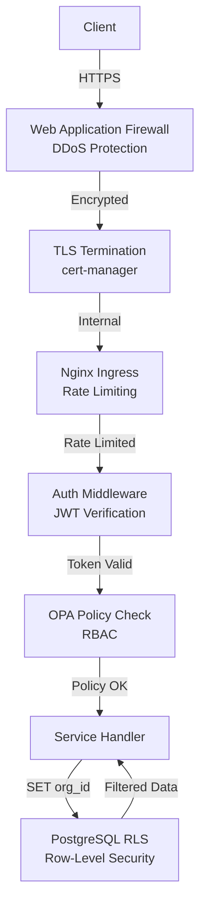

# 00. Architecture Overview

> **Complete system architecture, technology decisions, and architectural decision records (ADRs) for DreamSeedAI**

## Table of Contents

- [Overview](#overview)
- [System Architecture](#system-architecture)
- [Technology Stack](#technology-stack)
- [Architectural Decision Records (ADRs)](#architectural-decision-records-adrs)
- [Data Architecture](#data-architecture)
- [Security Architecture](#security-architecture)
- [Deployment Architecture](#deployment-architecture)
- [Development Environment](#development-environment)

---

## Overview

DreamSeedAI is a **microservices-based adaptive learning platform** that combines:

- **Adaptive Testing** (IRT-based CAT)
- **AI-Powered Tutoring** (LLM with RAG)
- **Learning Analytics** (Predictive models, reporting)
- **Content Management** (Item bank, knowledge graph)
- **Multi-Tenancy** (Organization-level isolation)
- **LMS Integration** (LTI 1.3)

### Design Principles

1. **Microservices First**: Independent, deployable services with clear boundaries
2. **API-Driven**: All functionality exposed via REST APIs (OpenAPI 3.0)
3. **Event-Driven**: Kafka for async communication and audit logs
4. **Security by Default**: Zero-trust, encryption, RBAC, RLS
5. **Multi-Tenant**: Organization-level data isolation (FERPA compliant)
6. **Observable**: Metrics, logs, traces for all components
7. **Scalable**: Horizontal scaling via Kubernetes
8. **Cost-Effective**: <$5/user/month infrastructure cost

---

## System Architecture

### High-Level Architecture

```mermaid
graph TB
    subgraph "Client Layer"
        WEB[Web App<br/>Next.js 14]
        MOBILE[Mobile App<br/>React Native]
        LMS[LMS<br/>Canvas, Moodle]
    end

    subgraph "Edge Layer"
        CDN[CloudFlare CDN<br/>Static Assets]
        WAF[WAF<br/>DDoS Protection]
    end

    subgraph "API Gateway Layer"
        NGINX[Nginx Ingress<br/>SSL, Rate Limiting]
        KONG[Kong Gateway<br/>Alternative]
    end

    subgraph "Authentication Layer"
        AUTH[Auth Service<br/>JWT, OAuth 2.0]
        OPA[OPA<br/>Policy Engine]
    end

    subgraph "Core Services"
        USER[User Service<br/>Profiles, Classes]
        CONTENT[Content Service<br/>Item Bank]
        ASSESS[Assessment Service<br/>IRT, CAT]
        TUTOR[AI Tutor Service<br/>LLM, RAG]
        ANALYTICS[Analytics Service<br/>Reports, Metrics]
        PAYMENT[Payment Service<br/>Stripe]
        INTEGRATION[Integration Service<br/>LTI 1.3]
    end

    subgraph "Data Layer"
        PG[(PostgreSQL 15<br/>Primary DB + RLS)]
        REDIS[(Redis 7<br/>Cache, Sessions)]
        KAFKA[Kafka<br/>Event Stream]
        MINIO[MinIO<br/>Object Storage)]
        VECTOR[(pgvector<br/>Embeddings)]
    end

    subgraph "AI/ML Layer"
        IRT[IRT Engine<br/>scipy, statsmodels]
        NLP[NLP Engine<br/>OpenAI, Gemini]
        QUARTO[Quarto<br/>Report Generation]
    end

    subgraph "Infrastructure"
        K8S[Kubernetes<br/>GKE, EKS, AKS]
        PROM[Prometheus<br/>Metrics]
        GRAFANA[Grafana<br/>Dashboards]
        ELK[ELK Stack<br/>Logs]
        JAEGER[Jaeger<br/>Traces]
    end

    WEB --> CDN --> WAF --> NGINX
    MOBILE --> WAF --> NGINX
    LMS --> NGINX

    NGINX --> AUTH
    AUTH --> OPA

    NGINX --> USER
    NGINX --> CONTENT
    NGINX --> ASSESS
    NGINX --> TUTOR
    NGINX --> ANALYTICS
    NGINX --> PAYMENT
    NGINX --> INTEGRATION

    USER --> PG
    USER --> REDIS
    USER --> KAFKA

    CONTENT --> PG
    CONTENT --> VECTOR
    CONTENT --> MINIO

    ASSESS --> PG
    ASSESS --> REDIS
    ASSESS --> IRT

    TUTOR --> PG
    TUTOR --> VECTOR
    TUTOR --> NLP

    ANALYTICS --> PG
    ANALYTICS --> QUARTO
    ANALYTICS --> MINIO

    PAYMENT --> PG
    PAYMENT --> KAFKA

    INTEGRATION --> PG
    INTEGRATION --> KAFKA

    K8S --> PROM --> GRAFANA
    K8S --> ELK
    K8S --> JAEGER
```

### Service Breakdown

| Service                 | Responsibility                            | Technology | Database              | Cache |
| ----------------------- | ----------------------------------------- | ---------- | --------------------- | ----- |
| **Auth Service**        | JWT tokens, OAuth 2.0, OIDC, social login | FastAPI    | PostgreSQL            | Redis |
| **User Service**        | User profiles, class assignments, roles   | FastAPI    | PostgreSQL            | Redis |
| **Content Service**     | Item bank, standards, versioning          | FastAPI    | PostgreSQL + pgvector | Redis |
| **Assessment Service**  | IRT models, CAT algorithm, scoring        | FastAPI    | PostgreSQL            | Redis |
| **AI Tutor Service**    | LLM integration, RAG, conversations       | FastAPI    | PostgreSQL + pgvector | Redis |
| **Analytics Service**   | Learning analytics, reports (Quarto)      | FastAPI    | PostgreSQL            | Redis |
| **Payment Service**     | Stripe subscriptions, licenses            | FastAPI    | PostgreSQL            | Redis |
| **Integration Service** | LTI 1.3, LMS connectivity                 | FastAPI    | PostgreSQL            | Redis |

---

## Technology Stack

### Backend Services

```python
# Core Framework
FastAPI==0.104.1
uvicorn[standard]==0.24.0
pydantic==2.5.0
pydantic-settings==2.1.0

# Database
sqlalchemy==2.0.23
alembic==1.12.1
psycopg2-binary==2.9.9
asyncpg==0.29.0

# Caching & Sessions
redis==5.0.1
hiredis==2.2.3

# Message Queue
kafka-python==2.0.2
celery==5.3.4
kombu==5.3.4

# Authentication
python-jose[cryptography]==3.3.0
passlib[bcrypt]==1.7.4
python-multipart==0.0.6

# AI/ML
scipy==1.11.4
statsmodels==0.14.0
scikit-learn==1.3.2
openai==1.3.0
langchain==0.0.340
chromadb==0.4.18

# Testing
pytest==7.4.3
pytest-asyncio==0.21.1
pytest-cov==4.1.0
httpx==0.25.2
faker==20.1.0

# Code Quality
ruff==0.1.6
black==23.11.0
mypy==1.7.1
bandit==1.7.5
```

### Frontend

```json
{
  "dependencies": {
    "react": "^18.2.0",
    "next": "^14.0.0",
    "typescript": "^5.3.0",
    "@tanstack/react-query": "^5.8.0",
    "zustand": "^4.4.0",
    "react-hook-form": "^7.48.0",
    "zod": "^3.22.0",
    "@tiptap/react": "^2.1.0",
    "tailwindcss": "^3.3.0",
    "shadcn-ui": "latest"
  }
}
```

### Infrastructure

```yaml
# Kubernetes Stack
Kubernetes: v1.28+
Helm: v3.13+
Cert-Manager: v1.13+
Nginx Ingress: v1.9+
Sealed Secrets: v0.24+

# Databases
PostgreSQL: v15.5
Redis: v7.2
Apache Kafka: v3.6
MinIO: v2023.11

# Monitoring
Prometheus: v2.48
Grafana: v10.2
Elasticsearch: v8.11
Logstash: v8.11
Kibana: v8.11
Jaeger: v1.52
```

---

## Architectural Decision Records (ADRs)

### ADR-001: FastAPI over Django/Flask

**Status**: Accepted

**Context**: Need high-performance async API framework for real-time IRT calculations and LLM calls.

**Decision**: Use FastAPI for all backend services.

**Rationale**:

- **Performance**: ASGI-based, 3-5x faster than Flask
- **Async/Await**: Native async support for I/O-bound operations (DB, Redis, OpenAI API)
- **Type Safety**: Pydantic models provide runtime validation
- **Auto Documentation**: OpenAPI/Swagger UI out-of-the-box
- **Modern**: Python 3.11+ with latest features

**Alternatives Considered**:

- **Django**: Too heavy, sync-first, ORM lock-in
- **Flask**: Sync-only, lacks native validation

**Consequences**:

- ✅ Better performance for real-time CAT
- ✅ Type-safe API contracts
- ⚠️ Team learning curve (async programming)

---

### ADR-002: PostgreSQL with RLS over Separate Databases

**Status**: Accepted

**Context**: Need strict multi-tenancy with data isolation (FERPA requirement).

**Decision**: Single PostgreSQL instance with Row-Level Security (RLS) policies per organization.

**Rationale**:

- **Security**: Database-enforced isolation (cannot be bypassed by application bugs)
- **Cost**: One database instance vs hundreds
- **Maintenance**: Single schema migration
- **Performance**: Modern PostgreSQL handles RLS efficiently with proper indexing
- **Compliance**: FERPA/GDPR compliant by design

**Alternatives Considered**:

- **Schema-per-tenant**: Complex migrations, connection pooling issues
- **Database-per-tenant**: Expensive, hard to maintain
- **Application-level filtering**: Error-prone, not truly secure

**Consequences**:

- ✅ Strong security guarantees
- ✅ Lower infrastructure costs
- ⚠️ Must set `app.current_organization_id` on every request
- ⚠️ Cross-tenant analytics require special handling

**Implementation**:

```sql
-- Enable RLS on all tenant tables
ALTER TABLE users ENABLE ROW LEVEL SECURITY;

-- Policy: Users can only see their organization's data
CREATE POLICY org_isolation ON users
    USING (organization_id = current_setting('app.current_organization_id')::uuid);
```

---

### ADR-003: Kafka over RabbitMQ for Event Streaming

**Status**: Accepted

**Context**: Need durable event log for audit trails and inter-service communication.

**Decision**: Use Apache Kafka for event streaming, Celery with RabbitMQ for task queue.

**Rationale**:

- **Durability**: Kafka retains events (configurable retention)
- **Audit Log**: Immutable event log for compliance
- **Replay**: Can replay events for debugging or data recovery
- **Scale**: Handles high throughput (millions of events/day)
- **Ecosystem**: Strong Python support (kafka-python, confluent-kafka)

**Alternatives Considered**:

- **RabbitMQ**: Better for task queue, but messages are ephemeral
- **Redis Streams**: Simpler, but less mature ecosystem
- **AWS SQS**: Vendor lock-in, higher latency

**Consequences**:

- ✅ Complete audit trail
- ✅ Event sourcing capabilities
- ⚠️ Additional operational complexity (Kafka cluster)
- ⚠️ Higher memory usage

**Usage Pattern**:

- **Kafka**: Audit logs, user events, data changes (immutable)
- **Celery + RabbitMQ**: Background tasks (report generation, emails)

---

### ADR-004: pgvector over Pinecone for Vector Search

**Status**: Accepted

**Context**: Need vector embeddings for semantic search and RAG.

**Decision**: Use pgvector extension in PostgreSQL.

**Rationale**:

- **Simplicity**: Single database (PostgreSQL) for both structured and vector data
- **Cost**: No external SaaS fees
- **Performance**: HNSW index provides fast approximate nearest neighbor search
- **Data Locality**: Vectors stored with metadata (no cross-service joins)
- **Open Source**: No vendor lock-in

**Alternatives Considered**:

- **Pinecone**: SaaS, expensive at scale ($70-$700/month)
- **Weaviate**: Separate database to maintain
- **FAISS**: In-memory only, no persistence

**Consequences**:

- ✅ Lower operational costs
- ✅ Simplified architecture
- ⚠️ Limited to ~1M vectors (for now, can scale with read replicas)
- ⚠️ Must manage PostgreSQL extensions

**Implementation**:

```sql
-- Enable pgvector extension
CREATE EXTENSION IF NOT EXISTS vector;

-- Create table with vector column
CREATE TABLE embeddings (
    id UUID PRIMARY KEY,
    content_id UUID REFERENCES contents(id),
    embedding vector(1536),  -- OpenAI embedding size
    created_at TIMESTAMPTZ DEFAULT NOW()
);

-- Create HNSW index for fast similarity search
CREATE INDEX ON embeddings USING hnsw (embedding vector_cosine_ops);

-- Similarity search query
SELECT content_id, 1 - (embedding <=> '[...]'::vector) AS similarity
FROM embeddings
WHERE organization_id = current_setting('app.current_organization_id')::uuid
ORDER BY embedding <=> '[...]'::vector
LIMIT 10;
```

---

### ADR-005: Quarto over LaTeX for Report Generation

**Status**: Accepted

**Context**: Need to generate PDF reports with statistical analysis, charts, and tables.

**Decision**: Use Quarto (with R/Python support) for report generation.

**Rationale**:

- **Flexibility**: Mix R, Python, SQL in one document
- **Templates**: Reusable templates with parameters
- **Output Formats**: PDF, HTML, Word, PowerPoint
- **Statistical Analysis**: Native integration with statsmodels, ggplot2
- **Modern**: Actively developed (successor to R Markdown)

**Alternatives Considered**:

- **LaTeX**: Steep learning curve, hard to maintain
- **ReportLab (Python)**: Programmatic, but less flexible for complex layouts
- **WeasyPrint**: HTML to PDF, but limited statistical support

**Consequences**:

- ✅ Beautiful statistical reports
- ✅ Reproducible research
- ⚠️ Requires R installation (Docker image: `quarto/quarto:latest`)
- ⚠️ Slower rendering (5-30 seconds per report)

**Example Quarto Template**:

````qmd
---
title: "Student Learning Report"
format: pdf
params:
  student_id: "uuid-here"
  start_date: "2024-01-01"
  end_date: "2024-12-31"
---

## Learning Progress

```{python}
import pandas as pd
from sqlalchemy import create_engine

engine = create_engine(os.getenv("DATABASE_URL"))
query = f"""
    SELECT skill_name, ability_estimate, created_at
    FROM assessments
    WHERE student_id = '{params['student_id']}'
    AND created_at BETWEEN '{params['start_date']}' AND '{params['end_date']}'
"""
df = pd.read_sql(query, engine)
````

```{python}
import matplotlib.pyplot as plt
plt.plot(df['created_at'], df['ability_estimate'])
plt.xlabel('Date')
plt.ylabel('Ability Estimate')
plt.title('Learning Trajectory')
plt.show()
```

````

---

### ADR-006: Kubernetes over Docker Swarm

**Status**: Accepted

**Context**: Need container orchestration for microservices deployment.

**Decision**: Deploy on Kubernetes (GKE, EKS, or AKS).

**Rationale**:
- **Industry Standard**: 90%+ of container orchestration market
- **Ecosystem**: Helm, Operators, Ingress controllers, monitoring tools
- **Cloud Native**: First-class support on all major clouds
- **Auto-scaling**: HPA (Horizontal Pod Autoscaler) for dynamic scaling
- **Managed Options**: GKE Autopilot, EKS Fargate reduce operational burden

**Alternatives Considered**:
- **Docker Swarm**: Simpler, but limited ecosystem
- **Nomad**: HashiCorp ecosystem, but less adoption
- **ECS**: AWS-only, vendor lock-in

**Consequences**:
- ✅ Production-ready orchestration
- ✅ Strong community and tooling
- ⚠️ Steeper learning curve
- ⚠️ Higher operational complexity (mitigated by managed K8s)

---

### ADR-007: JWT over Session Cookies

**Status**: Accepted

**Context**: Need authentication mechanism for stateless microservices.

**Decision**: Use JWT (JSON Web Tokens) with short expiry + refresh token pattern.

**Rationale**:
- **Stateless**: No server-side session storage required
- **Microservices**: Token can be validated by any service
- **Mobile-Friendly**: Works well with mobile apps
- **Standards-Based**: OAuth 2.0, OIDC compatible

**Alternatives Considered**:
- **Session Cookies**: Requires sticky sessions or shared Redis
- **API Keys**: No expiry, hard to rotate

**Consequences**:
- ✅ Scalable authentication
- ✅ Mobile and SPA support
- ⚠️ Cannot revoke tokens before expiry (mitigation: short expiry + refresh token)
- ⚠️ Must protect against XSS (httpOnly cookies for refresh tokens)

**Implementation**:
```python
from datetime import datetime, timedelta
from jose import jwt

# Configuration
SECRET_KEY = os.getenv("JWT_SECRET_KEY")
ALGORITHM = "HS256"
ACCESS_TOKEN_EXPIRE_MINUTES = 15
REFRESH_TOKEN_EXPIRE_DAYS = 7

def create_access_token(user_id: str, organization_id: str) -> str:
    expire = datetime.utcnow() + timedelta(minutes=ACCESS_TOKEN_EXPIRE_MINUTES)
    to_encode = {
        "sub": user_id,
        "org_id": organization_id,
        "exp": expire,
        "type": "access"
    }
    return jwt.encode(to_encode, SECRET_KEY, algorithm=ALGORITHM)

def create_refresh_token(user_id: str) -> str:
    expire = datetime.utcnow() + timedelta(days=REFRESH_TOKEN_EXPIRE_DAYS)
    to_encode = {
        "sub": user_id,
        "exp": expire,
        "type": "refresh"
    }
    return jwt.encode(to_encode, SECRET_KEY, algorithm=ALGORITHM)
````

---

### ADR-008: Monorepo over Multi-Repo

**Status**: Accepted

**Context**: Need to manage multiple services, shared libraries, and frontend apps.

**Decision**: Use monorepo with pnpm workspaces (frontend) and Python namespace packages (backend).

**Rationale**:

- **Code Sharing**: Shared libraries (Pydantic models, utilities) across services
- **Atomic Changes**: Cross-service changes in one PR
- **Consistent Tooling**: Single CI/CD, linting, formatting
- **Developer Experience**: Clone once, see everything

**Alternatives Considered**:

- **Multi-Repo**: Harder to share code, versioning hell
- **Microrepo per service**: Too many repositories

**Consequences**:

- ✅ Easier refactoring
- ✅ Single source of truth
- ⚠️ Larger repository size
- ⚠️ Need sparse checkout for CI/CD (only build changed services)

**Structure**:

```
dreamseed_monorepo/
├── services/
│   ├── auth/
│   ├── user/
│   ├── content/
│   ├── assessment/
│   ├── tutor/
│   ├── analytics/
│   ├── payment/
│   └── integration/
├── shared/
│   ├── models/          # Pydantic models
│   ├── utils/           # Common utilities
│   ├── clients/         # Service clients
│   └── schemas/         # OpenAPI schemas
├── apps/
│   ├── portal_front/    # Main web app
│   ├── examinee-frontend/
│   └── mobile/
├── infrastructure/
│   ├── k8s/
│   ├── terraform/
│   └── docker/
└── docs/
    ├── system_layer/
    └── implementation/
```

---

## Data Architecture

### Database Schema Strategy

**Multi-Tenant Schema Design**:

```sql
-- Organization table (tenant)
CREATE TABLE organizations (
    id UUID PRIMARY KEY DEFAULT gen_random_uuid(),
    name VARCHAR(255) NOT NULL,
    slug VARCHAR(100) UNIQUE NOT NULL,
    plan_type VARCHAR(50) NOT NULL, -- 'individual', 'school', 'enterprise'
    max_seats INT,
    created_at TIMESTAMPTZ DEFAULT NOW(),
    updated_at TIMESTAMPTZ DEFAULT NOW()
);

-- Users table with RLS
CREATE TABLE users (
    id UUID PRIMARY KEY DEFAULT gen_random_uuid(),
    organization_id UUID NOT NULL REFERENCES organizations(id) ON DELETE CASCADE,
    email VARCHAR(255) NOT NULL,
    hashed_password VARCHAR(255),
    role VARCHAR(50) NOT NULL, -- 'admin', 'teacher', 'student'
    created_at TIMESTAMPTZ DEFAULT NOW(),
    updated_at TIMESTAMPTZ DEFAULT NOW(),
    UNIQUE(organization_id, email)
);

-- Enable RLS
ALTER TABLE users ENABLE ROW LEVEL SECURITY;

-- Policy: Users can only access their organization's data
CREATE POLICY users_org_isolation ON users
    FOR ALL
    USING (organization_id = current_setting('app.current_organization_id')::uuid);

-- Index for performance
CREATE INDEX idx_users_org ON users(organization_id);
CREATE INDEX idx_users_email ON users(email);
```

### Data Partitioning

For high-volume tables (assessments, events), use PostgreSQL partitioning:

```sql
-- Partition assessments by organization_id
CREATE TABLE assessments (
    id UUID NOT NULL,
    organization_id UUID NOT NULL,
    student_id UUID NOT NULL,
    ability_estimate NUMERIC(5,3),
    created_at TIMESTAMPTZ DEFAULT NOW()
) PARTITION BY HASH (organization_id);

-- Create partitions
CREATE TABLE assessments_p0 PARTITION OF assessments FOR VALUES WITH (MODULUS 4, REMAINDER 0);
CREATE TABLE assessments_p1 PARTITION OF assessments FOR VALUES WITH (MODULUS 4, REMAINDER 1);
CREATE TABLE assessments_p2 PARTITION OF assessments FOR VALUES WITH (MODULUS 4, REMAINDER 2);
CREATE TABLE assessments_p3 PARTITION OF assessments FOR VALUES WITH (MODULUS 4, REMAINDER 3);
```

### Caching Strategy

```python
from functools import lru_cache
from redis import Redis
import json

redis = Redis(host='redis', port=6379, decode_responses=True)

# L1: In-memory cache (per-process)
@lru_cache(maxsize=1000)
def get_item_parameters_l1(item_id: str):
    return _fetch_from_db(item_id)

# L2: Redis cache (shared)
def get_item_parameters(item_id: str):
    # Try L2 cache first
    cached = redis.get(f"item:{item_id}")
    if cached:
        return json.loads(cached)

    # Fetch from DB
    params = _fetch_from_db(item_id)

    # Store in L2 cache (1 hour TTL)
    redis.setex(f"item:{item_id}", 3600, json.dumps(params))

    return params
```

---

## Security Architecture

### Defense in Depth



### Security Layers

1. **Network Layer**: WAF, DDoS protection, IP whitelisting
2. **Transport Layer**: TLS 1.3, strong cipher suites
3. **Application Layer**: Rate limiting, input validation, CSRF protection
4. **Authentication Layer**: JWT, OAuth 2.0, MFA support
5. **Authorization Layer**: OPA policies, RBAC
6. **Data Layer**: PostgreSQL RLS, encryption at rest
7. **Audit Layer**: Kafka event log, immutable audit trail

### Encryption

```python
# Encryption at rest (PostgreSQL)
# pgcrypto extension for column-level encryption
CREATE EXTENSION IF NOT EXISTS pgcrypto;

CREATE TABLE sensitive_data (
    id UUID PRIMARY KEY,
    organization_id UUID NOT NULL,
    encrypted_ssn BYTEA,  -- Encrypted with pgcrypto
    created_at TIMESTAMPTZ DEFAULT NOW()
);

-- Insert encrypted data
INSERT INTO sensitive_data (organization_id, encrypted_ssn)
VALUES (
    'org-uuid',
    pgp_sym_encrypt('123-45-6789', current_setting('app.encryption_key'))
);

-- Query encrypted data
SELECT id, pgp_sym_decrypt(encrypted_ssn, current_setting('app.encryption_key')) AS ssn
FROM sensitive_data
WHERE organization_id = current_setting('app.current_organization_id')::uuid;
```

---

## Deployment Architecture

### Kubernetes Cluster Layout

```yaml
# Namespace organization
namespaces:
  - production # Production services
  - staging # Staging environment
  - monitoring # Prometheus, Grafana
  - logging # ELK stack
  - kafka # Kafka cluster
  - databases # PostgreSQL, Redis
```

### Service Deployment Pattern

```yaml
# Example: Assessment Service Deployment
apiVersion: apps/v1
kind: Deployment
metadata:
  name: assessment-service
  namespace: production
spec:
  replicas: 3
  selector:
    matchLabels:
      app: assessment-service
  template:
    metadata:
      labels:
        app: assessment-service
        version: v1.2.3
    spec:
      containers:
        - name: assessment
          image: gcr.io/dreamseed/assessment:v1.2.3
          ports:
            - containerPort: 8000
          env:
            - name: DATABASE_URL
              valueFrom:
                secretKeyRef:
                  name: postgres-credentials
                  key: url
            - name: REDIS_URL
              value: "redis://redis:6379/0"
          resources:
            requests:
              memory: "256Mi"
              cpu: "100m"
            limits:
              memory: "512Mi"
              cpu: "500m"
          livenessProbe:
            httpGet:
              path: /health
              port: 8000
            initialDelaySeconds: 10
            periodSeconds: 30
          readinessProbe:
            httpGet:
              path: /ready
              port: 8000
            initialDelaySeconds: 5
            periodSeconds: 10
---
apiVersion: v1
kind: Service
metadata:
  name: assessment-service
  namespace: production
spec:
  selector:
    app: assessment-service
  ports:
    - port: 80
      targetPort: 8000
  type: ClusterIP
---
apiVersion: autoscaling/v2
kind: HorizontalPodAutoscaler
metadata:
  name: assessment-hpa
  namespace: production
spec:
  scaleTargetRef:
    apiVersion: apps/v1
    kind: Deployment
    name: assessment-service
  minReplicas: 3
  maxReplicas: 20
  metrics:
    - type: Resource
      resource:
        name: cpu
        target:
          type: Utilization
          averageUtilization: 70
    - type: Resource
      resource:
        name: memory
        target:
          type: Utilization
          averageUtilization: 80
```

### CI/CD Pipeline

```yaml
# .github/workflows/deploy-assessment.yml
name: Deploy Assessment Service

on:
  push:
    branches: [main]
    paths:
      - "services/assessment/**"

jobs:
  build-and-deploy:
    runs-on: ubuntu-latest
    steps:
      - uses: actions/checkout@v4

      - name: Run tests
        run: |
          cd services/assessment
          python -m pytest

      - name: Build Docker image
        run: |
          docker build -t gcr.io/dreamseed/assessment:${{ github.sha }} \
            -f services/assessment/Dockerfile .

      - name: Push to registry
        run: |
          docker push gcr.io/dreamseed/assessment:${{ github.sha }}

      - name: Deploy to staging
        run: |
          kubectl set image deployment/assessment-service \
            assessment=gcr.io/dreamseed/assessment:${{ github.sha }} \
            -n staging

      - name: Run smoke tests
        run: |
          ./scripts/smoke-test.sh staging

      - name: Deploy to production (manual approval)
        if: github.event.review.state == 'approved'
        run: |
          kubectl set image deployment/assessment-service \
            assessment=gcr.io/dreamseed/assessment:${{ github.sha }} \
            -n production
```

---

## Development Environment

### Local Setup

```bash
# 1. Install dependencies
brew install python@3.11 node@18 docker kubectl helm

# 2. Clone repository
git clone https://github.com/dreamseedai/dreamseed_monorepo.git
cd dreamseed_monorepo

# 3. Set up Python virtual environment
python3.11 -m venv venv
source venv/bin/activate
pip install -r requirements-dev.txt

# 4. Set up environment variables
cp .env.example .env
# Edit .env with your settings

# 5. Start local infrastructure
docker-compose up -d postgres redis kafka

# 6. Run database migrations
alembic upgrade head

# 7. Start a service (e.g., assessment)
cd services/assessment
uvicorn main:app --reload --port 8001
```

### Docker Compose for Local Development

```yaml
# docker-compose.yml
version: "3.8"

services:
  postgres:
    image: postgres:15-alpine
    environment:
      POSTGRES_DB: dreamseed
      POSTGRES_USER: admin
      POSTGRES_PASSWORD: dev_password
    ports:
      - "5432:5432"
    volumes:
      - postgres_data:/var/lib/postgresql/data

  redis:
    image: redis:7-alpine
    ports:
      - "6379:6379"

  kafka:
    image: confluentinc/cp-kafka:7.5.0
    environment:
      KAFKA_BROKER_ID: 1
      KAFKA_ZOOKEEPER_CONNECT: zookeeper:2181
      KAFKA_ADVERTISED_LISTENERS: PLAINTEXT://localhost:9092
    ports:
      - "9092:9092"
    depends_on:
      - zookeeper

  zookeeper:
    image: confluentinc/cp-zookeeper:7.5.0
    environment:
      ZOOKEEPER_CLIENT_PORT: 2181

volumes:
  postgres_data:
```

---

## Next Steps

1. ✅ **Understand Architecture**: Review this document
2. 📖 **Read Implementation Guides**:
   - [01-fastapi-microservices.md](./01-fastapi-microservices.md) - Service structure
   - [02-irt-cat-implementation.md](./02-irt-cat-implementation.md) - Assessment engine
   - [05-multi-tenancy-rls.md](./05-multi-tenancy-rls.md) - Data isolation
3. 🛠️ **Set Up Local Environment**: Follow [Development Environment](#development-environment)
4. 🚀 **Build First Service**: Start with User Service (simplest)

---

_Last Updated: November 9, 2025_
_Version: 1.0.0_
