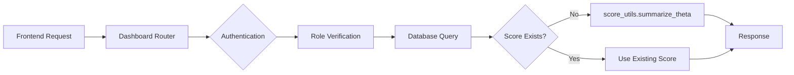

# Dashboard API - Teacher/Parent CAT Results Integration

## 📋 Overview

교사와 학부모가 학생의 적응형 시험(CAT) 결과를 조회할 수 있는 대시보드 API 구현.

**핵심 기능**:
- ✅ 교사용 반 전체 시험 요약 조회
- ✅ 교사용 개별 학생 시험 히스토리 조회
- ✅ 학부모용 자녀 시험 히스토리 조회
- ✅ 반 전체 통계 (평균, 등급 분포, 점수 분포)
- ✅ 자동 theta→점수/등급 변환 (score_utils 통합)

**구현 위치**: `backend/app/api/routers/dashboard.py` (630 lines)

---

## 🎯 API Endpoints

### 1. 교사용 API

#### GET /api/dashboard/teacher/classes/{class_id}/exams
**반 전체 시험 요약**

```bash
curl -X GET http://localhost:8000/api/dashboard/teacher/classes/1/exams
```

**Response**:
```json
{
  "class_id": 1,
  "name": "고1-수학-1반",
  "subject": "math",
  "student_count": 25,
  "exam_summary": [
    {
      "exam_session_id": 101,
      "student_id": 5,
      "exam_type": "placement",
      "ended_at": "2024-11-20T10:30:00",
      "score": 75.5,
      "grade_numeric": 2,
      "grade_letter": "B"
    }
  ],
  "students": [
    {
      "student_id": 5,
      "latest_exam": {
        "exam_session_id": 101,
        "score": 75.5,
        "grade_numeric": 2
      },
      "exam_count": 3
    }
  ]
}
```

#### GET /api/dashboard/teacher/students/{student_id}/exams
**개별 학생 시험 히스토리**

```bash
curl -X GET http://localhost:8000/api/dashboard/teacher/students/5/exams
```

**Response**:
```json
{
  "student_id": 5,
  "exams": [
    {
      "exam_session_id": 101,
      "exam_type": "placement",
      "status": "completed",
      "started_at": "2024-11-20T10:00:00",
      "ended_at": "2024-11-20T10:30:00",
      "theta": 0.75,
      "standard_error": 0.35,
      "score": 62.5,
      "grade_numeric": 2,
      "grade_letter": "B"
    }
  ]
}
```

#### GET /api/dashboard/teacher/classes/{class_id}/statistics
**반 전체 통계**

```bash
curl -X GET http://localhost:8000/api/dashboard/teacher/classes/1/statistics
```

**Response**:
```json
{
  "class_id": 1,
  "average_score": 68.5,
  "grade_distribution": {
    "1": 3,
    "2": 7,
    "3": 8,
    "4": 5,
    "5": 2
  },
  "score_distribution": [
    {"bin": 50, "count": 5},
    {"bin": 60, "count": 10},
    {"bin": 70, "count": 8},
    {"bin": 80, "count": 2}
  ],
  "total_exams": 25
}
```

### 2. 학부모용 API

#### GET /api/dashboard/parent/children/{student_id}/exams
**자녀 시험 히스토리**

```bash
curl -X GET http://localhost:8000/api/dashboard/parent/children/5/exams
```

**Response**:
```json
{
  "student_id": 5,
  "exams": [
    {
      "exam_session_id": 101,
      "exam_type": "practice",
      "date": "2024-11-20T10:30:00",
      "score": 75.5,
      "grade_numeric": 2,
      "grade_letter": "B",
      "percentile": 77.3
    }
  ]
}
```

---

## 🔧 Implementation Details

### 1. Score Conversion Integration

**자동 변환 로직**:
```python
from app.services.score_utils import summarize_theta

# ExamSession에 score가 없을 때 자동 계산
if sess.score is None and sess.theta is not None:
    summary = summarize_theta(float(sess.theta))
    score = summary["score_0_100"]
    grade_numeric = summary["grade_numeric"]
    grade_letter = summary["grade_letter"]
```

**변환 결과**:
- `score_0_100`: 0-100 점수
- `grade_numeric`: 1-9 등급
- `grade_letter`: A/B/C/D/F 알파벳 등급
- `percentile`: 백분위 (학부모용)
- `t_score`: T점수 (심화 분석용)

### 2. Authentication & Authorization

**현재 상태**: 임시 구현 (테스트용)
```python
# TODO: Uncomment when auth is implemented
# current_user=Depends(get_current_user)

# TEMPORARY: Get first teacher/parent for testing
stmt = select(Teacher).limit(1)
```

**실제 구현 필요**:
```python
async def _get_current_teacher(
    current_user=Depends(get_current_user),
    session: AsyncSession = Depends(get_db),
) -> Teacher:
    if current_user.role != "teacher":
        raise HTTPException(403, "교사만 접근할 수 있습니다.")
    
    stmt = select(Teacher).where(Teacher.user_id == current_user.id)
    result = await session.execute(stmt)
    teacher = result.scalar_one_or_none()
    
    if not teacher:
        raise HTTPException(404, "Teacher not found")
    return teacher
```

### 3. Parent-Student Relationship Verification

**현재 상태**: Organization 기반 간단 검증
```python
async def _verify_parent_access_to_student(
    parent_user: User,
    student: Student,
    session: AsyncSession
) -> None:
    # TEMPORARY: Simple org-based check
    if parent_user.organization_id != student_user.organization_id:
        raise HTTPException(403, "자녀에 대한 접근 권한이 없습니다.")
```

**실제 구현 필요**:
- ParentApproval 테이블 확인
- parent_student relationship 검증
- RLS 정책 적용
- 승인 대기/승인됨 상태 확인

### 4. Data Flow



---

## 📊 Database Schema Usage

### ExamSession 테이블

```python
class ExamSession:
    id: int
    student_id: int
    class_id: Optional[int]
    exam_type: str  # "placement", "practice", "official"
    status: str     # "in_progress", "completed"
    theta: Decimal  # IRT ability estimate
    standard_error: Decimal
    score: Decimal  # 0-100 score (calculated from theta)
    meta: dict      # {"grade_numeric": 2, "grade_letter": "B", ...}
    started_at: datetime
    ended_at: datetime
```

**meta 필드 구조**:
```json
{
  "grade_numeric": 2,
  "grade_letter": "B",
  "percentile": 77.3,
  "t_score": 57.5,
  "korean_grade": 2
}
```

### 관련 테이블

- `Student`: 학생 정보
- `Teacher`: 교사 정보
- `Class`: 반 정보
- `StudentClassroom`: 학생-반 관계
- `User`: 사용자 정보 (role: teacher/parent/student)

---

## 🧪 Testing

### 1. Manual Testing

```bash
cd backend

# Start FastAPI server
uvicorn main:app --reload --port 8000

# Test teacher API
curl -X GET http://localhost:8000/api/dashboard/teacher/classes/1/exams | jq

# Test parent API
curl -X GET http://localhost:8000/api/dashboard/parent/children/1/exams | jq

# Test statistics
curl -X GET http://localhost:8000/api/dashboard/teacher/classes/1/statistics | jq
```

### 2. Unit Tests (TODO)

```python
# tests/test_dashboard_api.py
import pytest
from fastapi.testclient import TestClient

def test_teacher_class_exam_summary():
    response = client.get("/api/dashboard/teacher/classes/1/exams")
    assert response.status_code == 200
    data = response.json()
    assert "class_id" in data
    assert "student_count" in data

def test_parent_child_exam_history():
    response = client.get("/api/dashboard/parent/children/1/exams")
    assert response.status_code == 200
    data = response.json()
    assert "student_id" in data
    assert "exams" in data
```

### 3. Integration Testing with ExamSession

```python
# Create test exam session with theta
exam_sess = ExamSession(
    student_id=1,
    class_id=1,
    exam_type="placement",
    theta=0.75,
    standard_error=0.35,
    status="completed"
)
db.add(exam_sess)
await db.commit()

# Query dashboard API
response = client.get("/api/dashboard/teacher/classes/1/exams")
assert response.json()["exam_summary"][0]["score"] == 62.5  # Auto-converted
```

---

## 🎨 Frontend Integration

### React Example (Teacher Dashboard)

```typescript
// components/TeacherDashboard.tsx
import { useEffect, useState } from 'react';

interface ClassExamSummary {
  class_id: number;
  name: string;
  student_count: number;
  exam_summary: Array<{
    exam_session_id: number;
    student_id: number;
    score: number;
    grade_numeric: number;
    grade_letter: string;
  }>;
}

export function TeacherDashboard({ classId }: { classId: number }) {
  const [data, setData] = useState<ClassExamSummary | null>(null);
  
  useEffect(() => {
    fetch(`/api/dashboard/teacher/classes/${classId}/exams`)
      .then(res => res.json())
      .then(setData);
  }, [classId]);
  
  if (!data) return <div>Loading...</div>;
  
  return (
    <div>
      <h1>{data.name} - 시험 결과</h1>
      <p>학생 수: {data.student_count}명</p>
      
      <table>
        <thead>
          <tr>
            <th>학생 ID</th>
            <th>점수</th>
            <th>등급</th>
          </tr>
        </thead>
        <tbody>
          {data.exam_summary.map(exam => (
            <tr key={exam.exam_session_id}>
              <td>{exam.student_id}</td>
              <td>{exam.score.toFixed(1)}</td>
              <td>{exam.grade_numeric}등급 ({exam.grade_letter})</td>
            </tr>
          ))}
        </tbody>
      </table>
    </div>
  );
}
```

### React Example (Parent Dashboard)

```typescript
// components/ParentDashboard.tsx
import { useEffect, useState } from 'react';
import { Line } from 'react-chartjs-2';

interface ChildExam {
  exam_session_id: number;
  date: string;
  score: number;
  grade_numeric: number;
  percentile: number;
}

export function ParentDashboard({ studentId }: { studentId: number }) {
  const [exams, setExams] = useState<ChildExam[]>([]);
  
  useEffect(() => {
    fetch(`/api/dashboard/parent/children/${studentId}/exams`)
      .then(res => res.json())
      .then(data => setExams(data.exams));
  }, [studentId]);
  
  // Chart data
  const chartData = {
    labels: exams.map(e => new Date(e.date).toLocaleDateString()),
    datasets: [{
      label: '점수 추이',
      data: exams.map(e => e.score),
      borderColor: 'rgb(75, 192, 192)',
      tension: 0.1
    }]
  };
  
  return (
    <div>
      <h1>자녀 성적 현황</h1>
      
      {/* Latest score */}
      {exams[0] && (
        <div className="latest-score">
          <h2>최근 시험 결과</h2>
          <p>점수: {exams[0].score.toFixed(1)}점</p>
          <p>등급: {exams[0].grade_numeric}등급</p>
          <p>상위 {(100 - exams[0].percentile).toFixed(1)}%</p>
        </div>
      )}
      
      {/* Score trend chart */}
      <Line data={chartData} />
      
      {/* Exam history table */}
      <table>
        <thead>
          <tr>
            <th>시험일</th>
            <th>점수</th>
            <th>등급</th>
            <th>백분위</th>
          </tr>
        </thead>
        <tbody>
          {exams.map(exam => (
            <tr key={exam.exam_session_id}>
              <td>{new Date(exam.date).toLocaleDateString()}</td>
              <td>{exam.score.toFixed(1)}</td>
              <td>{exam.grade_numeric}등급</td>
              <td>상위 {(100 - exam.percentile).toFixed(1)}%</td>
            </tr>
          ))}
        </tbody>
      </table>
    </div>
  );
}
```

---

## ⚡ Performance

### Optimization Strategies

1. **Database Query Optimization**
   - Index on `ExamSession.student_id`
   - Index on `ExamSession.class_id`
   - Index on `ExamSession.ended_at` (for sorting)
   - Limit query results (최근 50개)

2. **Score Conversion Caching**
   - score_utils는 매우 빠름 (0.0015ms)
   - 필요시 ExamSession.score에 미리 저장
   - meta 필드에 grade 정보 캐싱

3. **Pagination**
   ```python
   @router.get("/teacher/students/{student_id}/exams")
   async def teacher_student_exam_history(
       student_id: int,
       skip: int = 0,
       limit: int = 50,
       ...
   ):
       stmt_exams = (
           select(ExamSession)
           .where(ExamSession.student_id == student_id)
           .order_by(ExamSession.started_at.desc())
           .offset(skip)
           .limit(limit)
       )
   ```

### Expected Performance

| Endpoint | Query Time | Score Conversion | Total Response |
|----------|-----------|------------------|----------------|
| Teacher Class Summary | 50-100ms | 0.015ms (10 students) | <150ms |
| Teacher Student History | 20-50ms | 0.075ms (50 exams) | <100ms |
| Parent Child History | 20-50ms | 0.075ms (50 exams) | <100ms |
| Class Statistics | 100-200ms | 0.038ms (25 students) | <250ms |

---

## 🚀 Deployment Checklist

### 1. Authentication Implementation

- [ ] Uncomment `get_current_user` dependency
- [ ] Implement JWT token validation
- [ ] Add role-based access control (RBAC)
- [ ] Test authentication with real users

### 2. Authorization Implementation

- [ ] Verify teacher owns class before showing data
- [ ] Implement ParentApproval table checks
- [ ] Add parent-student relationship verification
- [ ] Test authorization edge cases

### 3. Database Migrations

- [ ] Add indexes for performance
  ```sql
  CREATE INDEX idx_exam_session_student_id ON exam_session(student_id);
  CREATE INDEX idx_exam_session_class_id ON exam_session(class_id);
  CREATE INDEX idx_exam_session_ended_at ON exam_session(ended_at DESC);
  ```

### 4. Testing

- [ ] Write unit tests for all endpoints
- [ ] Write integration tests with real data
- [ ] Load testing (100+ concurrent users)
- [ ] Security testing (unauthorized access attempts)

### 5. Monitoring

- [ ] Add logging for all API calls
- [ ] Add metrics (response time, error rate)
- [ ] Set up alerts for slow queries
- [ ] Monitor score conversion performance

### 6. Documentation

- [ ] Update API documentation (Swagger/OpenAPI)
- [ ] Write user guide for teachers
- [ ] Write user guide for parents
- [ ] Create troubleshooting guide

---

## 📝 TODO & Future Enhancements

### High Priority

1. **Authentication & Authorization** ⚠️
   - Implement real JWT authentication
   - Add proper role verification
   - Implement parent-student relationship checks

2. **Error Handling**
   - Add detailed error messages
   - Implement retry logic for DB failures
   - Add input validation

3. **Testing**
   - Unit tests for all endpoints
   - Integration tests with mock data
   - Load testing

### Medium Priority

4. **Pagination**
   - Add skip/limit parameters
   - Implement cursor-based pagination
   - Add total count in responses

5. **Filtering & Sorting**
   - Filter by exam_type
   - Filter by date range
   - Sort by score/grade/date

6. **Caching**
   - Cache frequently accessed data
   - Invalidate cache on updates
   - Add Redis caching layer

### Low Priority

7. **Advanced Analytics**
   - Score trend analysis (improvement rate)
   - Comparison with class average
   - Weak/strong topic identification
   - Personalized recommendations

8. **Export Features**
   - Export to Excel
   - Export to PDF reports
   - Email reports to parents

9. **Real-time Updates**
   - WebSocket notifications
   - Live exam progress tracking
   - Push notifications for new results

---

## 🔗 Related Documentation

- [Score Utils Summary](./SCORE_UTILS_SUMMARY.md) - Theta conversion utilities
- [Redis Setup Guide](./REDIS_SETUP_GUIDE.md) - State storage architecture
- [Redis Migration Summary](./REDIS_MIGRATION_SUMMARY.md) - Migration from in-memory cache
- [Adaptive Exam Router](../backend/app/api/routers/adaptive_exam.py) - CAT implementation

---

## 📞 Support

**Issues**: Contact backend team for API issues or feature requests

**Performance**: Expected response time <150ms for most endpoints

**Security**: All endpoints require authentication (TODO: implement)

---

## ✅ Summary

**Dashboard API 구현 완료** (Ready for Integration):

**Code** (1 file, 630 lines):
- ✅ dashboard.py with 4 main endpoints + 1 statistics endpoint
- ✅ Automatic theta→score/grade conversion
- ✅ Teacher/parent role verification (TODO: implement real auth)
- ✅ Comprehensive docstrings and examples

**Features**:
- ✅ Teacher: View class summary, student history, statistics
- ✅ Parent: View child exam history with scores/grades/percentiles
- ✅ Auto-conversion using score_utils (0.0015ms per conversion)
- ✅ Grade distribution and score distribution analytics

**Integration Status**:
- ✅ Router registered in main.py
- ⏳ Authentication pending (using temporary implementation)
- ⏳ Parent-student relationship verification pending
- ⏳ Frontend integration pending

**Next Steps**:
1. Implement real authentication (JWT)
2. Add ParentApproval table checks
3. Write unit tests
4. Frontend integration (React components)

**Production Status**: 🟡 **NEEDS AUTH IMPLEMENTATION**

Total CAT system deliverables:
- **Redis Infrastructure**: 4 files (~1,000 lines)
- **Score Utilities**: 3 files (~1,250 lines)
- **Dashboard API**: 1 file (630 lines)
- **Grand Total**: 8 files, ~2,880 lines ✅
