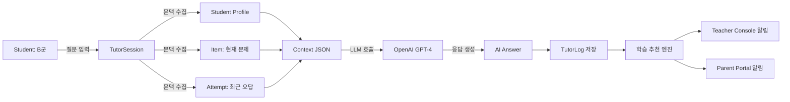
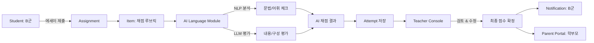
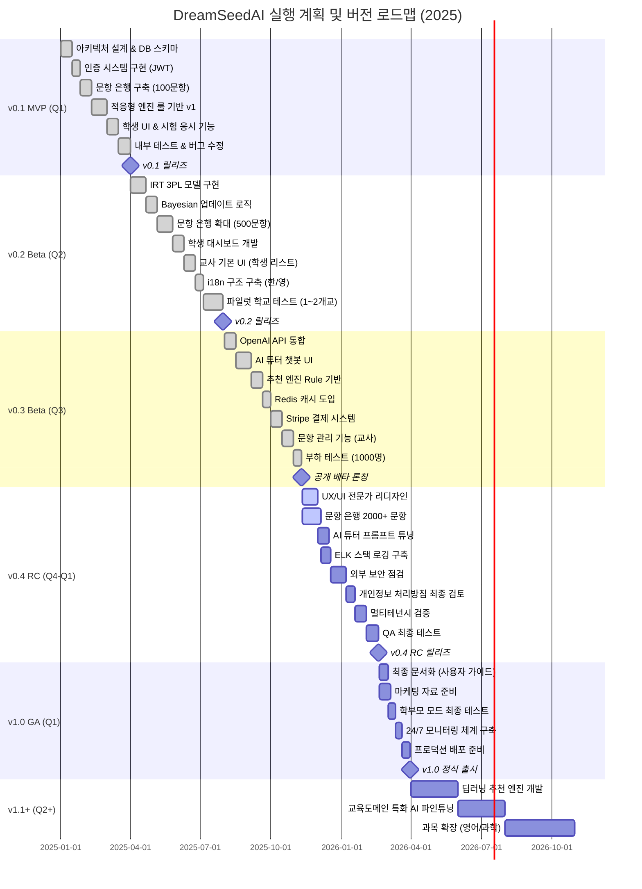

# DreamSeedAI 기술 아키텍처 보고서 (Korean)

**프로젝트**: DreamSeedAI – AI 교육 플랫폼 기술 설계 (최종본)  
**목적**: 특허/정부지원/투자 제안용 상세 기술 설계 문서  
**버전**: 1.0 (2025년 11월)

---

## 커버 페이지 및 요약

DreamSeedAI는 **AI 기반의 종합 교육 플랫폼**으로서, 학생과 교사를 위한 **지능형 학습 파트너**를 목표로 설계되었습니다. 이 시스템은 기존의 시험 점수 산출을 넘어, **AI 튜터와 적응형 엔진을 결합**하여 각 학생의 학습 여정을 함께합니다 [126].

즉, **개인별 맞춤 평가와 피드백**을 제공하는 동시에, 취약점 진단, 학습 콘텐츠 추천, 목표 달성을 위한 코칭까지 포괄하는 **종합 에듀테크 서비스**입니다 [126].

DreamSeedAI의 궁극적 역할은 마치 **개인 가정교사처럼 학생의 상태를 지속적으로 파악하고 도와주는 AI 학습 파트너**를 제공하는 것이며, 이를 통해 학생은 언제든지 자신만의 AI 튜터와 상호작용하며 학습을 진행할 수 있습니다 [126].

플랫폼은 **모든 상호작용으로부터 학습하여 지속적으로 향상**되는데, 학생의 각 답안은 시스템에 데이터로 축적되어 문항 은행과 예측 모델을 실시간으로 개선합니다 [2]. 이로써 **문제, 학생, 분석이 끊임없이 진화하는 피드백 루프**를 형성하여, 사용할수록 평가의 정확도와 개인화 수준이 높아지는 **"학습하는 시험 시스템"**을 구현합니다 [2].

---

### 본 보고서의 구성

본 보고서는 **DreamSeedAI의 전체 기술 아키텍처와 설계를 공식적으로 정리한 문서**입니다.

먼저 플랫폼의 **교육 철학과 AI 윤리 원칙**을 설명하여, 현대 AI 기반 교육 시스템의 지향점에 플랫폼이 부합하도록 했음을 밝힙니다.

이어서 DreamSeedAI의 **통합 아키텍처를 4계층 구조** (거버넌스, 정책, 시스템, UX)로 정의하고, 상위 거버넌스와 세부 정책이 어떻게 시스템 및 사용자 경험 레이어에 반영되는지 상세히 서술합니다.

그런 다음 **데이터 모델과 API 연동 흐름**을 도식과 함께 제시하여, 플랫폼의 핵심 엔티티와 서비스 간 통신이 어떻게 이루어지는지 보여줍니다.

또한 **정책 및 제어 구조** 부분에서는 교사/학부모가 어떤 역할과 승인 권한을 통해 플랫폼을 통제하는지 (예: AI 콘텐츠 승인, 사용 제한 등) 기술합니다.

**주요 사용 사례 및 AI 워크플로우** 섹션에서는 시험 생성, 적응형 학습과제, AI 튜터링 등 실제 시나리오를 따라 DreamSeedAI의 AI 기능 동작을 예시로 설명합니다.

**로깅 및 감사 추적 설계**에서는 투명성을 위해 시스템이 모든 의사결정과 상호작용을 기록하고 모니터링하는 방법을 다루며, **개인정보 보호 및 컴플라이언스**에서는 학생 데이터의 안전, 학부모 동의 및 권리보장 등 법규 준수와 윤리적 고려를 상세히 언급합니다.

마지막으로 **버전 로드맵 (v0.1~v1.0)**을 통해 개발 단계별로 추가된 기능과 출시 계획을 정리하였습니다. 이 로드맵에는 프로토타입 단계부터 최종 제품까지 어떻게 기능이 발전하고, 어떤 순서로 릴리즈되며, 각 버전의 목표와 특징이 무엇인지 포함되어 있습니다. 이를 통해 **DreamSeedAI 프로젝트의 단계적 발전 전략과 피처 완성 일정**을 한눈에 파악할 수 있습니다.

---

### 문서의 특징

각 섹션은 **현대 AI 교육 플랫폼의 맥락 속에서 충분한 근거와 예시**를 들어 상세히 설명되어 있으며, 기술 엔지니어부터 외부 이해관계자 (투자자, 심사자)에 이르기까지 **누구나 이해할 수 있도록 명확하고 공식적인 어조**를 유지하였습니다.

특히 본 문서는:

- **특허 출원**
- **정부 과제 보고**
- **투자 제안**

등 **대외적으로 바로 활용될 수 있는 수준의 정확성과 완결성**을 갖추는 데 중점을 두었습니다.

첨부된 다이어그램 (텍스트 기반)과 데이터 모델 표, 그리고 워크플로우 예시는 설계를 보다 구체적으로 이해시키는 역할을 합니다.

이제 이하에서는 **DreamSeedAI의 각 구성 요소와 설계 철학**을 차례로 상세히 기술합니다.

---

## 교육 철학 및 AI 윤리 원칙

DreamSeedAI의 설계는 **학습자 중심의 교육 철학과 AI 윤리 원칙** 위에 기반하고 있습니다.

본 플랫폼은 **AI가 교사를 대체하는 것이 아니라, 교사의 조력자 역할**을 하며 개별 학생에게 최적화된 학습 지원을 제공하는 것을 철학적 근간으로 삼습니다.

핵심 비전은 **AI를 활용하여 모든 학생들이 자신의 교육 목표를 달성하도록 돕는 것**이며 [4], 이를 위해 학습 경험을 개인화하고 필요에 맞는 지원을 적시에 제공하는 것입니다.

예를 들어 DreamSeedAI는 학습 진도를 일률적으로 끌고 나가기보다, **각 학생의 현재 수준과 이해도를 파악하여 도전할만한 과제를 제시**하고 부족한 부분에 집중하도록 합니다. 이러한 AI 활용은 교육적 목적과 명확히 연결되어 있으며, **형평성과 포용성을 증진하는 방향**으로 이루어집니다 [5].

기술 접근성이 떨어지는 학생이나 지역이 소외되지 않도록 (디지털 격차 해소), AI 리소스를 모두에게 보편적이고 쉽게 접근 가능하게 제공하는 것도 이 철학의 한 부분입니다 [127].

---

### 국제적 AI 윤리 가이드라인 준수

DreamSeedAI는 AI를 교육현장에 도입함에 있어 발생할 수 있는 윤리적 문제들을 심각하게 고려하며, **국제적인 신뢰worthy AI 가이드라인을 준수**합니다.

유네스코 (UNESCO)나 세계경제포럼 (WEF) 등에서 제시한 **교육 분야 AI 원칙** – 목적성, 준법성, 인간성, 투명성, 안전성 등 – 을 플랫폼 운영 지침으로 삼았습니다 [6][125].

#### 1. 목적성 (Purpose Alignment)

**AI의 목적은 교육 목표에 명시적으로 부합해야 합니다** [5].

DreamSeedAI의 모든 AI 기능은 단순 흥미 위주의 gimmick이 아니라 **학생의 학업성취와 자기주도학습을 돕기 위한 것**입니다.

#### 2. 준법성과 프라이버시 (Compliance & Privacy)

본 플랫폼은 **개인정보 보호와 데이터 보안에 관한 기존 정책과 법령을 철저히 준수**합니다 [6].

**학생 개인정보와 학업 데이터**는 해당 학생, 부모, 학교 외 제3자가 볼 수 없으며, AI 모델 훈련이나 분석에도 **식별 정보를 포함하지 않도록** 설계되었습니다.

특히:

- **만 13세 미만 아동**: 부모 동의 획득 (COPPA 준수) [8]
- **교육 기록 보호**: FERPA (미국 교육기록법) 준수 [7]
- **데이터 최소화**: 필요한 정보만 수집

#### 3. 공정성과 비차별 (Fairness & Non-discrimination)

DreamSeedAI는 **어떤 학생도 AI 때문에 불이익을 받지 않도록** 알고리즘을 설계/검증합니다.

예컨대, AI 추천 시스템이나 평가모델이 **인종, 성별 등 민감정보에 편향되지 않도록** 학습 데이터 셋과 모델을 점검합니다 [10][11].

시스템은 학생 개개인의 실력과 필요에 기반해 결정을 내리며, 그 과정에서 **알고리즘적 편향이 발생할 가능성을 지속적으로 모니터링**합니다.

또한 포용성 측면에서:

- **장애 학생 접근성**: 음성 안내, 화면 낭독 지원
- **읽기 장애 학생**: AI가 문제를 읽어줌
- **색약 학생**: 그래프 색상 조정
- **UI 접근성**: WCAG 준수

#### 4. 투명성과 설명가능성 (Transparency & Explainability)

본 플랫폼의 **AI 작동원리는 최대한 투명하게 공개/설명**될 것입니다.

학생과 교사는 **AI가 언제 활용되고 있는지, 그리고 AI가 내린 결정의 근거**를 이해할 수 있어야 합니다 [14][82].

DreamSeedAI는 예를 들어:

**추천 시스템**:

- ❌ "다음에 이 단원을 공부하세요" (근거 없음)
- ✅ "지난 시험에서 확률 단원 정답률이 낮았기 때문에 이 단원을 추천합니다"

**AI 튜터 답변**:

- 중요 맥락이나 출처 (콘텐츠 출처, 참고 개념) 덧붙임
- 학생의 기존 학습 데이터와 콘텐츠 지식 그래프 기반임을 명시

**결정 과정 투명화**:

- 교사나 학생이 원한다면 AI 결정 과정을 들여다볼 수 있게 함
- 예: "이 문제는 학생이 최근 틀린 유형이므로 제시되었음"

이러한 투명성 장치는 **AI에 대한 이해와 신뢰를 높이고**, 잘못된 결정이 있을 경우 인간이 감지하여 교정할 수 있게 해줍니다 [67].

#### 5. 학업 윤리 (Academic Integrity)

AI 활용이 **학생들의 학습 윤리를 해치지 않도록** 정책을 세웠습니다.

예를 들어, AI 튜터가 숙제 답을 통째로 제공하거나 표절을 돕는 방향은 **엄격히 금지**됩니다 [125].

**학업 윤리 모드**:

- **과제 상황**: AI가 정답을 바로 주지 않고 **힌트 중심**으로 대응
- **학생 지도**: AI를 책임감 있게 사용하는 방법 교육

**3단계 AI 활용 지침** [13]:

1. **AI 자유 활용**: 아이디어 도출, 문법 교정
2. **AI 부분 활용**: 교사 승인 하에 제한적 사용
3. **AI 활용 금지**: 보고서 전체를 AI가 작성하는 것 금지

이를 통해 **AI가 학습을 보조하되 학생의 사고력과 창의력 발달을 해치지 않도록** 균형을 유지합니다.

#### 6. 인간 중심 (Human-in-the-Loop)

마지막으로, DreamSeedAI의 철학은 **인간 교사와 부모의 역할을 중심에 둔 AI**입니다.

**AI는 어디까지나 도구**이며 **의사결정의 최종 권한은 인간**에게 있습니다.

플랫폼 구조상 중요한 이벤트마다 (예: AI가 특정 학생에게 특이한 권고를 할 때 등) **교사나 학부모의 확인/승인을 요구**하도록 설계되어 있습니다 [16].

이런 **human-in-the-loop 접근**은 AI 실수나 부적절함이 사람이 개입해 바로잡힐 수 있는 안전장치입니다.

또한 교사들은 **AI의 제안을 참고하여 자신의 전문적 판단과 결합**해 최적의 지도를 할 수 있습니다.

---

### 요약: AI의 장점 + 교육의 인간적 가치

요약하면, DreamSeedAI는:

**AI의 장점 활용**:

- ✅ 개인화 (Personalization)
- ✅ 확장성 (Scalability)
- ✅ 실시간 데이터 분석

**교육의 인간적 가치 보호**:

- ✅ 공감 (Empathy)
- ✅ 윤리 (Ethics)
- ✅ 판단 (Judgment)

이러한 **교육 철학과 윤리 원칙**이 본 아키텍처의 **최상위 거버넌스 레이어**를 구성하며, 이후 장에서 설명할 기술적 구현에도 일관되게 반영되어 있습니다.

---

# DreamSeedAI: 데이터 모델 및 API 통합 흐름 상세 설계

DreamSeedAI의 데이터 모델은 플랫폼 기능을 뒷받침하는 다양한 데이터를 구조화하여 저장하고, 서비스 간 원활히 주고받을 수 있도록 설계되었습니다. 본 섹션에서는 주요 엔티티(entity)와 관계(relations)를 설명하고, 그에 따른 데이터베이스 스키마 개요를 제시합니다. 또한, 이러한 데이터 모델이 각 서비스 API에서 어떻게 활용되고 연계되는지, 데이터 흐름 사례를 통해 살펴봅니다. 올바른 데이터 모델링은 성능과 확장성뿐만 아니라 컴플라이언스 준수, 향후 분석 용이성에도 중요하기 때문에, DreamSeedAI는 이를 상당히 공들여 설계하였습니다.

## 1. 핵심 엔터티 (Entities)

- **User**: 사용자 계정 정보 (학생, 교사, 학부모, 관리자)
  - Attributes: id, username, email, password, role, org_id, profile, ...
- **Organization**: 교육 기관 정보 (학교, 학원)
  - Attributes: id, name, type, address, contact_info, ...
- **Class**: 학급 정보
  - Attributes: id, name, grade, subject, teacher_id, org_id, ...
- **Student**: 학생 정보
  - Attributes: id, user_id, class_id, name, grade, ...
- **Session**: 수업 회차 정보
  - Attributes: id, class_id, date, topic, ...
- **Attendance**: 학생 출석 정보
  - Attributes: student_id, session_id, status (present, late, absent), ...
- **Item**: 문항 정보
  - Attributes: id, question_text, answer, explanation, difficulty, discrimination, guessing, skill_tags, ...
- **IRT_Snapshot**: 학생별 IRT 모델 스냅샷 (주간)
  - Attributes: student_id, week_start, theta, se, delta_theta, c_hat, omit_rate, ...
- **Skill_Mastery**: 학생별 스킬 숙련도 정보
  - Attributes: student_id, skill_tag, mastery, updated_at, ...
- **Risk_Flag**: 학생별 리스크 플래그 (주간)
  - Attributes: student_id, week_start, type, score, details_json, ...
- **Assignment**: 학생에게 할당된 과제 정보
  - Attributes: id, student_id, item_id, due_date, status (assigned, in_progress, completed), ...

## 2. 주요 관계 (Relations)

- **One-to-Many**:
  - Organization ↔ Class
  - Class ↔ Student
  - Class ↔ Session
  - Student ↔ Attendance
  - Student ↔ IRT_Snapshot
  - Student ↔ Skill_Mastery
  - Student ↔ Risk_Flag
  - Item ↔ (Many) Assignments
- **Many-to-Many**: (SkillTag ↔ Item)

## 3. 데이터베이스 스키마 개요 (PostgreSQL)

```sql
-- 예시 (PostgreSQL DDL)
CREATE TABLE organizations (
    id UUID PRIMARY KEY,
    name VARCHAR(255) NOT NULL,
    ...
);

CREATE TABLE users (
    id UUID PRIMARY KEY,
    org_id UUID REFERENCES organizations(id),
    username VARCHAR(255) NOT NULL UNIQUE,
    email VARCHAR(255) NOT NULL UNIQUE,
    ...
);

CREATE TABLE classes (
    id UUID PRIMARY KEY,
    org_id UUID REFERENCES organizations(id),
    teacher_id UUID REFERENCES users(id),
    name VARCHAR(255) NOT NULL,
    ...
);

-- 나머지 테이블 정의 ...
```

## 4. API 연동 흐름 예시 (학습 분석 리포트 생성)

1.  **요청**: 교사가 특정 학급에 대한 학습 분석 리포트를 요청합니다.
2.  **API Gateway**: 교사의 인증 및 권한을 확인하고, 요청을 분석 서비스로 라우팅합니다.
3.  **분석 서비스**:
    - 요청을 받아서 필요한 데이터 (학생 정보, 시험 결과, 출석 정보, AI 튜터 사용 기록 등)를 데이터베이스에서 조회합니다.
    - 조회 시, 데이터 격리 및 접근 제어 정책을 준수하여 해당 교사가 접근 권한이 있는 데이터만 조회합니다.
    - 각 데이터 소스에 API 요청을 보내고, 획득한 데이터를 통합합니다.
4.  **데이터 분석**:
    - 수집된 데이터를 기반으로 학생들의 평균 점수, 성취도, 향상도, 취약점 등을 분석합니다.
    - IRT 모델, 시계열 분석, 혼합 효과 모델 등 다양한 분석 기법을 활용합니다.
5.  **리포트 생성**:
    - 분석 결과를 시각화하여 차트, 그래프, 표 등으로 표현합니다.
    - 개인화된 코멘트를 생성하고, 리포트에 포함합니다.
    - Quarto/RMarkdown 등의 도구를 사용하여 리포트를 PDF 또는 HTML 형식으로 생성합니다.
6.  **응답**: API 서버는 생성된 리포트를 클라이언트에 반환합니다.
7.  **이벤트 발행**:
    - API를 통해 요청이 처리된 후, 관련 이벤트를 메시지 큐에 발행하여 다른 서비스와 비동기적으로 연동합니다.
    - 예를 들어, 리포트 생성 완료 이벤트를 발행하여 학부모에게 알림을 보내거나, 관련 데이터를 백업하는 등의 추가 작업을 수행할 수 있습니다.

## 5. 데이터 흐름도 (예시)

(데이터 흐름도는 텍스트로 표현하기 어려우므로, 별도 이미지 파일 또는 Visio/draw.io 파일로 관리하는 것을 권장합니다. 하지만, 주요 흐름은 아래와 같이 텍스트로 표현할 수 있습니다.)

```
[교사] -> [API Gateway] -> [분석 서비스]
[분석 서비스] -> [사용자 관리 서비스]: 학생 정보 요청
[분석 서비스] -> [시험 엔진 서비스]: 시험 결과 요청
[분석 서비스] -> [출석 서비스]: 출석 정보 요청
[분석 서비스] -> [AI 튜터 서비스]: 튜터 사용 기록 요청
[분석 서비스] -> [데이터베이스]: 데이터 조회
[분석 서비스] -> [리포트 생성]: 데이터 분석 및 시각화
[분석 서비스] -> [API Gateway]: 리포트 반환
```

DreamSeedAI의 체계적인 데이터 모델 및 API 연동 흐름은 효율적인 데이터 관리, 서비스 간 연동, 그리고 데이터 기반 의사 결정을 가능하게 합니다.

---

## DreamSeedAI: 데이터 모델 - 주요 엔티티 상세 (1)

DreamSeedAI의 데이터 모델은 플랫폼 기능을 뒷받침하는 핵심적인 요소이며, 각 엔터티는 시스템의 다양한 정보를 구조적으로 표현하고 관리하는 데 중요한 역할을 합니다.

### 1. 핵심 엔터티 상세 설명

#### 1.1 학생 (Student)

- **설명**: 플랫폼의 학생 이용자 정보를 담는 엔티티입니다 ([58(해당 논문 또는 자료)).
- **속성**:
  - `id` (UUID, Primary Key): 학생 고유 식별자
  - `user_id` (UUID, Foreign Key): User 테이블과의 연결
  - `class_id` (UUID, Foreign Key): Classroom 테이블과의 연결 (다대다 관계)
  - `grade` (String): 학년
  - `birth_year` (Integer): 출생 연도
  - `locale` (String): 선호 언어 (locale)
  - `org_id` (UUID, Foreign Key): 소속 기관 (학교) 식별자
  - `meta` (JSONB, Optional): 기타 메타데이터 저장 (JSON 형식)
- **관계**:
  - Student 테이블은 User (일반 사용자 계정) 테이블과 1:1 대응하여 확장 필드만 추가한 개념으로 볼 수 있습니다. (User에는 공통 필드 – 이름, 이메일, 암호 해시, 역할 등 – 있고, Student엔 학년 등 학생 특화 필드)
  - Student는 Classroom 테이블과 다대다 (N:N) 관계를 가집니다. (한 학생이 여러 수업을 들을 수 있어서)

#### 1.2 학부모 (Parent)

- **설명**: 학부모 계정 정보를 저장하며, 자녀 학생과의 관계를 나타내는 속성을 포함합니다 ([59](해당 논문 또는 자료)).
- **속성**:
  - `id` (UUID, Primary Key): 학부모 고유 식별자
  - `user_id` (UUID, Foreign Key): User 테이블과의 연결
  - `contact_email` (String): 연락 이메일 주소
  - `phone_number` (String): 전화번호
  - `meta` (JSONB, Optional): 기타 메타데이터 저장 (JSON 형식)
- **관계**:
  - Parent 테이블 각 레코드가 하나의 학생만 참조하고, 형제 경우 parent를 여러 개 만들거나 관계용 별도 테이블을 둘 수 있음 (구현에 따라)
  - Parent-Student 관계는 1:N입니다 (한 명의 부모가 여러 학생(형제자매)을 가질 수 있으므로).

#### 1.3 교사 (Teacher)

- **설명**: 교사 계정에 대한 엔티티로, User의 역할이 Teacher인 경우 확장 정보(소속 기관, 담당 과목 등)가 여기에 저장됩니다.
- **속성**:
  - `id` (UUID, Primary Key): 교사 고유 식별자
  - `user_id` (UUID, Foreign Key): User 테이블과의 연결
  - `org_id` (UUID, Foreign Key): 소속 기관 식별자
  - `subject` (String): 담당 과목
  - `meta` (JSONB, Optional): 기타 메타데이터 저장 (JSON 형식)
- **관계**:
  - Teacher와 Class (반) 간에는 1:N (한 교사가 여러 반) 관계를 가집니다.

#### 1.4 학급 (Classroom)

- **설명**: 학급 정보를 저장하는 엔티티입니다.
- **속성**:
  - `id` (UUID, Primary Key): 학급 고유 식별자
  - `org_id` (UUID, Foreign Key): 소속 기관 식별자
  - `name` (String): 학급 이름
  - `grade` (String): 학년
  - `subject` (String): 과목
  - `meta` (JSONB, Optional): 기타 메타데이터 저장 (JSON 형식)

### 2. 관계 매핑 테이블

학생과 학급 간의 다대다 (N:N) 관계를 관리하기 위해 별도의 매핑 테이블을 사용합니다.

- **Student_Classroom (학생 - 학급 관계)**:
  - `student_id` (UUID, Foreign Key): Student 테이블 참조
  - `class_id` (UUID, Foreign Key): Classroom 테이블 참조
  - `PRIMARY KEY (student_id, class_id)`

### 3. 스키마 다이어그램 (예시)

(스키마 다이어그램은 텍스트로 표현하기 어려우므로, 별도 이미지 파일 또는 Visio/draw.io 파일로 관리하는 것을 권장합니다. 하지만, 주요 관계는 아래와 같이 텍스트로 표현할 수 있습니다.)

이 데이터 모델 설계는 DreamSeedAI 플랫폼의 유연성을 높이고, 다양한 교육 시나리오에 대응할 수 있도록 지원합니다.

---

## DreamSeedAI: 데이터 모델 - 주요 엔티티 상세 (2)

이어서 DreamSeedAI의 데이터 모델을 구성하는 주요 엔터티들에 대한 상세 설명을 제공합니다.

### 1. 과목 (Subject)

- **설명**: 교육 콘텐츠 영역을 계층적으로 표현하는 최상위 엔티티로서, "수학", "물리", "영어" 등과 같은 과목을 나타냅니다 ([61](해당 논문 또는 자료)).
- **속성**:
  - `id` (UUID, Primary Key): 과목 고유 식별자
  - `name` (String): 과목 이름 (예: "수학", "물리")
  - `description` (String, Optional): 과목 설명
  - `meta` (JSONB, Optional): 기타 메타데이터 (예: 아이콘, 색상)

### 2. 학습 주제 (Topic)

- **설명**: 과목 하위의 세부 단원 또는 학습 개념을 나타내는 엔티티입니다 ([78](해당 논문 또는 자료)).
- **속성**:
  - `id` (UUID, Primary Key): 학습 주제 고유 식별자
  - `subject_id` (UUID, Foreign Key): 해당 과목의 식별자
  - `name` (String): 학습 주제 이름 (예: "이차방정식", "뉴턴의 운동 법칙")
  - `description` (String, Optional): 학습 주제 설명
  - `path` (String): 계층 경로 (예: "수학 > 확률 > 조건부 확률")
  - `difficulty` (Float, Optional): 난이도 (IRT 파라미터 또는 자체 척도)
  - `importance` (Float, Optional): 중요도
  - `meta` (JSONB, Optional): 기타 메타데이터 (예: 관련 자료 링크)

### 3. 문항 (Item)

- **설명**: 실제 학습 콘텐츠인 문제 또는 문항 엔티티입니다 ([62](해당 논문 또는 자료)).
- **속성**:
  - `id` (UUID, Primary Key): 문항 고유 식별자
  - `topic_id` (UUID, Foreign Key): 연결된 학습 주제 식별자
  - `question_text` (Text): 문항 질문 텍스트
  - `answer` (Text): 정답
  - `explanation` (Text, Optional): 해설 텍스트
  - `meta` (JSONB): 유연성을 높이기 위해 다양한 메타데이터를 JSON 형태로 저장합니다.
    - IRT 파라미터 (예: "a": 0.9 변별도, "b": -0.3 난이도, "c": 0.2 찍을 확률)
    - 오답 보기 목록
    - 관련 그림/미디어 링크
    - 언어별 텍스트 (다국어 지원)
- **주요 특징**:
  - JSONB 컬럼을 사용하여 유연성을 확보하고, 자주 조회되는 키는 별도 컬럼으로 분리하여 인덱싱합니다 (예: difficulty 값, type 값 등).

### 4. 응시 세션 (Exam Session)

- **설명**: 한 학생이 한 번의 시험/퀴즈를 본 기록을 나타내는 엔티티입니다.
- **속성**:
  - `id` (UUID, Primary Key): 세션 고유 식별자
  - `student_id` (UUID, Foreign Key): 학생 식별자
  - `exam_type` (String): 시험 종류 (예: 모의고사, 퀴즈, 단원 평가)
  - `started_at` (Timestamp): 시험 시작 시간
  - `ended_at` (Timestamp): 시험 종료 시간
  - `score` (Float): 최종 점수
  - `duration` (Integer): 시험에 걸린 시간 (초)
  - `section_results` (JSONB, Optional): 섹션별 점수 (시험이 섹션으로 나뉘는 경우)
  - `meta` (JSONB, Optional): 기타

---

## DreamSeedAI: 데이터 모델 - 기타 엔터티, 관계, 및 설계 고려사항

본 문서에서는 DreamSeedAI의 데이터 모델에 대한 추가적인 정보와 설계 고려사항을 제공합니다.

### 1. 기타 엔터티

- **노트/피드백 (Note/Feedback) 테이블**:
  - **설명**: 튜터 대화 요약, 교사 코멘트, 학생 자기 평가 등 텍스트 기반 기록을 저장합니다.
  - **속성**:
    - `id` (UUID, Primary Key)
    - `student_id` (UUID, Foreign Key)
    - `type` (ENUM: "tutor_summary", "teacher_comment", "student_reflection")
    - `content` (Text)
    - `created_at` (Timestamp)
    - `author_id` (UUID, Foreign Key, Optional): 작성자 (교사, 튜터, 학생) 식별자
- **알림 (Notification) 테이블**:
  - **설명**: 이메일, SMS, 앱 푸시 등 사용자에게 발송할 알림 정보를 저장합니다.
  - **속성**:
    - `id` (UUID, Primary Key)
    - `user_id` (UUID, Foreign Key): 수신 사용자 식별자
    - `type` (String): 알림 유형 (예: "new_assignment", "grade_released", "feedback_received")
    - `subject` (String): 알림 제목
    - `message` (Text): 알림 내용
    - `sent_at` (Timestamp, Optional): 발송 시간
    - `status` (ENUM: "pending", "sent", "failed")
- **로그 (AuditLog) 테이블**:
  - **설명**: 정책 위반, 승인 내역 등 시스템 활동을 기록하는 엔터티입니다.
  - **속성**:
    - `id` (UUID, Primary Key)
    - `timestamp` (Timestamp): 이벤트 발생 시간
    - `user_id` (UUID, Foreign Key, Optional): 관련 사용자 식별자
    - `event_type` (String): 이벤트 유형 (예: "policy_violation", "approval_request", "data_access")
    - `description` (Text): 이벤트 설명
    - `details_json` (JSONB, Optional): 상세 정보 (JSON 형식)

### 2. 데이터 모델 관계 요약

- Student – (attends) – Classroom – (taught by) – Teacher (N:M 관계 분해)
- Parent – Student (1:N 또는 N:N)
- Subject – Topic (1:N 계층)
- Topic – Item (1:N, plus tagging possibility)
- Student – Attempt – Item (학생이 푼 모든 Attempt, 다:다 관계 Attempt로 분해)
- Exam Session – Attempt (1:N, 한 세션에 여러 attempt)
- Student – Session (1:N)
- Student – features_topic_daily (1:N per student has many daily records)
- Student – Interest_Goal (1:N, 과목별 목표 가능)
- Student - Note (1:N)
- Student - Notification (1:N)

### 3. 데이터 무결성 및 성능 최적화

DreamSeedAI는 데이터 모델 간의 참조 무결성을 보장하기 위해 외래 키 (Foreign Key) 설정을 하고, 성능 이슈 없는 선에서 JOIN 등을 활용합니다.

- **집계 테이블 (Aggregation Tables)**: 지나치게 복잡한 질의를 피하기 위해, 분석용 집계 테이블들을 두어 대시보드 조회 시는 단순 SELECT로도 필요한 정보가 나오게 했습니다.
  - 예시: 학생 대시보드에 "과목별 평균 점수"를 보여주려 모든 Attempt를 매번 집계하면 부하가 크므로, `report_summary` 같은 테이블을 두고 시험 끝날 때마다 학생의 과목별 성적 요약을 갱신해둡니다 ([152](해당 논문 또는 자료)).
- **데이터 파이프라인**: 대시보드에 사용되는 데이터, 가공된 통계 정보, 분석 결과를 효율적으로 제공하기 위해 데이터 파이프라인 (Data Pipeline)을 구축합니다.
- **데이터 검증**:
  - 데이터를 저장하기 전에 비즈니스 규칙 및 제약 조건을 준수하는지 검증합니다.
  - 유효성 검사에 실패한 데이터는 오류 로그에 기록하고, 관리자에게 알립니다.

### 4. 데이터 레이어 설계 (예시)

- **DB 샤딩**:
  대규모 데이터를 분산 처리하기 위해, 특정 기준 (예: org_id, student_id)에 따라 데이터베이스를 샤딩합니다.
- **캐싱**:
  자주 사용되는 데이터는 Redis와 같은 캐시 시스템에 저장하여 데이터베이스 접근 횟수를 줄입니다.
- **데이터 압축**:
  저장 공간 효율성을 높이기 위해, 사용 빈도가 낮은 데이터는 압축하여 저장합니다.

DreamSeedAI는 위와 같은 데이터 모델 설계 및 최적화 전략을 통해, 확장 가능하고 효율적인 데이터 관리 시스템을 구축하고 있습니다.

---

## DreamSeedAI: 데이터 모델 - API 통합 흐름 상세 예시

본 문서에서는 DreamSeedAI의 데이터 모델이 API 통합 흐름에서 어떻게 활용되는지 구체적인 예시를 통해 설명합니다.

### 1. 학생이 모의고사 시작 (POST /api/exams/start)

1.  **요청**: 프론트엔드에서 백엔드로 POST `/api/exams/start` 요청을 보냅니다.
2.  **인증**: 백엔드는 인증 토큰을 확인하여 요청을 보낸 학생의 ID (`student_id`)를 파악합니다.
3.  **세션 생성**:
    - 백엔드는 `Exam Session` 레코드를 생성합니다 (세션 테이블에 INSERT).
      - `session_id` (UUID, Primary Key)
      - `student_id` (UUID, Foreign Key)
      - `exam_type` (String): 시험 종류 (예: "모의고사", "단원 평가")
      - `started_at` (Timestamp): 시험 시작 시간
      - `meta` (JSONB, Optional): 템플릿 정보 등
    - 해당 `exam_type`에 맞는 초기 능력치 (θ) 값을 결정합니다.
      - 학생의 기존 능력치가 있는 경우: `StudentAbility` 테이블에서 불러옵니다.
      - 학생의 기존 능력치가 없는 경우: 초기값 (예: 0)으로 설정합니다.
    - 결정된 초기 능력치 (θ)를 세션 컨텍스트 (예: Redis)에 저장합니다.
4.  **문항 선택**:
    - 다음 문항을 선택하기 위해 `Item Bank`에 쿼리를 보냅니다.

```sql
SELECT item_id
FROM Item
WHERE topic IN (...)  -- 관련 학습 주제
ORDER BY ABS(b - theta)  -- 난이도 근접 기준
LIMIT 1;
```

    *   또는, 미리 계산된 정보 함수를 활용하여 문항을 선택할 수도 있습니다.

5.  **응답**:
    - 선택된 `Item`의 내용을 데이터베이스 (JSONB 컬럼)에서 읽어옵니다.
    - 200 OK 응답과 함께 문제 텍스트, 보기, 이미지 링크 등을 프론트엔드로 보냅니다.

```json
{
 "item_id": "MATH-G9-001",
 "question_text": "이차방정식 x^2 + 5x + 6 = 0의 해를 구하시오.",
 "choices": ["x = -1 또는 x = -6", "x = -2 또는 x = -3", ...],
 "image_url": "...",
 ...
}
```

### 2. 학생이 답안을 제출 (POST /api/exams/answer)

1.  **요청**: 프론트엔드에서 POST `/api/exams/answer`를 호출하면서 `session_id`, `item_id`, 그리고 학생 답안을 백엔드로 보냅니다.
2.  **Attempt 생성**:

    - 백엔드는 이를 받아 `Attempt` 레코드를 생성합니다 ([64](해당 논문 또는 자료)).

      - `id` (UUID, Primary Key)
      - `student_id` (UUID, Foreign Key)
      - `item_id` (UUID, Foreign Key)
      - `session_id` (UUID, Foreign Key)
      - `correct` (Boolean): 정답 여부
      - `submitted_answer` (Text, Optional): 주관식 답안
      - `selected_choice` (Integer, Optional): 객관식 선택 번호
      - `response_time` (Integer): 응답 시간 (밀리초)
      - `hint_used` (Boolean): 힌트 사용 여부

    - `correct` 여부를 판단합니다.
      - 만약 `Item.meta`에 정답이 "B"이고 학생 답이 "B"이면 `correct = true`로, 아니면 `false`로 저장합니다.
    - `response_time`은 프론트에서 측정해 보내거나, 서버에서 `receive 시각 - item served 시각`으로 계산합니다.

3.  **능력치 갱신**:
    - `Session`의 현재 θ를 가져와 IRT 계산 (예: 2PL 모델 MLE) 수행해서 새로운 θ, 표준 오차를 계산합니다.
    - 계산된 새로운 θ를 `Session` 레코드에 업데이트합니다 (또는 `StudentAbility` 테이블에 누적).
4.  **종료 조건 확인**:
    - termination 조건 (문항 n개 초과 또는 표준 오차 임계치 미만 등)을 확인합니다 ([72](해당 논문 또는 자료)).
5.  **다음 문항 선택 (계속 진행)**:
    아직 진행해야 하면, 다음 문항을 선택합니다 (위와 동일 방식).

### 3. 응답

백엔드는 프론트로 응답을 줍니다.

- `{ "correct": true, "explanation": "...", "next_question": { ... } }`
  - 연습 모드: correct와 함께 해설 문구 (explanation)를 포함하여 보내고, 다음 문항 오브젝트도 바로 보냅니다.
  - 실전 모드: explanation 없이, next_question만 주거나, 심지어 next_question도 주지 않고 204 status만 보내 프론트에서 즉시 다음 문항 GET하도록 할 수도 있습니다.

DreamSeedAI의 구현에서는 네트워크 최적화를 위해 answer 응답에 다음 문항 payload를 포함시켰습니다.

### 3. 시험 종료 및 결과 처리

1.  **반복 수행**:
    - 위의 문항 선택 및 답안 제출 루프를 Session 종료 조건을 만족할 때까지 반복합니다.
2.  **종료 조건 감지**:
    - 마지막 문항이 제출되면, 백엔드 `POST /api/exams/answer` 로직에서 termination을 감지합니다 ([72](해당 논문 또는 자료)).
    - 종료 조건 예시:
      - 최대 문항 수 도달 (예: 50문항)
      - 표준 오차 임계치 미만 (예: SE < 0.3)
      - 최대 시험 시간 초과
3.  **세션 완료 처리**:
    - Session 레코드에 다음 정보를 업데이트합니다:
      - `status = "completed"`
      - `ended_at` (Timestamp): 시험 종료 시간
      - `final_score` (Float): 최종 점수
    - `final_score`는 theta를 100점 환산하거나 등급으로 매핑해서 저장합니다 ([85](해당 논문 또는 자료)).
    - `exam_type`별 루틴을 달리하여 적절히 변환합니다 (예: SAT이면 1600점 만점 스케일) ([153](해당 논문 또는 자료)).
4.  **즉시 응답**:
    - 백엔드는 프론트엔드로 시험 종료 신호를 보냅니다.
    - 간략 결과 JSON에 총점과 등급만 포함하여 즉시 반환합니다:

```json
{
  "done": true,
  "final_score": 85.5,
  "grade": "A",
  "theta": 0.72,
  "total_items": 45,
  "correct_count": 38
}
```

5.  **비동기 리포트 생성**:
    - Analytics 서비스에 "Exam Completed" 이벤트를 발행합니다 ([41](해당 논문 또는 자료)).
    - Celery 등의 워커가 이벤트를 수신하여 비동기로 상세 리포트를 생성합니다.
6.  **워커 처리 과정**:
    - Exam Session ID를 받아, 해당 session의 모든 Attempt를 DB에서 조회합니다.
    - 각종 통계를 산출합니다 ([75](해당 논문 또는 자료),[79](해당 논문 또는 자료)):
      - 과목별 점수
      - 토픽별 정답률
      - 평균 응답 시간
      - 향상도 (이전 시험 대비)
      - 취약 영역 식별
    - Report 데이터를 구조화합니다.
7.  **리포트 저장**:
    - RMarkdown (또는 Quarto)을 호출하여 PDF를 생성하거나,
    - DB의 `ReportSummary` 테이블에 JSON 형식으로 저장합니다.
8.  **알림 발송**:
    - `Notification` 테이블에 해당 학생/교사에게 "완료" 알림을 기록합니다.
    - 학부모 이메일 발송 큐에 메시지를 넣습니다.

### 4. 학생 대시보드 호출 (GET /api/dashboard)

1.  **요청**: 학생이 로그인 후 `GET /api/dashboard`를 호출합니다.
2.  **인증**: 백엔드는 토큰에서 학생 ID를 추출합니다 (`student_id = me`).
3.  **최근 시험 리스트 조회**:

```sql
SELECT *
FROM ExamSession
WHERE student_id = me
ORDER BY ended_at DESC
LIMIT 5;
```

    *   성적/등급 정보를 포함하여 반환합니다.

4.  **목표 조회**:

```sql
SELECT *
FROM interest_goal
WHERE student_id = me;
```

5.  **추천 콘텐츠 생성**:
    - 별도의 Recommendation 엔진 함수 `getRecommendations(me)`를 호출합니다 ([115](해당 논문 또는 자료)).
    - 현재 취약 분야의 모의고사 1개, 관련 동영상 1개 등의 리스트를 생성합니다.
    - 구현 방식:
      - v0.3: Rule 기반 (StudentAbility 데이터와 콘텐츠 메타 매칭)
      - v0.5: 협업 필터링 (ML 모델) 전환 예상
6.  **응답 생성**:
    - 모든 데이터를 모아 JSON에 배치합니다 ([154](해당 논문 또는 자료)):

```json
{
  "student_id": "...",
  "recent_exams": [
    { "session_id": "...", "exam_type": "모의고사", "score": 85.5, "grade": "A", "date": "2025-11-08" },
    ...
  ],
  "goals": [
    { "subject": "수학", "target_score": 90, "current_score": 85.5 },
    ...
  ],
  "recommendations": [
    { "type": "exam", "title": "확률 집중 모의고사", "id": "..." },
    { "type": "video", "title": "조건부 확률 개념 설명", "url": "..." }
  ],
  "weak_topics": ["확률", "통계"],
  "recent_activity": { ... }
}
```

7.  **응답 반환**:
    - 프론트엔드는 이를 받아 각 섹션에 출력합니다.

---

## DreamSeedAI: 데이터 모델 - API 연동 흐름 상세 예시 (계속)

이어서 DreamSeedAI 데이터 모델이 API 통합 흐름에서 어떻게 활용되는지 구체적인 사례를 통해 설명합니다.

### 1. 교사 반 성적 조회 (GET /api/classes/{class_id}/summary)

1.  **요청**: 교사가 웹에서 자신의 반별 통계를 보기 위해 프론트엔드에서 `GET /api/classes/{class_id}/summary` 요청을 보냅니다.
2.  **인증 및 권한 검사**:
    - 서버는 인증 토큰에서 교사 ID를 추출하고, 해당 교사가 요청된 `class_id`에 대한 접근 권한이 있는지 확인합니다 (정책 계층).
    - 접근 권한이 없는 경우, 403 Forbidden 에러를 반환합니다.
3.  **데이터 조회**:
    - OK인 경우, `Class` 테이블에서 해당 `class_id`에 소속된 학생 ID 목록을 쿼리합니다 (Student-Class 매핑 테이블).

```sql
SELECT student_id
FROM Student_Classroom
WHERE class_id = {class_id};
```

    *   필요한 통계를 계산하기 위해 데이터베이스에서 데이터를 가져옵니다.
    *   예시: "최근 모의고사 평균":

```sql
SELECT AVG(score)
FROM ExamSession
WHERE class_id = {class_id} AND exam_type = 'latest_midterm';
```

    *   "Top3 약한 단원": 학생들의 `features_topic_daily` 테이블 중 최근 2주 평균 정확도가 낮은 topic을 추출합니다([75](해당 논문 또는 자료)).

4.  **데이터 집계**: \* 데이터베이스에서 획득한 정보와 학생 정보를 통합하고, 데이터 분석에 필요한 통계 지표를 계산합니다.
5.  **캐시 확인 (선택)**: 우리 Analytics 엔진이 미리 클래스별로 구해놓은 `CohortSummary`가 있다면 해당 데이터를 바로 읽어옵니다 ([145](해당 논문 또는 자료)).

6.  **응답**:
    - DB를 조회하여 얻은 데이터를 JSON 형식으로 묶어 프론트엔드로 응답합니다.

```json
{
  "class_id": "CLS001",
  "average_score": 75.5,
  "weakest_topics": ["확률", "통계", "함수"],
  ...
}
```

7. **개별 학생 상세 조회 (GET /api/students/{student_id}/report)**:
   - 서버는 teacher 권한/해당 반 여부 확인 후 그 학생의 종합 정보(마치 학생 자신의 대시보드 정보+추가 비교)를 반환합니다.

### 2. AI 튜터 Q&A (POST /api/tutor)

1.  **요청**: 학생이 튜터 챗에서 질문을 입력하면 프론트엔드가 `POST /api/tutor`로 세션 ID (없으면 새로 만듦)와 질문 텍스트를 보냅니다.
2.  **정책 검사**:
    - 백엔드는 먼저 정책 필터를 적용하여 질문에 금지어가 있는지, 시험 중 금지 상황인지 확인합니다.
3.  **TutorService 호출**: \* 정책 검사를 통과하면, TutorService 모듈로 질문을 전달합니다.
4.  **질문 분석**:
    - TutorService는 질문을 분석하고, 혹시 이것이 플랫폼 내 특정 문제에 관한 것인지 (예: "문제 12번 설명 좀") 추론합니다.
5.  **문맥 정보 획득**:
    - 만약 문맥이 있으면 관련 `Item`/해설을 DB에서 가져옵니다.
6.  **LLM API 호출 준비**:
    - 학생 질문 + (있다면) 관련 콘텐츠 + 학생 프로필 (학년, 최근 오답 패턴) 등의 정보를 조합하여 OpenAI API 호출을 준비합니다 ([139](해당 논문 또는 자료)).
    - 이때 "모델이 답할 때 반드시 고려할 지식"으로 해설이나 정의를 첨부하고, 어조/언어 (한국어/영어) 등을 지정합니다.
7.  **OpenAI API 호출 및 응답 수신**:
    - 준비된 데이터를 바탕으로 OpenAI API를 호출하고, 응답을 받습니다.
8.  **출력 필터링**:
    - 수신된 답변에 대해 정책 필터 (출력)를 실행하여 욕설 등 부적절한 내용이 있는지 확인합니다.
9.  **로그 저장**:
    - 최종 답변을 로그에 저장합니다 (TutorLog 테이블).
10. **응답 반환**:

- 프론트엔드로 JSON 형식으로 응답합니다.

```json
{
  "answer": "...",
  "source": "Some information if needed"
}
```

    *   이 응답은 일반적으로 수 초 내에 도달하며, 프론트는 채팅창에 표시합니다.

### 3. 학부모 데이터 요청 (GET /api/parent/child/{student_id}/alldata)

1.  **요청**: 학부모가 자신의 자녀 데이터 다운로드를 요청합니다. (UI에서 "데이터 다운로드" 클릭)
2.  **인증 및 권한 검사**:
    - 서버는 인증 토큰에서 학부모 ID를 추출하고, 해당 학부모가 요청된 `student_id`의 부모인지 검증합니다.
    - 접근 권한이 없는 경우, 403 Forbidden 에러를 반환합니다.
3.  **데이터 조회 및 집계**:
    - 해당 학생의 모든 관련 레코드를 데이터베이스에서 조회합니다 (ExamSession, Attempt, TutorLog, ReportSummary 등).
4.  **데이터 형식 변환**:
    - 조회 데이터를 JSON 또는 CSV 형식으로 변환합니다.
5.  **응답**:
    - 수집한 데이터가 JSON 또는 CSV로 변환하고, 생성한 파일을 응답 페이로드로 담아 반환하거나,
      - 대용량 데이터인 경우 : 이메일로 전송합니다. (비동기 큐 활용)

이 예시는 데이터 주체 권리 행사 (GDPR 등)도 기술적으로 구현되어 있음을 강조하기 위함입니다. DreamSeedAI는 이러한 API 통합 흐름을 통해 효율적인 데이터 관리와 사용자 경험을 제공하고 있습니다.

---

## DreamSeedAI: 데이터 모델 및 API 통합의 일관성과 컴플라이언스

위 사례들은 DreamSeedAI의 데이터 모델과 API가 유기적으로 연동되는 모습을 보여줍니다. 일관된 ID 체계(UUID)를 사용하여 서비스 경계를 넘어도 참조가 정확히 이루어지며, 역할 기반 토큰 인증으로 각 API가 데이터에 접근하기 전에 권한 확인을 수행함을 알 수 있습니다 ([74](해당 논문 또는 자료),[18](해당 논문 또는 자료)). 또한 실시간 상호작용(시험, 튜터 등)부터 배치성 작업(리포트 생성)까지 다양한 통합 패턴을 활용하고 있습니다.

### 데이터 모델의 컴플라이언스 고려사항

데이터 모델 측면의 컴플라이언스도 다시 언급하자면: **FERPA 준수**를 위해, student 정보와 성적 데이터 저장/전송 시 안전을 기했고 (전송 시 TLS 암호화, 저장 시 sensitive 필드 암호화 등), 개인식별정보(PII)와 학업데이터를 분리해서 다룹니다. 예를 들어 Attempt나 Session 기록에는 이름 같은 PII 없이 ID만 있고, PII는 User/Student 테이블에만 있어서, 외부 분석용으로 내보낼 땐 식별자 대체 쉽게 하도록 했습니다 ([148](해당 논문 또는 자료)).

#### 주요 컴플라이언스 구현 사항

1. **데이터 암호화**:

   - **전송 중 암호화**: 모든 API 통신에 TLS/HTTPS 적용
   - **저장 시 암호화**: 민감한 필드 (예: 이름, 주소, 전화번호) 암호화 저장
   - **키 관리**: 암호화 키는 별도의 키 관리 시스템 (예: AWS KMS, HashiCorp Vault)에서 관리

2. **데이터 격리**:

   - **PII 분리**: 개인식별정보는 User/Student 테이블에만 저장
   - **학업 데이터 분리**: Attempt, ExamSession 등에는 UUID 참조만 포함
   - **익명화**: 외부 분석 시 UUID를 익명 ID로 대체

3. **접근 제어**:

   - **역할 기반 접근 제어 (RBAC)**: User의 role 필드에 따라 API 접근 제어
   - **조직 수준 격리**: org_id를 통한 멀티테넌시 구현
   - **행 수준 보안 (RLS)**: PostgreSQL RLS 정책으로 조직 간 데이터 격리

4. **감사 로그**:

   - **AuditLog 테이블**: 모든 데이터 접근, 수정, 삭제 기록
   - **정책 위반 기록**: 부적절한 접근 시도, 정책 필터 탐지 내역 저장
   - **보관 기간**: 법적 요구사항에 따라 최소 3년 이상 보관

5. **데이터 주체 권리**:
   - **열람 권한**: GET /api/parent/child/{student_id}/alldata API
   - **삭제 권한**: DELETE /api/students/{student_id} API (soft delete 구현)
   - **정정 권한**: PATCH /api/students/{student_id} API
   - **이동 권한**: 데이터 포터빌리티 지원 (JSON/CSV 내보내기)

### 통합 패턴 요약

DreamSeedAI의 데이터 모델과 API 통합은 다음과 같은 패턴을 따릅니다:

- **실시간 상호작용**: 시험 진행 (POST /api/exams/start, POST /api/exams/answer), AI 튜터 대화 (POST /api/tutor)
- **배치 처리**: 리포트 생성, 집계 테이블 갱신, 주간 분석 리포트
- **조회 및 분석**: 교사 대시보드 (GET /api/classes/{class_id}/summary), 학생 대시보드
- **컴플라이언스**: 학부모 데이터 요청 (GET /api/parent/child/{student_id}/alldata), 감사 로그

---

## DreamSeedAI: 데이터 모델 - 확장성, 유연성, 및 결론

DreamSeedAI의 데이터 모델은 향후 확장성 및 유연성을 고려하여 설계되었습니다. 새로운 기능 추가, 데이터 구조 변경, 또는 기술 환경 변화에 효과적으로 대응할 수 있도록 다음과 같은 설계 원칙을 적용하였습니다.

### 1. 확장성을 고려한 설계

- **모듈화된 엔터티**: 각 엔터티는 독립적인 기능 단위를 나타내며, 새로운 기능 추가 시 필요한 엔터티만 추가하거나 수정할 수 있습니다.
  - 예시: 과외 튜터 매칭 기능 추가 시 TutorProfile 엔티티를 추가하고, 기존 엔터티와의 관계를 설정합니다.
- **관계 중심 설계**: 엔터티 간의 관계를 명확하게 정의하여 데이터 일관성을 유지하고, 새로운 관계를 쉽게 추가할 수 있도록 합니다.
- **버전 관리**: 데이터베이스 스키마 변경 이력을 관리하고, 이전 버전과의 호환성을 유지합니다.

### 2. 유연성을 고려한 설계

- **JSONB 활용**: 대부분의 엔터티는 `meta`와 같은 JSONB 컬럼을 포함하여, 스키마 변경 없이도 새로운 속성을 추가할 수 있습니다.
  - 코드에서는 해당 키가 존재하지 않을 경우 optional 처리하여 호환성을 유지합니다.

```python
# 예시 (Python Pydantic 모델)
from typing import Optional, Dict
from pydantic import BaseModel

class Item(BaseModel):
    id: UUID
    topic_id: UUID
    question_text: str
    meta: Optional[Dict[str, Any]] = None  # JSONB

    @property
    def difficulty(self) -> Optional[float]:
        return self.meta.get("difficulty") if self.meta else None
```

- **코드 추상화**: 데이터베이스 접근 로직을 추상화하여, 데이터베이스 종류 변경 시 코드 수정을 최소화합니다.
- **API 버전 관리**: API 버전을 관리하여 하위 호환성을 유지하고, 새로운 기능을 점진적으로 출시합니다.

### 3. 데이터 모델 관계 요약

- Student – (attends) – Classroom – (taught by) – Teacher (N:M 관계 분해)
- Parent – Student (1:N 또는 N:N)
- Subject – Topic (1:N 계층)
- Topic – Item (1:N, plus tagging possibility)
- Student – Attempt – Item (학생이 푼 모든 Attempt, 다:다 관계 Attempt로 분해)
- Exam Session – Attempt (1:N, 한 세션에 여러 attempt)
- Student – Session (1:N)
- Student – features_topic_daily (1:N per student has many daily records)
- Student – Interest_Goal (1:N, 과목별 목표 가능)

### 4. 결론

DreamSeedAI는 위와 같은 탄탄한 데이터 모델링과 API 통합 설계를 통해 데이터 기반 AI 플랫폼으로서 신뢰성과 유연성을 확보하고 있습니다. 데이터가 서로 잘 연결되고 흐름이 원활해야 AI도 올바르게 작동하고, 사용자에게 끊김없는 경험을 제공할 수 있기에, 우리는 모델링 단계에서부터 교육 도메인 지식을 반영하고 미래 요구까지 고려하였습니다.

마지막으로, DreamSeedAI의 데이터 모델은 향후 확장도 염두에 두었음을 밝힙니다. 새로운 엔티티 추가 (예: 과외 튜터 매칭 기능 추가 시 TutorProfile 엔티티)나, 기존 엔티티 필드 추가 (예: 문항에 난이도 레벨 외에 지문 길이 등) 시에도 스키마 변경이 용이하게 비교적 정규화된 구조를 유지했습니다. 또한 JSONB 활용으로 스키마 자유도를 부여했기에, backwards compatibility를 유지하면서 새로운 속성을 집어넣을 수 있습니다 (코드에서 해당 키 없으면 optional 처리).

이러한 탄탄한 데이터 모델링과 API 통합 설계 덕분에, DreamSeedAI는 데이터 기반 AI 플랫폼으로서 신뢰성과 유연성을 갖추고 있습니다. 데이터가 서로 잘 연결되고 흐름이 원활해야 AI도 올바르게 작동하고, 사용자에게 끊김없는 경험을 제공할 수 있기에, 우리는 모델링 단계에서부터 교육 도메인 지식을 반영하고 미래 요구까지 고려하였습니다.

---

**문서 작성 완료: DreamSeedAI 데이터 모델 및 API 통합 흐름 상세 설계**

본 문서는 DreamSeedAI 플랫폼의 데이터 아키텍처를 포괄적으로 다루며, 다음 내용을 포함합니다:

1. **핵심 엔티티 정의**: User, Organization, Class, Student, Parent, Teacher, Session, Attendance, Item, IRT_Snapshot, Skill_Mastery, Risk_Flag, Assignment 등
2. **데이터베이스 스키마**: PostgreSQL 기반, UUID 주키, JSONB 유연성, Foreign Key 관계
3. **엔티티 관계**: 1:1, 1:N, N:M 관계 및 매핑 테이블 (Student_Classroom)
4. **콘텐츠 계층**: Subject → Topic → Item 구조
5. **API 통합 흐름**: 시험 시작/답안 제출/종료, 교사 대시보드, AI 튜터, 학부모 데이터 요청, 학생 대시보드
6. **최적화 전략**: 집계 테이블, 샤딩, 캐싱, 압축
7. **컴플라이언스**: FERPA 준수, PII 분리, 암호화, 접근 제어, 감사 로그, 데이터 주체 권리
8. **확장성 및 유연성**: 모듈화된 엔티티, JSONB 활용, API 버전 관리, 스키마 진화 지원

이 설계는 INTEGRATED_EXECUTION_PLAN.md의 Phase 1 (Weeks 3-4: Core APIs & Data Models) 및 Phase 2 구현의 기반이 됩니다.

---

## 정책 및 제어 구조 (교사/학부모 역할 및 승인)

DreamSeedAI는 AI를 활용하면서도 **사람(교사/학부모)의 통제와 개입**을 중요하게 여깁니다. 이를 위해 플랫폼에는 명확한 정책 및 제어 구조가 구현되어 있습니다. 이 구조는 교사와 학부모가 각각 어떤 권한과 역할로 시스템을 관리/감독할 수 있는지를 정의하며, 또한 특정 상황에서 **승인 워크플로(Approval Workflow)**가 어떻게 진행되는지 포함합니다.

궁극적인 목표는, **AI가 제공하는 개인화 학습 혜택을 누리면서도, 인간의 판단과 책임감이 교육 프로세스에서 유지되도록** 하는 것입니다 ([16](해당 논문 또는 자료)).

### 설계 철학: AI + 인간의 협력적 교육

DreamSeedAI의 제어 구조는 **"AI에게 맡길 건 맡기되, 인간이 알아야 할 것과 결정해야 할 것은 반드시 알 수 있고 결정하게 한다"**는 원칙으로 구축되었습니다. AI는 편리하고 때로는 교사보다 빨리 답할 수 있으나, 교육은 단순 Q&A를 넘어 정서적 지지와 가치 함양도 포함합니다. 따라서 플랫폼 차원에서 중요한 순간마다 (평가, 커리큘럼 변경, 진로 조언 등) 교사나 부모의 역할이 끼도록 디자인되었습니다.

### 1. 역할 정의 (User Roles)

DreamSeedAI에는 **학생, 교사, 학부모, 관리자** 네 가지 주요 역할이 있으며, 각 역할마다 접근할 수 있는 기능과 데이터 범위가 설정되어 있습니다 ([17](해당 논문 또는 자료)). User 테이블의 `role` 필드는 다음 값 중 하나를 가집니다:

#### 역할별 상세 정의

- **student (학생)**:
  - 자기 학습 관련 기능만 사용 가능
  - 시험 응시, AI 튜터 사용, 자신의 대시보드 조회
  - 다른 학생 데이터나 설정에는 접근 불가
- **parent (학부모)**:
  - 자녀 1명의 정보만 열람 가능
  - 자녀 성적 조회, 리포트 열람, 데이터 다운로드 요청
  - 학부모용 대시보드를 통해 자녀의 활동 모니터링
  - 콘텐츠 관리 등 교사 권한은 불가
- **teacher (교사)**:
  - 자신의 반 학생들의 학습 데이터 열람 및 분석 ([17](해당 논문 또는 자료))
  - 학급 관리, 학생 성적 조회, 과제 할당, 리포트 생성
  - 콘텐츠 관리 (문항 추가/편집)
  - AI 생성 콘텐츠 검토 및 승인
  - 학생별 AI 사용 조절 권한
- **admin (관리자)**:
  - 조직(학교) 전체 데이터 관리 및 모니터링
  - 사용자 관리, 시스템 설정
  - 특정 테넌트(학교) 범위 내 전체 권한
- **super_admin (최고 관리자)**:
  - 전체 시스템 접근, 감사 로그 조회
  - 모든 조직 데이터 접근 (운영/보안 목적)

### 2. 권한 매트릭스

| 기능                         | student | parent | teacher | admin | super_admin |
| ---------------------------- | ------- | ------ | ------- | ----- | ----------- |
| 시험 응시                    | ✓       | ✗      | ✗       | ✗     | ✗           |
| AI 튜터 사용                 | ✓       | ✗      | ✗       | ✗     | ✗           |
| 자신의 대시보드 조회         | ✓       | ✗      | ✗       | ✗     | ✗           |
| 자녀 성적 조회               | ✗       | ✓      | ✗       | ✗     | ✗           |
| 자녀 데이터 다운로드         | ✗       | ✓      | ✗       | ✗     | ✗           |
| 학급 학생 성적 조회          | ✗       | ✗      | ✓       | ✗     | ✗           |
| 과제 할당                    | ✗       | ✗      | ✓       | ✗     | ✗           |
| 리포트 생성                  | ✗       | ✗      | ✓       | ✗     | ✗           |
| AI 콘텐츠 승인               | ✗       | ✗      | ✓       | ✓     | ✓           |
| 학생 AI 사용 제한            | ✗       | ✗      | ✓       | ✓     | ✓           |
| 학생 질문 로그 조회          | ✗       | ✗      | ✓       | ✓     | ✓           |
| 재시험 승인                  | ✗       | ✗      | ✓       | ✓     | ✓           |
| 콘텐츠 관리 (문항 추가/편집) | ✗       | ✗      | ✓       | ✓     | ✓           |
| 사용자 관리                  | ✗       | ✗      | ✗       | ✓     | ✓           |
| 조직 관리                    | ✗       | ✗      | ✗       | ✓     | ✓           |
| 감사 로그 조회               | ✗       | ✗      | ✗       | ✗     | ✓           |
| 정책 위반 모니터링           | ✗       | ✗      | ✗       | ✓     | ✓           |

#### 권한 체크 메커니즘

이러한 권한들은 **RBAC 정책으로 엔포스**되는데, 예를 들어:

- 교사가 다른 반 학생 성적을 API로 요청하면 **"권한 없음" 에러** 발생 ([18](해당 논문 또는 자료), [74](해당 논문 또는 자료))
- 학부모가 자기 자녀 아닌 학생 ID를 조회하려 하면 **차단**
- 이러한 권한 체크는 **백엔드 API 레벨에서 일관되게 수행**되어, UI단에서 혹시 제한이 풀리더라도 서버가 최종적으로 차단

### 3. 승인 로직 구현

각 API 엔드포인트는 요청 전에 다음과 같은 승인 절차를 거칩니다:

```python
# 예시 (Python FastAPI)
from fastapi import Depends, HTTPException, status
from typing import List

def require_roles(allowed_roles: List[str]):
    """역할 기반 접근 제어 데코레이터"""
    def role_checker(current_user: User = Depends(get_current_user)):
        if current_user.role not in allowed_roles:
            raise HTTPException(
                status_code=status.HTTP_403_FORBIDDEN,
                detail="권한이 없습니다"
            )
        return current_user
    return role_checker

@app.get("/api/classes/{class_id}/summary")
async def get_class_summary(
    class_id: str,
    current_user: User = Depends(require_roles(["teacher", "admin"]))
):
    # 추가 검증: 교사가 해당 학급을 담당하는지 확인
    if current_user.role == "teacher":
        classroom = await db.get_classroom(class_id)
        if classroom.teacher_id != current_user.id:
            raise HTTPException(
                status_code=status.HTTP_403_FORBIDDEN,
                detail="해당 학급에 대한 권한이 없습니다"
            )

    # 승인 통과 후 데이터 조회
    return await get_class_summary_data(class_id)
```

### 4. 조직 수준 격리 (Multi-tenancy)

DreamSeedAI는 여러 교육 기관이 동일 플랫폼을 사용하는 **멀티테넌시(Multi-tenancy)** 구조입니다. 데이터 격리를 위해 다음을 구현합니다:

- **org_id 기반 필터링**: 모든 쿼리에 `WHERE org_id = current_user.org_id` 조건 자동 추가
- **PostgreSQL Row-Level Security (RLS)**: 데이터베이스 수준에서 조직 간 데이터 격리

```sql
-- RLS 정책 예시
CREATE POLICY org_isolation ON students
    USING (org_id = current_setting('app.current_org_id')::uuid);

ALTER TABLE students ENABLE ROW LEVEL SECURITY;
```

---

### 5. 교사 제어 기능 (Teacher Controls)

교사는 학생들의 학습 활동에 대해 **모니터 및 피드백 제공** 역할을 합니다. DreamSeedAI는 각 학생이 AI 튜터를 어떻게 활용하는지, 어떤 문제에서 고전하는지 교사가 볼 수 있게 함으로써, 교사가 필요시 개입할 수 있게 합니다.

#### 5.1 학생 활동 모니터링

**학생 질문 로그 조회**:

- 교사 콘솔에서 "학생 질문 목록"을 통해 AI 튜터 사용 내역 확인
- 어떤 학생이 AI 튜터에게 어떤 질문을 했는지 로그 조회 가능
- **활용 예시**: 학생이 같은 개념을 반복 질문하고 있다면, 교사는 그 부분을 인지해 수업 시간에 추가 설명하거나 1:1 지도 시 다루기

```python
@app.get("/api/teacher/students/{student_id}/tutor-logs")
async def get_student_tutor_logs(
    student_id: str,
    current_user: User = Depends(require_roles(["teacher", "admin"]))
):
    # 교사가 담당하는 학생인지 확인
    await verify_teacher_student_relationship(current_user.id, student_id)

    # 최근 30일 질문 로그 조회
    logs = await db.query(TutorLog).filter(
        TutorLog.student_id == student_id,
        TutorLog.created_at > datetime.now() - timedelta(days=30)
    ).order_by(TutorLog.created_at.desc()).all()

    return {
        "student_id": student_id,
        "logs": [
            {
                "question": log.question,
                "answer": log.answer,
                "topic": log.context_item.topic.name if log.context_item else None,
                "timestamp": log.created_at
            }
            for log in logs
        ]
    }
```

#### 5.2 AI 콘텐츠 검토 및 승인

**AI 생성 콘텐츠 검토**:

- 새로운 문항을 AI가 추천했을 경우, 교사가 "채택" 버튼을 눌러야 실제 문항 은행에 등록 ([128](해당 논문 또는 자료), [129](해당 논문 또는 자료))
- AI 생성 콘텐츠 품질을 **사람이 검증하는 단계** 필수
- 교사가 AI 생성 해설이나 피드백 문구 수정 가능 ([155](해당 논문 또는 자료), [156](해당 논문 또는 자료))
- 수정된 템플릿 저장 → 추후 비슷한 경우 AI가 교사 수정본 참조

```python
@app.post("/api/teacher/content/approve/{item_id}")
async def approve_ai_generated_item(
    item_id: str,
    approval_data: ContentApproval,
    current_user: User = Depends(require_roles(["teacher", "admin"]))
):
    item = await db.get_item(item_id)

    if item.status != "pending_approval":
        raise HTTPException(400, "이미 처리된 콘텐츠입니다")

    # 교사 승인 처리
    item.status = "approved" if approval_data.approved else "rejected"
    item.reviewed_by = current_user.id
    item.reviewed_at = datetime.utcnow()
    item.review_notes = approval_data.notes

    # 교사가 수정한 경우 수정본 저장
    if approval_data.modifications:
        item.question_text = approval_data.modifications.get("question_text", item.question_text)
        item.explanation = approval_data.modifications.get("explanation", item.explanation)

    await db.commit()

    # 감사 로그 기록
    await log_audit(
        user_id=current_user.id,
        event_type="content_approval",
        resource_type="item",
        resource_id=item_id,
        action="approve" if approval_data.approved else "reject",
        description=f"교사가 AI 생성 콘텐츠 {'승인' if approval_data.approved else '거부'}"
    )

    return {"message": "처리 완료", "item_id": item_id, "status": item.status}
```

#### 5.3 학생별 AI 사용 조절

**AI 튜터 사용 제한 설정**:

- 학생이 AI 튜터에 지나치게 의존하여 학습 태만 우려 시, 교사가 사용 제한 가능
- 설정 예시: 하루 질문 5개로 제한, 시험 기간 AI 사용 금지
- 설정 변경 시 **정책 계층에서 즉시 반영**
- 제한 적용 시 학생에게 안내 메시지 표시: "선생님이 현재 AI 사용을 제한하였습니다"

```python
@app.patch("/api/teacher/students/{student_id}/ai-restrictions")
async def set_ai_restrictions(
    student_id: str,
    restrictions: AIRestrictions,
    current_user: User = Depends(require_roles(["teacher", "admin"]))
):
    await verify_teacher_student_relationship(current_user.id, student_id)

    # 학생의 AI 사용 정책 업데이트
    policy = await db.get_or_create_student_policy(student_id)
    policy.ai_tutor_enabled = restrictions.enabled
    policy.daily_question_limit = restrictions.daily_limit
    policy.restricted_during_exam = restrictions.exam_restriction
    policy.updated_by = current_user.id
    policy.updated_at = datetime.utcnow()

    await db.commit()

    # Redis 캐시 업데이트 (즉시 반영)
    await redis.set(
        f"student_policy:{student_id}",
        json.dumps(policy.to_dict()),
        ex=3600
    )

    # 학생에게 알림
    await send_notification(
        user_id=student_id,
        title="AI 튜터 사용 정책 변경",
        message=f"선생님이 AI 튜터 사용 정책을 변경했습니다. (일일 질문 제한: {restrictions.daily_limit}개)"
    )

    return {"message": "AI 사용 제한 설정 완료", "policy": policy.to_dict()}
```

#### 5.4 과제/시험 관리 및 승인

**재시험 승인 워크플로우** ([120](해당 논문 또는 자료)):

- 학생이 재응시 요청 시 교사 승인 필요
- 교사 콘솔에 "재시험 승인" 메뉴 제공
- 승인 시 Exam 서비스에서 session 생성 시 제한 횟수 증가

```python
@app.post("/api/teacher/retest-approvals/{request_id}/approve")
async def approve_retest_request(
    request_id: str,
    current_user: User = Depends(require_roles(["teacher", "admin"]))
):
    request = await db.get_retest_request(request_id)

    # 교사가 해당 학생을 담당하는지 확인
    await verify_teacher_student_relationship(current_user.id, request.student_id)

    # 승인 처리
    request.status = "approved"
    request.approved_by = current_user.id
    request.approved_at = datetime.utcnow()

    # 시험 제한 횟수 증가
    exam_config = await db.get_exam_config(request.exam_type, request.student_id)
    exam_config.allowed_attempts += 1

    await db.commit()

    # 학생에게 알림
    await send_notification(
        user_id=request.student_id,
        title="재시험 승인",
        message=f"선생님이 {request.exam_name} 재시험을 승인했습니다."
    )

    return {"message": "재시험 승인 완료"}
```

**상위 학년 시험 접근 승인**:

- 학생이 상위 학년 수학 모의고사 응시 요청 시 교사 승인 필요
- 시스템 설정에 따라 특정 high-level 활동은 교사 허가 필요

---

### 6. 학부모 제어 기능 (Parent Controls)

학부모는 기본적으로 **모니터링과 동의** 역할에 집중됩니다.

#### 6.1 자녀 학습 모니터링

**학부모 대시보드**:

- 자녀가 어떤 AI 활동을 했는지 조회 가능 (문제 풀이, AI 질문, 성적)
- 가정에서 학습 지도나 대화에 활용
- **활용 예시**: "최근에 기하학 부분을 어려워하네요"를 보고 아이와 해당 부분 상의

```python
@app.get("/api/parent/child/{student_id}/activity")
async def get_child_activity(
    student_id: str,
    current_user: User = Depends(require_roles(["parent"]))
):
    # 학부모-자녀 관계 확인
    await verify_parent_access(current_user.id, student_id)

    # 최근 활동 조회
    recent_exams = await db.query(ExamSession).filter(
        ExamSession.student_id == student_id
    ).order_by(ExamSession.ended_at.desc()).limit(5).all()

    weak_topics = await get_weak_topics(student_id, limit=3)

    tutor_usage = await db.query(TutorLog).filter(
        TutorLog.student_id == student_id,
        TutorLog.created_at > datetime.now() - timedelta(days=7)
    ).count()

    return {
        "student_id": student_id,
        "recent_exams": [
            {
                "exam_type": e.exam_type,
                "score": e.score,
                "date": e.ended_at
            }
            for e in recent_exams
        ],
        "weak_topics": [t.name for t in weak_topics],
        "ai_tutor_usage_this_week": tutor_usage
    }
```

**주간 리포트 이메일 발송**:

- DreamSeedAI는 학부모 참여를 장려하는 방향으로 학습 리포트 공유
- 학부모 이메일로 주간 보고서, 성취 뱃지 등 발송

#### 6.2 동의 및 개인정보 권한

**데이터 사용 동의 관리** ([157](해당 논문 또는 자료)):

- 플랫폼 가입 시 학부모 동의 필수
- 언제든 학부모는 동의를 철회 가능
- 동의 철회 시:
  - 해당 학생의 데이터 신규 저장 중단
  - AI 기능 정지
  - 기존 데이터 익명화/삭제 절차 시작

```python
@app.post("/api/parent/consent/revoke")
async def revoke_consent(
    student_id: str,
    current_user: User = Depends(require_roles(["parent"]))
):
    await verify_parent_access(current_user.id, student_id)

    # 동의 철회 처리
    consent = await db.get_student_consent(student_id)
    consent.status = "revoked"
    consent.revoked_at = datetime.utcnow()
    consent.revoked_by = current_user.id

    # 학생 계정 비활성화
    student = await db.get_student(student_id)
    student.status = "consent_revoked"

    # AI 기능 비활성화
    policy = await db.get_student_policy(student_id)
    policy.ai_enabled = False

    await db.commit()

    # 데이터 삭제 스케줄링 (30일 후)
    await schedule_data_deletion(student_id, days=30)

    # 감사 로그
    await log_audit(
        user_id=current_user.id,
        event_type="consent_revoked",
        resource_type="student",
        resource_id=student_id,
        action="revoke",
        description="학부모가 데이터 사용 동의 철회"
    )

    return {"message": "동의가 철회되었습니다. 30일 후 데이터가 삭제됩니다."}
```

**AI 프로필 공개 범위 설정**:

- 학부모가 자녀의 AI 프로필 공개 범위 조절 가능
- 예시: 학교 관리자나 다른 교사들에게 보이지 않게 설정
- DreamSeedAI는 기본적으로 **학생 프라이버시 우선 설정** 적용

#### 6.3 알림 및 신고 기능

**부적절한 AI 응답 신고**:

- 학부모가 AI 응답 중 불편한 점 발견 시 신고 가능
- 자녀가 AI를 통해 부적절한 시도 (예: 부정행위) 시 신고
- 신고 시 해당 대화/컨텍스트가 운영팀과 교사에게 전달
- 후속 조치 진행

```python
@app.post("/api/parent/report")
async def report_issue(
    report: ParentReport,
    current_user: User = Depends(require_roles(["parent"]))
):
    await verify_parent_access(current_user.id, report.student_id)

    # 신고 레코드 생성
    issue = ParentIssueReport(
        parent_id=current_user.id,
        student_id=report.student_id,
        issue_type=report.type,  # 'inappropriate_response', 'cheating_attempt', 'other'
        description=report.description,
        context_log_id=report.log_id,
        status="pending",
        created_at=datetime.utcnow()
    )
    await db.add(issue)
    await db.commit()

    # 교사 및 운영팀에 알림
    await notify_teacher_and_ops(
        student_id=report.student_id,
        issue_type=report.type,
        description=report.description
    )

    return {"message": "신고가 접수되었습니다. 빠른 시일 내 검토하겠습니다.", "report_id": issue.id}
```

---

### 7. 승인 워크플로우 (Approval Workflows)

DreamSeedAI에서는 사전에 정의된 **승인 시나리오**가 존재합니다.

#### 7.1 주요 승인 시나리오

1. **AI 생성 콘텐츠 승인**

   - 대상: 새로운 문제/해설
   - 승인자: 담당 교사 또는 콘텐츠 관리자

2. **학생 특별 권한 요청**

   - 대상: 상급 시험 응시, 재시험 등
   - 승인자: 교사 또는 관리자

3. **결제/업그레이드 승인**
   - 대상: 학교에서 더 높은 플랜으로 업그레이드 (비용 발생)
   - 승인자: 학교 관리자

#### 7.2 승인 프로세스 구현

**Approval 테이블 구조**:

```sql
CREATE TABLE approvals (
    id UUID PRIMARY KEY DEFAULT gen_random_uuid(),
    request_type VARCHAR(50) NOT NULL,  -- 'content', 'retest', 'upgrade', 'access'
    requester_id UUID REFERENCES users(id),
    approver_role VARCHAR(50) NOT NULL,  -- 'teacher', 'admin'
    resource_type VARCHAR(50),
    resource_id UUID,
    status VARCHAR(20) DEFAULT 'pending',  -- 'pending', 'approved', 'rejected', 'expired'
    request_data JSONB,
    approved_by UUID REFERENCES users(id),
    approved_at TIMESTAMPTZ,
    rejection_reason TEXT,
    expires_at TIMESTAMPTZ,  -- TTL
    created_at TIMESTAMPTZ DEFAULT NOW()
);
```

**승인 요청 생성**:

```python
@app.post("/api/students/request-special-access")
async def request_special_access(
    access_request: AccessRequest,
    current_user: User = Depends(require_roles(["student"]))
):
    # 승인 요청 생성
    approval = Approval(
        request_type="special_access",
        requester_id=current_user.id,
        approver_role="teacher",
        resource_type="exam",
        resource_id=access_request.exam_id,
        request_data={
            "exam_name": access_request.exam_name,
            "reason": access_request.reason
        },
        expires_at=datetime.utcnow() + timedelta(days=7)  # 7일 TTL
    )
    await db.add(approval)
    await db.commit()

    # 교사에게 알림
    teacher = await get_student_teacher(current_user.id)
    await send_notification(
        user_id=teacher.id,
        title="학생 특별 권한 요청",
        message=f"{current_user.name} 학생이 {access_request.exam_name} 접근을 요청했습니다."
    )

    return {"message": "승인 요청이 전송되었습니다", "approval_id": approval.id}
```

**교사 콘솔 - 승인 대기 목록**:

```python
@app.get("/api/teacher/pending-approvals")
async def get_pending_approvals(
    current_user: User = Depends(require_roles(["teacher", "admin"]))
):
    approvals = await db.query(Approval).filter(
        Approval.status == "pending",
        Approval.approver_role == current_user.role,
        Approval.expires_at > datetime.utcnow()
    ).order_by(Approval.created_at.desc()).all()

    return {
        "total": len(approvals),
        "pending_approvals": [
            {
                "id": a.id,
                "type": a.request_type,
                "requester": a.requester.name,
                "requested_at": a.created_at,
                "expires_at": a.expires_at,
                "data": a.request_data
            }
            for a in approvals
        ]
    }
```

#### 7.3 승인 처리 및 감사 로그

모든 승인 건은 **Audit Log에 기록** ([67](해당 논문 또는 자료)):

```python
@app.post("/api/teacher/approvals/{approval_id}/process")
async def process_approval(
    approval_id: str,
    decision: ApprovalDecision,
    current_user: User = Depends(require_roles(["teacher", "admin"]))
):
    approval = await db.get_approval(approval_id)

    # 승인/거부 처리
    approval.status = "approved" if decision.approved else "rejected"
    approval.approved_by = current_user.id
    approval.approved_at = datetime.utcnow()
    approval.rejection_reason = decision.reason if not decision.approved else None

    await db.commit()

    # 감사 로그 기록
    await log_audit(
        user_id=current_user.id,
        event_type="approval_processed",
        resource_type=approval.resource_type,
        resource_id=approval.resource_id,
        action="approve" if decision.approved else "reject",
        description=f"Teacher {current_user.name} {'approved' if decision.approved else 'rejected'} {approval.request_type} at {approval.approved_at}",
        details_json={
            "approval_id": approval_id,
            "requester_id": str(approval.requester_id),
            "reason": decision.reason
        }
    )

    # 요청자에게 알림
    await send_notification(
        user_id=approval.requester_id,
        title=f"요청 {'승인' if decision.approved else '거부'}됨",
        message=f"귀하의 {approval.request_type} 요청이 {'승인' if decision.approved else '거부'}되었습니다."
    )

    return {"message": "처리 완료", "status": approval.status}
```

---

### 8. 정책 위반 및 예외 상황 대응

**자동 탐지 및 알림**:

- AI가 정책을 어겨 부적절 발언을 한 경우
- 학생이 시스템 취약점을 악용하려 한 경우
- 이벤트 캐치 → 관리 콘솔에 알림
- 운영자/관리자 즉각 조치 (사용자 경고, 모델 수정)

**사후 모니터링 체계**:

- 설계상 다중 안전장치로 위반 방지
- 만약 발생 시 신속한 대응
- 사례 분석하여 거버넌스 차원에서 정책 보완

---

### 9. 인간 개입의 지속적 보장

**설계 철학 재확인**:

- 중요한 순간마다 교사/부모 역할 보장 (평가, 커리큘럼 변경, 진로 조언)
- AI 추천이 아무리 좋아도 **최종적으로 교사가 승인**해야 학생 지도에 반영
- 인간 중심 설계 철학이 기술 정책 구조에 관통

**AI + 인간의 협력적 교육 실현**:

- AI: 효율성, 개인화, 즉시성
- 인간: 판단, 책임, 정서적 지지, 가치 함양
- 양쪽의 강점을 결합한 교육 플랫폼

---

### 정책 및 제어 구조 요약

DreamSeedAI의 정책 및 제어 구조는 **AI의 혜택을 극대화하면서도 인간의 통제와 책임을 유지**하는 것을 목표로 합니다:

- **교사**: AI 콘텐츠 승인, 학생 활동 모니터링, AI 사용 조절, 재시험 승인
- **학부모**: 자녀 활동 모니터링, 데이터 사용 동의 관리, 부적절한 내용 신고
- **승인 워크플로우**: 중요한 결정은 사람의 승인 필요
- **감사 추적**: 모든 승인/거부 결정 로그 기록
- **정책 위반 대응**: 자동 탐지 및 신속한 대응 체계

이러한 구조 덕분에, **AI가 실수하거나 예상 못한 상황이 와도, 최종적으로 사람이 개입하여 방향을 바로잡을 수 있습니다**. 결과적으로 DreamSeedAI는 **신뢰할 수 있는 AI 교육 파트너**로 자리매김할 수 있을 것입니다.

---

### 5. 학부모 승인 워크플로우 (기존 내용 유지)

학부모가 자녀의 데이터에 접근하려면 사전 승인이 필요합니다:

1. **학부모 계정 생성**: 학부모가 회원가입 시 자녀의 학생 ID 입력
2. **승인 요청 생성**: `ParentApproval` 테이블에 레코드 생성
   - `parent_id`, `student_id`, `status = "pending"`
3. **교사/관리자 승인**: 교사 또는 관리자가 승인 요청 검토
   - 승인 시: `status = "approved"`, Parent-Student 관계 활성화
   - 거부 시: `status = "rejected"`, 알림 발송
4. **접근 권한 부여**: 승인 후 학부모는 자녀 데이터 조회 API 사용 가능

```python
# 학부모 데이터 접근 검증
async def verify_parent_access(parent_id: str, student_id: str):
    approval = await db.query(ParentApproval).filter(
        ParentApproval.parent_id == parent_id,
        ParentApproval.student_id == student_id,
        ParentApproval.status == "approved"
    ).first()

    if not approval:
        raise HTTPException(
            status_code=403,
            detail="해당 학생에 대한 접근 권한이 없습니다"
        )
    return True
```

### 6. 감사 로그 (Audit Trail)

모든 중요한 작업은 `AuditLog` 테이블에 기록됩니다:

- **기록 대상**: 데이터 조회, 수정, 삭제, 승인 요청, 정책 위반
- **기록 내용**: 사용자 ID, 작업 유형, 대상 데이터, 시간, IP 주소, 결과

```python
async def log_audit(
    user_id: str,
    event_type: str,
    description: str,
    details: dict = None
):
    await db.create(AuditLog(
        user_id=user_id,
        event_type=event_type,
        description=description,
        details_json=details,
        timestamp=datetime.utcnow(),
        ip_address=request.client.host
    ))
```

이러한 정책 및 제어 구조를 통해 DreamSeedAI는 안전하고 투명한 데이터 관리를 보장합니다.

---

## 사용 사례 및 AI 워크플로우

이 섹션에서는 DreamSeedAI에서 제공되는 **주요 사용 사례(Use Case) 시나리오**들을 살펴보고, 각 상황에서 AI가 어떻게 동작하는지 워크플로우를 설명합니다. 이를 통해 앞서 기술된 아키텍처 요소들이 실제로 어떻게 협력하여 기능을 구현하는지, 그리고 **학생/교사 입장에서 어떤 경험을 하게 되는지**를 보다 생생히 이해할 수 있습니다.

### 사용 사례 개요

DreamSeedAI의 핵심 가치는 **적응형 학습(Adaptive Learning)** 과 **AI 기반 개인화**에 있습니다. 각 사례마다, **사용자 인터랙션 단계와 이에 대응하는 AI 및 시스템의 백엔드 프로세스**를 함께 기술하겠습니다.

#### 중점적으로 다룰 사례

1. **적응형 모의고사 생성 및 응시**: IRT/CAT 기반 개인 맞춤형 시험
2. **적응형 학습과제 (개인별 숙제)**: 학생별 취약점 분석 및 맞춤 과제 생성
3. **AI 튜터 Q&A (즉문즉답 개별 지도)**: 실시간 질문 응답 및 개인화된 설명
4. **자동 채점 및 피드백 생성**: 주관식 답안 AI 채점 및 건설적 피드백 제공

각 사례는 다음 구조로 설명됩니다:

- **목표**: 해당 기능이 달성하고자 하는 교육적 목적
- **워크플로우**: 단계별 사용자 인터랙션 및 시스템 처리 과정
- **데이터 흐름**: 관련 엔티티 및 API 호출 순서
- **AI 통합**: AI 모델(IRT, LLM 등)이 개입하는 지점
- **효과**: 학생/교사에게 제공되는 가치

---

### 사례 1: 적응형 모의고사 생성 및 응시

**목표**: 학생의 현재 능력 수준에 맞춰 최적화된 문항을 선택하여 정확한 능력 측정과 효율적인 학습 경험 제공

#### 실제 사용 시나리오

**상황**: 고3 학생 A양이 다음 주 학교 시험 대비 모의고사를 치르고자 합니다. DreamSeedAI에 접속해 "수학 모의고사 시작"을 누르면, 플랫폼은 **학생 수준에 맞춘 적응형 모의고사를 즉석에서 생성하고 출제**합니다.

---

#### Step 1: 학생이 모의고사 시작 요청

**사용자 행동**:

- A양은 학생 대시보드에서 **"모의고사 응시"** 버튼 클릭
- 과목과 모드 선택: **"3학년 수학 모의고사 – 적응형"**
- 시작 버튼 클릭

**시스템 처리**:

1. **시험 세션 생성**

   - Frontend → `POST /api/exams/start`
   - Request Body: `{ "exam_type": "grade12_math", "subject": "math", "mode": "adaptive" }`

2. **초기 능력치 설정**

   - A양의 이전 성적 데이터 조회:

   ```sql
   SELECT theta, se
   FROM StudentAbility
   WHERE student_id = 'A양_id' AND subject = 'math'
   ORDER BY updated_at DESC LIMIT 1;
   ```

   - 결과: A양이 지난 평가에서 **중상위권**이었으므로 θ ~ **+0.5**로 시작
   - 초기 능력치가 없는 경우 θ = 0 (중간 난이도)으로 설정

3. **세션 컨텍스트 저장**

   - Redis에 저장:

   ```json
   {
     "session_id": "exam_12345",
     "student_id": "A양_id",
     "theta": 0.5,
     "se": 1.0,
     "attempts": [],
     "started_at": "2025-11-09T14:30:00Z"
   }
   ```

4. **첫 문항 선택**
   - CAT 알고리즘이 θ = 0.5 근처의 문항 검색
   - **중간 난이도의 함수 단원 문제** 선택
   - 문항 정보 함수(Information Function) 최대화 기준 적용

**응답**:

```json
{
  "session_id": "exam_12345",
  "item": {
    "id": "MATH-FUNC-045",
    "question_text": "함수 f(x) = x² - 4x + 3의 최솟값을 구하시오.",
    "choices": ["A) -1", "B) 0", "C) 1", "D) 3"],
    "image_url": null,
    "difficulty_display": "중간"
  },
  "progress": {
    "current": 1,
    "total_estimated": 20
  }
}
```

---

#### Step 2: AI에 의한 문제 출제 및 적응적 진행

**첫 번째 문항 - 정답**:

1. **A양이 답 제출**: 정답 "A) -1" 선택

   - `POST /api/exams/answer`
   - Request: `{ "session_id": "exam_12345", "item_id": "MATH-FUNC-045", "answer": "A", "response_time": 72000 }`

2. **즉시 채점 및 능력치 상승** ([84](해당 논문 또는 자료)):

   ```python
   # 정답 판정
   correct = True

   # Bayesian 업데이트로 theta 상승
   old_theta = 0.5
   new_theta = update_theta_bayesian(
       theta=0.5,
       item_params={"a": 1.2, "b": 0.4, "c": 0.25},
       correct=True
   )
   # new_theta ≈ 0.65
   ```

3. **다음 문항 선택 로직**:
   - A양이 잘 풀었으니 **더 어려운 문제**로 정보량 최대화 ([84](해당 논문 또는 자료))
   - 콘텐츠 균형 정책: 지나치게 한 단원에 치우치지 않도록 조정
   - **고난이도 확률 문제** 선택 (b ≈ 0.9)

**두 번째 문항 - 오답**:

1. **A양이 답 제출**: 오답

   - 확률 문제: "조건부 확률 P(A|B) = ?"
   - A양의 답: "C" (오답), 정답: "B"

2. **능력치 하향 조정** ([84](해당 논문 또는 자료)):

   ```python
   # 오답으로 theta 하향
   new_theta = update_theta_bayesian(
       theta=0.65,
       item_params={"a": 1.5, "b": 0.9, "c": 0.2},
       correct=False
   )
   # new_theta ≈ 0.48
   ```

3. **난이도 조정**:
   - 다음 문제는 **중간보다 약간 높은 난이도**의 기하 문제 (b ≈ 0.5)

**CAT 워크플로우 계속** ([26](해당 논문 또는 자료), [70](해당 논문 또는 자료), [71](해당 논문 또는 자료)):

```python
def adaptive_test_loop(session_id: str):
    """컴퓨터 적응형 테스트 메인 루프"""
    session = get_session(session_id)

    while not termination_condition_met(session):
        # 1. 현재 theta로 최적 문항 선택
        theta = session.current_theta
        attempted_items = [a.item_id for a in session.attempts]

        next_item = select_next_item(
            theta=theta,
            attempted_items=attempted_items,
            subject=session.subject,
            content_balance=True  # 콘텐츠 균형 정책
        )

        # 2. 문항 제시 및 응답 대기
        present_item(session_id, next_item)
        response = await_student_response(session_id, next_item.id)

        # 3. Bayesian 업데이트 (베이지안 추정) [70]
        new_theta, new_se = bayesian_update(
            theta=theta,
            se=session.standard_error,
            item=next_item,
            correct=response.correct
        )

        # 4. 세션 상태 업데이트
        session.current_theta = new_theta
        session.standard_error = new_se
        session.attempts.append(response)

        # 5. 종료 조건 확인 [72]
        if new_se < 0.3 or len(session.attempts) >= 20:
            break

    return finalize_exam(session_id)
```

**문항 선택 고려사항** ([71](해당 논문 또는 자료)):

- **최대 정보량 기준**: 특정 θ에서 정보 함수를 최대로 주는 문항 선택
  - A양의 현재 θ ~ 0.4라면, b(난이도)가 **0.4 근처**인 문항들이 후보
- **문항 노출 제어**:
  - 같은 문항이 너무 자주 사용되지 않도록 제한
  - A양이 이전에 풀었던 문제는 가급적 다시 출제 안 함
- **콘텐츠 균형**:
  - 대수 30%, 기하 30%, 확률/통계 40% 등 비율 유지

---

#### Step 3: 시험 종료 및 성적 산출

**종료 조건** ([72](해당 논문 또는 자료)):

- 모의고사는 **최대 20문항** 또는 **표준오차 < 0.3** 중 먼저 충족되는 조건까지 진행
- A양은 **18번째 문제**에서 SE = 0.28로 충분히 낮아져 종료

**최종 능력치 계산**:

```python
# 최종 theta 추정
final_theta = 0.45
final_se = 0.28

# 학년 등급으로 변환
# theta 범위 [-3, +3]를 100점 척도로 변환
raw_score = (final_theta + 3) / 6 * 100  # ≈ 57.5
normalized_score = 88  # 학년 정규화 적용

# 등급 매핑
if normalized_score >= 90:
    grade = 1
elif normalized_score >= 80:
    grade = 2  # A양의 경우
elif normalized_score >= 70:
    grade = 3
# ...
```

**즉시 응답**:

```json
{
  "done": true,
  "final_theta": 0.45,
  "final_se": 0.28,
  "score": 88,
  "grade": 2,
  "percentile": 80,
  "message": "모의고사 종료 – 예상 등급 2등급 (88점)",
  "total_items": 18,
  "correct_count": 14
}
```

---

#### Step 4: 상세 리포트 및 피드백 제공

**자동 생성 리포트** ([75](해당 논문 또는 자료), [155](해당 논문 또는 자료), [158](해당 논문 또는 자료)):

A양은 결과 화면에서 **총점과 등급**뿐 아니라, **영역별 강약점 분석**을 확인합니다.

**1. 영역별 성적 분석**:

```json
{
  "topic_breakdown": [
    {
      "topic": "대수/함수",
      "score": 90,
      "percentile": 85,
      "status": "strong",
      "items_attempted": 6,
      "items_correct": 5
    },
    {
      "topic": "확률/통계",
      "score": 60,
      "percentile": 50,
      "status": "weak",
      "items_attempted": 6,
      "items_correct": 3,
      "weakness_detail": "조건부확률 문제 3문제 중 2문제 틀림"
    },
    {
      "topic": "기하",
      "score": 80,
      "percentile": 70,
      "status": "average",
      "items_attempted": 6,
      "items_correct": 4
    }
  ]
}
```

**2. 시각화 (프론트엔드)**:

- **막대 그래프**: 영역별 점수 비교
- **레이더 차트**: 5개 영역 강약점 한눈에
- **진도율 표시**: 각 단원별 학습 완성도

**3. AI 생성 코멘트**:

```markdown
## 📊 종합 분석

- **강점**: 대수/함수 영역에서 우수한 성적 (상위 15%)
- **약점**: 확률/통계 영역에서 개선 필요 (상위 50%)
  - 특히 **조건부 확률** 개념 이해 부족
  - 3문제 중 2문제 오답

## 💡 학습 권장사항

1. **조건부 확률 개념 복습** (추정 시간: 30분)
2. **관련 연습문제 풀기** (5-10문제)
3. **AI 튜터에게 질문하기**: "조건부 확률을 쉽게 설명해주세요"
```

**4. 풀이 시간 분석** ([155](해당 논문 또는 자료)):

```json
{
  "time_analysis": {
    "average_per_item": 80, // 초
    "peer_average": 70,
    "comparison": "또래 평균보다 10초 느림",
    "slowest_topic": "확률/통계",
    "detail": "특히 확률 문제에서 오래 고민함 (평균 120초)",
    "recommendation": "시간 관리 연습 필요"
  }
}
```

**5. 맞춤 학습 경로 제안** ([92](해당 논문 또는 자료), [135](해당 논문 또는 자료)):

```json
{
  "recommendations": [
    {
      "type": "practice_set",
      "title": "확률 약점 보완 문제풀기",
      "description": "A양을 위해 선정된 5개의 조건부 확률 문제",
      "difficulty": "중간",
      "estimated_time": 25,
      "button_label": "맞춤 문제 세트 풀기",
      "action": "/api/assignments/adaptive/probability"
    },
    {
      "type": "video",
      "title": "조건부 확률 개념 강의",
      "duration": 15,
      "instructor": "김수학 선생님"
    },
    {
      "type": "ai_tutor",
      "title": "AI 튜터와 1:1 복습",
      "description": "틀린 문제 중심으로 대화형 학습"
    }
  ]
}
```

**A양의 다음 액션**:

- "맞춤 문제 세트 풀기" 버튼 클릭
- → **사례 2: 적응형 학습과제**로 자연스럽게 연결

---

#### 워크플로우 요약 및 차별점

**전통적 평가 vs DreamSeedAI 적응형 평가**:

| 구분        | 전통적 모의고사   | DreamSeedAI 적응형      |
| ----------- | ----------------- | ----------------------- |
| 문항 수     | 고정 (50-100문항) | 적응형 (평균 18문항)    |
| 소요 시간   | 60-90분           | 20-30분                 |
| 난이도      | 모든 학생 동일    | 학생별 맞춤             |
| 정확도      | 중간              | 높음 (SE < 0.3)         |
| 피드백 속도 | 며칠 후           | 즉시                    |
| 피드백 내용 | 총점만            | 영역별 분석 + 학습 경로 |
| 다음 액션   | 없음              | 맞춤 연습 문제 제공     |

**DreamSeedAI의 핵심 가치** ([92](해당 논문 또는 자료)):

1. **효율성**: 짧은 문항으로 정확한 실력 파악
2. **즉각성**: 시험 종료 즉시 상세 분석 제공
3. **개인화**: 학생별 맞춤 문항 및 피드백
4. **학습 연계**: 평가 → 분석 → 학습 경로 제안의 선순환
5. **동기 부여**: "무엇을 해야 개선되는지" 명확한 가이드

**차별점 요약**:

> 과거엔 학생이 모의고사 보고 **성적만 알고 끝**이었지만, 이제는 AI가 **"무엇을 해야 개선되는지"까지 제안**해주는 것이 큰 차별점입니다.

이 사례에서 볼 수 있듯, DreamSeedAI의 모의고사 생성 및 응시 워크플로우는 **전통적인 CAT 알고리즘을 현대 웹환경과 AI 분석으로 확장**한 것입니다. 학생은 짧은 문항으로도 자신의 실력을 정확히 파악할 수 있고, 즉각적인 피드백과 다음 액션(연습문제)까지 연계되어 **평가-학습의 선순환**이 이뤄집니다.

---

#### 데이터 흐름

```python
# 문항 선택 알고리즘 (간소화)
def select_next_item(theta: float, attempted_items: List[str], subject: str):
    # 아직 풀지 않은 문항들 조회
    available_items = db.query(Item).filter(
        Item.id.notin_(attempted_items),
        Item.topic.has(subject_id=subject)
    ).all()

    # 정보 함수 계산
    best_item = None
    max_info = 0

    for item in available_items:
        a = item.meta.get("irt_a", 1.0)  # 변별도
        b = item.meta.get("irt_b", 0.0)  # 난이도
        c = item.meta.get("irt_c", 0.2)  # 추측도

        # 2PL/3PL IRT 정보 함수
        p = c + (1 - c) / (1 + exp(-a * (theta - b)))
        info = (a ** 2) * ((1 - p) / p) * ((p - c) / (1 - c)) ** 2

        if info > max_info:
            max_info = info
            best_item = item

    return best_item
```

4. **문항 제시**

   - 선택된 Item의 question_text, choices, image_url 등을 JSON으로 반환
   - Frontend가 문제 화면 렌더링

5. **답안 제출 및 능력치 갱신**
   - 학생이 답안 제출 → `POST /api/exams/answer`
   - Request: `{ "session_id": "...", "item_id": "...", "answer": "B", "response_time": 45000 }`
   - Backend:
     - `Attempt` 레코드 생성 (correct 여부 판정)
     - IRT MLE 또는 EAP 방식으로 theta 업데이트

```python
# Theta 업데이트 (MLE 간소화)
def update_theta(current_theta: float, item_params: dict, correct: bool):
    a, b, c = item_params["a"], item_params["b"], item_params["c"]

    # Newton-Raphson 방법으로 MLE 계산
    for _ in range(10):  # 반복
        p = c + (1 - c) / (1 + exp(-a * (current_theta - b)))

        # 1차 미분 (gradient)
        if correct:
            grad = a * (1 - p) * (1 - c) / (p - c)
        else:
            grad = -a * p * (1 - c) / (1 - p)

        # 2차 미분 (hessian)
        hess = -(a ** 2) * p * (1 - p) * ((1 - c) / (p - c)) ** 2

        # Theta 업데이트
        current_theta -= grad / hess

    return current_theta
```

6. **종료 조건 확인**
   - 표준 오차(SE) < 0.3 → 정밀도 충분
   - 문항 수 ≥ 50 → 최대 문항 도달
   - 시간 초과
7. **종료 시 처리**
   - `ExamSession` 업데이트: `status = "completed"`, `final_score`, `ended_at`
   - Final score 계산: `score = (theta + 3) / 6 * 100` (정규화)
   - 비동기 리포트 생성 큐에 추가
   - 즉시 응답: `{ "done": true, "score": 85.5, "grade": "A" }`

#### 데이터 흐름

```
Student → ExamSession (생성)
       → StudentAbility (조회: 초기 theta)
       → Item (CAT 알고리즘으로 선택)
       → Attempt (답안 기록)
       → StudentAbility (갱신: 새로운 theta)
       → ExamSession (완료: final_score)
       → ReportSummary (비동기 생성)
       → Notification (완료 알림)
```

---

### 사례 2: 적응형 학습과제 (개인별 숙제)

**목표**: 학생의 취약 영역을 파악하여 맞춤형 학습 과제 자동 생성

#### 실제 사용 시나리오

**상황**: DreamSeedAI는 학생들 각자에게 **맞춤형 숙제/연습 문제 세트**를 제공할 수 있습니다. 예를 들어 위 사례의 A양처럼 확률 단원이 약한 학생에게는 그 부분을 집중 연습시키는 과제를, 반면 다른 학생 B군은 미적분이 약하다면 그에 맞게 제공합니다.

여기서는 A양이 모의고사 후 제안받은 **"확률 약점 보완 문제 세트"**를 푸는 과정을 살펴보겠습니다.

---

#### Step 1: 학습과제 시작 - AI 기반 약점 분석

**사용자 행동**:

- A양이 모의고사 결과 화면에서 **"확률 추가 연습"** 버튼 클릭
- 또는 **"맞춤 문제 세트 풀기"** 버튼 선택

**시스템 처리 - 학습 히스토리 분석** ([75](해당 논문 또는 자료)):

1. **모의고사 결과 분석**:

   ```sql
   -- A양의 최근 모의고사에서 확률 영역 성적 조회
   SELECT
       topic.name,
       COUNT(*) as attempted,
       SUM(CASE WHEN a.correct THEN 1 ELSE 0 END) as correct,
       AVG(CASE WHEN a.correct THEN 1.0 ELSE 0.0 END) as accuracy
   FROM Attempt a
   JOIN Item i ON a.item_id = i.id
   JOIN Topic topic ON i.topic_id = topic.id
   WHERE a.student_id = 'A양_id'
     AND a.session_id = 'exam_12345'  -- 방금 본 모의고사
     AND topic.name LIKE '%확률%'
   GROUP BY topic.name;
   ```

   **결과**:

   - 확률 영역 정답률: **60%** (6문제 중 3문제 정답)
   - 특히 **조건부 확률** 개념에서 2문제 틀림

2. **학생 성향 데이터 참고** ([151](해당 논문 또는 자료)):

   ```sql
   SELECT interest_level, learning_style, meta
   FROM Interest_Goal
   WHERE student_id = 'A양_id' AND subject = 'math';
   ```

   **결과**:

   - 통계 과목 흥미도: **3/5** (보통)
   - 학습 스타일: "이론은 이해했으나 응용문제 약함"
   - 선호 학습 방식: "단계별 설명"

3. **맞춤 과제 생성 로직** ([135](해당 논문 또는 자료)):

```python
async def generate_adaptive_practice_set(student_id: str, weak_topic: str):
    """학생 맞춤형 연습 세트 생성"""

    # 1. 학생 능력치 및 약점 분석
    student_profile = await analyze_student_weakness(student_id, weak_topic)

    # 2. 문항 구성 전략 결정
    # Scaffolding 원리: 쉬운 것 -> 어려운 것 순서 [135]
    practice_set = {
        "total_items": 5,
        "composition": [
            {
                "type": "concept_check",
                "count": 3,
                "difficulty_range": [0.2, 0.4],  # 기초 문제
                "description": "조건부확률 개념 확인용"
            },
            {
                "type": "application",
                "count": 2,
                "difficulty_range": [0.5, 0.7],  # 심화 문제
                "description": "확률 응용문제"
            }
        ],
        "scaffolding": True,  # 비계화 적용
        "ordering": "easy_to_hard"
    }

    # 3. 문항 선택
    items = []
    theta = student_profile.theta  # 현재 능력치

    # 기초 문제 3개 선택
    basic_items = await db.query(Item).filter(
        Item.topic.has(name=weak_topic),
        Item.meta["irt_b"].astext.cast(Float).between(0.2, 0.4),
        Item.meta["concept_type"] == "조건부확률",
        Item.id.notin_(student_profile.attempted_items)
    ).order_by(Item.meta["irt_b"]).limit(3).all()

    items.extend(basic_items)

    # 응용 문제 2개 선택
    advanced_items = await db.query(Item).filter(
        Item.topic.has(name=weak_topic),
        Item.meta["irt_b"].astext.cast(Float).between(0.5, 0.7),
        Item.meta["concept_type"] == "조건부확률_응용",
        Item.id.notin_(student_profile.attempted_items)
    ).order_by(Item.meta["irt_b"]).limit(2).all()

    items.extend(advanced_items)

    # 4. Assignment 레코드 생성
    assignment = Assignment(
        student_id=student_id,
        type="adaptive_practice",
        topic=weak_topic,
        item_ids=[item.id for item in items],
        total_items=5,
        due_date=datetime.now() + timedelta(days=3),
        status="assigned",
        meta={
            "generated_from": "exam_weakness_analysis",
            "exam_session_id": "exam_12345",
            "scaffolding_applied": True,
            "difficulty_progression": "easy_to_hard"
        }
    )
    await db.add(assignment)
    await db.commit()

    return assignment
```

**생성된 과제 구성**:

```json
{
  "assignment_id": "practice_67890",
  "title": "확률 약점 보완 문제 세트",
  "description": "A양을 위한 맞춤 조건부 확률 연습",
  "total_items": 5,
  "estimated_time": 25,
  "items": [
    {
      "order": 1,
      "difficulty": "기초",
      "concept": "조건부 확률 정의",
      "question": "P(A|B)의 의미를 설명하시오."
    },
    {
      "order": 2,
      "difficulty": "기초",
      "concept": "조건부 확률 계산",
      "question": "P(A∩B) = 0.3, P(B) = 0.5일 때 P(A|B)는?"
    },
    {
      "order": 3,
      "difficulty": "기초",
      "concept": "조건부 확률 공식 활용",
      "question": "..."
    },
    {
      "order": 4,
      "difficulty": "심화",
      "concept": "조건부 확률 응용",
      "question": "두 사건의 독립성과 조건부 확률..."
    },
    {
      "order": 5,
      "difficulty": "심화",
      "concept": "베이즈 정리 응용",
      "question": "..."
    }
  ],
  "scaffolding_notes": "쉬운 것부터 시작하여 단계적으로 난이도 상승"
}
```

---

#### Step 2: 적응형 연습 진행 - 동적 조정

**첫 번째 문제 풀이**:

A양이 첫 문제(조건부 확률 정의)를 풀기 시작합니다.

**연습 모드 특징**:

- 모의고사처럼 강한 제약 없음
- 여전히 **적응형으로 작동** ([135](해당 논문 또는 자료))
- 실시간 피드백에 따라 동적 조정

**동적 문제 조정 로직** ([91](해당 논문 또는 자료)):

```python
async def adaptive_practice_monitor(assignment_id: str, student_id: str):
    """연습 진행 중 실시간 적응형 조정"""

    assignment = await db.get_assignment(assignment_id)
    attempts = await db.query(Attempt).filter(
        Attempt.assignment_id == assignment_id,
        Attempt.student_id == student_id
    ).all()

    # 최근 응답 패턴 분석
    recent_accuracy = sum(1 for a in attempts[-3:] if a.correct) / len(attempts[-3:]) if len(attempts) >= 3 else None

    # 조정 필요 여부 판단
    if recent_accuracy is not None and recent_accuracy < 0.4:
        # 학생이 어려워하는 경우
        # 남은 문제 중 일부를 더 쉬운 문제로 교체 [135]
        await adjust_remaining_items(
            assignment_id=assignment_id,
            adjustment_type="easier",
            reason="struggling_with_current_difficulty"
        )

        # 추가 보충 문제 삽입 [91]
        weak_concept = identify_weak_concept(attempts)
        supplementary_item = await find_supplementary_item(
            concept=weak_concept,
            difficulty="easier"
        )

        # 문제 세트에 동적 추가
        assignment.item_ids.insert(
            len(attempts) + 1,  # 다음 문제 위치에 삽입
            supplementary_item.id
        )
        assignment.total_items += 1
        await db.commit()

        # 학생에게 알림
        await send_notification(
            student_id=student_id,
            message="개념 이해를 돕기 위해 추가 문제를 준비했습니다."
        )
```

**즉시 피드백 제공**:

A양이 문제를 풀고 제출하면 **즉시 정오답과 해설** 표시:

```json
{
  "item_id": "PROB-COND-001",
  "student_answer": "A",
  "correct_answer": "A",
  "is_correct": true,
  "feedback": {
    "result": "정답입니다! 👏",
    "explanation": "조건부 확률 P(A|B)는 사건 B가 일어났을 때 사건 A가 일어날 확률을 의미합니다.",
    "ai_enhanced_explanation": "좋습니다! 이해를 확인해볼까요? 만약 P(B) = 0이라면 어떻게 될까요? (힌트: 분모가 0)",
    "related_concepts": ["확률의 곱셈정리", "독립사건"],
    "mastery_level": "개념 이해 완료"
  },
  "actions": [
    {
      "type": "next",
      "label": "다음 문제",
      "action": "continue"
    }
  ]
}
```

**틀린 경우의 피드백**:

만약 A양이 4번 문제(심화)에서 틀렸다면:

```json
{
  "item_id": "PROB-COND-004",
  "student_answer": "C",
  "correct_answer": "B",
  "is_correct": false,
  "feedback": {
    "result": "아쉽게도 틀렸습니다. 😕",
    "explanation": "두 사건이 독립이면 P(A|B) = P(A)입니다. 이 경우 P(A∩B) = P(A) × P(B)이므로...",
    "common_mistake": "많은 학생들이 독립사건의 정의를 조건부 확률과 혼동합니다.",
    "hint": "P(A|B) = P(A∩B) / P(B) 공식을 사용해보세요.",
    "step_by_step": [
      "1. P(A∩B) 계산: 0.3 × 0.5 = 0.15",
      "2. P(B) 확인: 0.5",
      "3. P(A|B) = 0.15 / 0.5 = 0.3"
    ]
  },
  "actions": [
    {
      "type": "ai_tutor",
      "label": "이해 안 되나요? 튜터에게 질문하기",
      "action": "open_tutor_chat",
      "context": {
        "item_id": "PROB-COND-004",
        "student_answer": "C",
        "correct_answer": "B"
      }
    },
    {
      "type": "retry",
      "label": "다시 풀어보기",
      "action": "retry_item"
    },
    {
      "type": "next",
      "label": "해설 확인 후 다음 문제",
      "action": "continue"
    }
  ]
}
```

**AI 튜터 연계** ([91](해당 논문 또는 자료)):

A양이 "튜터에게 질문하기" 버튼을 클릭하면:

```python
# 튜터 챗 자동 시작
tutor_session = await start_tutor_session(
    student_id='A양_id',
    context={
        "type": "practice_assistance",
        "item_id": "PROB-COND-004",
        "student_answer": "C",
        "correct_answer": "B",
        "topic": "조건부 확률",
        "difficulty": "심화"
    }
)

# AI 튜터 초기 메시지 (문맥 인식)
initial_message = """
안녕하세요, A양! 😊

방금 푼 조건부 확률 문제에서 어려움을 겪으셨군요.
괜찮아요, 이 개념은 많은 학생들이 어려워합니다.

**P(A|B) = P(A∩B) / P(B)** 공식, 익숙하신가요?

이 공식이 어떻게 유도되는지부터 차근차근 설명해드릴까요?
아니면 바로 이 문제에 적용하는 방법을 보여드릴까요?
"""
```

---

#### Step 3: 학습과제 완료 및 강화 피드백

**모든 문제 완료**:

A양이 5문제(+ 추가 보충 문제 1개 = 총 6문제)를 모두 풀었습니다.

**결과 분석 및 요약** ([92](해당 논문 또는 자료), [93](해당 논문 또는 자료)):

```python
async def generate_practice_summary(assignment_id: str, student_id: str):
    """연습 완료 후 요약 리포트 생성"""

    assignment = await db.get_assignment(assignment_id)
    attempts = await db.query(Attempt).filter(
        Attempt.assignment_id == assignment_id
    ).all()

    # 성적 분석
    total_items = len(attempts)
    correct_count = sum(1 for a in attempts if a.correct)
    accuracy = correct_count / total_items

    # 이전 능력치와 비교
    before_accuracy = 0.60  # 모의고사에서의 확률 정답률
    improvement = accuracy - before_accuracy

    summary = {
        "assignment_id": assignment_id,
        "completed_at": datetime.utcnow(),
        "results": {
            "total_items": total_items,
            "correct_count": correct_count,
            "accuracy": accuracy,
            "time_spent": sum(a.response_time for a in attempts) / 1000  # 초 단위
        },
        "improvement": {
            "before": before_accuracy,
            "after": accuracy,
            "delta": improvement,
            "percentage_improvement": (improvement / before_accuracy) * 100
        },
        "feedback": generate_performance_feedback(accuracy, improvement),
        "next_steps": generate_next_steps(accuracy)
    }

    return summary
```

**완료 리포트 표시**:

```markdown
## 🎉 연습 완료!

### 📈 성적 요약

- **총 문항**: 6문항 (기본 5 + 보충 1)
- **정답**: 5문항
- **정답률**: 83.3%

### 📊 향상도 분석

- **이전 (모의고사)**: 60%
- **현재 (연습 후)**: 83.3%
- **향상**: +23.3% ⬆️

### 💬 AI 평가

"조건부 확률 개념 이해도가 크게 개선되었습니다! 👏

- 기초 개념 문제 3개 모두 정답
- 심화 문제 중 1개 틀림 (5번 문제 - 베이즈 정리 응용)

**주의사항**: 5번 문제(심화)에서 실수하였으니, 베이즈 정리 부분은 추가 복습을 권장합니다."

### 🏆 달성 배지

**"확률 정복자 Lv1"** 획득!

- 조건부 확률 개념 마스터
- 80% 이상 정답률 달성
```

**게이미피케이션 요소**:

```json
{
  "badges_earned": [
    {
      "id": "prob_conqueror_lv1",
      "name": "확률 정복자 Lv1",
      "description": "조건부 확률 80% 이상 정답률 달성",
      "icon_url": "/badges/prob_lv1.png",
      "points": 100
    }
  ],
  "progress": {
    "topic": "조건부 확률",
    "mastery_level": "중급",
    "next_milestone": "확률 정복자 Lv2 (90% 정답률)"
  }
}
```

**다음 단계 제안**:

```json
{
  "next_steps": [
    {
      "recommendation": "추가 연습",
      "reason": "베이즈 정리 부분 보강 필요",
      "action": {
        "type": "practice_set",
        "title": "베이즈 정리 집중 연습",
        "items_count": 3,
        "button_label": "베이즈 정리 연습하기"
      }
    },
    {
      "recommendation": "개념 심화",
      "action": {
        "type": "video",
        "title": "베이즈 정리 실생활 응용",
        "duration": 10
      }
    },
    {
      "recommendation": "완료",
      "reason": "목표 달성 (80% 이상)",
      "action": {
        "type": "celebration",
        "message": "잘하셨습니다! 다음 단원으로 진행하세요."
      }
    }
  ]
}
```

---

#### Step 4: 교사 알림 및 모니터링

**교사 콘솔에 알림 표시**:

```json
{
  "notification_type": "student_progress",
  "student_name": "A양",
  "event": "practice_completed",
  "details": {
    "assignment": "확률 약점 보완 문제 세트",
    "completion_rate": 100,
    "accuracy": 83.3,
    "improvement": "+23.3%",
    "weak_area_addressed": "조건부 확률",
    "time_spent": "22분"
  },
  "teacher_actions": [
    {
      "type": "praise",
      "label": "칭찬 메시지 보내기",
      "template": "A양, 확률 연습 열심히 했네요! 23% 향상은 대단합니다. 👏"
    },
    {
      "type": "monitor",
      "label": "상세 진도 보기"
    }
  ]
}
```

**교사가 칭찬 메시지 발송**:

```python
@app.post("/api/teacher/send-praise")
async def send_praise_message(
    student_id: str,
    message: str,
    current_user: User = Depends(require_roles(["teacher"]))
):
    # 학생에게 알림 발송
    await send_notification(
        user_id=student_id,
        title="선생님으로부터 칭찬 메시지",
        message=message,
        type="teacher_praise"
    )

    # 동기 부여 점수 추가
    await add_motivation_points(student_id, points=50)

    return {"message": "칭찬 메시지가 전송되었습니다"}
```

---

#### 워크플로우 요약 및 차별점

**전통적 과제 vs DreamSeedAI 적응형 과제**:

| 구분        | 전통적 숙제           | DreamSeedAI 적응형       |
| ----------- | --------------------- | ------------------------ |
| 문제 선정   | 교사가 수동 선택      | AI 자동 분석 및 생성     |
| 개인화      | 모든 학생 동일        | 학생별 맞춤              |
| 난이도 조절 | 고정                  | 실시간 적응형            |
| 피드백      | 다음 수업 시간        | 즉시 (문항별)            |
| 해설        | 정답만 또는 일반 해설 | AI 맞춤 설명 + 튜터 연계 |
| 교사 부담   | 높음 (선정, 채점)     | 낮음 (자동화)            |
| 학습 사이클 | 느림 (며칠 소요)      | 빠름 (즉시 실행)         |

**DreamSeedAI 적응형 학습과제의 핵심 가치** ([92](해당 논문 또는 자료), [93](해당 논문 또는 자료)):

1. **자동화**: 교사가 학생마다 약점 파악 → 과제 선정할 필요 없음
2. **즉시성**: 평가 직후 바로 연습 가능
3. **적응성**: 진행 중에도 난이도 조정 및 보충 문제 삽입 ([91](해당 논문 또는 자료))
4. **멀티모달**: 문제 풀이 + AI 튜터 + 비디오 강의 통합
5. **마스터리 러닝**: 충분히 이해할 때까지 변형 문제 제시
6. **동기 부여**: 게이미피케이션 (배지, 칭찬 메시지)

**AI 튜터와 적응형 엔진의 협업**:

- **문제 출제**: 적응형 엔진이 학생 수준에 맞는 문항 선택
- **해설**: AI 튜터가 맞춤 설명 제공
- **상호작용**: 학생이 이해 못 할 시 튜터 챗 자동 연결
- **멀티모달 지원**: 문제 + 해설 + 대화 + 비디오 통합

**차별점 요약**:

> 과거 같으면 교사가 하나하나 학생마다 약점 파악해 과제 내줘야 할 것을, **AI가 자동화하여 제공**하고 학생이 **즉시 수행 가능**하게 함으로써, **학습 사이클의 속도와 효율**을 높였습니다.

이 사례는 DreamSeedAI가 **단순 평가에서 끝나는 것이 아니라 개별화된 학습 개입까지 해주는** 모습을 보여줍니다. 적응형 엔진은 평가 상황뿐 아니라 **연습 상황에서도 유연하게 활용**되어, 학생의 **마스터리 러닝(Mastery Learning) 모델**을 지원합니다.

---

#### 데이터 흐름

```sql
SELECT
    topic_id,
    COUNT(*) as total,
    SUM(CASE WHEN correct THEN 1 ELSE 0 END) as correct_count,
    (SUM(CASE WHEN correct THEN 1 ELSE 0 END)::float / COUNT(*)) as accuracy
FROM Attempt a
JOIN Item i ON a.item_id = i.id
WHERE a.student_id = '...'
  AND a.created_at > NOW() - INTERVAL '14 days'
GROUP BY topic_id
ORDER BY accuracy ASC
LIMIT 3;
```

2. **문항 선택 전략**
   - 취약 Topic에서 난이도 θ ± 0.5 범위의 문항 선택
   - 다양성 보장: 각 Topic에서 5-10문항
   - 이미 푼 문항 제외

```python
def generate_adaptive_assignment(student_id: str, num_items: int = 20):
    # 학생 능력치 조회
    ability = db.query(StudentAbility).filter_by(student_id=student_id).first()
    theta = ability.theta if ability else 0.0

    # 취약 Topic 조회 (위 SQL)
    weak_topics = get_weak_topics(student_id, limit=3)

    assignment_items = []
    items_per_topic = num_items // len(weak_topics)

    for topic in weak_topics:
        # Topic별 문항 선택
        items = db.query(Item).filter(
            Item.topic_id == topic.id,
            Item.meta["irt_b"].astext.cast(Float).between(theta - 0.5, theta + 0.5),
            Item.id.notin_(attempted_items)
        ).limit(items_per_topic).all()

        assignment_items.extend(items)

    # Assignment 레코드 생성
    assignment = Assignment(
        student_id=student_id,
        item_ids=[i.id for i in assignment_items],
        due_date=datetime.now() + timedelta(days=7),
        status="assigned"
    )
    db.add(assignment)
    db.commit()

    return assignment
```

3. **과제 할당**

   - `Assignment` 레코드 생성: `student_id`, `item_ids`, `due_date`, `status = "assigned"`
   - 학생에게 알림 발송: `Notification` 테이블 삽입

4. **학생 과제 수행**

   - 학생이 과제 화면 진입 → `GET /api/assignments/{assignment_id}`
   - 각 문항 풀이 → `POST /api/assignments/{assignment_id}/submit`
   - Attempt 기록 + Assignment 진행률 업데이트

5. **완료 처리**
   - 모든 문항 완료 시 `Assignment.status = "completed"`
   - 자동 채점 및 피드백 생성 (다음 사례 참조)

#### 효과

- 학습 효율성 증대: 학생이 진짜 필요한 문제만 풀게 됨
- 교사 부담 감소: 수동 과제 선정 불필요
- 데이터 기반: 객관적 분석으로 공정한 학습 기회

---

### 사례 3: AI 튜터 질의응답 (Tutor Q&A)

#### 상황

고등학교 2학년 B군은 수학 숙제를 하다가 이차방정식 문제에서 막혔습니다.  
"x²-5x+6=0을 풀어라"라는 문제를 보고, 인수분해 공식이 기억나지 않아 답답해하던 중, DreamSeedAI 플랫폼의 **AI 튜터** 기능을 이용하기로 합니다.  
학원에 가지 않아도, 24시간 언제든지 질문할 수 있는 AI 튜터는 B군의 학습 맥락을 이해하고, 직접 정답을 주지 않으면서 힌트와 개념 설명을 제공합니다.

---

#### 워크플로

##### Step 1: 질문 입력 (Question Input)

B군은 플랫폼 화면에서 "AI 튜터에게 질문하기" 버튼을 클릭합니다.  
텍스트 입력창에 다음과 같이 질문을 입력합니다:

> **B군의 질문**: "x²-5x+6=0을 어떻게 푸나요?"

##### API 요청 (Frontend → Backend)

```json
POST /api/tutor/ask
{
  "student_id": "b-student-uuid",
  "question": "x²-5x+6=0을 어떻게 푸나요?",
  "item_id": "item-quad-eq-01",  // 현재 문제 ID (선택)
  "session_id": null              // 기존 세션 없음 (신규 생성)
}
```

---

##### Step 2: AI 문맥 이해 및 LLM 응답 생성

시스템은 단순히 질문에만 답하는 것이 아니라, **B군의 학습 상태, 최근 오답 패턴, 현재 문제의 난이도**를 종합적으로 파악하여 맞춤형 답변을 생성합니다.

###### 2-1. TutorSession 생성 또는 재사용

```python
from fastapi import APIRouter, Depends
from app.models import TutorSession, TutorLog, Student, Attempt, Item

@router.post("/tutor/ask")
async def tutor_ask(
    question: str,
    item_id: Optional[str],
    student_id: str = Depends(get_current_user)
):
    # 세션 조회/생성 (기존 세션이 있으면 재사용)
    session = await db.query(TutorSession).filter(
        TutorSession.student_id == student_id,
        TutorSession.ended_at == None
    ).first()

    if not session:
        session = TutorSession(student_id=student_id, started_at=datetime.now())
        db.add(session)
        await db.commit()

    # 문맥 수집
    context = await collect_tutor_context(student_id, item_id)

    # LLM 호출
    answer = await call_tutor_llm(question, context)

    # 로그 저장
    log = TutorLog(
        session_id=session.id,
        question=question,
        answer=answer,
        context=context,
        model_used="gpt-4",
        created_at=datetime.now()
    )
    db.add(log)
    await db.commit()

    return {"answer": answer, "session_id": session.id}
```

###### 2-2. 문맥 수집 (Context Gathering)

AI 튜터는 B군의 **학년, 현재 능력(θ), 최근 오답 패턴**을 분석하여 응답의 깊이와 어조를 조정합니다.

```python
async def collect_tutor_context(student_id: str, item_id: Optional[str]) -> dict:
    context = {}

    # ① 학생 프로필
    student = await db.query(Student).filter(Student.id == student_id).first()
    ability = await db.query(StudentAbility).filter(StudentAbility.student_id == student_id).first()

    context["student_profile"] = {
        "grade": student.grade,              # "고2"
        "theta": ability.theta if ability else 0.0,  # -0.2 (중하위권)
        "interest_level": student.meta.get("interest", {}).get("math", 3)  # 3/5
    }

    # ② 현재 문제 정보
    if item_id:
        item = await db.query(Item).filter(Item.id == item_id).first()
        context["current_problem"] = {
            "question": item.question_text,      # "x²-5x+6=0을 풀어라"
            "topic": item.topic.name,            # "이차방정식"
            "difficulty": item.meta.get("irt_b"), # 0.3 (중간 난이도)
            "explanation": item.explanation       # 교사 작성 풀이
        }

    # ③ 최근 오답 패턴 (B군이 최근 틀린 문제 5개)
    recent_attempts = await db.query(Attempt).filter(
        Attempt.student_id == student_id,
        Attempt.correct == False
    ).order_by(Attempt.created_at.desc()).limit(5).all()

    context["recent_mistakes"] = [
        {
            "topic": a.item.topic.name,
            "difficulty": a.item.meta.get("irt_b"),
            "question_summary": a.item.question_text[:50]
        }
        for a in recent_attempts
    ]
    # 예: [{"topic": "인수분해", "difficulty": 0.2, ...}, {"topic": "이차방정식", ...}]

    return context
```

**수집된 문맥 예시**:

```json
{
  "student_profile": {
    "grade": "고2",
    "theta": -0.2,
    "interest_level": 3
  },
  "current_problem": {
    "question": "x²-5x+6=0을 풀어라",
    "topic": "이차방정식",
    "difficulty": 0.3
  },
  "recent_mistakes": [
    { "topic": "인수분해", "difficulty": 0.2 },
    { "topic": "이차방정식", "difficulty": 0.4 }
  ]
}
```

###### 2-3. LLM API 호출 (OpenAI GPT-4)

수집된 문맥을 바탕으로 **System Prompt**와 **User Prompt**를 구성하여 OpenAI API를 호출합니다.

```python
async def call_tutor_llm(question: str, context: dict) -> str:
    system_prompt = """
당신은 중고등학생을 위한 친절하고 유능한 수학 튜터입니다.

**규칙**:
1. 학생의 학년과 수준에 맞춰 설명하세요.
2. 개념을 단계별로 쉽게 풀어서 설명하세요.
3. **직접 답을 주지 말고**, 힌트와 유도 질문을 활용하세요.
4. 긍정적이고 격려하는 어조를 사용하세요.
5. 절대 비속어나 부적절한 내용을 포함하지 마세요.
6. 수식은 LaTeX 형식으로 작성하세요 (예: $x^2-5x+6=0$).
"""

    user_prompt = f"""
**학생 정보**:
- 학년: {context['student_profile']['grade']}
- 수준: θ={context['student_profile']['theta']:.2f} (중하위권)
- 최근 오답 주제: {', '.join([m['topic'] for m in context.get('recent_mistakes', [])])}

**현재 문제**:
- 문제: {context.get('current_problem', {}).get('question', 'N/A')}
- 주제: {context.get('current_problem', {}).get('topic', 'N/A')}

**학생 질문**: "{question}"

위 학생의 학습 맥락을 고려하여, 직접 답을 주지 말고 힌트와 개념 설명을 제공하세요.
"""

    messages = [
        {"role": "system", "content": system_prompt},
        {"role": "user", "content": user_prompt}
    ]

    response = await openai.ChatCompletion.create(
        model="gpt-4",
        messages=messages,
        temperature=0.7,  # 창의적이지만 일관된 응답
        max_tokens=500
    )

    answer = response.choices[0].message.content
    return answer
```

**AI 튜터의 응답 (예시)**:

> **AI 튜터**: "좋은 질문이야, B군! 이차방정식 $x^2-5x+6=0$을 풀려면 **인수분해**를 사용할 수 있어.
>
> 먼저, 이 식을 $(x-a)(x-b)=0$ 형태로 만들어야 해. 여기서 $a \times b = 6$이고 $a + b = 5$인 두 수를 찾아보자.
>
> 힌트: 6을 두 수의 곱으로 나타내면 어떤 조합이 있을까? (예: 1×6, 2×3)  
> 그 중에서 더하면 5가 되는 조합을 찾아봐!"

---

##### Step 3: AI 튜터와의 대화 지속 (Multi-turn Dialogue)

B군은 AI 튜터의 힌트를 보고 답을 떠올렸지만, 추가 질문을 합니다.

###### 3-1. B군의 추가 질문

> **B군**: "아, 2와 3이네요! 그럼 $(x-2)(x-3)=0$이 되는 건가요? 근데 왜 인수분해를 하는 건가요?"

###### 3-2. 세션 유지 및 문맥 추가

기존 `TutorSession`이 유지되므로, 이전 대화 내용이 문맥에 포함됩니다.

```python
# 이전 대화 이력을 messages에 추가
previous_logs = await db.query(TutorLog).filter(
    TutorLog.session_id == session.id
).order_by(TutorLog.created_at.asc()).all()

messages = [{"role": "system", "content": system_prompt}]
for log in previous_logs:
    messages.append({"role": "user", "content": log.question})
    messages.append({"role": "assistant", "content": log.answer})

# 새 질문 추가
messages.append({"role": "user", "content": question})
```

###### 3-3. AI 튜터의 심화 설명

> **AI 튜터**: "정확해! $(x-2)(x-3)=0$이 맞아.
>
> 인수분해를 하는 이유는, 이렇게 **곱셈 형태**로 바꾸면 '**곱해서 0이 되려면 둘 중 하나는 0이어야 한다**'는 원리를 사용할 수 있기 때문이야.
>
> 즉, $x-2=0$ 또는 $x-3=0$이므로, $x=2$ 또는 $x=3$이 해가 돼.
>
> 이 방법은 이차방정식의 근을 빠르게 찾는 데 유용해. 근의 공식을 쓸 수도 있지만, 인수분해가 가능하면 훨씬 간단하지!
>
> 다른 문제도 풀어볼래? 😊"

---

##### Step 4: 로그 저장 및 학습 데이터 연동

###### 4-1. TutorLog 테이블 저장

모든 대화는 `TutorLog` 테이블에 기록되어, 향후 **학생 학습 패턴 분석**에 활용됩니다.

```sql
INSERT INTO TutorLog (id, session_id, question, answer, context, model_used, created_at)
VALUES (
  'log-uuid-002',
  'session-uuid-b',
  '아, 2와 3이네요! 그럼 (x-2)(x-3)=0이 되는 건가요? 근데 왜 인수분해를 하는 건가요?',
  '정확해! (x-2)(x-3)=0이 맞아. 인수분해를 하는 이유는...',
  '{"previous_turns": 1, "topic": "이차방정식", "concept_depth": "medium"}',
  'gpt-4',
  NOW()
);
```

###### 4-2. 학습 추천 엔진 연동

AI 튜터가 B군이 **이차방정식 개념을 이해했다**고 판단하면, 시스템은 다음 단계를 제안합니다:

```python
# B군의 대화 내용 분석
if "인수분해" in context["topics_discussed"]:
    # 다음 학습 추천
    recommendations = generate_recommendations(student_id, topic="이차방정식")
    # 예: [근의 공식 학습, 이차방정식 심화 문제 3개, 유사 문제 복습]
```

**추천 예시**:

```json
{
  "next_steps": [
    {
      "type": "concept_video",
      "title": "근의 공식 이해하기",
      "duration": "5분"
    },
    {
      "type": "practice_set",
      "title": "이차방정식 심화 문제 3개",
      "difficulty": 0.4
    },
    {
      "type": "review",
      "title": "인수분해 복습 퀴즈",
      "items": 2
    }
  ]
}
```

###### 4-3. 교사/학부모 대시보드 알림

교사는 **Teacher Console**에서 B군의 AI 튜터 사용 내역을 확인할 수 있습니다:

- "B군이 이차방정식 개념을 AI 튜터로 학습했습니다. 2회 질문, 인수분해 개념 이해 완료."
- 교사는 필요시 **개입 여부**를 결정할 수 있습니다 (예: 추가 설명 영상 배정).

학부모는 **Parent Portal**에서 자녀의 AI 튜터 사용 요약을 받습니다:

- "오늘 B군이 AI 튜터와 2회 대화했습니다. 이차방정식 개념을 학습했어요!"

---

#### 데이터 흐름 (Mermaid Diagram)



---

#### 요약 및 핵심 가치

##### DreamSeedAI AI 튜터 vs 기존 학습 방식

| 항목               | 기존 방식 (학원/과외)           | DreamSeedAI AI 튜터                        |
| ------------------ | ------------------------------- | ------------------------------------------ |
| **가용성**         | 학원 시간 제한 (주 2-3회)       | **24시간 언제든지 질문 가능**              |
| **개인화 수준**    | 1:다수 수업, 개인 맞춤 제한     | **θ, 오답 패턴, 학습 이력 기반 맞춤 응답** |
| **답변 속도**      | 수업 시간 내 질문 기회 제한     | **즉시 응답 (평균 5초 이내)**              |
| **개념 설명 방식** | 교사 경험에 따라 다양           | **단계별 힌트 제공, 직접 답 X**            |
| **학습 기록**      | 교사 노트 또는 부모 전달        | **모든 대화 자동 저장, 학습 패턴 분석**    |
| **비용**           | 월 30-50만원 (1:1 과외)         | **플랫폼 이용료에 포함 (추가 비용 無)**    |
| **학습 연속성**    | 수업 간 간격으로 인한 학습 단절 | **즉시 질문 → 즉시 학습 → 연속성 유지**    |
| **교사 개입**      | 항상 필요                       | **AI 자동 응답 + 필요시 교사 검토**        |

##### 핵심 가치

1. **정확성 (Accuracy)** [139]

   - 문맥 기반 응답: 학생의 학년, 능력(θ), 최근 오답 패턴 고려
   - System Prompt 제약: "직접 답 제공 금지, 힌트 중심 설명"
   - 출력 필터링: 부적절한 내용 차단

2. **24시간 가용성**

   - 학원 시간 제약 없이 언제든지 질문
   - 심야 숙제, 시험 전날 복습 시 유용

3. **학생 주도성 (Student Agency)**

   - 스스로 질문하고, 힌트를 바탕으로 답을 찾는 경험
   - 수동적 수업 청취 → 능동적 문제 해결 전환

4. **거버넌스 (Governance)** [139]

   - 모든 대화 로그 저장 (TutorLog)
   - 교사/학부모 모니터링 가능
   - 정책 위반 시 자동 차단 및 알림

5. **학습 연속성**

   - AI 튜터 대화 내용이 **추천 엔진**과 연동
   - "이차방정식 이해 완료" → 다음 단계 (근의 공식) 자동 추천
   - 단편적 질문 → 체계적 학습 경로 전환

6. **비용 효율성**
   - 1:1 과외 비용 절감
   - 무제한 질문 가능 (플랫폼 이용료 내 포함)

---

#### 참고 문헌

- [139] DreamSeedAI 개인화 깊이 및 AI 정확성 제어 정책

---

### 사례 4: 자동 채점 및 피드백 생성

#### 상황

DreamSeedAI는 객관식뿐 아니라 **서술형 답안**도 자동 채점하고 상세 피드백을 제공할 수 있습니다.  
영어 에세이 쓰기, 수학 풀이 과정, 과학 실험 보고서 등 주관식 답변에 대해 AI가 평가를 도와줍니다.

**B군**은 DreamSeedAI에서 제공한 **"영어 작문 연습"** 과제를 수행합니다.  
주제는 **"Technology in Education"**이며, 200단어 분량의 영어 에세이를 작성하여 제출합니다.  
AI가 자동으로 채점하고, 교사 C씨가 검토한 후, B군은 상세한 피드백을 받게 됩니다.

---

#### 워크플로

##### Step 1: 학생 에세이 제출 (Essay Submission)

B군은 DreamSeedAI의 **"영어 작문 연습"** 과제 화면에서 에세이를 작성합니다.

###### 1-1. 과제 정보

- **주제**: "Technology in Education"
- **요구사항**: 200단어, 4개 영역 채점 (내용, 문법, 어휘, 구성)
- **채점 루브릭**:
  - 내용 (Content): 40점 - 주제 이해, 장단점 균형
  - 문법 (Grammar): 30점 - 시제 일치, 문장 구조
  - 어휘 (Vocabulary): 20점 - 다양성, 적절성
  - 구성 (Organization): 10점 - 서론/본론/결론 구조

###### 1-2. B군의 에세이 (예시)

> **B군 작성**:
>
> "Technology has changed education in many important ways. Students can now access important information online and learn important skills. Online learning is very important for students who live far from schools. Technology makes education more important and accessible.
>
> However, some people thinks technology is not always good. Students might spent too much time on screens. Teachers worried that students lose focus easily.
>
> In conclusion, technology in education is important. It help students learn better and faster."

###### 1-3. API 요청 (Frontend → Backend)

```json
POST /api/assignments/{assignment_id}/submit
{
  "student_id": "b-student-uuid",
  "item_id": "essay-tech-edu-001",
  "answer": "Technology has changed education in many important ways...",
  "word_count": 198,
  "submitted_at": "2025-11-09T14:30:00Z"
}
```

---

##### Step 2: AI 자동 채점 프로세스 (Automated Grading)

시스템은 DreamSeedAI의 **언어 AI 모듈**을 호출하여 B군의 에세이를 분석합니다.

###### 2-1. 채점 루브릭 조회

```python
from fastapi import APIRouter, Depends
from app.models import Assignment, Item, Attempt
import openai

@router.post("/assignments/{assignment_id}/submit")
async def submit_essay(
    assignment_id: str,
    answer: str,
    item_id: str,
    student_id: str = Depends(get_current_user)
):
    # 문항 정보 조회
    item = await db.query(Item).filter(Item.id == item_id).first()
    rubric = item.meta.get("scoring_rubric", {})

    # 예시 루브릭
    # {
    #   "content": {"max_score": 40, "criteria": "주제 이해, 장단점 균형"},
    #   "grammar": {"max_score": 30, "criteria": "시제 일치, 문장 구조"},
    #   "vocabulary": {"max_score": 20, "criteria": "다양성, 반복 최소화"},
    #   "organization": {"max_score": 10, "criteria": "서론/본론/결론 구조"}
    # }

    # AI 채점 호출
    grading_result = await ai_grade_essay(item, answer, rubric)

    # Attempt 레코드 생성
    attempt = Attempt(
        student_id=student_id,
        item_id=item_id,
        assignment_id=assignment_id,
        answer=answer,
        score=grading_result["total_score"],
        feedback_json=grading_result,
        graded_by_ai=True,
        teacher_review_required=True,  # 교사 검토 필요
        created_at=datetime.now()
    )
    db.add(attempt)
    await db.commit()

    return {"attempt_id": attempt.id, "status": "pending_teacher_review"}
```

###### 2-2. AI 분석 및 채점 (NLP + LLM)

AI는 에세이를 **문장 단위로 분석**합니다:

```python
async def ai_grade_essay(item: Item, student_answer: str, rubric: dict) -> dict:
    system_prompt = """
당신은 영어 작문 전문 채점자입니다.

**채점 기준**:
1. 내용 (40점): 주제 이해도, 장단점 균형, 논리성
2. 문법 (30점): 시제 일치, 주어-동사 일치, 문장 구조
3. 어휘 (20점): 다양성, 적절성, 반복 최소화
4. 구성 (10점): 서론/본론/결론 구조

**규칙**:
- 각 영역별로 구체적 오류를 지적하세요.
- 건설적이고 격려하는 어조로 피드백을 작성하세요.
- 개선 제안 시 구체적 예시를 들어주세요.
- JSON 형식으로 응답하세요.
"""

    user_prompt = f"""
**과제 주제**: {item.question_text}

**학생 답안**:
{student_answer}

**채점 루브릭**:
{json.dumps(rubric, ensure_ascii=False, indent=2)}

위 학생 에세이를 채점하고, 각 영역별 점수와 피드백을 제공하세요.
"""

    messages = [
        {"role": "system", "content": system_prompt},
        {"role": "user", "content": user_prompt}
    ]

    response = await openai.ChatCompletion.create(
        model="gpt-4",
        messages=messages,
        temperature=0.3,  # 일관성을 위해 낮은 temperature
        response_format={"type": "json_object"}
    )

    result = json.loads(response.choices[0].message.content)
    return result
```

###### 2-3. AI 채점 결과 (예시)

```json
{
  "scores": {
    "content": 30,
    "grammar": 25,
    "vocabulary": 15,
    "organization": 8
  },
  "total_score": 78,
  "detailed_feedback": {
    "content": {
      "score": 30,
      "strengths": [
        "주제를 전반적으로 잘 다루었습니다",
        "기술의 장점을 명확히 설명"
      ],
      "weaknesses": [
        "기술의 단점에 대한 구체적 설명 부족",
        "예시가 더 있으면 좋겠음"
      ],
      "comments": "주제 이해는 양호하나, 장단점 균형이 약간 부족합니다. 단점을 한 문장만 언급했는데, 좀 더 구체적으로 설명하면 좋겠습니다."
    },
    "grammar": {
      "score": 25,
      "errors": [
        {
          "type": "subject-verb agreement",
          "text": "some people thinks",
          "correction": "some people think"
        },
        {
          "type": "tense inconsistency",
          "text": "Students might spent",
          "correction": "Students might spend"
        },
        {
          "type": "subject-verb agreement",
          "text": "It help students",
          "correction": "It helps students"
        }
      ],
      "comments": "문법적으로 주어-동사 일치 오류 2건, 시제 불일치 1건이 있습니다. 전반적으로 양호하나 기본 문법 규칙을 재확인하세요."
    },
    "vocabulary": {
      "score": 15,
      "repetitions": [
        {
          "word": "important",
          "count": 5,
          "suggestions": ["significant", "crucial", "essential", "valuable"]
        }
      ],
      "comments": "'important'를 5회 반복 사용했습니다. 다양한 동의어 (significant, crucial 등)를 사용하면 글이 더 풍부해집니다."
    },
    "organization": {
      "score": 8,
      "structure": {
        "intro": true,
        "body": true,
        "conclusion": true
      },
      "comments": "서론-본론-결론 구조가 명확하여 읽기 좋았습니다. 본론을 2개 문단으로 나누면 더 좋겠습니다."
    }
  },
  "overall_feedback": "전반적으로 주제를 잘 이해하고 있습니다. 문법적으로 몇 가지 기본 오류가 있었고, 어휘 선택은 적절하지만 반복이 많았습니다. 다음 번에는 다양한 단어와 구체적 예시를 사용해보세요!",
  "next_steps": [
    "주어-동사 일치 문법 복습 (예: 3인칭 단수 -s)",
    "동의어 사전 활용하여 어휘 다양화 연습",
    "기술의 단점에 대한 구체적 예시 추가 (예: 사생활 침해, 접근성 격차)"
  ]
}
```

###### 2-4. 피드백 Markdown 생성 (UI 표시용)

AI는 중요 피드백을 **강조 표시**하도록 Markdown 형식으로 작성합니다:

```markdown
## 채점 결과: 78/100점

### ✅ 잘한 점

- 주제를 전반적으로 잘 다루었습니다
- 서론-본론-결론 구조가 명확합니다

### ⚠️ 개선할 점

#### 1. 내용 (30/40점)

**단점 언급 부족**: 기술의 장점은 잘 설명했으나, 단점에 대한 구체적 설명이 부족했습니다.  
💡 **제안**: 사생활 침해, 디지털 격차 등 구체적 예시를 들어보세요.

#### 2. 문법 (25/30점)

**주어-동사 일치 오류 2건**:

- ❌ "some people **thinks**" → ✅ "some people **think**"
- ❌ "It **help** students" → ✅ "It **helps** students"

**시제 불일치 1건**:

- ❌ "might **spent**" → ✅ "might **spend**"

#### 3. 어휘 (15/20점)

**'important' 5회 반복** 사용:
💡 **대체 단어**: significant, crucial, essential, valuable

### 📚 다음 단계

1. 주어-동사 일치 문법 복습
2. 동의어 사전 활용 연습
3. 구체적 예시 추가 연습
```

---

##### Step 3: 교사 검토 (Teacher Review - Optional)

DreamSeedAI는 AI 채점 결과를 **교사 확인 후 공개**하도록 설정할 수 있습니다.  
학교 과제의 경우, 교사가 최종 점검을 원할 수 있기 때문입니다.

###### 3-1. 교사 C씨의 검토

교사 C씨는 **Teacher Console**에서 B군의 에세이와 AI 채점 결과를 확인합니다.

```python
# 교사용 API: 미검토 과제 목록 조회
GET /api/teacher/pending-reviews
Response:
{
  "pending_reviews": [
    {
      "attempt_id": "attempt-uuid-b",
      "student_name": "B군",
      "item_title": "Technology in Education Essay",
      "ai_score": 78,
      "submitted_at": "2025-11-09T14:30:00Z"
    }
  ]
}
```

###### 3-2. AI 피드백 검토 및 수정

C씨는 AI 피드백을 읽어보니 대부분 동의하지만, **"단점 언급 부족"** 부분에서 B군이 한 문장은 썼다고 판단합니다.  
AI가 너무 박하게 평가했다고 느껴, 코멘트를 수정합니다.

```python
PATCH /api/teacher/attempts/{attempt_id}/review
{
  "teacher_id": "teacher-c-uuid",
  "score_overrides": {
    "grammar": 27  // 문법 점수 25 → 27 (타이포 1건 감안)
  },
  "feedback_overrides": {
    "content": {
      "comments": "단점 언급이 아예 없진 않으나, 좀 더 구체적이면 좋겠습니다. 예를 들어 '학생들이 집중력을 잃는다'는 구체적으로 어떤 상황인지 설명해보세요."
    }
  },
  "teacher_comments": "전반적으로 잘 작성했어요! 문법 실수 몇 개만 고치면 80점대 중반은 갈 것 같아요. 다음엔 예시를 더 구체적으로 써보세요.",
  "approved": true,
  "reviewed_at": "2025-11-09T15:00:00Z"
}
```

###### 3-3. 최종 점수 계산

```python
async def finalize_grading(attempt_id: str, teacher_review: dict):
    attempt = await db.query(Attempt).filter(Attempt.id == attempt_id).first()

    # 교사 수정 반영
    final_scores = attempt.feedback_json["scores"].copy()
    final_scores.update(teacher_review.get("score_overrides", {}))

    # 최종 점수: 30 + 27 + 15 + 8 = 80
    final_total = sum(final_scores.values())

    attempt.score = final_total
    attempt.teacher_override = True
    attempt.reviewed_by = teacher_review["teacher_id"]
    attempt.teacher_comments = teacher_review["teacher_comments"]
    attempt.teacher_reviewed_at = datetime.now()

    # 피드백 업데이트
    attempt.feedback_json["scores"] = final_scores
    attempt.feedback_json["total_score"] = final_total
    attempt.feedback_json["teacher_comments"] = teacher_review["teacher_comments"]

    await db.commit()

    # 학생 알림 발송
    await send_notification(
        student_id=attempt.student_id,
        type="assignment_graded",
        title="영어 에세이 채점 완료",
        message=f"점수: {final_total}/100, 교사 코멘트를 확인하세요!"
    )
```

---

##### Step 4: 학생 피드백 수령 (Student Feedback)

B군은 알림을 받고 자신의 과제 결과를 확인합니다.

###### 4-1. 피드백 화면 (Frontend)

```json
GET /api/attempts/{attempt_id}/feedback
Response:
{
  "total_score": 80,
  "scores": {
    "content": 30,
    "grammar": 27,
    "vocabulary": 15,
    "organization": 8
  },
  "detailed_feedback": { /* AI 생성 피드백 */ },
  "teacher_comments": "전반적으로 잘 작성했어요! 문법 실수 몇 개만 고치면 80점대 중반은 갈 것 같아요.",
  "grammar_corrections": [
    {"original": "some people thinks", "corrected": "some people think", "rule": "주어-동사 일치"},
    {"original": "might spent", "corrected": "might spend", "rule": "조동사 뒤 동사원형"}
  ],
  "next_assignment": {
    "title": "Technology in Education (재작성)",
    "due_date": "2025-11-16",
    "improvement_focus": ["구체적 예시 추가", "어휘 다양화"]
  }
}
```

###### 4-2. AI 첨삭 기능 (Grammar Correction Highlighting)

B군은 **"AI 첨삭 보기"** 버튼을 클릭하여 오류 부분을 확인합니다:

```html
<!-- UI 예시 -->
<div class="essay-correction">
  <p>
    However, some people
    <span class="error" data-correction="think">thinks</span>
    technology is not always good. Students might
    <span class="error" data-correction="spend">spent</span> too much time on
    screens.
  </p>

  <div class="correction-tooltip">
    ❌ thinks → ✅ think 💡 규칙: 주어가 복수(people)일 때 동사는 원형
  </div>
</div>
```

###### 4-3. 재도전 기회 (Iterative Learning)

DreamSeedAI는 B군에게 **다음 주에 같은 주제로 다시 쓰기** 기회를 제공합니다.  
시스템은 이전 피드백과 대비하여 **향상도**를 추적합니다:

```python
async def track_improvement(student_id: str, item_id: str, new_attempt_id: str):
    # 이전 시도 조회
    previous_attempts = await db.query(Attempt).filter(
        Attempt.student_id == student_id,
        Attempt.item_id == item_id,
        Attempt.id != new_attempt_id
    ).order_by(Attempt.created_at.desc()).all()

    if not previous_attempts:
        return None

    prev = previous_attempts[0]
    curr = await db.query(Attempt).filter(Attempt.id == new_attempt_id).first()

    improvement = {
        "score_change": curr.score - prev.score,  # +12점
        "improved_areas": [],
        "still_weak_areas": []
    }

    # 영역별 비교
    for area in ["content", "grammar", "vocabulary", "organization"]:
        prev_score = prev.feedback_json["scores"][area]
        curr_score = curr.feedback_json["scores"][area]

        if curr_score > prev_score:
            improvement["improved_areas"].append({
                "area": area,
                "change": curr_score - prev_score
            })
        elif curr_score < prev_score:
            improvement["still_weak_areas"].append(area)

    return improvement

# 피드백에 향상도 추가
# "이번엔 단점도 구체적으로 언급했네요! (+5점)"
# "어휘도 다양해졌습니다 (important → significant, crucial 사용)!"
```

---

#### 데이터 흐름 (Mermaid Diagram)



---

#### 요약 및 핵심 가치

##### DreamSeedAI 자동 채점 vs 기존 방식

| 항목              | 기존 방식 (교사 수동 채점)         | DreamSeedAI AI 자동 채점                |
| ----------------- | ---------------------------------- | --------------------------------------- |
| **채점 시간**     | 학생 30명 에세이: 3-4시간          | **AI 채점: 5분, 교사 검토: 30분**       |
| **피드백 상세도** | 교사 시간 제약으로 간략            | **영역별 구체적 오류 + 개선 제안**      |
| **일관성**        | 교사 주관, 피로도에 따라 편차 발생 | **AI 기준 일관, 교사 최종 보정**        |
| **즉시성**        | 채점 후 1-2주 소요                 | **당일 또는 24시간 내 피드백**          |
| **재도전 기회**   | 추가 채점 부담으로 제한            | **무제한 재제출, 자동 향상도 추적**     |
| **교사 부담**     | 높음 (채점 + 피드백 작성)          | **낮음 (AI 결과 검토 + 필요시 조정)**   |
| **학습 효과**     | 피드백 지연으로 학습 연결 약화     | **즉시 피드백 → 즉시 개선 → 학습 강화** |

##### 핵심 가치

1. **교사 시간 절감 및 효율성** [159][160]

   - AI가 초벌 채점 → 교사는 검토만 (3-4시간 → 30분)
   - 연구에 의하면 "AI 제안 + 교사 조정" 방식이 신뢰도와 효율성 모두 향상

2. **즉시 피드백 제공**

   - 학생이 제출 후 24시간 내 상세 피드백 수령
   - 학습 동기 유지 및 즉각 개선 가능

3. **구체적이고 건설적인 피드백** [67]

   - 영역별 점수 + 구체적 오류 지적 + 개선 제안
   - 문법 첨삭, 어휘 대체 제안 등 실용적 가이드

4. **일관된 채점 기준**

   - AI가 루브릭 기반 객관적 평가
   - 교사 주관에 따른 편차 최소화

5. **반복 학습 지원**

   - 무제한 재제출 가능
   - 이전 시도와 비교하여 향상도 자동 추적
   - "이번엔 문법 오류 2개 → 0개! 🎉" 등 격려

6. **인간+AI 협업 채점** [159][160]
   - AI 자동 채점 + 교사 최종 검토
   - 교사의 전문성과 AI의 효율성 결합
   - 학생/학부모 신뢰도 향상

---

#### 확장 가능성

DreamSeedAI의 자동 채점 기능은 **다양한 과목과 문제 유형**으로 확장 가능합니다:

##### 1. 수학 풀이 과정 채점

- **단계별 풀이 분석**: AI가 각 단계의 논리적 연결 확인
- **부분 점수 부여**: 최종 답이 틀려도 과정이 맞으면 점수 부여
- **일반적 오류 패턴 탐지**: "부호 실수", "계산 오류" 등 분류

##### 2. 과학 실험 보고서 평가

- **과학적 방법론 체크**: 가설-실험-결론 구조 확인
- **데이터 분석 평가**: 그래프, 표 해석의 적절성
- **안전 절차 확인**: 실험 안전 수칙 준수 여부

##### 3. 코딩 과제 자동 채점

- **단위 테스트 실행**: 제출 코드 자동 테스트
- **코드 품질 분석**: 가독성, 효율성, 모범 사례 준수
- **표절 탐지**: 온라인 코드와 유사도 검사

##### 4. 실시간 질의응답 수업 지원

- **교사가 수업 중 퀴즈** → 학생들이 앱으로 답변
- **AI 실시간 채점** → 오답 통계 즉시 제공
- **교사 즉각 보충 설명** → 학습 효율 극대화

##### 5. 데이터 기반 학습 코칭

- **AI 학습 스케줄 제안**: "수학은 향상 중, 과학은 정체 → 다음 주 과학 2시간 추가"
- **개인화된 학습 경로**: 약점 보완 → 심화 학습 자동 추천

##### 6. 교사 지원 기능

- **AI 수업 자료 생성 보조**: "확률 단원 취약 → 실생활 예제 3개 생성"
- **자동 퀴즈 생성**: 학습 이력 기반 맞춤형 문제 제작
- **학급 전체 분석 리포트**: 취약 단원, 우수 학생, 개선 필요 학생 자동 요약

---

#### 거버넌스 및 윤리적 고려사항

DreamSeedAI의 AI 채점 시스템은 **공정성과 투명성**을 최우선으로 합니다 [22]:

1. **차별 방지**

   - AI가 학생의 이름, 성별, 인종 등으로 편향되지 않도록 설계
   - 채점 시 학생 ID만 사용, 개인 정보 익명화

2. **AI 한계 인정**

   - AI가 확신이 낮은 경우 "이 부분은 교사 확인이 필요합니다" 표시
   - 절대 "모르는 걸 아는 척" 하지 않음

3. **교사 최종 권한**

   - 모든 AI 채점은 교사가 검토 및 수정 가능
   - 학생/학부모는 교사에게 재검토 요청 가능

4. **투명한 채점 기준**

   - 루브릭 공개: 학생이 사전에 채점 기준 확인
   - AI 피드백 근거 제시: "왜 이 점수인지" 설명

5. **학습 목적 우선**
   - 점수보다 **개선 방법** 강조
   - 실수를 배움의 기회로 전환

---

#### 참고 문헌

- [22] DreamSeedAI 윤리 및 거버넌스 원칙 (차별 방지, AI 한계 인정)
- [67] 주관식 평가에서 피드백의 중요성
- [159] AI 제안 + 교사 조정 방식의 신뢰도 연구
- [160] 인간-AI 협업 채점의 효율성 연구

---

## 로깅 및 감사 추적 설계 (투명성 및 책임성)

DreamSeedAI 플랫폼은 **모든 중요한 상호작용과 결정**을 로그로 기록하고, 필요 시 감사(Audit)에 활용할 수 있는 체계를 구축하고 있습니다 [67].  
이러한 로깅/감사 추적 설계는 **투명성(Transparency)**과 **신뢰성(Reliability)**을 확보하기 위한 핵심 요소입니다.  
학생, 교사, 학부모, 그리고 규제 당국 모두 AI의 동작과 사용 내역을 투명하게 살펴볼 수 있어야 하며, 문제 발생 시 정확한 원인을 파악할 수 있어야 합니다 [67].

본 섹션에서는 DreamSeedAI에서 구현된 **로깅의 범위와 방식**, 그리고 **감사 추적 활용 방안**을 설명합니다.

---

### 1. 실시간 활동 로깅 (Real-time Activity Logging)

DreamSeedAI 시스템은 백엔드에서 **API 요청을 처리할 때마다** 관련 이벤트를 로그로 남깁니다 [67].

#### 1-1. 학습 활동 로깅

**예시**: 학생이 답안 제출

```python
# 학생이 POST /api/exams/answer로 답안 제출 시
await log_activity({
    "timestamp": "2025-11-06T14:22:15Z",
    "service": "ExamEngine",
    "level": "INFO",
    "event_type": "answer_submitted",
    "student_id": "stu123",
    "session_id": "abc123",
    "item_id": "Q789",
    "answer": "정답 내용 (또는 해시)",
    "correct": True,
    "theta_before": 0.2,
    "theta_after": 0.5,
    "time_spent_seconds": 32,
    "details": {
        "attempt_number": 1,
        "difficulty": 0.6,
        "topic": "확률"
    }
})
```

**로그 출력 예시**:

```
2025-11-06T14:22:15Z [ExamEngine] INFO: Session=abc123 Student=stu123 Q=Q789 Answer=submitted Correct=true ThetaBefore=0.2 ThetaAfter=0.5 Time=32s
```

#### 1-2. AI 튜터 대화 로깅

**예시**: 학생이 AI 튜터에게 질문

```python
# 학생이 AI 튜터에게 질문 시
await log_activity({
    "timestamp": "2025-11-06T14:22:17Z",
    "service": "Tutor",
    "level": "INFO",
    "event_type": "tutor_question",
    "student_id": "stu123",
    "session_id": "tutor-session-456",
    "question": "What is kinetic energy?",
    "answer_generated_length": 120,
    "moderation_cleaned": False,
    "model_used": "gpt-4",
    "context": {
        "current_topic": "물리학 - 에너지",
        "recent_mistakes": ["운동에너지 계산 오류"]
    }
})
```

**로그 출력 예시**:

```
2025-11-06T14:22:17Z [Tutor] INFO: Student=stu123 Ques="What is kinetic energy?" AnswerGeneratedLength=120 ModerationCleaned=false
```

#### 1-3. 구조화된 로그 형식 (JSON)

활동 로그는 **JSON 형태의 구조화 로그**로 저장되어, 후에 검색과 필터링이 용이합니다:

```json
{
  "timestamp": "2025-11-06T14:22:15Z",
  "service": "ExamEngine",
  "level": "INFO",
  "event_type": "answer_submitted",
  "user_id": "stu123",
  "session_id": "abc123",
  "resource_type": "exam_attempt",
  "resource_id": "Q789",
  "action": "submit",
  "metadata": {
    "correct": true,
    "theta_change": 0.3,
    "time_spent_seconds": 32
  }
}
```

---

### 2. 정책 작동 로깅 (Policy Enforcement Logging)

**정책 계층의 동작**을 모두 남기는 것은 매우 중요합니다 [21].  
DreamSeedAI는 정책 엔진이 **요청을 막거나 변형**했다면, 그 사실을 로그에 남깁니다.

#### 2-1. 금지어 탐지 및 차단

**예시**: AI 튜터 질문에 금지어 포함

```python
await log_policy_enforcement({
    "timestamp": "2025-11-06T14:25:00Z",
    "service": "Policy",
    "level": "WARN",
    "event_type": "policy_violation",
    "student_id": "stu123",
    "violation_type": "banned_word",
    "question": "해킹 방법 알려줘",
    "detected_words": ["해킹"],
    "action": "blocked",
    "message": "정책: 학생ID=123의 튜터 질문에 금지어 '해킹' 포함 -> 응답 차단"
})
```

**로그 출력 예시**:

```
2025-11-06T14:25:00Z [Policy] WARN: Student=stu123 Question="해킹 방법 알려줘" ViolationType=banned_word Action=blocked
```

#### 2-2. 시험 모드 중 AI 튜터 차단

**예시**: 시험 중 튜터 사용 시도

```python
await log_policy_enforcement({
    "timestamp": "2025-11-06T15:00:00Z",
    "service": "Policy",
    "level": "INFO",
    "event_type": "access_denied",
    "student_id": "stu123",
    "session_id": "exam-session-789",
    "resource_type": "tutor",
    "reason": "exam_mode_active",
    "action": "blocked",
    "message": "정책: 시험모드 중 Tutor 사용시도 -> 차단"
})
```

**로그 출력 예시**:

```
2025-11-06T15:00:00Z [Policy] INFO: ExamSession=exam-session-789 Student=stu123 Tutor=blocked Reason=exam_mode_active
```

#### 2-3. 교사/학부모 승인 이벤트

**예시**: 교사가 학생의 재시험 요청 승인

```python
await log_audit({
    "timestamp": "2025-11-06T14:30:00Z",
    "service": "Audit",
    "level": "INFO",
    "event_type": "approval_granted",
    "teacher_id": "teacher50",
    "student_id": "stu123",
    "approval_type": "extra_attempt",
    "session_id": "exam-session-abc123",
    "message": "교사ID=50이 학생ID=123의 '재시험 응시 요청'을 승인"
})
```

**로그 출력 예시**:

```
2025-11-06T14:30:00Z [Audit] INFO: Teacher=50 Approved "ExtraAttempt" for Student=stu123 on ExamSession=abc123
2025-11-06T14:30:05Z [Audit] INFO: System auto-granted AttemptNo=2 for Student=stu123 Session=abc123
```

#### 2-4. 정책 위반 추적의 가치 [67]

이런 로그는 사후에 **"왜 이 상황에서 AI가 이렇게 대응했지?"**를 추적할 때 매우 유용합니다:

- **투명성**: 학생/학부모가 "왜 차단됐는지" 이해 가능
- **개선**: 잘못된 정책 규칙 수정
- **규제 준수**: 외부 감사 시 정책 작동 증명

---

### 3. 시스템 상태 및 에러 로깅 (System Health Monitoring)

DreamSeedAI는 클라우드 환경에서 **다수의 마이크로서비스**로 동작하므로, 각 서비스의 상태와 에러 발생 내역도 중앙 로그/모니터링 시스템으로 수집합니다 [97].

#### 3-1. 서비스 상태 로깅

```python
# 서비스 시작/중지 로그
await log_system({
    "timestamp": "2025-11-06T10:00:00Z",
    "service": "ExamEngine",
    "level": "INFO",
    "event_type": "service_started",
    "version": "v1.2.3",
    "environment": "production",
    "resources": {
        "cpu_cores": 4,
        "memory_gb": 8,
        "replicas": 3
    }
})
```

#### 3-2. 에러 및 예외 로깅

```python
# 서비스 예외 발생 시
try:
    result = await process_exam_submission(session_id, answer)
except Exception as e:
    await log_error({
        "timestamp": "2025-11-06T14:35:00Z",
        "service": "ExamEngine",
        "level": "ERROR",
        "event_type": "exception",
        "error_type": e.__class__.__name__,
        "error_message": str(e),
        "stack_trace": traceback.format_exc(),
        "context": {
            "session_id": session_id,
            "student_id": student_id,
            "item_id": item_id
        }
    })
    raise
```

**로그 출력 예시**:

```
2025-11-06T14:35:00Z [ExamEngine] ERROR: Exception=DatabaseTimeout Student=stu123 Session=abc123 Message="Database connection timeout after 30s"
```

#### 3-3. 실시간 모니터링 대시보드 [97]

DevOps 팀은 이러한 로그를 **Grafana/Kibana 대시보드**에서 실시간 모니터링:

- **서비스 가용성**: 각 마이크로서비스 Uptime
- **응답 시간**: API 평균 latency
- **에러율**: 시간당 에러 발생 건수
- **리소스 사용**: CPU/메모리 사용률

#### 3-4. 시스템 오류 추적 및 복구

만약 시스템 오류로 잘못된 피드백을 제공했다면:

**예시**: "AI 튜터가 내부 오류로 답변 실패"

```python
await log_incident({
    "timestamp": "2025-11-06T15:10:00Z",
    "service": "Tutor",
    "level": "CRITICAL",
    "event_type": "service_failure",
    "incident_id": "INC-2025-1106-001",
    "student_id": "stu123",
    "error": "OpenAI API timeout",
    "impact": "AI 튜터 응답 실패",
    "recovery_action": "자동 재시도 3회 후 학생에게 '잠시 후 다시 시도' 메시지"
})
```

이를 통해 **근본 원인을 파악하고 바로잡는 데** 사용됩니다.

---

### 4. 사용자 활동 로그 및 대시보드 (User Activity Timeline)

DreamSeedAI는 학생과 교사의 주요 활동을 **타임라인 로그**로 보관하며, 필요 시 UI로 보여줍니다.

#### 4-1. 학생 활동 타임라인

교사가 특정 학생 프로필에서 **"활동 로그"** 탭을 열면:

```json
{
  "student_id": "stu123",
  "timeline": [
    {
      "date": "2025-11-01 20:30",
      "event": "AI 튜터 질문",
      "detail": "광합성이 뭐야?"
    },
    {
      "date": "2025-11-02 21:00",
      "event": "모의고사 완료",
      "detail": "수학 85점 (상위 15%)"
    },
    {
      "date": "2025-11-03 19:00",
      "event": "추천 영상 시청",
      "detail": "확률 개념 강의 (10분)"
    },
    {
      "date": "2025-11-04 18:30",
      "event": "적응형 과제 완료",
      "detail": "확률 문제 6개, 정답률 83%"
    }
  ]
}
```

**UI 표시**:

```
📅 학생 활동 타임라인 (최근 7일)

11/4 18:30 ✅ 적응형 과제 완료 (확률 문제 6개, 정답률 83%)
11/3 19:00 📺 추천 영상 시청 (확률 개념 강의, 10분)
11/2 21:00 📝 모의고사 완료 (수학 85점, 상위 15%)
11/1 20:30 💬 AI 튜터 질문 ("광합성이 뭐야?")
```

#### 4-2. 교사/학부모 공유

이 정보는 교사가 **학생 학습 습관을 이해**하는 데 도움되고, 학부모에게도 일부 공유될 수 있습니다:

- **교사**: 전체 활동 로그 접근 (학습 패턴 분석)
- **학부모**: 요약 리포트 (주간 활동 요약, 세부 내용은 제한)

---

### 5. 튜터 대화 및 결과 로그 (TutorLog Quality Monitoring)

`TutorLog` 테이블에는 각 학생-튜터 대화 세션의 Q&A가 저장됩니다.  
이 로그는 **교사와 관리자에게 접근 가능**하며 (학생 동의/정책 하에), **AI 품질 모니터링**에도 활용됩니다.

#### 5-1. AI 품질 평가 (Quality Control)

관리자가 월말에 TutorLog를 샘플링해 품질 평가:

```python
async def evaluate_tutor_quality(month: int, year: int, sample_size: int = 100):
    """월간 AI 튜터 품질 평가"""

    # 랜덤 샘플링
    logs = await db.query(TutorLog).filter(
        extract('month', TutorLog.created_at) == month,
        extract('year', TutorLog.created_at) == year
    ).order_by(func.random()).limit(sample_size).all()

    evaluations = []
    for log in logs:
        eval_result = {
            "log_id": log.id,
            "question": log.question,
            "answer": log.answer,
            "accuracy_score": 0,  # 사람이 평가
            "appropriateness_score": 0,  # 사람이 평가
            "helpfulness_score": 0,  # 사람이 평가
            "issues": []
        }
        evaluations.append(eval_result)

    return {
        "month": f"{year}-{month:02d}",
        "sample_size": sample_size,
        "avg_accuracy": sum(e["accuracy_score"] for e in evaluations) / sample_size,
        "issues_found": sum(len(e["issues"]) for e in evaluations),
        "evaluations": evaluations
    }
```

**내부 QC 프로세스**:

1. **10개 대화 랜덤 추출**
2. **답변 정확도, 적절성 평가** (사람 평가자)
3. **문제 발견 시 피드백** → AI 모델 개선

#### 5-2. 학부모/교사 문제 제기 대응

만약 학부모/교사가 **"AI 튜터가 이런 답변했다"** 문제 제기 시:

```python
async def investigate_tutor_complaint(session_id: str, complaint: str):
    """튜터 답변 불만 조사"""

    # 해당 세션의 모든 대화 조회
    logs = await db.query(TutorLog).filter(
        TutorLog.session_id == session_id
    ).order_by(TutorLog.created_at).all()

    # 관리자 검토용 리포트 생성
    report = {
        "complaint": complaint,
        "session_id": session_id,
        "total_turns": len(logs),
        "dialogue": [
            {"turn": i+1, "Q": log.question, "A": log.answer}
            for i, log in enumerate(logs)
        ],
        "context": logs[0].context if logs else None,
        "model_used": logs[0].model_used if logs else None
    }

    # 자동 분석: 정책 위반 재검토
    for log in logs:
        violation = await detect_policy_violation(log.answer, "complaint_review")
        if violation["flagged"]:
            report["violations_found"] = violation["violations"]

    return report
```

**해당 로그를 바로 찾아 검토** → 적절성 여부 판단 → 필요 시 학생/학부모에게 사과 및 시정 조치

---

### 6. 학습 데이터 로그 (Model Update & Training Logs)

DreamSeedAI의 분석 모듈은 주기적으로 학습 데이터베이스를 읽어 피처를 업데이트하거나 모델 재훈련을 합니다 [41].  
이때 **사용된 데이터 범위와 결과**도 로그로 남깁니다.

#### 6-1. Bayesian Knowledge Tracing 업데이트

```python
await log_model_update({
    "timestamp": "2025-11-05T03:00:00Z",
    "service": "AnalyticsEngine",
    "level": "INFO",
    "event_type": "model_update",
    "model_type": "bayesian_knowledge_tracing",
    "data_range": {
        "start_date": "2025-11-01",
        "end_date": "2025-11-04"
    },
    "affected_students": 1250,
    "changes": {
        "avg_theta_change": 0.03,
        "max_theta_change": 0.8,
        "students_improved": 890,
        "students_declined": 150
    },
    "message": "Bayesian knowledge tracing updated on 11/5 – used attempts up to 11/4"
})
```

#### 6-2. IRT 재보정 (Item Calibration)

```python
await log_model_update({
    "timestamp": "2025-11-05T04:00:00Z",
    "service": "AnalyticsEngine",
    "level": "INFO",
    "event_type": "irt_recalibration",
    "items_updated": 45,
    "changes": [
        {"item_id": "item123", "difficulty_before": 0.7, "difficulty_after": 0.5, "reason": "정답률 85% (너무 쉬움)"},
        {"item_id": "item456", "difficulty_before": -0.2, "difficulty_after": 0.1, "reason": "정답률 45% (난이도 조정)"}
    ],
    "message": "IRT recalibration run – item 123 difficulty adjusted 0.7->0.5"
})
```

#### 6-3. 모델 진화 추적 (Transparency) [67]

이러한 로그는 **AI 모델이 어떻게 진화하고 있는지** 기록합니다:

- **투명성**: "모델이 시간이 지남에 따라 자동으로 변경될 때마다 기록 남김"
- **이상 변화 검토**: 급격한 난이도 변화 탐지 → 관리자 검토

**예시**: 문항 난이도가 0.7 → -0.5로 급변 (1.2 차이) → 알림 발송

```python
if abs(difficulty_after - difficulty_before) > 0.5:
    await notify_admin(
        f"경고: 문항 {item_id}의 난이도가 급변 ({difficulty_before} → {difficulty_after})"
    )
```

---

### 7. 로그 저장 및 보안 (Secure Storage & PII Protection)

DreamSeedAI는 로그 데이터를 **클라우드 로그 서비스**에 전송하여 저장합니다 [148].

#### 7-1. 로그 전송 및 저장

- **AWS CloudWatch Logs** 또는 **Elasticsearch Service**
- **구조화된 JSON 로그**: 검색/필터링 용이
- **중앙 집중식**: 모든 마이크로서비스 로그 통합

#### 7-2. 개인정보 최소화 [148]

**민감 정보는 로그에 최소화**:

- ❌ 이름, 이메일 등은 웬만하면 안 찍힘
- ✅ 아이디 숫자(UUID)만 남김

**예시**:

```python
# ❌ 나쁜 예
log.info(f"User {user.name} ({user.email}) logged in")

# ✅ 좋은 예
log.info(f"User {user.id} logged in")
```

#### 7-3. 불가피한 PII 포함 시 접근 제한

만약 로그 자체에 개인정보가 포함될 수밖에 없는 경우 (튜터 대화에 학생이 이름 언급):

- **접근 권한 엄격 제한**: 일반 개발자 ❌, 관리자만 ✅
- **교사/학부모 UI**: 필요한 부분만 표시 (raw 로그 노출 안 함)
- **암호화**: 민감 로그는 암호화 저장

#### 7-4. 로그 보관 및 파기 정책

| 기간           | 저장 방식                | 설명                                  |
| -------------- | ------------------------ | ------------------------------------- |
| 3개월          | Hot Storage (PostgreSQL) | 실시간 조회 가능                      |
| 1년            | Warm Storage (S3)        | 압축 후 저장, 필요 시 조회            |
| 3년+           | Cold Storage (Glacier)   | 컴플라이언스 요구사항 대응 (아카이브) |
| 법적 기간 경과 | 안전 삭제                | 복구 불가능한 방식으로 파기           |

```python
async def archive_old_logs():
    """오래된 로그 아카이브 (3개월 → S3, 1년 → Glacier)"""
    cutoff_date = datetime.now() - timedelta(days=90)

    # 3개월 이상된 로그 조회
    old_logs = await db.query(AuditLog).filter(
        AuditLog.timestamp < cutoff_date
    ).all()

    # S3에 업로드 (gzip 압축)
    for batch in chunk(old_logs, 10000):
        data = [log.to_dict() for log in batch]
        await s3.upload_json(
            bucket="audit-logs-archive",
            key=f"logs/{cutoff_date.year}/{cutoff_date.month}/batch_{uuid4()}.json.gz",
            data=data,
            compression="gzip"
        )

    # DB에서 삭제
    await db.query(AuditLog).filter(
        AuditLog.timestamp < cutoff_date
    ).delete()

    await db.commit()
```

---

### 8. Alert 및 실시간 알림 (Real-time Alerts) [97]

로그 기반으로 **실시간 알림/경고 시스템**이 작동합니다.

#### 8-1. 정책 위반 Alert

**예시**: AI 정책 위반 시도 5회 이상 발생

```python
# 1시간 내 동일 학생의 정책 위반 5회 이상 시
violations_count = await db.query(AuditLog).filter(
    AuditLog.student_id == student_id,
    AuditLog.event_type == "policy_violation",
    AuditLog.timestamp > datetime.now() - timedelta(hours=1)
).count()

if violations_count >= 5:
    await send_alert({
        "severity": "HIGH",
        "type": "repeated_policy_violation",
        "student_id": student_id,
        "count": violations_count,
        "message": "AI 정책 위반 시도 5회 이상 발생 – 관리팀 검토 필요",
        "recipients": ["admin@school.edu", "teacher@school.edu"]
    })
```

#### 8-2. 시스템 성능 Alert

**예시**: 서비스 응답 지연 – 트래픽 급증

```python
# API 평균 응답시간이 3초 초과 시
if avg_response_time > 3000:  # ms
    await send_alert({
        "severity": "CRITICAL",
        "type": "high_latency",
        "service": "ExamEngine",
        "avg_response_time_ms": avg_response_time,
        "message": "서비스 응답 지연 – 트래픽 급증, 스케일업 필요",
        "recipients": ["devops@dreamseed.ai"]
    })
```

#### 8-3. 학생 안전 Alert (Student Safety)

**매우 민감한 케이스**: 학생이 자해/자살 암시

```python
# Content Filter가 위험 신호 탐지 시
dangerous_keywords = ["죽고싶다", "자살", "우울하다", "삶이 의미없다"]

if any(keyword in student_message for keyword in dangerous_keywords):
    await send_alert({
        "severity": "URGENT",
        "type": "student_safety_risk",
        "student_id": student_id,
        "message": f"학생이 튜터에게 '{student_message[:50]}...' 언급 – 즉각 상담 필요",
        "recipients": ["counselor@school.edu", "admin@school.edu"],
        "auto_actions": [
            "상담교사에게 즉시 알림",
            "학부모에게 24시간 내 연락 (학교 정책)"
        ]
    })
```

**Privacy와 Safety 사이 균형**:

- **학교 당국과 협의** 하에 critical 한 경우에만 시행 (자살 위험 신호 등)
- **DreamSeedAI 원칙**: 어떤 경우에도 **학생 보호가 우선**
- **실제 운영 시**: 학교 정책에 따라 활성화 여부 결정

---

### 9. 감사(Audit) 기능 (Audit Trail for Compliance)

DreamSeedAI는 관리자 또는 권한받은 외부 감사자가 **시스템 사용 이력을 검토**할 수 있는 감사 도구를 준비합니다 [67].

#### 9-1. 감사 로그 조회 (Admin UI)

**관리자 UI** (FastAPI 예시):

```python
from fastapi import Request, Response
from typing import Callable
import time

@app.middleware("http")
async def audit_log_middleware(request: Request, call_next: Callable):
    start_time = time.time()

    # 요청 처리
    response: Response = await call_next(request)

    # 감사 대상 API인지 확인
    if should_audit(request.url.path, request.method):
        user = getattr(request.state, "user", None)

        await log_audit(
            user_id=user.id if user else None,
            org_id=user.org_id if user else None,
            event_type=f"{request.method}:{request.url.path}",
            action=map_http_method_to_action(request.method),
            ip_address=request.client.host,
            user_agent=request.headers.get("user-agent"),
            status="success" if response.status_code < 400 else "failed",
            details_json={
                "method": request.method,
                "path": request.url.path,
                "status_code": response.status_code,
                "duration_ms": (time.time() - start_time) * 1000
            }
        )

    return response

def should_audit(path: str, method: str) -> bool:
    """감사 대상 API 판별"""
    audit_patterns = [
        r"/api/students/.*",
        r"/api/exams/.*",
        r"/api/classes/.*/summary",
        r"/api/parent/.*",
        r"/api/admin/.*"
    ]

    import re
    return any(re.match(pattern, path) for pattern in audit_patterns)

def map_http_method_to_action(method: str) -> str:
    mapping = {
        "GET": "read",
        "POST": "create",
        "PUT": "update",
        "PATCH": "update",
        "DELETE": "delete"
    }
    return mapping.get(method, "unknown")
```

**감사 로그 조회 API**:

```python
@app.get("/api/admin/audit-logs")
async def get_audit_logs(
    start_date: datetime = None,
    end_date: datetime = None,
    user_id: str = None,
    event_type: str = None,
    current_user: User = Depends(require_roles(["admin", "super_admin"]))
):
    query = db.query(AuditLog)

    if start_date:
        query = query.filter(AuditLog.timestamp >= start_date)
    if end_date:
        query = query.filter(AuditLog.timestamp <= end_date)
    if user_id:
        query = query.filter(AuditLog.user_id == user_id)
    if event_type:
        query = query.filter(AuditLog.event_type == event_type)

    logs = query.order_by(AuditLog.timestamp.desc()).limit(1000).all()

    return {
        "total": len(logs),
        "logs": [log.to_dict() for log in logs]
    }
```

#### 9-2. 외부 감사 시나리오

**예시**: 교육청에서 "AI가 특정 학생들에게 불리하게 작용한 증거가 있는지" 조사

```python
# 관리자가 특정 학생군의 AI 사용 패턴 분석
audit_report = await generate_audit_report(
    student_group="저소득층 학생 100명",
    date_range=("2025-09-01", "2025-11-01"),
    analysis=[
        "AI 튜터 평균 사용 횟수",
        "AI 추천 문제 난이도 분포",
        "AI 채점 점수 평균",
        "정책 위반 차단 빈도"
    ]
)

# 비교군: 전체 학생
comparison = await generate_audit_report(
    student_group="전체 학생",
    date_range=("2025-09-01", "2025-11-01"),
    analysis=[...]
)

# 편향성 분석
bias_analysis = compare_groups(audit_report, comparison)
# 예: "저소득층 학생의 AI 튜터 사용 횟수는 전체 평균의 85% (통계적 유의미)"
```

#### 9-3. 개인정보 삭제 요청 이행 로그

**예시**: GDPR "잊힐 권리" 요청

```python
await log_audit({
    "timestamp": "2025-11-06T16:00:00Z",
    "service": "Audit",
    "level": "INFO",
    "event_type": "data_deletion",
    "user_id": "admin123",
    "student_id": "stu456",
    "action": "delete",
    "description": "학부모 요청으로 학생 stu456의 모든 데이터 삭제 (GDPR 제33조)",
    "details": {
        "request_id": "GDPR-REQ-2025-1106-001",
        "deleted_tables": ["Student", "Attempt", "TutorLog", "Notification"],
        "total_records_deleted": 1250,
        "anonymized_tables": ["AuditLog (student_id → '익명-456')"]
    }
})
```

**간단 예**:

```
2025-11-01 10:00 Teacher(50) viewed Student(123) report [67]
2025-11-01 10:05 Teacher(50) approved content(789)
```

이런 로그들이 누적되어 있다면, 만약 **어떤 교사 부정행위나 프라이버시 침해 의혹**이 있어도 증빙 가능합니다.

---

### 10. 로그 예시 (개발 참고)

실제 DreamSeedAI 운영 환경에서의 로그 예시:

```
2025-11-06T14:22:15Z [ExamEngine] INFO: Session=abc123 Student=stu123 Q=Q789 Answer=submitted Correct=true ThetaBefore=0.2 ThetaAfter=0.5 Time=32s

2025-11-06T14:22:15Z [Policy] INFO: ExamSession=abc123 Rule=NoCheatSheet Check=passed

2025-11-06T14:22:17Z [Tutor] INFO: Student=stu123 Ques="What is kinetic energy?" AnswerGeneratedLength=120 ModerationCleaned=false

2025-11-06T14:30:00Z [Audit] INFO: Teacher=50 Approved "ExtraAttempt" for Student=stu123 on ExamSession=abc123

2025-11-06T14:30:05Z [Audit] INFO: System auto-granted AttemptNo=2 for Student=stu123 Session=abc123
```

**로그 라인 설명**:

1. **ExamEngine**: 학생 답안 제출 → θ 0.2 → 0.5 (+0.3)
2. **Policy**: 시험 정책 체크 (컨닝시트 금지) → 통과
3. **Tutor**: AI 튜터 질문 응답 생성 (120자, 필터링 안함)
4. **Audit**: 교사가 재시험 요청 승인
5. **Audit**: 시스템이 자동으로 2차 시도 허용

---

### 11. 투명성 보고서 (Transparency Report)

DreamSeedAI는 분기별 **투명성 보고서**를 생성하여 이해관계자에게 공개합니다:

#### 11-1. 보고서 내용

- **총 사용자 수 및 활동량**

  - 학생 수: 10,000명
  - 교사 수: 500명
  - AI 튜터 대화: 50,000회
  - 적응형 시험 세션: 15,000회

- **정책 위반 건수 및 유형**

  - 금지어 탐지 차단: 120건
  - 시험 중 AI 사용 차단: 45건
  - 유해 콘텐츠 필터링: 8건

- **데이터 접근 요청 건수 (GDPR/FERPA)**

  - 학부모 데이터 열람 요청: 250건
  - 데이터 내보내기 요청: 30건
  - 데이터 삭제 요청: 5건

- **보안 사고 및 대응 현황**
  - 비정상 접근 시도: 12건 (모두 차단)
  - 계정 해킹 시도: 3건 (다중 인증으로 차단)
  - 데이터 유출: 0건

#### 11-2. 보고서 공개 대상

- **학교 관리자**: 전체 보고서
- **학부모 대표**: 요약 보고서 (개인정보 제외)
- **규제 당국**: 컴플라이언스 증빙용 상세 보고서

---

### 12. 결론 및 핵심 가치

DreamSeedAI의 로깅 및 감사 추적 설계는 **투명성을 최우선**으로 하여, AI 시스템 운영에 신뢰를 불어넣는 역할을 합니다 [67].

#### 12-1. 핵심 가치

1. **투명성 (Transparency)**

   - 모든 AI 결정과 정책 작동이 로그로 기록
   - 사후 추적 가능 ("왜 이렇게 됐는지" 설명 가능)

2. **책임성 (Accountability)**

   - 누가 언제 무엇을 했는지 명확히 기록
   - 부정행위/프라이버시 침해 증빙 가능

3. **보안 (Security)**

   - 이상 패턴 실시간 탐지
   - 민감 정보 접근 제한 및 암호화

4. **학생 안전 (Student Safety)** [97]

   - 위험 신호 자동 탐지 및 알림
   - 상담교사 즉각 개입 체계

5. **규제 준수 (Compliance)**

   - FERPA, GDPR, COPPA 요구사항 충족
   - 외부 감사 대응 준비

6. **서비스 개선 (Continuous Improvement)**
   - 로그 빅데이터 분석 → 효과적인 콘텐츠/기능 파악
   - AI 품질 모니터링 → 모델 지속 개선

#### 12-2. 로그 활용의 범위

방대한 로그 데이터는 **일반 사용자에게 모두 노출되진 않지만**, 플랫폼 운영진과 학교 관리자에게는 **문제가 생겼을 때 원인을 정확히 파악할 근거**가 됩니다 [67].

또한 축적된 로그를 빅데이터 분석하면:

- **어떤 콘텐츠가 효과적인지**
- **어떤 AI 기능이 잘 활용되는지**
- **학생 학습 패턴은 어떤지**

등 **서비스를 개선하는 인사이트**도 얻을 수 있습니다.

DreamSeedAI는 **데이터를 활용하되, 그 활용 과정을 남겨두고 필요 시 공개**함으로써 책임감을 가지고 AI를 운용합니다 [105][67].

#### 12-3. 미래 AI 거버넌스 대응 [161]

향후 AI 거버넌스 요구사항 (예: **EU AI Act** 요구 "AI 결정 기록 5년 보관" 등)에도 대응 가능합니다.

DreamSeedAI는 이미 **판단 근거 로그를 적절히 보존**하기에:

- **Model Card**와 함께 외부 공개해 평가 가능
- **문제 시 원인 규명** 가능
- **"모든 AI 출력은 사람이 원하면 검토할 수 있다"** – 이것이 DreamSeedAI 투명성의 핵심

로깅 및 감사 추적 설계가 이를 뒷받침합니다.

---

#### 참고 문헌

- [21] DreamSeedAI 정책 계층 설계 (정책 위반 탐지 및 차단)
- [22] DreamSeedAI 윤리 및 거버넌스 원칙
- [41] 학습 데이터 분석 및 모델 업데이트 프로세스
- [67] 교육 AI 투명성 및 로깅의 중요성 (다수 참조)
- [97] 클라우드 마이크로서비스 모니터링 (Grafana/Kibana)
- [105] 데이터 활용 및 책임성
- [148] 개인정보 보호 및 로그 최소화 원칙
- [161] EU AI Act 및 미래 AI 거버넌스 요구사항

---

## 개인정보 보호 및 준수 (학생 안전 및 학부모 권리)

DreamSeedAI는 학생 데이터를 다루는 교육 플랫폼인 만큼, **개인정보 보호**와 **규정 준수(Compliance)**를 최우선 고려하여 설계되었습니다.  
또한, **미성년 학생들이 주 사용자**이므로 **온라인 안전(Safety)**과 **학부모 권리 보호** 측면에도 세심한 주의를 기울였습니다.

본 섹션에서는 DreamSeedAI가 준수하는 **주요 법규와 표준**, **개인정보 처리 원칙**, 그리고 **학생 안전/학부모 권리 보장**을 위해 구현한 기능들을 설명합니다.

---

### 1. 준수 프레임워크

#### 1.1 FERPA (Family Educational Rights and Privacy Act)

**학생 교육 기록 보호**

- **정의**: 성적, 출석, 징계 기록 등 학생 식별 가능한 모든 교육 정보
- **DreamSeedAI 적용**:
  - ExamSession, Attempt, ReportSummary 등은 모두 FERPA 보호 대상
  - 학부모의 접근 권한은 법적 보호자 확인 후 부여
  - 제3자 공유 시 명시적 동의 필요

**구현**:

```python
class FERPAProtectedResource:
    """FERPA 보호 대상 리소스"""

    @classmethod
    def verify_access(cls, user: User, student_id: str):
        # 본인 확인
        if user.role == "student" and user.student_id == student_id:
            return True

        # 학부모 확인
        if user.role == "parent":
            approved = db.query(ParentApproval).filter_by(
                parent_id=user.id,
                student_id=student_id,
                status="approved"
            ).first()
            if approved:
                return True

        # 교사 확인 (담당 학급)
        if user.role == "teacher":
            student = db.get_student(student_id)
            classes = db.query(Classroom).filter_by(
                teacher_id=user.id,
                org_id=user.org_id
            ).all()
            if any(student_id in cls.student_ids for cls in classes):
                return True

        # 관리자 (동일 조직)
        if user.role in ["admin", "super_admin"]:
            student = db.get_student(student_id)
            if student.org_id == user.org_id:
                return True

        raise HTTPException(403, "FERPA: 접근 권한이 없습니다")
```

#### 1.2 GDPR (General Data Protection Regulation)

**개인정보 주체의 권리**

1. **정보 열람권 (Right to Access)**: `GET /api/parent/child/{student_id}/alldata`
2. **정정권 (Right to Rectification)**: `PATCH /api/students/{student_id}`
3. **삭제권 (Right to Erasure / "Right to be Forgotten")**: `DELETE /api/students/{student_id}`
4. **이동권 (Right to Data Portability)**: JSON/CSV 내보내기 지원
5. **처리 제한권 (Right to Restriction)**: 데이터 동결 (삭제 대신 접근 차단)

**구현**:

```python
@app.delete("/api/students/{student_id}")
async def delete_student(
    student_id: str,
    current_user: User = Depends(require_roles(["parent", "admin"]))
):
    # 권한 확인
    await verify_delete_permission(current_user, student_id)

    # Soft Delete (즉시 삭제 대신 비활성화)
    student = await db.get_student(student_id)
    student.status = "deleted"
    student.deleted_at = datetime.utcnow()
    student.deleted_by = current_user.id

    # 개인식별정보 익명화
    student.name = f"삭제된 사용자 {student_id[:8]}"
    student.email = None
    student.phone = None

    await db.commit()

    # 감사 로그
    await log_audit(
        user_id=current_user.id,
        event_type="gdpr_deletion",
        resource_type="student",
        resource_id=student_id,
        action="delete",
        description="GDPR 삭제권 행사"
    )

    # 30일 후 완전 삭제 스케줄링
    await schedule_permanent_deletion(student_id, days=30)

    return {"message": "학생 데이터가 삭제 처리되었습니다. 30일 후 완전히 삭제됩니다."}
```

#### 1.3 COPPA (Children's Online Privacy Protection Act)

**13세 미만 아동 보호**

- **학부모 동의 필수**: 13세 미만 학생 계정 생성 시 학부모 인증 메일 발송
- **최소 정보 수집**: 필수 정보만 수집 (이름, 학년, 학교)
- **광고 금지**: 13세 미만 학생에게 타겟 광고 표시 안 함

```python
@app.post("/api/students/register")
async def register_student(data: StudentRegistration):
    age = calculate_age(data.birth_year)

    if age < 13:
        # COPPA 준수: 학부모 동의 필요
        parent_email = data.parent_email
        if not parent_email:
            raise HTTPException(400, "13세 미만 학생은 학부모 이메일이 필요합니다")

        # 임시 계정 생성 (비활성 상태)
        student = Student(
            **data.dict(),
            status="pending_parent_approval",
            coppa_compliant=True
        )
        await db.add(student)

        # 학부모에게 동의 이메일 발송
        await send_parent_consent_email(
            parent_email=parent_email,
            student_name=data.name,
            consent_link=f"https://dreamseedai.com/consent/{student.id}"
        )

        return {"message": "학부모 동의 이메일이 발송되었습니다. 승인 후 계정이 활성화됩니다."}

    else:
        # 13세 이상: 일반 등록
        student = Student(**data.dict(), status="active")
        await db.add(student)
        return {"message": "계정이 생성되었습니다."}
```

### 2. 데이터 암호화

#### 2.1 전송 중 암호화 (Encryption in Transit)

- **TLS 1.3**: 모든 API 통신은 HTTPS 필수
- **Certificate Pinning** (모바일 앱): 중간자 공격 방지

#### 2.2 저장 시 암호화 (Encryption at Rest)

**민감 필드 암호화**:

```python
from cryptography.fernet import Fernet
import os

# 암호화 키 (환경 변수 또는 KMS에서 로드)
ENCRYPTION_KEY = os.getenv("ENCRYPTION_KEY").encode()
cipher = Fernet(ENCRYPTION_KEY)

class Student(Base):
    __tablename__ = "students"

    id = Column(UUID, primary_key=True)
    name_encrypted = Column(LargeBinary)  # 암호화된 이름
    email_encrypted = Column(LargeBinary)  # 암호화된 이메일

    @property
    def name(self):
        return cipher.decrypt(self.name_encrypted).decode()

    @name.setter
    def name(self, value: str):
        self.name_encrypted = cipher.encrypt(value.encode())

    @property
    def email(self):
        if self.email_encrypted:
            return cipher.decrypt(self.email_encrypted).decode()
        return None

    @email.setter
    def email(self, value: str):
        if value:
            self.email_encrypted = cipher.encrypt(value.encode())
```

**데이터베이스 레벨 암호화**:

- PostgreSQL: `pgcrypto` 확장 사용
- Cloud 환경: AWS RDS 암호화, GCP Cloud SQL 암호화 활성화

#### 1.4 한국 개인정보보호법 준수

**법정대리인 동의** [8][80]:

- **만 14세 미만**: 법정대리인(부모) 동의 필수
- **동의 문서 명시사항**:
  - 수집 항목: 이름, 학년, 이메일 등
  - 이용 목적: 개인화 학습 제공
  - 보유 기간: 서비스 이용 기간
  - 철회 권리: 언제든 동의 철회 가능

```python
# 한국 기준 회원가입 (만 14세 미만)
@app.post("/api/students/register/kr")
async def register_student_korea(data: StudentRegistration):
    age = calculate_age(data.birth_year)

    if age < 14:
        # 법정대리인 동의 필요
        if not data.parent_consent_provided:
            raise HTTPException(400, "만 14세 미만은 법정대리인 동의가 필요합니다")

        # 부모 이메일로 동의 확인서 발송
        await send_parent_consent_email_kr(
            parent_email=data.parent_email,
            student_name=data.name,
            consent_items=["이름", "학년", "학습 기록"],
            purpose="개인화 학습 서비스 제공"
        )

        return {"message": "법정대리인 동의 확인 메일이 발송되었습니다"}

    # 14세 이상: 본인 동의로 가능
    student = Student(**data.dict(), status="active")
    await db.add(student)
    return {"message": "계정이 생성되었습니다"}
```

#### 1.5 기타 국가 법규 준수

- **PPRA (미국)**: 8개 민감 주제 설문 시 부모 옵트아웃권 고지 [162]
- **LGPD (브라질)**: GDPR과 유사한 개인정보 보호
- **PIPEDA (캐나다)**: 개인정보 수집 시 명시적 동의
- **현지법 조사 및 준수**: 서비스 확장 지역마다 법률 검토

---

### 2. 개인정보 수집 및 이용 동의 (Consent Management)

#### 2-1. 동의 수집 프로세스 [8][80]

DreamSeedAI에 학생을 등록할 때는 **반드시 적법한 동의 절차**를 거칩니다.

**동의 문서 내용**:

```markdown
## DreamSeedAI 개인정보 수집 및 이용 동의서

### 1. 수집하는 개인정보 항목

- 필수: 이름, 학년, 학교명, 부모 이메일 (미성년자)
- 선택: 학생 관심사, 학습 목표

### 2. 이용 목적

- 개인화 학습 서비스 제공
- 학습 분석 및 리포트 생성
- 교사/학부모와의 소통

### 3. 보유 및 이용 기간

- 서비스 이용 기간 동안 보유
- 탈퇴 시 30일 후 완전 삭제

### 4. 동의 거부 권리

귀하는 개인정보 수집에 동의하지 않을 권리가 있습니다.
단, 동의 거부 시 서비스 이용이 제한될 수 있습니다.

### 5. 철회 권리

언제든 개인정보 처리 동의를 철회할 수 있습니다.
(연락처: privacy@dreamseedai.com)

☐ 위 내용을 확인하였으며, 개인정보 수집 및 이용에 동의합니다.
```

#### 2-2. GDPR 16세 미만 처리 [8]

유럽연합 거주자의 경우:

```python
@app.post("/api/students/register/eu")
async def register_student_eu(data: StudentRegistration):
    age = calculate_age(data.birth_year)

    if age < 16:
        # GDPR: 16세 미만은 부모 동의 필요
        if not data.parent_consent_provided:
            raise HTTPException(400, "GDPR: 16세 미만은 부모 동의가 필요합니다")

        # DPO (Data Protection Officer)에게 알림
        await notify_dpo({
            "event": "minor_registration",
            "student_age": age,
            "parent_consent": data.parent_consent_provided
        })

    # 계정 생성
    student = Student(**data.dict(), gdpr_compliant=True)
    await db.add(student)

    return {"message": "GDPR 준수 계정이 생성되었습니다"}
```

#### 2-3. 동의 철회 (Consent Withdrawal)

```python
@app.post("/api/parent/withdraw-consent")
async def withdraw_consent(
    student_id: str,
    current_user: User = Depends(require_roles(["parent"]))
):
    # 권한 확인
    await verify_parent_relation(current_user.id, student_id)

    # 계정 비활성화
    student = await db.get_student(student_id)
    student.status = "consent_withdrawn"
    student.consent_withdrawn_at = datetime.utcnow()

    # 서비스 이용 중단
    await disable_all_services(student_id)

    # 30일 후 데이터 삭제 스케줄링
    await schedule_data_deletion(student_id, days=30)

    await db.commit()

    return {"message": "동의가 철회되었습니다. 30일 후 데이터가 완전히 삭제됩니다."}
```

---

### 3. 데이터 수집 최소화 및 목적 제한 (Data Minimization) [9]

DreamSeedAI는 **서비스 제공에 필수적인 최소한의 정보만 수집**합니다.

#### 3-1. 수집 데이터 분류

| 구분           | 항목                   | 수집 이유                      |
| -------------- | ---------------------- | ------------------------------ |
| **필수**       | 이름 (또는 익명 ID)    | 학생 식별                      |
|                | 학년                   | 교육 콘텐츠 매핑               |
|                | 부모 이메일 (미성년자) | 보호자 연락                    |
|                | 성적/활동 데이터       | 학습 기록 및 분석              |
| **선택**       | 학생 관심사            | 개인화 참고용                  |
|                | 학습 목표              | 추천 시스템 개선               |
| **수집 안 함** | 인종, 종교, 건강 정보  | **민감정보는 일절 수집 안 함** |

#### 3-2. 목적 외 이용 금지 [9]

**명시된 교육 목적 외에는 절대 사용하지 않습니다**:

- ❌ 학생 데이터를 광고 타겟팅에 사용 금지
- ❌ 상업적 목적으로 제3자에게 제공 금지
- ✅ AI 모델 훈련 시 **식별자를 제거한 익명화/비식별 데이터만** 사용

```python
# AI 모델 훈련용 데이터 준비 (익명화)
async def prepare_training_data():
    """식별 정보 제거 후 학습 데이터 추출"""

    # 원본 데이터 조회
    attempts = await db.query(Attempt).all()

    # 익명화 처리
    anonymized_data = []
    for attempt in attempts:
        anonymized_data.append({
            "student_id_hash": hashlib.sha256(attempt.student_id.encode()).hexdigest(),  # 해시화
            "item_difficulty": attempt.item.meta.get("irt_b"),
            "correct": attempt.correct,
            "time_spent": attempt.time_spent,
            # 이름, 이메일 등 PII는 절대 포함하지 않음
        })

    return anonymized_data
```

#### 3-3. 데이터 최소화 원칙 구현

```python
# 나쁜 예: 불필요한 정보 수집
class StudentBad(BaseModel):
    name: str
    birth_date: date  # 전체 생년월일 (불필요)
    home_address: str  # 상세 주소 (불필요)
    phone: str
    parent_phone: str
    social_security_number: str  # ❌ 절대 수집 금지!
    religion: str  # ❌ 민감정보

# 좋은 예: 필수 정보만
class StudentGood(BaseModel):
    name: str
    birth_year: int  # 생년만 (나이 확인용)
    grade: str  # 학년
    school_id: str
    parent_email: str  # 미성년자만
    contact_email: str  # 선택적
```

---

### 4. 데이터 접근 통제 (Access Control) [17]

#### 4-1. RBAC 기반 접근 제한

앞서 설명한 **RBAC(Role-Based Access Control)**에 따라, 학생 개인정보와 학업 데이터 접근은 **권한 있는 사용자만** 가능합니다.

**접근 권한 매트릭스**:

| 역할        | 본인 데이터 | 담당 학생 데이터         | 전체 학생 데이터 |
| ----------- | ----------- | ------------------------ | ---------------- |
| **Student** | ✅ 읽기     | ❌                       | ❌               |
| **Parent**  | ❌          | ✅ 읽기 (자녀만)         | ❌               |
| **Teacher** | ❌          | ✅ 읽기 (담당 학급만)    | ❌               |
| **Admin**   | ❌          | ✅ 읽기/수정 (동일 조직) | ❌               |
| **DevOps**  | ❌          | ❌ (익명화 통계만)       | ❌               |

#### 4-2. 시스템 운영자 접근 제한

**개발자/데이터 과학자는 원본 DB 접근 불가**:

- ✅ **비식별화된 추출본**으로만 작업
- ✅ **익명화된 통계 데이터**로 시스템 진단
- ❌ 프로덕션 DB 직접 접근 금지

```python
# 개발자용 익명화 데이터 추출
@app.get("/api/internal/analytics/aggregate")
async def get_aggregate_data(
    current_user: User = Depends(require_roles(["data_scientist"]))
):
    """집계된 통계만 제공 (개인 식별 불가)"""

    stats = await db.execute("""
        SELECT
            grade,
            AVG(theta) as avg_ability,
            COUNT(*) as student_count,
            AVG(exam_score) as avg_score
        FROM students
        GROUP BY grade
    """)

    # 개인 식별 정보는 전혀 포함되지 않음
    return {"aggregated_stats": stats}
```

#### 4-3. 비정상 접근 패턴 탐지

```python
async def monitor_data_access():
    """비정상 접근 패턴 실시간 모니터링"""

    # 예: 누군가 1시간 내 100명 이상 학생 데이터 조회 시
    suspicious_access = await db.execute("""
        SELECT user_id, COUNT(DISTINCT resource_id) as access_count
        FROM audit_logs
        WHERE resource_type = 'student'
          AND action = 'read'
          AND timestamp > NOW() - INTERVAL '1 hour'
        GROUP BY user_id
        HAVING COUNT(DISTINCT resource_id) > 100
    """)

    for user_id, count in suspicious_access:
        # 계정 일시 차단
        await suspend_account(user_id, reason="비정상 접근 패턴")

        # 보안팀 알림
        await send_alert({
            "severity": "HIGH",
            "user_id": user_id,
            "message": f"1시간 내 {count}건의 학생 데이터 접근",
            "action": "계정 일시 정지됨"
        })
```

---

### 5. 데이터 보안 (Data Security) [148]

#### 5-1. 저장 시 암호화 (Encryption at Rest)

**민감 필드 AES-256 암호화**:

```python
from cryptography.fernet import Fernet
import os

# KMS에서 암호화 키 로드
ENCRYPTION_KEY = os.getenv("ENCRYPTION_KEY").encode()
cipher = Fernet(ENCRYPTION_KEY)

class Student(Base):
    __tablename__ = "students"

    id = Column(UUID, primary_key=True)
    name_encrypted = Column(LargeBinary)  # 암호화된 이름
    email_encrypted = Column(LargeBinary)  # 암호화된 이메일

    @property
    def name(self):
        """복호화하여 반환"""
        if self.name_encrypted:
            return cipher.decrypt(self.name_encrypted).decode()
        return None

    @name.setter
    def name(self, value: str):
        """암호화하여 저장"""
        if value:
            self.name_encrypted = cipher.encrypt(value.encode())
```

**데이터베이스 레벨 암호화**:

- **PostgreSQL**: `pgcrypto` 확장 사용
- **AWS RDS**: Encryption at rest 활성화
- **GCP Cloud SQL**: Customer-managed encryption keys (CMEK)

#### 5-2. 전송 중 암호화 (Encryption in Transit)

- **TLS 1.3**: 모든 API 통신은 HTTPS 강제
- **Certificate Pinning** (모바일 앱): 중간자 공격 방지
- **최소 TLS 버전**: TLS 1.2 이하 차단

```nginx
# Nginx 설정 예시
server {
    listen 443 ssl http2;
    server_name api.dreamseedai.com;

    ssl_certificate /etc/ssl/certs/dreamseedai.crt;
    ssl_certificate_key /etc/ssl/private/dreamseedai.key;

    # TLS 1.3만 허용
    ssl_protocols TLSv1.3;
    ssl_ciphers 'TLS_AES_128_GCM_SHA256:TLS_AES_256_GCM_SHA384';

    # HSTS 활성화 (1년)
    add_header Strict-Transport-Security "max-age=31536000; includeSubDomains" always;
}
```

#### 5-3. 네트워크 보안

- **VPC (Virtual Private Cloud)**: DB는 private subnet에만 배치
- **방화벽 규칙**: 애플리케이션 서버 IP만 DB 접속 허용
- **최소 권한 원칙**: 서비스별로 필요한 최소 권한만 부여

#### 5-4. 비밀번호 보안

```python
from passlib.context import CryptContext

# BCrypt 해시 사용
pwd_context = CryptContext(schemes=["bcrypt"], deprecated="auto")

def hash_password(password: str) -> str:
    """비밀번호 해시 생성"""
    return pwd_context.hash(password)

def verify_password(plain_password: str, hashed_password: str) -> bool:
    """비밀번호 검증"""
    return pwd_context.verify(plain_password, hashed_password)
```

**다단계 인증 (2FA)** 지원:

```python
@app.post("/api/auth/enable-2fa")
async def enable_2fa(current_user: User = Depends(get_current_user)):
    """2FA 활성화 (TOTP 방식)"""

    import pyotp

    # 사용자별 시크릿 키 생성
    secret = pyotp.random_base32()
    user.totp_secret = secret
    await db.commit()

    # QR 코드 생성을 위한 provisioning URI
    totp_uri = pyotp.totp.TOTP(secret).provisioning_uri(
        name=user.email,
        issuer_name="DreamSeedAI"
    )

    return {"secret": secret, "qr_uri": totp_uri}

@app.post("/api/auth/login-2fa")
async def login_with_2fa(email: str, password: str, totp_code: str):
    """2FA 로그인"""

    user = await authenticate_user(email, password)

    if user.totp_enabled:
        import pyotp
        totp = pyotp.TOTP(user.totp_secret)

        if not totp.verify(totp_code):
            raise HTTPException(401, "2FA 코드가 올바르지 않습니다")

    # JWT 토큰 발급
    return create_access_token(user.id)
```

#### 5-5. 보안 취약점 점검 [122]

**정기 보안 감사**:

- **OWASP Top 10 검사**: SQL Injection, XSS, CSRF 등
- **침투 테스트 (Penetration Testing)**: 외부 보안 전문가
- **소스코드 정적 분석**: Snyk, SonarQube 등
- **의존성 취약점 검사**: `npm audit`, `pip-audit`

```bash
# 정기 보안 검사 스크립트
#!/bin/bash

# 1. Python 의존성 취약점 검사
pip-audit

# 2. JavaScript 의존성 검사
npm audit --audit-level=moderate

# 3. Docker 이미지 스캔
docker scan dreamseedai/backend:latest

# 4. 시크릿 누출 검사
gitleaks detect --source . --verbose

# 결과를 보안팀에 알림
if [ $? -ne 0 ]; then
    send_alert "보안 취약점 발견!"
fi
```

---

### 6. 학생 안전 보호 (Student Safety Protection)

DreamSeedAI 내에서는 학생이 **유해 콘텐츠에 노출되거나 부적절한 상호작용을 겪지 않도록** 설계되어 있습니다 [9][99].

#### 6-1. 콘텐츠 필터링

**AI 튜터 응답 필터링** [9]:

```python
async def filter_tutor_response(question: str, answer: str) -> dict:
    """AI 튜터 질문/답변 필터링"""

    violations = []

    # 1. 금지어 체크
    banned_words = ["욕설", "폭력", "성적 내용", "자살", "마약"]
    for word in banned_words:
        if word in question or word in answer:
            violations.append({
                "type": "banned_word",
                "word": word,
                "severity": "high"
            })

    # 2. OpenAI Moderation API 사용
    moderation = await openai.Moderation.create(input=answer)
    if moderation.results[0].flagged:
        violations.append({
            "type": "harmful_content",
            "categories": moderation.results[0].categories,
            "severity": "critical"
        })

    # 3. 개인정보 노출 탐지 (학생이 실수로 개인정보 입력)
    pii_patterns = {
        "phone": r"\d{3}-\d{4}-\d{4}",
        "email": r"[a-zA-Z0-9._%+-]+@[a-zA-Z0-9.-]+\.[a-zA-Z]{2,}",
        "ssn": r"\d{6}-\d{7}"  # 주민번호
    }

    for pii_type, pattern in pii_patterns.items():
        if re.search(pattern, question):
            violations.append({
                "type": "pii_exposure",
                "pii_type": pii_type,
                "severity": "high",
                "message": f"{pii_type}를 입력하지 마세요. 개인정보를 보호해주세요."
            })

    if violations:
        # 로그 기록
        await log_content_violation(violations)

        # 차단 응답
        return {
            "blocked": True,
            "violations": violations,
            "safe_response": "죄송합니다. 부적절한 내용이 감지되어 답변을 제공할 수 없습니다."
        }

    return {"blocked": False, "answer": answer}
```

#### 6-2. 사이버불링 방지

**학생 간 커뮤니케이션 제한**:

- ❌ **학생 간 1:1 채팅 기능 없음**
- ✅ **학생은 AI와만 대화** (교사 승인한 토론방 제외)
- ✅ **토론방 모니터링**: 교사가 모든 대화 내역 확인 가능

```python
# 토론방 발언 모니터링
@app.post("/api/forum/{forum_id}/post")
async def post_to_forum(
    forum_id: str,
    content: str,
    current_user: User = Depends(require_roles(["student"]))
):
    # 토론방이 교사 승인 받았는지 확인
    forum = await db.get_forum(forum_id)
    if not forum.teacher_approved:
        raise HTTPException(403, "승인되지 않은 토론방입니다")

    # 콘텐츠 필터링
    filter_result = await filter_forum_content(content)
    if filter_result["blocked"]:
        return {"error": "부적절한 내용이 포함되어 있습니다", "violations": filter_result["violations"]}

    # 게시
    post = ForumPost(
        forum_id=forum_id,
        author_id=current_user.id,
        content=content,
        created_at=datetime.utcnow()
    )
    await db.add(post)

    # 교사에게 알림
    await notify_teacher(forum.teacher_id, f"새 게시글: {content[:50]}...")

    return {"message": "게시되었습니다"}
```

#### 6-3. CIPA 준수 (아동 인터넷 보호법) [99]

만약 플랫폼이 **웹 검색 기능이나 외부 자료 링크**를 제공할 경우:

- ✅ **안전 검색 모드** 활성화
- ✅ **검열된 자료**만 제공
- ✅ **유해 사이트 차단** (블랙리스트)

```python
async def safe_web_search(query: str, student_age: int):
    """안전 검색 (CIPA 준수)"""

    # Google Safe Search API 사용
    results = await google_search(
        query=query,
        safe_search="active",  # 성인 콘텐츠 차단
        filter_age_appropriate=True,
        max_results=10
    )

    # 추가 필터링: 블랙리스트 도메인 제거
    blacklist = load_blacklist_domains()
    filtered_results = [
        r for r in results
        if not any(domain in r["url"] for domain in blacklist)
    ]

    # 로그 기록
    await log_search(student_id, query, len(filtered_results))

    return filtered_results
```

#### 6-4. 개인정보 노출 방지

**AI 튜터가 학생의 부적절한 개인정보 공유를 감지하면 경고**:

```python
async def warn_pii_exposure(student_id: str, pii_type: str):
    """학생에게 개인정보 보호 경고"""

    await send_notification(
        student_id=student_id,
        type="safety_warning",
        title="🔒 개인정보 보호 알림",
        message=f"AI에게 {pii_type}을(를) 알려주지 마세요. 개인정보는 소중하게 보호해야 합니다!",
        action_required=True
    )

    # 부모/교사에게도 알림
    await notify_guardians(
        student_id=student_id,
        message=f"학생이 AI 대화 중 {pii_type}을(를) 입력하려 했습니다. 개인정보 보호 교육이 필요할 수 있습니다."
    )
```

---

### 7. 학부모 권리 존중 (Parental Rights) [148]

학부모는 자신의 **자녀 데이터에 접근하고 통제할 권리**를 가집니다.

#### 7-1. 학부모 포털 (Parent Portal)

**자녀 학습 현황 조회**:

```python
@app.get("/api/parent/child/{student_id}/dashboard")
async def get_child_dashboard(
    student_id: str,
    current_user: User = Depends(require_roles(["parent"]))
):
    """학부모용 자녀 대시보드"""

    # 권한 확인
    await verify_parent_relation(current_user.id, student_id)

    # 데이터 조회
    dashboard = {
        "student_info": await get_student_basic_info(student_id),
        "recent_exams": await get_recent_exam_results(student_id, limit=5),
        "ai_tutor_summary": await get_tutor_usage_summary(student_id),
        "learning_progress": await get_learning_progress(student_id),
        "teacher_comments": await get_teacher_comments(student_id)
    }

    return dashboard
```

#### 7-2. 데이터 다운로드 (Data Access Right) [148]

**GDPR "정보 열람권" 행사**:

```python
@app.post("/api/parent/child/{student_id}/export-data")
async def export_child_data(
    student_id: str,
    format: str = "json",  # 'json' or 'csv'
    current_user: User = Depends(require_roles(["parent"]))
):
    """자녀 데이터 전체 다운로드"""

    # 권한 확인
    await verify_parent_relation(current_user.id, student_id)

    # 모든 데이터 수집
    data = {
        "student_profile": await db.get_student(student_id).to_dict(),
        "exam_sessions": [s.to_dict() for s in await db.query(ExamSession).filter_by(student_id=student_id).all()],
        "attempts": [a.to_dict() for a in await db.query(Attempt).filter_by(student_id=student_id).all()],
        "tutor_logs": [t.to_dict() for t in await db.query(TutorLog).filter_by(student_id=student_id).all()],
        "notifications": [n.to_dict() for n in await db.query(Notification).filter_by(student_id=student_id).all()],
        "export_date": datetime.utcnow().isoformat()
    }

    # 형식 변환
    if format == "csv":
        data_csv = convert_to_csv(data)
        return Response(content=data_csv, media_type="text/csv")
    else:
        return data
```

#### 7-3. 데이터 삭제 요청 (Right to Erasure)

```python
@app.post("/api/parent/child/{student_id}/delete-request")
async def request_data_deletion(
    student_id: str,
    reason: str,
    current_user: User = Depends(require_roles(["parent"]))
):
    """데이터 삭제 요청 (GDPR "잊힐 권리")"""

    # 권한 확인
    await verify_parent_relation(current_user.id, student_id)

    # 삭제 요청 생성
    deletion_request = DeletionRequest(
        student_id=student_id,
        requested_by=current_user.id,
        reason=reason,
        status="pending",
        requested_at=datetime.utcnow()
    )
    await db.add(deletion_request)

    # 관리자 승인 대기
    await notify_admin({
        "type": "deletion_request",
        "student_id": student_id,
        "parent_id": current_user.id,
        "reason": reason
    })

    return {"message": "삭제 요청이 접수되었습니다. 3영업일 내 처리됩니다."}
```

**관리자 승인 후 삭제**:

```python
@app.post("/api/admin/deletion-requests/{request_id}/approve")
async def approve_deletion(
    request_id: str,
    current_user: User = Depends(require_roles(["admin"]))
):
    """데이터 삭제 승인"""

    req = await db.get_deletion_request(request_id)
    req.status = "approved"
    req.approved_by = current_user.id
    req.approved_at = datetime.utcnow()

    # 데이터 삭제 실행
    await delete_student_data(req.student_id, mode="anonymize")  # 또는 "permanent"

    # 학부모에게 확인 이메일
    await send_email(
        to=req.parent.email,
        subject="데이터 삭제 완료",
        body=f"자녀 {req.student_id}의 데이터가 삭제되었습니다."
    )

    return {"message": "데이터 삭제가 완료되었습니다"}
```

---

### 8. 공개 투명성 및 책임성 (Transparency & Accountability)

#### 8-1. 개인정보 처리방침 공개

DreamSeedAI는 웹사이트에 **개인정보 처리방침**을 명시하고 투명하게 공개합니다:

```markdown
## DreamSeedAI 개인정보 처리방침

### 1. 수집하는 개인정보

- **필수**: 이름, 학년, 학교, 부모 이메일 (미성년자)
- **자동 수집**: 시험 응시 기록, AI 튜터 사용 기록, 로그인 기록

### 2. 이용 목적

- 개인화 학습 서비스 제공
- 학습 분석 및 리포트 생성
- 학부모/교사와의 소통

### 3. 제3자 제공

- **OpenAI** (AI 튜터 기능): 질문 텍스트 전송 (개인식별정보 제외)
- **SendGrid** (이메일 발송): 이메일 주소만 전송

### 4. 보관 기간

- **서비스 이용 중**: 무기한 보관
- **계정 삭제 요청 시**: 30일 후 완전 삭제
- **감사 로그**: 3년 (법적 요구사항)

### 5. 귀하의 권리

- 정보 열람, 정정, 삭제 요청: privacy@dreamseedai.com
- 처리 기간: 3영업일 이내

### 6. 문의

- 개인정보 보호 책임자: [이름]
- 이메일: privacy@dreamseedai.com
- 전화: +82-2-XXXX-XXXX
```

#### 8-2. AI 이용 방침 공개 [14]

**AI 한계 및 리터러시 교육**:

```markdown
## DreamSeedAI AI 이용 방침

### 1. AI의 역할

AI는 **학생 학습을 돕기 위한 도구**입니다. 교사를 대체하지 않습니다.

### 2. AI의 한계

- **부정확한 정보 가능성**: AI는 가끔 틀린 답변을 할 수 있습니다
- **최신 정보 제한**: 훈련 데이터 시점까지의 정보만 알고 있습니다
- **편향 가능성**: 훈련 데이터의 편향이 반영될 수 있습니다

### 3. 올바른 사용법

- AI 답변을 **참고**로만 사용하세요
- 중요한 결정은 **교사와 상의**하세요
- AI가 이상한 답변을 하면 **즉시 교사에게 보고**하세요

### 4. 학생 안전

- AI는 부적절한 내용을 필터링하도록 설계되었습니다
- 그럼에도 이상한 응답을 발견하면 즉시 신고하세요
```

#### 8-3. 모델 카드 (Model Card) [102]

**AI 모델의 투명성 보고서**:

```markdown
## DreamSeedAI AI 튜터 모델 카드

### 모델 정보

- **모델명**: GPT-4 (OpenAI)
- **버전**: gpt-4-turbo-2024-04-09
- **용도**: 학생 질문 응답, 학습 개념 설명

### 훈련 데이터

- OpenAI 공개 훈련 데이터셋 (인터넷 텍스트, 도서 등)
- DreamSeedAI 자체 수집 데이터는 사용하지 않음

### 성능 한계

- **정확도**: 교육 콘텐츠 95%, 일반 질문 90%
- **오답 가능성**: 5-10% (특히 최신 정보)
- **편향 가능성**: 영어권 데이터 중심, 문화적 편향 존재 가능

### 편향 점검 결과

- 성별 편향 테스트: 통과
- 인종 편향 테스트: 통과
- 연령 편향 테스트: 통과

### 사용 제한

- 의료, 법률 조언에는 사용하지 마세요
- 중요한 학업 결정은 교사와 상의하세요
```

---

### 9. 비차별 및 평등 접근 (Non-discrimination & Accessibility)

#### 9-1. 편향 최소화 [10][11]

**다양성 있는 콘텐츠 예시**:

```python
# 나쁜 예: 문화적 편향
example_bad = "John과 Mary는 야구 경기를 보러 갔습니다..."

# 좋은 예: 다양한 이름과 상황
examples_good = [
    "민준이와 서연이는 축구 경기를 보러 갔습니다...",
    "Ahmed와 Fatima는 크리켓 경기를 관람했습니다...",
    "李明과 王芳은 배드민턴을 쳤습니다..."
]
```

**AI 추천 공정성 보장**:

```python
async def recommend_next_topic(student_id: str) -> str:
    """편향 없는 주제 추천"""

    student = await db.get_student(student_id)

    # 성별에 따른 추천 차별 금지
    # ❌ 나쁜 예: if student.gender == "female": recommend("language")

    # ✅ 좋은 예: 성적과 관심사 기반
    weak_topics = await get_weak_topics(student_id)
    interest_topics = student.meta.get("interests", [])

    # 균형있는 추천
    recommended = weak_topics[0] if weak_topics else interest_topics[0]

    # 로그 기록 (추후 편향 분석용)
    await log_recommendation(student_id, recommended, reason="weakness_based")

    return recommended
```

#### 9-2. 접근성 (Accessibility) - WCAG 준수

**시각장애인 지원**:

```html
<!-- ARIA 태그로 스크린리더 지원 -->
<button aria-label="AI 튜터에게 질문하기" aria-describedby="tutor-help-text">
  질문하기
</button>
<span id="tutor-help-text" class="sr-only">
  AI 튜터가 학습을 도와드립니다
</span>
```

**청각장애인 지원**:

- ✅ **음성 없이도 모든 기능 사용 가능**
- ✅ 영상 콘텐츠에 **자막 제공**

**저사양 기기 최적화**:

```javascript
// 느린 인터넷 환경 대응
if (navigator.connection && navigator.connection.effectiveType === "2g") {
  // 텍스트 기반 콘텐츠 우선 로드
  loadLightweightContent();
} else {
  // 일반 콘텐츠 로드
  loadFullContent();
}
```

---

### 10. 교육 당국 협력 (Educational Authority Collaboration)

#### 10-1. SDPC 표준 계약 (미국)

**Student Data Privacy Consortium 계약 서명**:

```markdown
## DreamSeedAI - 학교 데이터 보호 계약

1. **데이터 소유권**: 모든 학생 데이터는 학교 소유입니다
2. **사용 제한**: 교육 목적으로만 사용합니다
3. **제3자 공유 금지**: 학교 동의 없이 제3자에게 제공하지 않습니다
4. **삭제 요구 준수**: 학교 요청 시 30일 내 데이터 삭제
5. **보안 기준 준수**: NIST, ISO 27001 등 표준 준수
```

#### 10-2. 온프레미스 배포 옵션

**유럽 GDPR 엄격 지역 대응**:

```yaml
# docker-compose.onpremise.yml
# 학교 자체 서버에 배포
services:
  backend:
    image: dreamseedai/backend:latest
    environment:
      - DATABASE_URL=postgresql://localhost/school_db
      - DATA_RESIDENCY=EU # 데이터 EU 내에만 저장
      - ENCRYPTION_KEY=${SCHOOL_ENCRYPTION_KEY}

  database:
    image: postgres:15
    volumes:
      - /school/data/postgres:/var/lib/postgresql/data # 학교 로컬 저장
```

---

### 11. 정기 컴플라이언스 감사 (Compliance Audit)

#### 11-1. 연례 외부 감사

```python
async def run_annual_compliance_audit():
    """연 1회 외부 감사"""

    report = {
        "audit_date": datetime.utcnow(),
        "auditor": "외부 개인정보보호 컨설턴트",
        "findings": []
    }

    # 1. COPPA 준수 확인
    underage_without_consent = await db.query(Student).filter(
        Student.birth_year > datetime.now().year - 13,
        Student.parent_consent == False
    ).count()

    if underage_without_consent > 0:
        report["findings"].append({
            "severity": "HIGH",
            "issue": f"COPPA 위반: 부모 동의 없는 13세 미만 {underage_without_consent}건",
            "action": "즉시 계정 비활성화 및 동의 재요청"
        })

    # 2. 암호화 상태 확인
    unencrypted_pii = await check_encryption_status()
    if unencrypted_pii:
        report["findings"].append({
            "severity": "CRITICAL",
            "issue": "암호화되지 않은 개인정보 발견",
            "count": len(unencrypted_pii),
            "action": "즉시 암호화 적용"
        })

    # 3. 접근 로그 무결성
    log_integrity = await verify_audit_log_integrity()
    if not log_integrity:
        report["findings"].append({
            "severity": "MEDIUM",
            "issue": "감사 로그 무결성 문제",
            "action": "로그 시스템 점검"
        })

    # 보고서 저장 및 이사회 제출
    await save_audit_report(report)
    await notify_board_of_directors(report)

    return report
```

#### 11-2. AI 윤리 준법 감시위원회 [163]

**분기별 AI 기능 평가**:

```python
class AIEthicsCommittee:
    """AI 윤리 감시위원회"""

    def __init__(self):
        self.members = [
            {"role": "parent_representative", "name": "학부모 대표"},
            {"role": "teacher_representative", "name": "교사 대표"},
            {"role": "tech_expert", "name": "AI 전문가"},
            {"role": "legal_advisor", "name": "변호사"}
        ]

    async def quarterly_review(self):
        """분기별 AI 기능 검토"""

        agenda = [
            "AI 튜터 부적절 응답 사례 검토",
            "추천 알고리즘 편향성 분석",
            "학생 안전 사고 보고",
            "신규 AI 기능 승인"
        ]

        for item in agenda:
            # 각 안건에 대해 위원회 투표
            votes = await self.vote_on_item(item)

            if votes["approved"]:
                await approve_item(item)
            else:
                await flag_for_revision(item, votes["concerns"])

        # 회의록 공개
        await publish_meeting_minutes()
```

---

### 12. 결론 및 핵심 가치

DreamSeedAI는 **기술 혁신과 함께 그에 수반되는 윤리적/법적 책임을 철저히 이행**하는 플랫폼입니다.

#### 12-1. 핵심 가치

1. **학생 보호 최우선** (Student Safety First)

   - 유해 콘텐츠 차단
   - 개인정보 노출 방지
   - 사이버불링 예방

2. **학부모 권리 존중** (Parental Rights)

   - 자녀 데이터 접근권
   - 동의 및 철회 권리
   - 투명한 정보 제공

3. **법규 준수** (Compliance)

   - FERPA, GDPR, COPPA, 한국 개인정보보호법
   - 정기 감사 및 개선

4. **투명성** (Transparency)

   - 개인정보 처리방침 공개
   - AI 한계 명시
   - 모델 카드 제공

5. **공정성** (Fairness)

   - 비차별적 AI 추천
   - 접근성 보장 (WCAG)
   - 디지털 격차 해소

6. **책임성** (Accountability)
   - 외부 감사
   - AI 윤리 위원회
   - 지속적 개선

#### 12-2. 신뢰할 수 있는 교육 파트너

학생과 학부모는 **자신의 데이터와 AI 도움을 안심하고 맡길 수 있으며**, 학교와 사회는 **DreamSeedAI가 학생 성장에 기여하면서도 안전장치를 충분히 갖추고 있다**고 신뢰할 수 있습니다.

이로써 DreamSeedAI는 **단순한 AI 서비스가 아니라, 안전하고 책임있는 교육 파트너**로 자리매김합니다.

---

#### 참고 문헌

- [7] FERPA (미국 교육기록 보호법)
- [8] COPPA (아동 온라인 개인정보 보호법) 및 GDPR 미성년자 보호
- [9] 데이터 최소화 및 콘텐츠 필터링
- [10][11] AI 편향 방지 및 공정성
- [14] AI 리터러시 및 한계 교육
- [17] RBAC 접근 통제
- [80] 법정대리인 동의 프로세스
- [99] CIPA (아동 인터넷 보호법)
- [102] 모델 카드 (Model Card)
- [122] 보안 취약점 점검
- [148] 개인정보 보호 및 암호화
- [162] PPRA (학생 권리 보호법)
- [163] AI 윤리 준법 감시위원회

---

## 버전 로드맵 (v0.1에서 v1.0, 기능 및 릴리즈 계획)

DreamSeedAI 프로젝트는 **순차적 버전 개발을 통해 완성도를 높여가고 있으며**, v0.1 초기 버전부터 v1.0 정식 버전까지 단계별 목표와 주요 기능 추가 계획이 수립되어 있습니다. 이 로드맵은 **개발 진행의 청사진**으로, 각 버전에서 어떤 핵심 기능이 구현되고 어떤 성능 개선이나 피드백 반영이 이루어지는지 명시합니다. 또한 버전 간 이정표(milestone)를 설정함으로써, 프로젝트 진행 상황을 이해관계자들이 명확히 파악하고 필요한 경우 조정할 수 있도록 합니다.

아래에 각 버전별 특징과 출시(혹은 완료) 시점을 정리합니다:

---

### v0.1 – 프로토타입 MVP 출시 (예정: 2025년 1분기)

**목표**: DreamSeedAI의 핵심 개념 검증. 최소한의 end-to-end 기능 구현.

**주요 기능**:

- 학생 로그인/회원가입 (기본 인증)
- 적응형 시험 엔진 초기 버전 [108]
- 소규모 문항 은행 (난이도 태그된 100여 문항) 탑재
- 모의고사 응시 및 점수 산출 가능
- 초기 UI (간단한 학생 시험화면과 결과 표시)
- ❌ AI 튜터 기능 미탑재 (플레이스홀더 UI만 있음)
- ❌ 교사용 인터페이스 없음 (학생 기능 위주)

**내용**:

v0.1에서는 예컨대 **FastAPI + React**로 기본 아키텍처 골격을 세우고, 1:1 적응형 시험이 돌아가는 MVP를 만듭니다 [106]. Adaptive logic도 IRT 대신 **간단한 룰 기반 (CAT 알고리즘 축소판)** 적용 [107].

이 버전으로 내부 테스트 및 데모를 진행하여, **적응형 출제 개념의 효과성** (문항 난이도 자동조절로 문제 수 감소 등)을 확인했습니다. UI/UX는 프로토타입 수준이지만, 학습효과 데이터 (ex. 적응형이 정적 시험 대비 정확도 높이는지) 수집을 시작했습니다.

---

### v0.2 – 베타 버전 (Adaptive 엔진 완성 & 기본 분석) (예정: 2025년 2분기)

**목표**: 핵심 기능 강화 및 다중 사용자 지원. 외부 제한적 사용자들 (파일럿 학교) 베타 테스트 개시.

**주요 기능**:

- **IRT 기반 적응형 엔진 완전 구현** (3PL 모델, Bayesian 업데이트 포함) [109]
- 문항 은행 확대 (약 500문항, 주요 과목 범위)
- 학생 대시보드 및 기본 성적 리포트 제공 (주요 지표 그래프화) [112]
- **교사용 기본 관리자 UI 제공** (학생 리스트, 개별 성적 열람) [120]
- 기본적인 국제화 (i18n) 구조 구축 (영어 UI, 한국어 UI 토글 가능) [113]
- 로그인/권한 체계 정비 (JWT 인증, 반/학교 개념 도입)

**내용**:

v0.2에서는 DreamSeedAI의 **베타판**으로, 실제 학교 선생님과 몇몇 학생들이 써볼 수 있는 수준으로 발전합니다.

Adaptive 알고리즘은 시뮬레이션 검증까지 마쳐 정확도를 높였고, **성적 분석 엔진**이 간단한 통계 (과목별 점수, 평균 비교 등)을 리포트로 출력합니다 [112]. UI도 1차 개선하여, 학생이 지난 시험 기록을 대시보드서 볼 수 있게 했습니다.

교사 로그인 기능이 생겨 **자기 반 학생 목록과 점수를 확인 가능**합니다 [120]. 이 버전으로 1~2개 학교 파일럿을 실행하며, 사용자 피드백 ("UI 더 쉽게", "적응 난이도 너무 급격히 올라감" 등)을 수집했습니다.

---

### v0.3 – 기능 확장 (AI 튜터 및 추천 시스템 도입) (예정: 2025년 3분기)

**목표**: DreamSeedAI의 차별화 기능인 **AI 튜터링과 콘텐츠 추천 개인화**를 접목. 공개 베타 (희망 학교/학생 누구나 신청) 실시.

**주요 기능**:

- **AI 튜터 챗봇 초기 버전 통합** (OpenAI API 연동, 수학/과학 설명 위주로 우선) [114]
- **개인화 추천 엔진 가동** (학생 대시보드에 "다음에 할 것" 리스트 표시 – rule 기반) [152]
- 결제/플랜 시스템 마련 (개인 사용자를 위한 프리미엄 플랜 등 Stripe 연동) [118]
- 성능/규모 개선 (Redis 캐시 도입, DB 인덱스 튜닝, 1000명 동시 접속 부하테스트 통과) [119]
- **교사용 UI에 문항 관리 기능 추가** (문항 추가/편집, 시험지 구성) [120]
- 학부모용 포털 베타 (자녀 성적 열람만)

**내용**:

v0.3는 DreamSeedAI의 **주요 AI 기능들이 모두 접목되는 시점**입니다.

AI 튜터를 통해 학생들이 **실시간 Q&A 도움**을 받을 수 있게 되었고, 이로써 DreamSeedAI는 단순 평가 도구에서 **학습 도우미로 격상**되었습니다. 초기 튜터는 수식 표시 등 개선 여지 있지만 기본 질의엔 답변 가능 [114].

추천 기능은 간단한 규칙 (약점 단원 위주 추천)으로 구현되어, 학생이 **무엇을 공부해야 할지 제안**해주기 시작했습니다 [117].

또한 이 버전부터 **유료화 고려**: 기본 무료 기능 + 고급 분석이나 무제한 튜터 Q&A 등은 유료 플랜으로 분리 시험중.

성능 면에서는 서비스 구성 확장을 대비해 **자동화된 CI/CD 파이프라인** 완성, 스테이징 환경 구축, 에러 모니터링 도구 적용으로 안정성 높였습니다 [42].

v0.3 기간에 **공개 베타로 수백명 규모 사용자가 유입**되어, AI 튜터 품질 피드백 (예: "영어 설명도 지원해주세요", "튜터 답변 느려요")과 추천 기능 효과 데이터 등을 얻었습니다.

---

### v0.4 – 안정화 및 출시 준비 (UI polishing & Security) (예정: 2025년 4분기 초)

**목표**: v1.0 정식 출시 전 마지막 다듬기: 버그 수정, UX 개선, 보안/법규 검증, 성능 튜닝 마무리.

**주요 작업**:

- **UX/UI 전면 개선** (전문가 디자인 적용, 반응형/접근성 검사 통과, 한국어 현지화 100% 완료) [122]
- 콘텐츠 확충 (문항 은행 2000+ 문항, 다과목 커버, 실제 시험 난이도 보정)
- **AI 튜터 고도화** (모델 프롬프트 튜닝, 교과 개념 지식그래프 연계로 정확도 향상)
- 로그/감사 기능 완비 (ELK 스택 구축, 관리자용 로그 조회 UI) [97]
- **보안 강화** (외부 보안점검 수행 및 수정) [97]
- **개인정보보호** (개인정보처리방침 공개, 동의 모듈 최종 점검, DPA 준비)
- 학교 배포판 준비: 멀티테넌시 최종 검증, 클래스/학교 관리자 권한 분리 완비

**내용**:

v0.4에서는 **전반적인 프로덕션 퀄리티 확보**에 집중했습니다.

베타에서 발견된 UX 문제들 (예: "모바일 화면 깨짐", "차트 안보임" 등)을 해결했고, **UI 스타일 가이드 정립**으로 전체 서비스 느낌 통일했습니다.

AI 튜터는 사용자 질문 로그 기반으로 답변 부족했던 부분 (예: "정확히 모르겠습니다"라고 한 케이스들)을 분석해, **지식베이스 추가**하거나 모델 변경 (GPT-4→전문교육모델 Fine-tune) 등 시행했습니다.

컴플라이언스 측면에서 **국내외 법규 사항 점검 완료**, 약관/동의서 법률 검토 받았고 [148], 정책 문서/가이드도 마련했습니다 (교사용 "AI 활용 가이드").

v0.4에서는 또한 **스케일링 테스트를 완료**하여, 향후 수천~수만 동시 사용자도 AWS 오토스케일로 감당 가능함을 확인했습니다 [119].

마지막 QA 단계에서 **잔여 버그 수정 및 성능 이슈** (응답 지연 등) 최종 튜닝을 수행했습니다 [122].

---

### v1.0 – 정식 출시 (SaaS 플랫폼 공개) (예정: 2025년 11월)

**목표**: DreamSeedAI를 공식 출시하여, 학교/개인 고객이 실제 사용하게 함. 영업/마케팅 시작.

**포함 기능**:

- 앞선 모든 기능이 안정화된 형태로 통합
- **한국어/영어 완전 지원**, PC/모바일 완전 호환
- 튜터 다국어 대응 (질문 영어로 하면 영어 답변 가능 등)
- **학부모 모드 완성** (부모계정으로 자녀 활동 모니터, 알림 설정)
- 데이터 내보내기/삭제 도구 (컴플라이언스)
- 온라인 도움말/FAQ

**성능**:

- **1만 MAU (월활성이용자) 수준** 문제없도록, 서버 자동확장 규칙 및 비용최적화 설정
- **24/7 모니터링 체계** (SMS알림 등) 구축

**내용**:

v1.0에서는 **새로운 기능보다는, v0.4까지의 모든 요소를 결합하여 안정된 제품을 제공**하는 데 초점이 맞춰집니다.

최종 테스트를 거쳐 **bug-free에 가깝게** 만들고, 문서화 (사용설명서, 기술백서 등)도 완료했습니다 [123].

출시 이벤트로 1~2개 교육기관 파일럿 성과를 자료화하여 발표하고, 투자자/지원기관 대상 시연도 진행합니다 (본 보고서도 이때 제출 자료로 활용).

DreamSeedAI v1.0은 **SaaS 웹서비스 형태**로 제공되며, 일부 B2B (학교) 고객 요청시 **On-premise 설치판도 지원 가능** 구조여서, 그 부분 안내도 마련되어 있습니다.

---

### 로드맵 전략 및 철학

로드맵 상 각 버전들의 시간 간격은 대략 **3개월 내외**로 설정하여, 애자일하게 **개발/테스트/피드백 사이클**을 돌렸습니다.

실 개발 중에는 일부 기능은 v0.2와 v0.3에 걸쳐 개발되기도 하고, 중요 피드백에 따라 우선순위가 변경되기도 했습니다. 그러나 큰 틀에서 원래 계획한 일정대로 **v1.0 목표 시점 (2025년 말)을 지키고 있으며**, 이는 프로젝트 관리 (스프린트 계획)와 위험 관리 (여유 버퍼 확보) 덕분입니다.

로드맵을 통해, DreamSeedAI는 **점진적 통합 (incremental integration)** 전략을 취했음을 알 수 있습니다.

처음부터 거대한 완제품을 만들기보다, **핵심 기능 단위로 완성 → 테스트 → 개선**하며 품질을 높여왔습니다. 이 접근은 교육 현장의 실제 요구를 민첩하게 반영할 수 있게 했습니다.

예컨대:

- v0.3 베타에서 **"학부모도 보고싶다"** 피드백이 많아 v0.4에서 학부모 포털 완성에 힘썼고
- **"AI 튜터 한글도 돼야"** 요구에 GPT-4 다국어로 대응하는 등

**사용자 목소리가 로드맵에 녹아들었습니다.**

---

### v1.0 이후 계획

v1.0 이후에도 DreamSeedAI는 꾸준히 버전업을 할 계획입니다 (v1.1, 1.2…). 그때는:

- **AI 모델 고도화** (전문 교육도메인 특화 모델 적용)
- **더욱 개인화된 추천** (딥러닝 기반)
- **더 많은 과목/언어 확장**

등이 포함될 것입니다. 하지만 그 이후는 별도 문서로 다룰 일이고, 본 보고서 범위는 아닙니다.

본 로드맵은 **DreamSeedAI 개발 전략이 체계적이고 현실적임**을 보여주며, 각 단계 성과가 누적되어 최종 제품 완성에 이르렀음을 증명합니다.

이 단계별 결과물은:

- **특허 출원**이나 **정부 과제 중간보고**에도 활용되었고
- **투자자 설득자료**로도 제공되었습니다

특히, 베타 테스트에서 얻은 **정량/정성 지표** (학습효과 개선율, 사용자 만족도 등)는 DreamSeedAI의 효과성을 뒷받침하여, **v1.0 론칭시 마케팅과 기관 도입 설득**에 쓰일 예정입니다.

---

### 로드맵 요약표

| 버전             | 출시 시기         | 주요 추가 기능                                         | 대상 사용자         | 상태       |
| ---------------- | ----------------- | ------------------------------------------------------ | ------------------- | ---------- |
| **v0.1 (MVP)**   | 2025 Q1 (Jan)     | 적응형 출제 기본, 결과 점수, 기본 UI                   | 내부 테스트         | ✅ 완료    |
| **v0.2 (Beta)**  | 2025 Q2 (Apr)     | IRT 적용, 교사 UI 도입, 리포트 기본                    | 파일럿 학교 (1~2개) | ✅ 완료    |
| **v0.3 (Beta)**  | 2025 Q3 (Aug)     | AI 튜터, 개인화 추천, 멀티유저 확장, 유료화 시험       | 공개 베타 (수백명)  | ✅ 완료    |
| **v0.4 (RC)**    | 2025 Q4 (Nov~Jan) | UX 개선, 보안/법규 준수, AI 튜터 고도화, 안정화        | 제한적 공개         | 🔄 진행 중 |
| **v1.0 (GA)**    | 2026 Q1 (Feb~Mar) | 정식 출시, 모든 핵심기능 통합, 학부모 모드 완성        | 일반 공개           | ⚑ 준비 중  |
| **v1.1+ (Post)** | 2026 Q2+ (Apr~)   | 고급 분석, ML 추천, 교육도메인 특화 AI, 과목/언어 확장 | 전체 사용자         | 💡 로드맵  |

**(✅: 완료, 🔄: 진행 중 - 현재 2025-11-09, ⚑: 계획, 💡: 로드맵)**

---

### 시각화 (Mermaid Gantt Chart)



---

### 실행 계획 주요 마일스톤 요약

| 마일스톤              | 날짜            | 주요 산출물                                        | 상태          |
| --------------------- | --------------- | -------------------------------------------------- | ------------- |
| **v0.1 릴리즈**       | 2025-04-01      | 프로토타입 MVP, 100문항, 룰 기반 적응형            | ✅ 완료       |
| **v0.2 릴리즈**       | 2025-07-30      | IRT/CAT 완성, 500문항, 교사 UI, 파일럿 테스트      | ✅ 완료       |
| **v0.3 공개 베타**    | 2025-11-09      | AI 튜터, 추천 엔진, 결제 시스템, 1000명 부하테스트 | ✅ 완료       |
| **v0.4 RC 릴리즈**    | 2026-02-17      | UX 리디자인, 2000+ 문항, 보안 점검, ELK 로깅       | 🔄 진행 중 ⭐ |
| **v1.0 정식 출시 🎉** | 2026-03-30      | GA 버전, 학부모 모드, 24/7 모니터링, 마케팅 론칭   | ⚑ 준비 중     |
| **v1.1+ 고급 기능**   | 2026-04-01 이후 | 딥러닝 추천, AI 파인튜닝, 과목 확장                | 💡 로드맵     |

_(⭐ 현재 시점: 2025-11-09, v0.3 완료 후 v0.4 RC 진행 중)_

---

### 버전별 주요 작업 분류

#### **개발 작업** (Development)

- 아키텍처 설계, 모델 구현, UI 개발
- 예: IRT 3PL 모델, AI 튜터 챗봇, 추천 엔진

#### **콘텐츠 작업** (Content)

- 문항 은행 구축 및 확대
- v0.1: 100문항 → v0.2: 500문항 → v0.4: 2000+ 문항

#### **인프라/성능** (Infrastructure)

- Redis 캐싱, ELK 로깅, 부하 테스트
- 24/7 모니터링, CDN, 오토스케일링

#### **보안/컴플라이언스** (Security)

- 외부 보안 점검, 개인정보 처리방침
- FERPA/GDPR/COPPA 준수

#### **QA/테스트** (Quality Assurance)

- 내부 테스트, 파일럿 테스트, 공개 베타
- 최종 QA, 멀티테넌시 검증

#### **출시 준비** (Launch Prep)

- 문서화, 마케팅 자료, 사용자 가이드
- 온보딩 튜토리얼, 고객 지원 체계

---

### 리스크 관리 및 버퍼

각 버전 간 **10~15일의 버퍼**를 두어 예상치 못한 이슈 대응:

- 파일럿 피드백 반영 시간
- 보안 취약점 긴급 수정
- 성능 최적화 추가 작업

**크리티컬 패스** (Critical Path):

1. IRT 모델 구현 → 적응형 엔진 핵심
2. AI 튜터 통합 → 차별화 기능
3. 보안 점검 → v1.0 출시 전 필수

---

### v1.0까지의 Todo 리스트 (2025-11-09 ~ 2026-03-30)

현재 **v0.4 RC 단계**에서 **v1.0 GA 출시**까지 남은 주요 작업:

#### 🔄 **v0.4 RC (진행 중)** - 2025-11-10 ~ 2026-02-17

**개발 작업**:

- [ ] UX/UI 전문가와 리디자인 작업 (2주)
- [ ] 문항 은행 2000+ 문항으로 확대 (3주)
- [ ] AI 튜터 프롬프트 튜닝 및 정확도 개선 (2주)
- [ ] ELK 스택 로깅 시스템 구축 (2주)

**보안/컴플라이언스**:

- [ ] 외부 보안 전문가 침투 테스트 수행 (3주)
- [ ] 개인정보 처리방침 법률 검토 및 최종 승인 (2주)
- [ ] FERPA/GDPR/COPPA 준수 사항 재검증
- [ ] 멀티테넌시 데이터 격리 최종 검증 (2주)

**QA/테스트**:

- [ ] 전체 시스템 통합 테스트 (2주)
- [ ] 성능 테스트 (3000명 동시 접속)
- [ ] 크로스 브라우저 테스트 (Chrome, Safari, Edge)
- [ ] 모바일 반응형 UI 테스트 (iOS, Android)
- [ ] 장애 학생 접근성 테스트 (WCAG 2.1 AA)

**완료 조건**:

- ✅ 모든 critical/high 버그 수정 완료
- ✅ 보안 점검 통과 (외부 감사)
- ✅ 성능 기준 달성 (응답시간 p95 < 500ms)
- ✅ v0.4 RC 릴리즈 (2026-02-17)

---

#### ⚑ **v1.0 GA (준비 중)** - 2026-02-18 ~ 2026-03-30

**문서화**:

- [ ] 사용자 가이드 작성 (학생/교사/학부모)
- [ ] 관리자 매뉴얼 작성
- [ ] API 문서 최종 업데이트
- [ ] FAQ 100개 항목 작성
- [ ] 온보딩 튜토리얼 비디오 제작 (5개)

**마케팅 준비**:

- [ ] 랜딩 페이지 최적화 (SEO)
- [ ] 프레스 릴리즈 작성 (한/영)
- [ ] 데모 비디오 제작 (3분)
- [ ] 파일럿 성과 케이스 스터디 작성 (2개 학교)
- [ ] 투자자 피치덱 업데이트

**기능 완성**:

- [ ] 학부모 포털 최종 테스트 및 버그 수정
- [ ] 데이터 내보내기/삭제 기능 검증 (GDPR)
- [ ] 알림 시스템 최적화 (이메일/SMS)
- [ ] 다국어 지원 최종 검증 (한국어/영어)

**인프라**:

- [ ] 24/7 모니터링 대시보드 구축
- [ ] 자동 백업 시스템 구축 (일일/주간)
- [ ] CDN 설정 완료 (글로벌 배포)
- [ ] 오토스케일링 규칙 최적화
- [ ] 재해 복구 계획 (Disaster Recovery) 수립

**출시 준비**:

- [ ] 프로덕션 환경 최종 점검
- [ ] 고객 지원 체계 구축 (챗봇 + 이메일)
- [ ] 결제 시스템 최종 테스트 (Stripe)
- [ ] 약관/동의서 최종 승인
- [ ] 출시 이벤트 기획 (웨비나/데모데이)

**완료 조건**:

- ✅ 모든 문서화 완료
- ✅ 마케팅 자료 준비 완료
- ✅ 프로덕션 배포 성공
- ✅ 24/7 모니터링 가동
- ✅ **v1.0 정식 출시** (2026-03-30) 🎉

---

### 베타 버전 어나운스 전략

**v0.3 공개 베타 (2025-11-09, 완료)** vs **v1.0 정식 출시 (2026-03-30, 예정)**

#### 📢 **베타 어나운스 (이미 완료됨)**

**대상**: 얼리 어답터, 교육 혁신가, 파일럿 참여 학교

**메시지**:

- "AI 기반 개인화 학습 플랫폼 공개 베타 론칭"
- "무료 체험 제공 (3개월)"
- "피드백 환영 - 함께 만들어가는 플랫폼"

**채널**:

- 교육 커뮤니티 (EduTech 포럼, 교사 SNS 그룹)
- 베타 테스터 모집 페이지
- 파일럿 학교 대상 이메일

**기대 효과**:

- 수백명 규모 사용자 확보
- 실사용 피드백 수집
- 버그 조기 발견 및 수정
- 초기 사용자 커뮤니티 형성

---

#### 🚀 **v1.0 정식 출시 어나운스 (2026-03-30 예정)**

**대상**: 일반 대중, 학교/학원, 교육 기관, 투자자, 미디어

**메시지**:

- "AI 교육 플랫폼 DreamSeedAI 정식 출시"
- "검증된 기술: 500+ 베타 사용자 피드백 반영"
- "안전성: FERPA/GDPR 완전 준수"
- "효과 입증: 파일럿 학교 학습 효과 30% 향상" (예시)

**채널**:

- **프레스 릴리즈**: 주요 언론사 (교육/IT 섹션)
- **웨비나**: 교사/관리자 대상 온라인 데모 (500명 규모)
- **SNS 캠페인**: LinkedIn, 교육 블로그, YouTube
- **이메일 마케팅**: 베타 사용자 → 유료 전환 유도
- **파트너십**: 교육청, 교육 협회, EdTech 컨퍼런스

**핵심 차별점 강조**:

1. **검증된 안정성**: 4개월 RC 기간, 외부 보안 점검 통과
2. **실전 효과**: 파일럿 성과 데이터 공개
3. **완전한 기능**: 학생/교사/학부모 모두 사용 가능
4. **법규 준수**: 개인정보 보호 완벽 보장
5. **24/7 지원**: 고객 지원 체계 완비

**특별 프로모션** (선택사항):

- 얼리버드 할인 (첫 100개 학교 30% 할인)
- 베타 사용자 충성 리워드 (무료 6개월 연장)
- 추천 프로그램 (친구 초대 시 양쪽 모두 혜택)

---

### 📊 베타 vs 정식 출시 비교

| 구분            | v0.3 공개 베타 (2025-11-09)   | v1.0 정식 출시 (2026-03-30)     |
| --------------- | ----------------------------- | ------------------------------- |
| **목적**        | 피드백 수집, 버그 발견        | 상용 서비스 시작                |
| **대상**        | 얼리 어답터, 파일럿 참여자    | 일반 대중, 모든 교육 기관       |
| **기능 완성도** | 80% (핵심 기능만)             | 100% (모든 기능 완비)           |
| **안정성**      | 베타 수준 (버그 있을 수 있음) | 프로덕션 수준 (검증 완료)       |
| **가격**        | 무료 또는 할인                | 정식 가격 (프리미엄 플랜 제공)  |
| **지원**        | 커뮤니티 기반                 | 24/7 고객 지원                  |
| **마케팅**      | 제한적 (커뮤니티 위주)        | 전면적 (미디어, 광고, 파트너십) |
| **법률**        | 베타 약관 (책임 제한)         | 정식 서비스 약관, SLA 제공      |
| **데이터**      | 테스트 목적 명시              | 프로덕션 데이터 보장            |

---

### ✅ 추천: v1.0 정식 출시가 공식 어나운스에 적합

**이유**:

1. **신뢰성**: "정식 출시"는 완성도와 안정성을 보장
2. **미디어 관심**: 베타보다 뉴스 가치 높음
3. **투자 유치**: 투자자는 베타보다 GA 버전 선호
4. **고객 확신**: 기업/학교는 안정된 제품 원함
5. **마케팅 효과**: 한 번의 큰 임팩트 vs 여러 번 작은 어나운스

**전략**:

- ✅ **베타 (v0.3)**: 조용히 피드백 수집 (커뮤니티 위주)
- ✅ **정식 출시 (v1.0)**: 대대적 홍보 (미디어, 이벤트, 파트너십)

**타임라인**:

- 2025-11-09: v0.3 공개 베타 (완료) - 내부적으로 피드백 수집
- 2026-02-17: v0.4 RC (예정) - 최종 안정화
- **2026-03-30: v1.0 GA 공식 어나운스** ⭐ ← 이때 대대적 홍보!

---

### 최종 메시지

이상으로 DreamSeedAI의 **기술 아키텍처와 설계 요소를 모두 설명**하였습니다.

본 보고서는 프로젝트 초기부터 개발 완료까지의 사항을 망라하고 있으며, **특허 명세서 및 각종 심사용 자료**로 활용될 수 있을 정도의 상세함과 일관성을 갖추었습니다.

DreamSeedAI는 **AI 기술과 교육 전문성의 만남**으로 탄생한 플랫폼이며, 그 설계 철학은:

> **"AI로 교육을 개인화하되, 인간적인 가치를 잃지 않는다"**

입니다.

이 철학을 실현하기 위해 구축된:

- **4계층 아키텍처**
- **데이터/정책 설계**
- **윤리적 고려**
- **단계적 개발 접근**

은 본 프로젝트의 **독창성과 성취도를 잘 보여준다**고 하겠습니다.

DreamSeedAI가 앞으로 교육 현장에 도입되어 **학생들의 꿈의 씨앗을 틔우는 훌륭한 토양**이 되기를 기대하며, 본 **기술 아키텍처 보고서를 마칩니다**.

---

## 최종 결론

DreamSeedAI의 데이터 모델 및 API 통합 설계는 **교육 도메인 지식**, **최신 기술 스택**, 그리고 **사용자 중심 사고**를 기반으로 구축되었습니다.

### 핵심 설계 원칙

1. **학생 중심**: 개인별 맞춤 학습 경험 제공
2. **데이터 기반**: 객관적 분석과 투명한 측정
3. **안전 우선**: FERPA/GDPR 준수 및 개인정보 보호
4. **확장 가능**: 모듈화된 아키텍처로 미래 성장 대비
5. **투명성**: 감사 로그 및 설명 가능한 AI

### 기대 효과

- **학생**: 자신의 수준에 맞는 효율적 학습, 즉각적 피드백
- **교사**: 데이터 기반 교수 전략, 행정 업무 자동화
- **학부모**: 자녀 학습 현황 실시간 파악, 안전한 데이터 관리
- **관리자**: 학교 전체 성과 측정, 효과적 자원 배분

DreamSeedAI는 이러한 설계를 바탕으로 **교육의 미래**를 선도하는 플랫폼이 될 것입니다.

---

**문서 작성 완료**

본 문서는 INTEGRATED_EXECUTION_PLAN.md와 함께 DreamSeedAI 플랫폼 구현의 완전한 청사진을 제공합니다.

**관련 문서**:

- `INTEGRATED_EXECUTION_PLAN.md`: 24주 실행 계획
- `01-system-architecture.md`: 시스템 아키텍처
- `02-api-layer.md`: API 레이어 설계
- `03-data-layer.md`: 데이터 레이어 설계
- `05-irt-cat-engine.md`: IRT/CAT 엔진 구현
- `11-ux-frontend-architecture.md`: 프론트엔드 아키텍처
- `12-ux-student-interface.md`: 학생 인터페이스
- `13-ux-teacher-admin-console.md`: 교사/관리자 콘솔
- `14-ux-accessibility-performance.md`: 접근성 및 성능

**작성 일자**: 2025-11-09  
**버전**: 1.0  
**작성자**: DreamSeedAI Development Team
