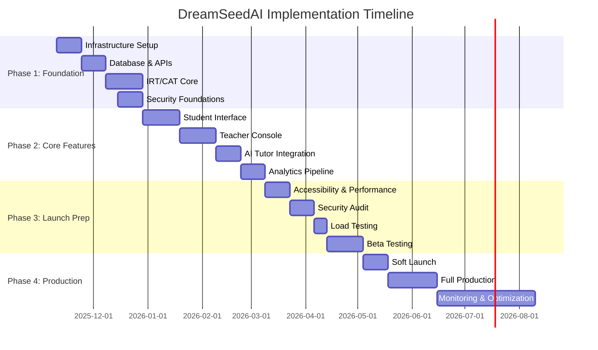

# DreamSeedAI Platform - Integrated Execution Plan

**Version**: 1.0  
**Date**: November 9, 2025  
**Status**: Ready for Implementation  
**Branch**: feat/governance-production-ready

---

## Executive Summary

This execution plan integrates all implementation guides (01-14) and GPT feedback action items into a phased roadmap for deploying the DreamSeedAI adaptive learning platform to production.

### Platform Overview

**DreamSeedAI** is an AI-powered adaptive learning platform that:

- Uses **IRT (Item Response Theory)** and **CAT (Computerized Adaptive Testing)** for personalized assessments
- Provides **real-time ability estimation** (θ) with Bayesian updating
- Offers **AI tutor** support for personalized learning
- Delivers **comprehensive analytics** for teachers, parents, and administrators
- Ensures **WCAG 2.1 AA accessibility** and **COPPA/FERPA/GDPR compliance**

### Success Metrics

| Metric                     | Target | Current | Timeline |
| -------------------------- | ------ | ------- | -------- |
| Student Accuracy           | 85%+   | TBD     | 3 months |
| Assessment Completion Rate | 90%+   | TBD     | 3 months |
| Platform Uptime            | 99.9%  | TBD     | 6 months |
| WCAG AA Compliance         | 100%   | 0%      | 6 months |
| Lighthouse Score           | 90+    | TBD     | 6 months |
| Response Time (p95)        | <500ms | TBD     | 6 months |

---

## Table of Contents

1. [Implementation Phases](#implementation-phases)
2. [Phase 1: Foundation (Weeks 1-8)](#phase-1-foundation-weeks-1-8)
3. [Phase 2: Core Features (Weeks 9-16)](#phase-2-core-features-weeks-9-16)
4. [Phase 3: Production Launch (Weeks 17-24)](#phase-3-production-launch-weeks-17-24)
5. [Phase 4: Post-Launch (Months 4-12)](#phase-4-post-launch-months-4-12)
6. [Team Structure & Resources](#team-structure--resources)
7. [Risk Management](#risk-management)
8. [Budget & Timeline](#budget--timeline)
9. [Quality Assurance](#quality-assurance)
10. [Deployment Strategy](#deployment-strategy)

---

## Implementation Phases

### Overview

### Phase Breakdown

| Phase                      | Duration | Key Deliverables                         | Team Size |
| -------------------------- | -------- | ---------------------------------------- | --------- |
| **Phase 1: Foundation**    | 8 weeks  | Infrastructure, APIs, IRT/CAT core       | 6-8       |
| **Phase 2: Core Features** | 8 weeks  | Student/Teacher UIs, AI Tutor, Analytics | 8-10      |
| **Phase 3: Launch Prep**   | 8 weeks  | Security, Performance, Testing           | 10-12     |
| **Phase 4: Post-Launch**   | 8 weeks  | Production ops, optimization             | 6-8       |

---

## Phase 1: Foundation (Weeks 1-8)

**Goal**: Establish robust infrastructure, core APIs, and IRT/CAT engine

### Week 1-2: Infrastructure Setup

#### Tasks (Priority: HIGH)

**1.1 GCP Project Setup** (Guide 04)

- [ ] Create GCP project with proper organization
- [ ] Set up billing alerts and quotas
- [ ] Configure VPC network with subnets
- [ ] Enable required APIs (Compute, Storage, SQL, etc.)
- [ ] Set up Cloud IAM roles and service accounts

**1.2 Kubernetes Cluster** (Guide 04)

- [ ] Provision GKE cluster (3 nodes, n1-standard-4)
- [ ] Configure node pools (system, application, data)
- [ ] Set up Workload Identity for pod authentication
- [ ] Install Ingress controller (nginx)
- [ ] Configure cert-manager for SSL

**1.3 PostgreSQL Database** (Guide 03)

- [ ] Deploy Cloud SQL PostgreSQL 15 (HA mode)
- [ ] Configure automated backups (daily, 30-day retention)
- [ ] Set up read replicas for analytics
- [ ] Enable connection pooling (PgBouncer)
- [ ] Create initial schemas and migrations

**1.4 CI/CD Pipeline** (Guide 04)

- [ ] Set up GitHub Actions workflows
- [ ] Configure Docker image builds
- [ ] Implement automated testing pipeline
- [ ] Set up staging environment
- [ ] Configure deployment automation

**Deliverables**:

- ✅ GKE cluster running
- ✅ PostgreSQL database operational
- ✅ CI/CD pipeline functional
- ✅ Staging environment accessible

**Team**: 2 DevOps Engineers, 1 Backend Engineer

---

### Week 3-4: Core APIs & Data Models

#### Tasks (Priority: HIGH)

**2.1 FastAPI Backend** (Guide 02)

- [ ] Set up FastAPI project structure
- [ ] Implement authentication (JWT, OAuth2)
- [ ] Create user management APIs
- [ ] Set up SQLAlchemy ORM models
- [ ] Implement API versioning (/v1/)

**2.2 Database Schema** (Guide 03)

- [ ] Create `users` table with RBAC
- [ ] Create `assessments` and `sessions` tables
- [ ] Create `items` table with IRT parameters
- [ ] Create `responses` table for answer tracking
- [ ] Set up indexes for performance

**2.3 Authentication & Authorization** (Guide 07)

- [ ] Implement JWT token generation/validation
- [ ] Set up refresh token rotation
- [ ] Create RBAC middleware
- [ ] Implement session management
- [ ] Set up OAuth2 providers (Google, Microsoft)

**2.4 API Documentation** (Guide 02)

- [ ] Generate OpenAPI/Swagger docs
- [ ] Write API usage examples
- [ ] Document authentication flow
- [ ] Create Postman collections

**Deliverables**:

- ✅ FastAPI server running on GKE
- ✅ Database schema migrated
- ✅ Authentication working
- ✅ API docs published

**Team**: 3 Backend Engineers, 1 Database Engineer

---

### Week 5-7: IRT/CAT Engine (CRITICAL PATH)

#### Tasks (Priority: CRITICAL)

**3.1 IRT Implementation** (Guide 05)

- [ ] Implement 3PL IRT model in R
- [ ] Create item parameter estimation functions
- [ ] Implement ability estimation (MLE, EAP, MAP)
- [ ] Add Fisher Information calculation
- [ ] Handle boundary cases (θ = ±∞)

**3.2 CAT Algorithm** (Guide 05)

- [ ] Implement item selection (Maximum Information)
- [ ] Add content balancing constraints
- [ ] Implement stopping rules (SE < 0.3, max items)
- [ ] Create adaptive difficulty adjustment
- [ ] Add exposure control

**3.3 Bayesian Updating** (Guide 06)

- [ ] Implement prior distribution (N(0,1))
- [ ] Create posterior updating after each response
- [ ] Add ability trajectory tracking
- [ ] Implement convergence detection
- [ ] Handle edge cases

**3.4 R-Python Integration** (Guide 05)

- [ ] Set up rpy2 interface
- [ ] Create Python wrappers for R functions
- [ ] Implement error handling and retries
- [ ] Add performance caching
- [ ] Write integration tests

**3.5 Performance Optimization** (GPT Feedback Action #IRT-4)

- [ ] Vectorize IRT calculations
- [ ] Pre-compute Fisher Information
- [ ] Implement Redis caching for abilities
- [ ] Add database query optimization
- [ ] Target: <100ms per item selection

**Deliverables**:

- ✅ IRT/CAT engine operational
- ✅ Bayesian updating working
- ✅ Performance targets met (<100ms)
- ✅ Unit tests passing (95%+ coverage)

**Team**: 2 Data Scientists, 2 Backend Engineers, 1 R Developer

---

### Week 8: Security Foundations

#### Tasks (Priority: HIGH)

**4.1 Security Hardening** (Guide 07, GPT Feedback)

- [ ] Implement rate limiting (100 req/min per user)
- [ ] Set up WAF (Web Application Firewall)
- [ ] Configure HTTPS/TLS 1.3
- [ ] Implement CSRF protection
- [ ] Add XSS prevention headers

**4.2 Data Encryption** (Guide 07)

- [ ] Enable encryption at rest (Cloud SQL)
- [ ] Implement encryption in transit (TLS)
- [ ] Set up Secret Manager for API keys
- [ ] Encrypt PII fields in database
- [ ] Configure key rotation

**4.3 COPPA/FERPA Compliance** (Guide 08)

- [ ] Implement parental consent flow
- [ ] Add age verification (13+ check)
- [ ] Create data retention policies
- [ ] Set up audit logging
- [ ] Implement data export API

**4.4 GDPR Compliance** (Guide 08, GPT Feedback Action #SEC-7)

- [ ] Implement "Right to be Forgotten"
- [ ] Add data portability API
- [ ] Create consent management UI
- [ ] Set up data processing agreements
- [ ] Document data flows

**Deliverables**:

- ✅ Security audit passed
- ✅ COPPA/FERPA compliant
- ✅ GDPR requirements met
- ✅ Penetration test scheduled

**Team**: 2 Security Engineers, 1 Compliance Specialist, 1 Backend Engineer

---

## Phase 2: Core Features (Weeks 9-16)

**Goal**: Build student and teacher interfaces, integrate AI tutor, implement analytics

### Week 9-11: Student Interface

#### Tasks (Priority: HIGH)

**5.1 Next.js Frontend Setup** (Guide 11)

- [ ] Initialize Next.js 14 project (App Router)
- [ ] Configure Tailwind CSS with DreamSeed theme
- [ ] Set up Zustand state management
- [ ] Configure React Query
- [ ] Implement i18n (EN, KO, ES, ZH)

**5.2 Student Dashboard** (Guide 12)

- [ ] Build WelcomeHeader component
- [ ] Create RecentScores card with charts
- [ ] Implement WeaknessAreas visualization
- [ ] Build GoalProgress tracker
- [ ] Add RecommendedActivities feed

**5.3 Assessment Interface** (Guide 12)

- [ ] Create QuestionDisplay component (LaTeX support)
- [ ] Implement ProgressIndicator
- [ ] Build Timer component
- [ ] Add answer selection UI
- [ ] Implement pause/resume functionality

**5.4 AI Tutor Chat** (Guide 12)

- [ ] Build FloatingChatButton
- [ ] Create ChatInterface component
- [ ] Implement MessageBubble with LaTeX
- [ ] Add suggested questions
- [ ] Integrate with AI backend

**5.5 Gamification** (Guide 12)

- [ ] Build Achievements component
- [ ] Create Leaderboard
- [ ] Implement badges and rewards
- [ ] Add streak tracking
- [ ] Create progress animations

**Deliverables**:

- ✅ Student dashboard live
- ✅ Assessment taking functional
- ✅ AI tutor integrated
- ✅ Gamification features working

**Team**: 3 Frontend Engineers, 1 UX Designer, 1 Backend Engineer

---

### Week 12-14: Teacher Console

#### Tasks (Priority: HIGH)

**6.1 R Shiny Setup** (Guide 13)

- [ ] Initialize Shiny dashboard project
- [ ] Configure shinydashboard layout
- [ ] Set up database connection pooling
- [ ] Create API client module
- [ ] Implement authentication

**6.2 Teacher Dashboard** (Guide 13)

- [ ] Build summary value boxes
- [ ] Create recent assessments chart
- [ ] Implement class performance plot
- [ ] Add at-risk students table
- [ ] Build quick actions panel

**6.3 Class Management** (Guide 13)

- [ ] Create class list table
- [ ] Implement class creation modal
- [ ] Build student roster management
- [ ] Add class schedule UI
- [ ] Create assignment interface

**6.4 Student Monitoring** (Guide 13)

- [ ] Build student profile view
- [ ] Create ability trend charts
- [ ] Implement performance analytics
- [ ] Add topic strength radar chart
- [ ] Show AI tutor session history

**6.5 Item Bank Management** (Guide 13)

- [ ] Create item list with filters
- [ ] Build item editor (LaTeX support)
- [ ] Implement IRT parameter inputs
- [ ] Add bulk import/export
- [ ] Create item preview

**6.6 Reports & Analytics** (Guide 13)

- [ ] Build report generator
- [ ] Create class performance reports
- [ ] Implement student progress reports
- [ ] Add item analysis reports
- [ ] Enable PDF/Excel export

**Deliverables**:

- ✅ Teacher dashboard operational
- ✅ Class management working
- ✅ Item bank functional
- ✅ Reports generating

**Team**: 2 R Developers, 2 Backend Engineers, 1 Data Analyst

---

### Week 15-16: AI Tutor & Analytics

#### Tasks (Priority: MEDIUM)

**7.1 AI Tutor Backend** (Guide 09)

- [ ] Set up OpenAI API integration
- [ ] Implement conversation context management
- [ ] Create prompt engineering templates
- [ ] Add safety filters
- [ ] Implement rate limiting

**7.2 Analytics Pipeline** (Guide 10)

- [ ] Set up Apache Kafka cluster
- [ ] Implement event streaming
- [ ] Create data warehouse schema
- [ ] Build ETL pipelines
- [ ] Set up Apache Superset

**7.3 Real-time Features** (Guide 14)

- [ ] Set up Socket.IO server
- [ ] Implement live assessment monitoring
- [ ] Create real-time notifications
- [ ] Add collaborative whiteboard
- [ ] Build presence indicators

**Deliverables**:

- ✅ AI tutor responding
- ✅ Analytics pipeline running
- ✅ Real-time updates working

**Team**: 2 AI/ML Engineers, 2 Data Engineers, 1 Backend Engineer

---

## Phase 3: Production Launch (Weeks 17-24)

**Goal**: Ensure production-readiness through accessibility, security, performance, and testing

### Week 17-18: Accessibility & Performance

#### Tasks (Priority: HIGH)

**8.1 WCAG 2.1 AA Compliance** (Guide 14)

- [ ] Audit all components with axe-core
- [ ] Implement ARIA labels and roles
- [ ] Add keyboard navigation support
- [ ] Create skip links
- [ ] Ensure color contrast ratios (4.5:1)
- [ ] Add screen reader announcements
- [ ] Implement focus management
- [ ] Test with NVDA and JAWS

**8.2 Performance Optimization** (Guide 14)

- [ ] Implement code splitting
- [ ] Optimize images (WebP/AVIF)
- [ ] Configure font optimization
- [ ] Set up React Query caching
- [ ] Add memoization
- [ ] Implement virtual scrolling
- [ ] Optimize bundle size (<500KB)

**8.3 Core Web Vitals** (Guide 14)

- [ ] Achieve LCP < 2.5s
- [ ] Achieve FID < 100ms
- [ ] Achieve CLS < 0.1
- [ ] Set up performance monitoring
- [ ] Configure CDN (Cloudflare/Fastly)

**Deliverables**:

- ✅ WCAG AA compliance verified
- ✅ Lighthouse score 90+
- ✅ Core Web Vitals met

**Team**: 2 Frontend Engineers, 1 Accessibility Specialist, 1 Performance Engineer

---

### Week 19-20: Security Audit & Penetration Testing

#### Tasks (Priority: CRITICAL)

**9.1 Security Audit** (GPT Feedback Action #SEC-1)

- [ ] Conduct internal security review
- [ ] Hire external security firm
- [ ] Perform penetration testing
- [ ] Review authentication flows
- [ ] Audit API endpoints
- [ ] Check for OWASP Top 10 vulnerabilities

**9.2 Remediation** (GPT Feedback)

- [ ] Fix SQL injection vulnerabilities
- [ ] Patch XSS vulnerabilities
- [ ] Address CSRF issues
- [ ] Fix insecure deserialization
- [ ] Resolve authentication bypasses

**9.3 Compliance Verification**

- [ ] COPPA compliance check
- [ ] FERPA compliance check
- [ ] GDPR compliance check
- [ ] Document data flows
- [ ] Update privacy policy

**Deliverables**:

- ✅ Security audit report
- ✅ All critical issues resolved
- ✅ Compliance verified

**Team**: 2 Security Engineers, 1 External Auditor, 1 Compliance Specialist

---

### Week 21-22: Load Testing & Optimization

#### Tasks (Priority: HIGH)

**10.1 Load Testing** (GPT Feedback Action #PERF-8)

- [ ] Set up K6 or Locust
- [ ] Simulate 10,000 concurrent users
- [ ] Test assessment taking flow
- [ ] Test AI tutor under load
- [ ] Test real-time features
- [ ] Identify bottlenecks

**10.2 Database Optimization** (GPT Feedback Action #PERF-1)

- [ ] Optimize slow queries (target <50ms)
- [ ] Add missing indexes
- [ ] Implement query result caching
- [ ] Set up read replicas
- [ ] Configure connection pooling

**10.3 API Optimization** (GPT Feedback Action #PERF-3)

- [ ] Add Redis caching layer
- [ ] Implement response compression
- [ ] Optimize N+1 queries
- [ ] Add API rate limiting
- [ ] Configure CDN for static assets

**10.4 Scaling Configuration**

- [ ] Configure horizontal pod autoscaling
- [ ] Set up database auto-scaling
- [ ] Configure load balancer
- [ ] Implement circuit breakers
- [ ] Add health checks

**Deliverables**:

- ✅ Load test report
- ✅ Performance targets met
- ✅ Auto-scaling configured

**Team**: 2 Performance Engineers, 2 DevOps Engineers, 1 Database Engineer

---

### Week 23-24: Beta Testing

#### Tasks (Priority: HIGH)

**11.1 Beta Program Setup**

- [ ] Recruit 100 beta users (students/teachers/parents)
- [ ] Create beta onboarding materials
- [ ] Set up feedback collection forms
- [ ] Configure error tracking (Sentry)
- [ ] Prepare support documentation

**11.2 Beta Testing Execution**

- [ ] Conduct teacher training sessions
- [ ] Monitor system performance
- [ ] Collect user feedback
- [ ] Track bug reports
- [ ] Measure success metrics

**11.3 Issue Resolution**

- [ ] Triage and prioritize bugs
- [ ] Fix critical issues
- [ ] Implement UX improvements
- [ ] Optimize based on feedback
- [ ] Conduct regression testing

**Deliverables**:

- ✅ Beta testing complete
- ✅ Critical bugs fixed
- ✅ User satisfaction > 80%

**Team**: 4 Engineers (mixed), 1 QA Engineer, 1 Support Specialist

---

## Phase 4: Post-Launch (Months 4-12)

**Goal**: Ensure stable production operations, continuous improvement, and feature expansion

### Month 4-5: Soft Launch

#### Tasks (Priority: HIGH)

**12.1 Soft Launch Preparation**

- [ ] Prepare rollback procedures
- [ ] Set up monitoring dashboards
- [ ] Configure alerting (PagerDuty/Opsgenie)
- [ ] Create runbooks for common issues
- [ ] Train support team

**12.2 Phased Rollout**

- [ ] Deploy to 10% of users (Week 1)
- [ ] Monitor for 3 days, fix issues
- [ ] Deploy to 25% of users (Week 2)
- [ ] Monitor for 3 days, fix issues
- [ ] Deploy to 50% of users (Week 3)
- [ ] Monitor for 3 days, fix issues
- [ ] Deploy to 100% of users (Week 4)

**12.3 Production Monitoring** (Guide 14)

- [ ] Monitor Core Web Vitals
- [ ] Track error rates (<0.1%)
- [ ] Monitor API latency (p95 <500ms)
- [ ] Track database performance
- [ ] Monitor infrastructure costs

**Deliverables**:

- ✅ Soft launch successful
- ✅ 99.9% uptime achieved
- ✅ No critical incidents

**Team**: 6 Engineers (on-call rotation), 2 DevOps, 1 Support

---

### Month 6-12: Continuous Improvement

#### Tasks (Priority: MEDIUM-LOW)

**13.1 Feature Enhancements**

- [ ] Implement parent portal features
- [ ] Add advanced analytics
- [ ] Build curriculum alignment tools
- [ ] Create mobile apps (iOS/Android)
- [ ] Add offline mode support

**13.2 ML Model Improvements** (GPT Feedback)

- [ ] Implement 4PL IRT model
- [ ] Add multidimensional IRT
- [ ] Improve AI tutor responses
- [ ] Optimize item selection algorithm
- [ ] Add predictive analytics

**13.3 Operational Excellence** (GPT Feedback Action #OPS-1-5)

- [ ] Implement disaster recovery plan
- [ ] Set up blue-green deployments
- [ ] Configure centralized logging
- [ ] Add distributed tracing
- [ ] Implement cost optimization

**13.4 Compliance & Security** (GPT Feedback)

- [ ] Conduct quarterly security audits
- [ ] Update privacy policies
- [ ] Perform GDPR compliance reviews
- [ ] Train staff on data protection
- [ ] Update incident response plan

**Deliverables**:

- ✅ Feature roadmap executed
- ✅ ML models improved
- ✅ Operational maturity level 4+

**Team**: 8-10 Engineers (feature teams), 2 DevOps, 1 Security

---

## Team Structure & Resources

### Core Team (Full-Time)

| Role                   | Count  | Allocation | Cost/Year  |
| ---------------------- | ------ | ---------- | ---------- |
| **Backend Engineers**  | 3      | 100%       | $360K      |
| **Frontend Engineers** | 3      | 100%       | $330K      |
| **Data Scientists**    | 2      | 100%       | $280K      |
| **DevOps Engineers**   | 2      | 100%       | $260K      |
| **R Developer**        | 1      | 100%       | $120K      |
| **QA Engineer**        | 1      | 100%       | $100K      |
| **UX Designer**        | 1      | 100%       | $110K      |
| **Product Manager**    | 1      | 100%       | $140K      |
| **Tech Lead**          | 1      | 100%       | $180K      |
| **Total**              | **15** | -          | **$1.88M** |

### Specialized Support (Part-Time/Contract)

| Role                     | Allocation | Cost      |
| ------------------------ | ---------- | --------- |
| Security Engineer        | 25%        | $40K/year |
| Accessibility Specialist | 10%        | $15K/year |
| Compliance Specialist    | 15%        | $20K/year |
| Database Engineer        | 25%        | $35K/year |
| Performance Engineer     | 20%        | $30K/year |
| External Security Audit  | One-time   | $25K      |
| **Total**                | -          | **$165K** |

### Infrastructure Costs

| Service                          | Monthly    | Annual   |
| -------------------------------- | ---------- | -------- |
| GKE Cluster (3 nodes)            | $500       | $6K      |
| Cloud SQL (HA)                   | $400       | $4.8K    |
| Cloud Storage                    | $200       | $2.4K    |
| Cloud CDN                        | $300       | $3.6K    |
| Networking                       | $150       | $1.8K    |
| Monitoring/Logging               | $200       | $2.4K    |
| External Services (OpenAI, etc.) | $500       | $6K      |
| **Total**                        | **$2,250** | **$27K** |

### Total Budget

| Category          | Year 1       | Year 2+            |
| ----------------- | ------------ | ------------------ |
| Personnel         | $2.045M      | $2.045M            |
| Infrastructure    | $27K         | $35K (scaled)      |
| External Services | $25K (audit) | $15K (maintenance) |
| Contingency (15%) | $315K        | $315K              |
| **Grand Total**   | **$2.412M**  | **$2.41M**         |

---

## Risk Management

### High-Impact Risks

| Risk                           | Probability | Impact   | Mitigation                                         |
| ------------------------------ | ----------- | -------- | -------------------------------------------------- |
| **IRT/CAT Performance Issues** | Medium      | High     | Early prototyping, load testing, caching strategy  |
| **Security Breach**            | Low         | Critical | Penetration testing, security audits, encryption   |
| **COPPA/FERPA Non-Compliance** | Low         | Critical | Legal review, compliance specialist, documentation |
| **Scaling Bottlenecks**        | Medium      | High     | Load testing, horizontal scaling, CDN              |
| **AI Tutor Quality Issues**    | Medium      | Medium   | Prompt engineering, safety filters, monitoring     |
| **Browser Compatibility**      | Low         | Medium   | Cross-browser testing, polyfills, fallbacks        |
| **Team Attrition**             | Medium      | Medium   | Documentation, knowledge sharing, redundancy       |

### Mitigation Strategies

**1. Technical Risks**

- Conduct POCs for critical components (IRT/CAT)
- Implement comprehensive monitoring
- Maintain 80%+ test coverage
- Regular code reviews
- Architecture review board

**2. Compliance Risks**

- Hire compliance specialist early
- Legal review before launch
- Regular compliance audits
- Documentation of all data flows
- Staff training on privacy laws

**3. Operational Risks**

- Implement blue-green deployments
- Create detailed runbooks
- 24/7 on-call rotation
- Disaster recovery plan
- Regular backup testing

---

## Quality Assurance

### Testing Strategy

**Unit Testing**

- Target: 80%+ coverage
- Tools: Vitest (Frontend), pytest (Backend), testthat (R)
- Run: On every commit (CI/CD)

**Integration Testing**

- API integration tests
- Database integration tests
- R-Python integration tests
- Run: On every PR

**E2E Testing**

- Critical user flows
- Tools: Playwright
- Run: Nightly, before releases

**Accessibility Testing**

- WCAG 2.1 AA compliance
- Tools: axe-core, WAVE, screen readers
- Run: Weekly, before releases

**Performance Testing**

- Load testing (10K concurrent users)
- Stress testing (failure scenarios)
- Tools: K6, Artillery
- Run: Monthly, before releases

**Security Testing**

- Vulnerability scanning
- Penetration testing
- Tools: OWASP ZAP, Burp Suite
- Run: Quarterly, before major releases

### Quality Gates

**Code Quality**

- No critical bugs
- 80%+ test coverage
- 0 security vulnerabilities (high/critical)
- Lighthouse score 90+
- API response time p95 <500ms

**Pre-Release Checklist**

- [ ] All tests passing
- [ ] Security scan clean
- [ ] Performance benchmarks met
- [ ] Accessibility audit passed
- [ ] Documentation updated
- [ ] Rollback plan prepared
- [ ] Stakeholder sign-off

---

## Deployment Strategy

### Environments

| Environment     | Purpose                | Update Frequency                 | Access      |
| --------------- | ---------------------- | -------------------------------- | ----------- |
| **Development** | Feature development    | Continuous                       | Developers  |
| **Staging**     | Pre-production testing | Daily                            | QA, Product |
| **Production**  | Live users             | Weekly (features), Daily (fixes) | All users   |

### Deployment Process

**1. Development → Staging**

- Automated on merge to `develop` branch
- Run full test suite
- Deploy to staging cluster
- Smoke tests execute

**2. Staging → Production**

- Manual approval required
- Tag release version
- Blue-green deployment
- Gradual rollout (10% → 25% → 50% → 100%)
- Monitor for 3 days between stages

**3. Rollback Procedure**

- Automated rollback on critical errors
- Switch traffic back to previous version
- Investigate root cause
- Fix and redeploy

### Monitoring & Alerting

**Application Metrics**

- Request rate, error rate, latency
- Database query performance
- Cache hit rates
- AI tutor response times

**Infrastructure Metrics**

- CPU, memory, disk usage
- Network throughput
- Pod health and restarts
- Database connections

**Business Metrics**

- Active users (DAU/MAU)
- Assessment completion rate
- AI tutor usage
- Student ability improvements

**Alerting Thresholds**

- Critical: p95 latency >1s, error rate >1%, downtime
- Warning: p95 latency >500ms, error rate >0.5%
- Info: Deployment events, scaling events

---

## Success Criteria

### Technical Metrics (Month 6)

- ✅ **Uptime**: 99.9% (43 minutes downtime/month max)
- ✅ **Performance**: p95 API latency <500ms
- ✅ **Scalability**: Support 10,000 concurrent users
- ✅ **Security**: 0 critical vulnerabilities
- ✅ **Accessibility**: 100% WCAG AA compliance
- ✅ **Test Coverage**: 80%+ across all layers

### Business Metrics (Month 6)

- ✅ **User Growth**: 1,000+ active students
- ✅ **Engagement**: 70%+ weekly active users
- ✅ **Completion Rate**: 85%+ assessments completed
- ✅ **Accuracy**: Student ability estimates within ±0.3
- ✅ **Satisfaction**: NPS score >50
- ✅ **Retention**: 80%+ monthly retention

### Educational Outcomes (Month 12)

- ✅ **Learning Gains**: 15%+ improvement in test scores
- ✅ **Engagement**: 60%+ use AI tutor regularly
- ✅ **Teacher Satisfaction**: 80%+ find platform useful
- ✅ **Parent Satisfaction**: 75%+ recommend platform

---

## Next Steps

### Immediate Actions (Week 1)

1. **Kickoff Meeting**

   - Review execution plan with team
   - Assign ownership for each phase
   - Establish communication channels
   - Set up project management tools

2. **Infrastructure Setup**

   - Provision GCP project
   - Create GKE cluster
   - Set up PostgreSQL database
   - Configure CI/CD pipeline

3. **Team Onboarding**

   - Share implementation guides (01-14)
   - Review architecture decisions
   - Set up development environments
   - Establish coding standards

4. **Risk Assessment**
   - Review risk register
   - Assign risk owners
   - Schedule mitigation planning
   - Set up monitoring

### Weekly Cadence

- **Monday**: Sprint planning, assign tasks
- **Wednesday**: Mid-week check-in, unblock issues
- **Friday**: Demo, retrospective, plan next week
- **Daily**: 15-min standup (async for remote)

### Monthly Reviews

- Review progress against timeline
- Assess risks and mitigation
- Adjust resource allocation
- Update stakeholders
- Plan next month

---

## Appendix

### Implementation Guide Reference

| Guide | Title                       | Focus                        |
| ----- | --------------------------- | ---------------------------- |
| 01    | System Overview             | Architecture, tech stack     |
| 02    | API Layer                   | FastAPI, REST APIs           |
| 03    | Data Layer                  | PostgreSQL, schema design    |
| 04    | Infrastructure              | GCP, Kubernetes, deployment  |
| 05    | IRT/CAT Engine              | Adaptive testing core        |
| 06    | Bayesian Updating           | Ability estimation           |
| 07    | Security                    | Authentication, encryption   |
| 08    | Privacy Compliance          | COPPA, FERPA, GDPR           |
| 09    | AI Integration              | LLM tutor, safety            |
| 10    | Analytics                   | Data pipeline, reporting     |
| 11    | Frontend Architecture       | React, Next.js, setup        |
| 12    | Student Interface           | Dashboard, assessment, tutor |
| 13    | Teacher Console             | R Shiny, management          |
| 14    | Accessibility & Performance | WCAG, optimization           |

### GPT Feedback Action Items

Detailed action items are documented in `GPT_FEEDBACK_ACTION_PLAN.md`. Key priorities:

- **Architecture**: PostgreSQL HA, Kafka clustering, service consolidation
- **IRT/CAT**: Boundary handling, Fisher Information, performance
- **Security**: Penetration testing, COPPA UI, GDPR completion
- **Performance**: Query optimization, caching, load testing
- **Operations**: DR/backups, observability, deployments

### Contact & Escalation

- **Tech Lead**: [Name] - Architecture decisions
- **Product Manager**: [Name] - Scope and priorities
- **DevOps Lead**: [Name] - Infrastructure issues
- **Security Lead**: [Name] - Security concerns
- **Compliance Lead**: [Name] - Legal/privacy issues

---

**Document Version**: 1.0  
**Last Updated**: November 9, 2025  
**Status**: ✅ Ready for Implementation  
**Next Review**: Week 4 (December 2025)

---

_This execution plan integrates all 14 implementation guides and GPT feedback to provide a comprehensive roadmap for launching the DreamSeedAI platform. Adjust timelines and resources based on actual team capacity and organizational constraints._
