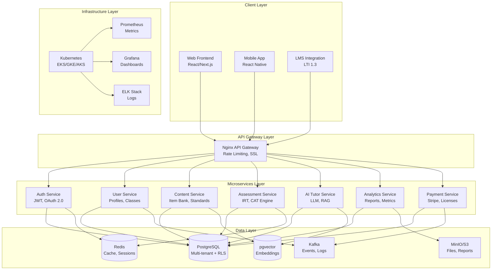

# DreamSeedAI System Layer Implementation Guide

> **Comprehensive production-ready implementation guide for building DreamSeedAI's microservices-based adaptive learning platform**

## 📋 Table of Contents

### Core Documentation

- [**00. Architecture Overview**](./00-architecture-overview.md) - System architecture, technology stack decisions, and ADRs
- [**01. FastAPI Microservices**](./01-fastapi-microservices.md) - Production patterns, project structure, testing ⭐ **Phase 1 Priority**
- [**02. IRT/CAT Implementation**](./02-irt-cat-implementation.md) - Adaptive testing engine with Item Response Theory ⭐ **Phase 1 Priority**
- [**03. Knowledge Graph & Semantic Search**](./03-knowledge-graph.md) - Content organization, prerequisite chains, vector embeddings
- [**04. AI Tutor & LLM Integration**](./04-ai-tutor-llm.md) - RAG pipeline, multi-LLM support, policy filtering
- [**05. Multi-Tenancy & Data Isolation**](./05-multi-tenancy-rls.md) - PostgreSQL RLS, tenant isolation, FERPA compliance ⭐ **Phase 1 Priority**
- [**06. Async Task Processing**](./06-async-task-processing.md) - Celery, Quarto reports, long-running operations
- [**07. Stripe Payment Integration**](./07-stripe-payment.md) - Subscriptions, school licenses, webhook handling
- [**08. LTI 1.3 Integration**](./08-lti-integration.md) - LMS connectivity, SSO, grade passback
- [**09. Kubernetes & CI/CD**](./09-kubernetes-cicd.md) - Production deployment, auto-scaling, monitoring
- [**10. Security & Compliance**](./10-security-compliance.md) - GDPR/COPPA/FERPA, encryption, audit logging

### Supporting Materials

- [**Templates**](./templates/) - Reusable boilerplate code and configurations
- [**Examples**](./examples/) - Working reference implementations

---

## 🚀 Quick Start

### Prerequisites

```bash
# Required tools
- Python 3.11+
- Node.js 18+
- Docker & Docker Compose
- kubectl & helm
- PostgreSQL 15+
- Redis 7+

# Recommended
- VS Code with extensions (Python, Docker, Kubernetes)
- Postman or Insomnia for API testing
```

### Initial Setup (10 minutes)

```bash
# 1. Clone repository
git clone https://github.com/dreamseedai/dreamseed_monorepo.git
cd dreamseed_monorepo

# 2. Set up Python environment
python -m venv venv
source venv/bin/activate  # or `venv\Scripts\activate` on Windows
pip install -r requirements-dev.txt

# 3. Configure environment
cp .env.example .env
# Edit .env with your settings

# 4. Start local infrastructure
docker-compose up -d postgres redis

# 5. Run database migrations
alembic upgrade head

# 6. Start development server
uvicorn main:app --reload
```

### First Service (30 minutes)

Follow the [**FastAPI Microservices Guide**](./01-fastapi-microservices.md) to:

1. Create your first service skeleton
2. Implement health checks and basic endpoints
3. Add database models and migrations
4. Write unit and integration tests
5. Deploy to local Kubernetes cluster

---

## 📅 Implementation Roadmap

### Phase 1: MVP (Months 1-3) ⭐ **Start Here**

**Goal**: Core platform functionality with basic adaptive testing

| Week  | Component                   | Status         | Guide                                                          |
| ----- | --------------------------- | -------------- | -------------------------------------------------------------- |
| 1-2   | Infrastructure setup        | 🚧 In Progress | [09-kubernetes-cicd.md](./09-kubernetes-cicd.md)               |
| 3-4   | User management & auth      | ⏳ Planned     | [01-fastapi-microservices.md](./01-fastapi-microservices.md)   |
| 5-6   | Content management (CRUD)   | ⏳ Planned     | [01-fastapi-microservices.md](./01-fastapi-microservices.md)   |
| 7-9   | Assessment engine (IRT/CAT) | ⏳ Planned     | [02-irt-cat-implementation.md](./02-irt-cat-implementation.md) |
| 10-11 | Multi-tenancy & RLS         | ⏳ Planned     | [05-multi-tenancy-rls.md](./05-multi-tenancy-rls.md)           |
| 12    | API Gateway & monitoring    | ⏳ Planned     | [09-kubernetes-cicd.md](./09-kubernetes-cicd.md)               |

**Deliverables**:

- ✅ Working authentication system (JWT + OAuth 2.0)
- ✅ Basic item bank with CRUD operations
- ✅ Functional CAT engine (1PL/2PL IRT models)
- ✅ Multi-tenant database with RLS
- ✅ API Gateway with rate limiting
- ✅ Basic Prometheus/Grafana monitoring

**Success Metrics**:

- 50+ test items in item bank
- 100+ concurrent test sessions supported
- <300ms p95 API latency
- 98% uptime

---

### Phase 2: Beta (Months 4-6)

**Goal**: Advanced features and production readiness

| Week  | Component                  | Status     | Guide                                                        |
| ----- | -------------------------- | ---------- | ------------------------------------------------------------ |
| 13-15 | AI Tutor (LLM + RAG)       | ⏳ Planned | [04-ai-tutor-llm.md](./04-ai-tutor-llm.md)                   |
| 16-18 | Analytics engine + Quarto  | ⏳ Planned | [06-async-task-processing.md](./06-async-task-processing.md) |
| 19-20 | Stripe payment integration | ⏳ Planned | [07-stripe-payment.md](./07-stripe-payment.md)               |
| 21-22 | LTI 1.3 for LMS            | ⏳ Planned | [08-lti-integration.md](./08-lti-integration.md)             |
| 23-24 | Advanced monitoring        | ⏳ Planned | [09-kubernetes-cicd.md](./09-kubernetes-cicd.md)             |

**Deliverables**:

- ✅ AI tutor with GPT-4 and RAG
- ✅ Automated PDF report generation
- ✅ Subscription and school license management
- ✅ Canvas/Moodle LMS integration
- ✅ Distributed tracing with Jaeger
- ✅ ELK stack for log aggregation

**Success Metrics**:

- 1,000+ active users
- 5,000+ AI tutor conversations
- 500+ generated reports
- 99.5% uptime

---

### Phase 3: Production (Months 7-9)

**Goal**: Scale, optimize, and enhance

| Week  | Component                         | Status     | Guide                                                          |
| ----- | --------------------------------- | ---------- | -------------------------------------------------------------- |
| 25-27 | Advanced IRT (MIRT, testlets)     | ⏳ Planned | [02-irt-cat-implementation.md](./02-irt-cat-implementation.md) |
| 28-30 | Knowledge graph + semantic search | ⏳ Planned | [03-knowledge-graph.md](./03-knowledge-graph.md)               |
| 31-32 | Anomaly detection                 | ⏳ Planned | [02-irt-cat-implementation.md](./02-irt-cat-implementation.md) |
| 33-34 | Multi-language support            | ⏳ Planned | [01-fastapi-microservices.md](./01-fastapi-microservices.md)   |
| 35-36 | Performance optimization          | ⏳ Planned | [09-kubernetes-cicd.md](./09-kubernetes-cicd.md)               |

**Deliverables**:

- ✅ Multi-dimensional IRT models
- ✅ pgvector-based semantic search
- ✅ Real-time anomaly detection (cheating, struggling students)
- ✅ Support for English, Korean, Spanish
- ✅ Optimized for 100K+ users

**Success Metrics**:

- 10,000+ concurrent test sessions
- <200ms p95 API latency
- <5s IRT ability estimation
- 99.9% uptime
- <$5/user/month infrastructure cost

---

## 🏗️ System Architecture



**Key Design Principles**:

- **Microservices**: Independent services with clear boundaries
- **Multi-Tenancy**: Organization-level data isolation via PostgreSQL RLS
- **Event-Driven**: Kafka for async communication and audit logs
- **API-First**: OpenAPI 3.0 specifications for all services
- **Security by Default**: HTTPS, JWT, RBAC, encryption at rest
- **Observability**: Metrics, logs, and traces for all components
- **Scalability**: Horizontal scaling with Kubernetes HPA

---

## 📚 Documentation Structure

### Implementation Guides (Step-by-Step)

Each guide contains:

- **Overview**: What you'll build and why
- **Prerequisites**: Required knowledge and dependencies
- **Architecture**: Component design and data flow
- **Implementation**: Production-ready code examples
- **Testing**: Unit, integration, and e2e test patterns
- **Deployment**: Docker, Kubernetes, and CI/CD
- **Monitoring**: Metrics, logs, and alerts
- **Troubleshooting**: Common issues and solutions

### Templates (Copy & Paste)

Ready-to-use code:

- FastAPI service skeleton with DI
- Kubernetes manifests (Deployment, Service, Ingress)
- GitHub Actions CI/CD workflows
- Docker multi-stage builds
- Alembic migration scripts
- pytest test fixtures

### Examples (Running Code)

Minimal working projects:

- `minimal-cat-engine/`: Standalone IRT/CAT implementation
- `simple-ai-tutor/`: Basic LLM chatbot with RAG
- `stripe-webhook-handler/`: Subscription management demo

---

## 🔧 Technology Stack

### Backend

| Component         | Technology   | Version | Purpose                     |
| ----------------- | ------------ | ------- | --------------------------- |
| **API Framework** | FastAPI      | 0.104+  | High-performance async APIs |
| **Language**      | Python       | 3.11+   | Primary backend language    |
| **Database**      | PostgreSQL   | 15+     | Primary data store with RLS |
| **Cache**         | Redis        | 7+      | Session store, caching      |
| **Message Queue** | Apache Kafka | 3.5+    | Event streaming, audit logs |
| **Task Queue**    | Celery       | 5.3+    | Async task processing       |
| **ORM**           | SQLAlchemy   | 2.0+    | Database abstraction        |
| **Migrations**    | Alembic      | 1.12+   | Schema versioning           |
| **Validation**    | Pydantic     | 2.5+    | Data validation             |

### Frontend

| Component          | Technology      | Version | Purpose                   |
| ------------------ | --------------- | ------- | ------------------------- |
| **Framework**      | React           | 18+     | UI library                |
| **Meta-Framework** | Next.js         | 14+     | SSR, routing, API routes  |
| **Language**       | TypeScript      | 5+      | Type-safe JavaScript      |
| **State**          | Zustand         | 4+      | Global state management   |
| **UI Components**  | shadcn/ui       | -       | Tailwind-based components |
| **Forms**          | React Hook Form | 7+      | Form handling             |
| **Rich Text**      | TipTap          | 2.5+    | Math editor               |

### AI/ML

| Component       | Technology          | Version | Purpose                |
| --------------- | ------------------- | ------- | ---------------------- |
| **IRT Models**  | scipy, statsmodels  | -       | Statistical modeling   |
| **LLM**         | OpenAI API          | -       | GPT-4 for tutoring     |
| **Embeddings**  | OpenAI Embeddings   | -       | Vector representations |
| **Vector DB**   | pgvector            | 0.5+    | Similarity search      |
| **Reporting**   | Quarto              | 1.4+    | PDF report generation  |
| **Forecasting** | ARIMA (statsmodels) | -       | Time series prediction |

### Infrastructure

| Component         | Technology     | Version | Purpose                      |
| ----------------- | -------------- | ------- | ---------------------------- |
| **Orchestration** | Kubernetes     | 1.28+   | Container orchestration      |
| **Container**     | Docker         | 24+     | Application packaging        |
| **Ingress**       | Nginx Ingress  | -       | API Gateway, SSL termination |
| **Monitoring**    | Prometheus     | 2.48+   | Metrics collection           |
| **Dashboards**    | Grafana        | 10+     | Visualization                |
| **Logging**       | ELK Stack      | 8+      | Log aggregation              |
| **Tracing**       | Jaeger         | 1.51+   | Distributed tracing          |
| **CI/CD**         | GitHub Actions | -       | Automated deployment         |

### Security & Compliance

| Component                  | Technology     | Version | Purpose                |
| -------------------------- | -------------- | ------- | ---------------------- |
| **Policy Engine**          | OPA            | 0.59+   | Authorization policies |
| **Secrets**                | Sealed Secrets | -       | Encrypted K8s secrets  |
| **TLS**                    | cert-manager   | 1.13+   | Automated certificates |
| **Vulnerability Scanning** | Snyk, Trivy    | -       | Security audits        |

---

## 🎯 Success Metrics

### Performance Targets

| Metric                 | Target | Measurement             |
| ---------------------- | ------ | ----------------------- |
| API Latency (p95)      | <200ms | Prometheus + Grafana    |
| IRT Ability Estimation | <5s    | Application metrics     |
| Report Generation      | <30s   | Celery task duration    |
| Database Query Time    | <100ms | pgAdmin, slow query log |
| Cache Hit Rate         | >80%   | Redis INFO stats        |

### Reliability Targets

| Metric       | Target | Measurement                   |
| ------------ | ------ | ----------------------------- |
| Uptime       | 99.9%  | Prometheus blackbox exporter  |
| Error Rate   | <1%    | Application logs, Sentry      |
| Failed Tasks | <2%    | Celery Flower dashboard       |
| Data Loss    | 0%     | Backup verification, DR tests |

### Scalability Targets

| Metric           | Target  | Measurement               |
| ---------------- | ------- | ------------------------- |
| Concurrent Users | 10,000+ | Load testing (Locust, k6) |
| Test Sessions    | 10,000+ | Database row counts       |
| API Requests     | 1M+/day | Nginx access logs         |
| Data Storage     | 1TB+    | PostgreSQL disk usage     |

### Cost Efficiency

| Metric              | Target            | Measurement             |
| ------------------- | ----------------- | ----------------------- |
| Infrastructure Cost | <$5/user/month    | Cloud billing dashboard |
| LLM API Cost        | <$0.50/user/month | OpenAI usage tracking   |
| Storage Cost        | <$0.10/user/month | S3/MinIO billing        |

---

## 📖 Learning Path

### For Backend Developers

1. ✅ **Start**: [01-fastapi-microservices.md](./01-fastapi-microservices.md)
2. **Core Logic**: [02-irt-cat-implementation.md](./02-irt-cat-implementation.md)
3. **Data**: [05-multi-tenancy-rls.md](./05-multi-tenancy-rls.md)
4. **AI**: [04-ai-tutor-llm.md](./04-ai-tutor-llm.md)
5. **Deploy**: [09-kubernetes-cicd.md](./09-kubernetes-cicd.md)

### For DevOps Engineers

1. ✅ **Start**: [00-architecture-overview.md](./00-architecture-overview.md)
2. **Infrastructure**: [09-kubernetes-cicd.md](./09-kubernetes-cicd.md)
3. **Security**: [10-security-compliance.md](./10-security-compliance.md)
4. **Monitoring**: [09-kubernetes-cicd.md](./09-kubernetes-cicd.md#monitoring)
5. **Optimization**: [09-kubernetes-cicd.md](./09-kubernetes-cicd.md#performance)

### For Data Scientists

1. ✅ **Start**: [02-irt-cat-implementation.md](./02-irt-cat-implementation.md)
2. **NLP**: [03-knowledge-graph.md](./03-knowledge-graph.md)
3. **LLM**: [04-ai-tutor-llm.md](./04-ai-tutor-llm.md)
4. **Reports**: [06-async-task-processing.md](./06-async-task-processing.md)
5. **Deploy**: [09-kubernetes-cicd.md](./09-kubernetes-cicd.md)

### For Full-Stack Developers

1. ✅ **Start**: [01-fastapi-microservices.md](./01-fastapi-microservices.md)
2. **Auth**: [01-fastapi-microservices.md](./01-fastapi-microservices.md#authentication)
3. **Integration**: [08-lti-integration.md](./08-lti-integration.md)
4. **Payment**: [07-stripe-payment.md](./07-stripe-payment.md)
5. **Testing**: [01-fastapi-microservices.md](./01-fastapi-microservices.md#testing)

---

## 🛠️ Development Workflow

### Daily Development

```bash
# 1. Pull latest changes
git pull origin main

# 2. Create feature branch
git checkout -b feature/new-assessment-algorithm

# 3. Start local services
docker-compose up -d

# 4. Run tests in watch mode
pytest --watch

# 5. Make changes, test, commit
git add .
git commit -m "feat(assessment): implement 3PL IRT model"

# 6. Push and create PR
git push origin feature/new-assessment-algorithm
```

### Code Review Checklist

- [ ] All tests pass (`pytest`)
- [ ] Type checking passes (`mypy`)
- [ ] Linting passes (`ruff`, `black`)
- [ ] Security scan clean (`bandit`, `safety`)
- [ ] Documentation updated
- [ ] API spec updated (OpenAPI)
- [ ] Migration script included (if schema changes)
- [ ] Performance impact assessed
- [ ] Security review completed

### Deployment Process

```bash
# 1. Merge to main triggers CI/CD
# 2. GitHub Actions runs:
#    - Tests
#    - Build Docker images
#    - Push to registry
#    - Deploy to staging
# 3. Manual approval for production
# 4. Blue-green deployment to production
# 5. Smoke tests
# 6. Monitor for 24 hours
```

---

## 🆘 Getting Help

### Documentation

- **API Reference**: `/docs` endpoint on each service (Swagger UI)
- **Architecture Decisions**: [00-architecture-overview.md](./00-architecture-overview.md#adrs)
- **Troubleshooting**: Each guide has a "Common Issues" section

### Communication

- **Issues**: GitHub Issues for bugs and feature requests
- **Discussions**: GitHub Discussions for questions
- **Slack**: `#engineering` channel for team communication

### External Resources

- [FastAPI Documentation](https://fastapi.tiangolo.com/)
- [PostgreSQL Row-Level Security](https://www.postgresql.org/docs/current/ddl-rowsecurity.html)
- [Kubernetes Best Practices](https://kubernetes.io/docs/concepts/configuration/overview/)
- [IRT Theory](https://en.wikipedia.org/wiki/Item_response_theory)
- [LangChain Documentation](https://python.langchain.com/)

---

## 📝 Contributing

We welcome contributions! Please:

1. Read the [Architecture Overview](./00-architecture-overview.md)
2. Follow the [FastAPI Best Practices](./01-fastapi-microservices.md)
3. Write tests for all new code
4. Update documentation
5. Submit a pull request

### Code Style

- **Python**: PEP 8, enforced by `ruff` and `black`
- **TypeScript**: ESLint + Prettier
- **Git Commits**: [Conventional Commits](https://www.conventionalcommits.org/)

---

## 📜 License

Copyright © 2025 DreamSeedAI. All rights reserved.

---

## 🗺️ Next Steps

**Ready to start building?**

👉 **Option 1 (Recommended)**: Follow the [Phase 1 Roadmap](#phase-1-mvp-months-1-3) step-by-step

👉 **Option 2**: Deep dive into a specific component:

- [FastAPI Microservices](./01-fastapi-microservices.md) - Service architecture
- [IRT/CAT Engine](./02-irt-cat-implementation.md) - Adaptive testing
- [Multi-Tenancy](./05-multi-tenancy-rls.md) - Data isolation

👉 **Option 3**: Explore working examples in [`examples/`](./examples/)

**Questions?** Open a [GitHub Discussion](https://github.com/dreamseedai/dreamseed_monorepo/discussions)

---

_Last Updated: November 9, 2025_
_Version: 1.0.0_
_Status: Phase 1 In Progress 🚧_
