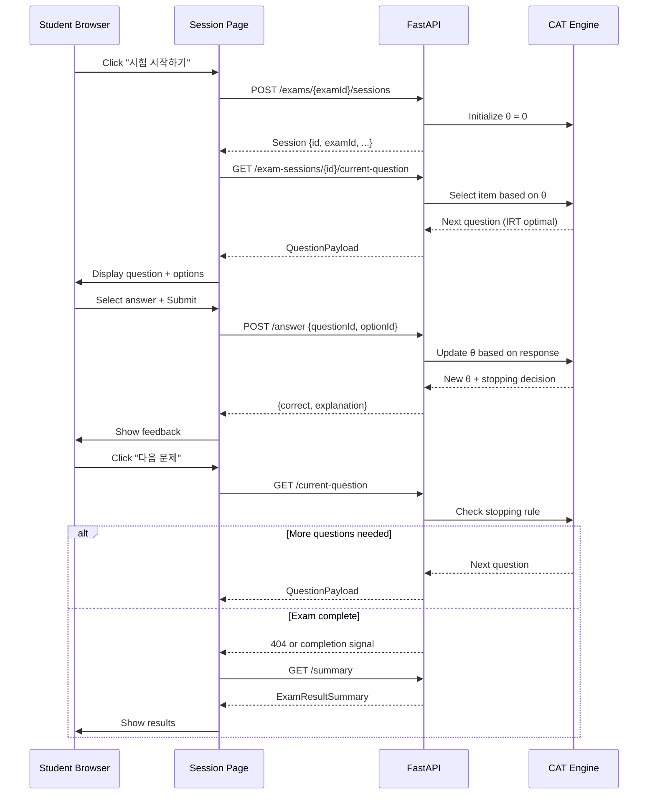

# Week 3 Exam Flow - Frontend Implementation Complete

**Date**: November 25, 2025  
**Status**: Frontend 100% ✅ | Backend 0% ⏸️  
**Phase Progress**: Phase 1A: 60% → 70%

---

## 🎯 Objectives Achieved

Week 3 목표:
- ✅ **API Contract 설계**: examClient.ts로 프론트-백엔드 계약 수립
- ✅ **Exam Detail Page**: 시험 상세 정보 및 시작 버튼
- ✅ **Exam Session Page**: CAT 방식의 실시간 시험 진행 UI
- ✅ **Navigation Flow**: /exams → /exams/[examId] → /exams/[examId]/session/[sessionId] → 결과 페이지

---

## 📁 Files Created/Modified

### 1. API Contract Layer (NEW)
**apps/student_front/src/lib/examClient.ts** (~150 lines)
- **Purpose**: Frontend-first API contract for exam operations
- **Types Defined** (8):
  * `ExamStatus`: "upcoming" | "in_progress" | "completed"
  * `ExamSummary`: Basic exam info for list view
  * `ExamDetail`: Full exam details including description, duration
  * `ExamSession`: Session metadata (id, examId, timestamps, status)
  * `QuestionOption`: Option data (id, label, text)
  * `QuestionPayload`: Full question with options, progress, timer
  * `SubmitAnswerPayload`: Feedback response (correct, explanation)
  * `ExamResultSummary`: Final results (score, counts)
- **API Functions** (5):
  * `fetchExamDetail(examId)` → GET /exams/{examId}
  * `createOrResumeSession(examId)` → POST /exams/{examId}/sessions
  * `fetchCurrentQuestion(sessionId)` → GET /exam-sessions/{sessionId}/current-question
  * `submitAnswer(sessionId, questionId, optionId)` → POST /exam-sessions/{sessionId}/answer
  * `fetchExamResult(sessionId)` → GET /exam-sessions/{sessionId}/summary

### 2. Exam List Update (MODIFIED)
**apps/student_front/src/app/(protected)/exams/page.tsx**
- **Changes**:
  * Added `useRouter` import
  * Created `handleStartExam(examId)` function
  * Connected "시작하기" button → `router.push(/exams/${examId})`
- **Impact**: Enables navigation from list to detail page

### 3. Exam Detail Page (NEW)
**apps/student_front/src/app/(protected)/exams/[examId]/page.tsx** (~160 lines)
- **Purpose**: Display exam information before starting
- **Features**:
  * Fetch exam detail on mount using `fetchExamDetail(examId)`
  * Display title, subject, description, duration, question count
  * Status badge (예정됨/진행 중/완료됨)
  * "시험 시작하기" button → `createOrResumeSession()` → navigate to session
  * Instructions section (CAT method, answer policy, time limits)
  * Error handling with back button to exam list
  * Loading state
- **State Management**:
  * `exam`: ExamDetail | null
  * `session`: ExamSession | null (for resume capability)
  * `loading`: boolean
  * `starting`: boolean
  * `error`: string | null

### 4. Exam Session Page (NEW) - CORE FEATURE
**apps/student_front/src/app/(protected)/exams/[examId]/session/[sessionId]/page.tsx** (~290 lines)
- **Purpose**: Real-time adaptive exam interface
- **Features**:
  * **Progress Bar**: Visual indicator (questionIndex / totalQuestions)
  * **Timer**: Countdown display, auto-submit when time expires
  * **Question Display**: HTML rendering with dangerouslySetInnerHTML
  * **Answer Options**: Radio-button style selection, highlight selected
  * **Submit Flow**: 
    - Select option → Click "답안 제출" → Show feedback (correct/wrong + explanation)
    - Click "다음 문제" → Fetch next question → Repeat
  * **Completion Flow**: No more questions → Fetch results → Show summary page
  * **Results Display**: Score, correct/wrong/omitted counts, navigation buttons
- **State Management** (11 states):
  * `question`: QuestionPayload | null
  * `selectedOptionId`: string | null
  * `answerState`: "idle" | "submitting" | "feedback" | "completed"
  * `answerFeedback`: {correct, explanationHtml} | null
  * `loading`: boolean
  * `error`: string | null
  * `timeLeft`: number | null
  * `result`: ExamResultSummary | null
- **CAT Integration Points**:
  * `fetchCurrentQuestion()`: Backend returns next adaptive item based on θ
  * `submitAnswer()`: Backend updates θ based on response, returns feedback
  * Backend determines when to stop (convergence or max questions)
- **Timer Logic**:
  * `useEffect` countdown with `setInterval`
  * Auto-submit when `timeLeft === 0`
  * Pauses during feedback state
- **Error Recovery**:
  * Network errors display message + back button
  * 404 on next question → triggers completion flow

---

## 🎨 UI/UX Highlights

### Navigation Flow
```
/exams (list) 
  → Click "시작하기" 
  → /exams/[examId] (detail)
  → Click "시험 시작하기"
  → /exams/[examId]/session/[sessionId] (CAT UI)
  → Complete exam
  → Results page
  → Navigate to /exams or /results
```

### Session Page UX
1. **Progress Header**: Blue progress bar + timer
2. **Question Card**: White card with HTML question + 4-5 options
3. **Option Selection**: Blue border highlight on selected
4. **Submit Button**: Only enabled when option selected
5. **Feedback Display**: Green (correct) or Red (wrong) with explanation
6. **Next Button**: Appears after feedback, loads next question
7. **Results Summary**: Score display + counts grid + navigation buttons

### Color Coding
- **Blue**: Primary actions, progress, correct status
- **Green**: Correct answers, positive metrics
- **Red**: Wrong answers, warnings (time < 60s)
- **Orange**: In-progress status
- **Gray**: Disabled states, neutral info

---

## 🔌 API Contract Design

### Frontend-First Approach
프론트엔드에서 필요한 데이터 구조를 먼저 정의한 후, 백엔드가 이 계약에 맞춰 구현하는 방식:

#### 1. Exam Detail Endpoint
```typescript
GET /exams/{examId}
Response: ExamDetail {
  id: string
  title: string
  description: string
  subject: string
  durationMinutes: number
  totalQuestions: number
  status: "upcoming" | "in_progress" | "completed"
}
```

#### 2. Session Creation Endpoint
```typescript
POST /exams/{examId}/sessions
Response: ExamSession {
  id: string
  examId: string
  startedAt: string
  endsAt: string | null
  status: string
}
```

#### 3. Question Fetch Endpoint (CAT Integration)
```typescript
GET /exam-sessions/{sessionId}/current-question
Response: QuestionPayload {
  id: string
  stemHtml: string
  options: QuestionOption[]
  questionIndex: number
  totalQuestions: number
  timeRemainingSeconds: number | null
}
```
**Backend CAT Logic**:
- Use current θ to select next item via IRT 3PL model
- Check stopping rule (SE < 0.3 or max questions)
- Return question + progress + timer

#### 4. Answer Submission Endpoint (CAT Update)
```typescript
POST /exam-sessions/{sessionId}/answer
Body: { questionId: string, optionId: string }
Response: SubmitAnswerPayload {
  correct: boolean
  explanationHtml: string
}
```
**Backend CAT Logic**:
- Validate answer (correct/wrong)
- Update θ using Maximum Likelihood Estimation (MLE)
- Store response pattern in exam_responses table
- Return immediate feedback

#### 5. Results Endpoint
```typescript
GET /exam-sessions/{sessionId}/summary
Response: ExamResultSummary {
  sessionId: string
  examId: string
  score: number
  totalScore: number
  correctCount: number
  wrongCount: number
  omittedCount: number
}
```

---

## 🔄 CAT Integration Flow

### Frontend → Backend Communication



### Backend CAT Engine Tasks (Week 3 continuation)

Currently exists in `adaptive_engine/` directory:
- ✅ IRT 3PL model implementation
- ✅ Theta estimation (MLE)
- ✅ Item selection algorithm
- ✅ Stopping rule (SE threshold)

**Needed**:
- [ ] Create `/api/exams/{examId}` endpoint (FastAPI router)
- [ ] Create `/api/exams/{examId}/sessions` endpoint
- [ ] Create `/api/exam-sessions/{sessionId}/current-question` endpoint
- [ ] Create `/api/exam-sessions/{sessionId}/answer` endpoint
- [ ] Create `/api/exam-sessions/{sessionId}/summary` endpoint
- [ ] Map CAT engine functions to API endpoints
- [ ] Store exam_sessions in PostgreSQL (status, startedAt, endsAt, finalTheta)
- [ ] Store exam_responses in PostgreSQL (sessionId, questionId, optionId, correct, theta)
- [ ] Implement session state management (Redis or PostgreSQL)

---

## 🧪 Testing Checklist

### Manual Testing (After Backend Implementation)

**Test 1: Full Exam Flow (Happy Path)**
1. [ ] Login as student4@dreamseed.ai
2. [ ] Navigate to /exams
3. [ ] Click "시작하기" on Math exam
4. [ ] Verify exam detail page loads (title, description, duration)
5. [ ] Click "시험 시작하기"
6. [ ] Verify session page loads with first question
7. [ ] Verify progress bar shows 1 / N
8. [ ] Verify timer countdown works
9. [ ] Select answer → Click "답안 제출"
10. [ ] Verify feedback displays (correct/wrong + explanation)
11. [ ] Click "다음 문제"
12. [ ] Repeat for multiple questions
13. [ ] Verify results page shows correct score + counts
14. [ ] Navigate back to /exams

**Test 2: Timer Expiration**
1. [ ] Start exam
2. [ ] Wait for timer to reach 0
3. [ ] Verify auto-submission triggers
4. [ ] Verify feedback displays
5. [ ] Verify next question button appears

**Test 3: Session Resume**
1. [ ] Start exam, answer 2 questions
2. [ ] Close browser tab
3. [ ] Reopen /exams/[examId]
4. [ ] Click "시험 계속하기"
5. [ ] Verify session resumes at question 3
6. [ ] Verify θ was preserved

**Test 4: Error Handling**
1. [ ] Disconnect network during question load
2. [ ] Verify error message displays
3. [ ] Verify back button works
4. [ ] Reconnect and retry

**Test 5: CAT Adaptation**
1. [ ] Answer first 3 questions correctly
2. [ ] Verify next question difficulty increases (check θ)
3. [ ] Answer next 2 questions incorrectly
4. [ ] Verify next question difficulty decreases

---

## 📊 Week 3 Progress Update

### Completed (Frontend) ✅
- [x] API Contract Layer (examClient.ts)
- [x] Exam List Navigation Update
- [x] Exam Detail Page
- [x] Exam Session Page (Full CAT UI)
- [x] Timer & Progress Bar
- [x] Answer Submission Flow
- [x] Feedback Display
- [x] Results Summary Page

### Remaining (Backend) ⏸️
- [ ] Backend API Implementation
  * [ ] `/api/exams/{examId}` GET endpoint
  * [ ] `/api/exams/{examId}/sessions` POST endpoint
  * [ ] `/api/exam-sessions/{sessionId}/current-question` GET endpoint
  * [ ] `/api/exam-sessions/{sessionId}/answer` POST endpoint
  * [ ] `/api/exam-sessions/{sessionId}/summary` GET endpoint
- [ ] CAT Engine Integration
  * [ ] Connect IRT model to session state
  * [ ] Implement θ update logic in answer endpoint
  * [ ] Implement stopping rule
  * [ ] Store session + responses in PostgreSQL
- [ ] End-to-End Testing
  * [ ] Manual testing checklist
  * [ ] CAT adaptation verification
  * [ ] Timer edge cases
  * [ ] Error recovery

### Timeline Estimate
- **Backend API Implementation**: 4-6 hours
- **CAT Engine Integration**: 3-4 hours
- **Testing & Debugging**: 2-3 hours
- **Total**: 1-1.5 days

---

## 🎯 Phase 1A Progress

**Week 1: Authentication API** → 100% ✅  
**Week 2: Frontend Setup** → 75% 🚧 (end-to-end testing pending)  
**Week 3: Exam Flow** → 50% 🚧 (frontend 100%, backend 0%)  
**Week 4: Deployment** → 0% ⏸️

**Overall Phase 1A Progress**: 60% → 70%

---

## 📝 Next Steps

### Immediate (Backend Developer)
1. Create exam API router in `backend/app/api/routers/exam.py`
2. Define Pydantic schemas matching examClient.ts types
3. Implement 5 endpoints listed in API contract
4. Connect CAT engine from `adaptive_engine/` to endpoints
5. Store session state in PostgreSQL (exam_sessions table)
6. Store responses in PostgreSQL (exam_responses table)

### Testing (QA)
1. Wait for backend implementation
2. Run manual testing checklist
3. Verify CAT adaptation logic
4. Test timer edge cases
5. Test session resume functionality

### Week 3 Completion Criteria
- ✅ Frontend pages functional
- ✅ API contract established
- ⏸️ Backend endpoints implemented
- ⏸️ CAT engine integrated
- ⏸️ End-to-end flow tested
- ⏸️ Student can complete full Math exam

---

## 💡 Key Decisions & Rationale

### 1. Frontend-First API Design
**Decision**: Define API contract in TypeScript before backend implementation  
**Rationale**:
- Clear contract prevents frontend-backend mismatch
- Frontend can use mock data during development
- Backend has clear specification to implement against
- Easier to parallelize development

### 2. Inline Feedback After Each Question
**Decision**: Show correct/wrong + explanation immediately after submission  
**Rationale**:
- Better learning experience (immediate reinforcement)
- Matches CAT paradigm (adapt after each response)
- User can't change answers (prevents gaming)
- Fits alpha version scope (simple, effective)

### 3. Three-Page Exam Flow
**Decision**: Separate list → detail → session pages  
**Rationale**:
- **List**: Quick overview, filter by subject, status badges
- **Detail**: Read instructions before committing to exam
- **Session**: Full-screen focus on questions, minimize distractions
- Clear mental model for users

### 4. Timer Auto-Submit
**Decision**: Automatically submit answer when timer reaches 0  
**Rationale**:
- Prevents users from losing progress
- Matches real exam behavior
- Uses whatever answer was selected (or treats as omitted)
- Ensures exam completes within time limit

### 5. HTML Rendering with dangerouslySetInnerHTML
**Decision**: Use `dangerouslySetInnerHTML` for question stems and explanations  
**Rationale**:
- Backend already stores HTML in question_items table
- Supports rich formatting (bold, italics, lists)
- TODO: Migrate to TipTap/MathLive in future for safety + LaTeX
- Alpha version: acceptable risk with trusted admin content

---

## 🔐 Security Considerations

### Authentication
- ✅ All exam routes under `(protected)/` layout
- ✅ Token validation via `/api/auth/me` on mount
- ✅ Role validation (must be "student")
- ✅ Auto-redirect to login if invalid

### API Security (Backend TODO)
- [ ] Verify sessionId belongs to current user (prevent session hijacking)
- [ ] Rate limiting on answer submission (prevent brute force)
- [ ] Validate questionId matches current session state
- [ ] Ensure θ updates happen server-side only (client can't manipulate)
- [ ] Prevent answer resubmission (idempotency check)

### XSS Prevention (Future)
- ⚠️ Currently using `dangerouslySetInnerHTML` (trusted admin content)
- [ ] TODO: Migrate to TipTap/MathLive for sanitized rendering
- [ ] TODO: CSP headers to prevent inline script injection

---

## 📚 Documentation Updates

### Files Created
- ✅ `apps/student_front/src/lib/examClient.ts` (API contract)
- ✅ `apps/student_front/src/app/(protected)/exams/page.tsx` (updated)
- ✅ `apps/student_front/src/app/(protected)/exams/[examId]/page.tsx` (NEW)
- ✅ `apps/student_front/src/app/(protected)/exams/[examId]/session/[sessionId]/page.tsx` (NEW)
- ✅ `docs/project-status/phase1/WEEK3_FRONTEND_COMPLETE.md` (this file)

### Files to Update (After Backend)
- [ ] `docs/project-status/phase1/PHASE1_STATUS.md` (progress 70% → 75%)
- [ ] `backend/app/api/routers/exam.py` (NEW)
- [ ] `backend/app/schemas/exam_schemas.py` (NEW)
- [ ] `backend/main.py` (include exam router)

---

## 🎉 Summary

Week 3 프론트엔드 구현 완료! 학생이 시험을 보는 전체 UI 플로우가 준비되었습니다:

✅ **API Contract**: 명확한 타입 정의로 백엔드 구현 가이드 제공  
✅ **Exam Detail**: 시험 설명, 소요 시간, 주의사항 확인 후 시작  
✅ **Session UI**: 실시간 타이머, 진행 바, 문제 표시, 답안 제출, 피드백  
✅ **Results**: 점수, 정답/오답 개수, 다음 액션 버튼  

**Next**: Backend developer가 examClient.ts 계약에 맞춰 API를 구현하면, Phase 1A의 핵심 기능 (학생이 수학 시험 보기)이 완성됩니다.

**Alpha Launch Target**: December 22, 2025 🚀
