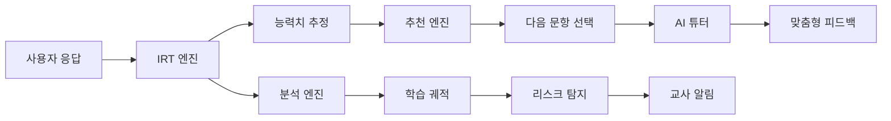
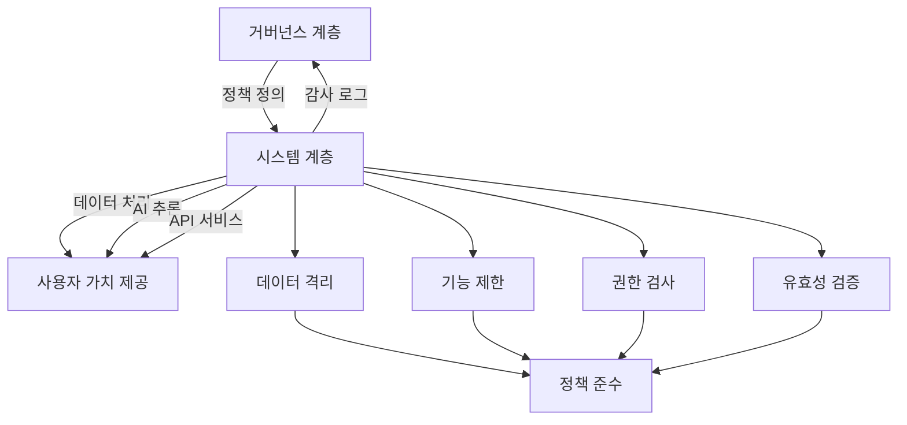

# DreamSeedAI: 시스템 계층 - 핵심 요약 및 결론

시스템 계층은 DreamSeedAI의 **두뇌와 근육**입니다. 이 계층에서 실제로 AI 모델이 실행되고, 데이터가 저장/처리되며, 사용자에게 가치를 제공하는 기능이 수행됩니다. 거버넌스와 정책의 요구사항은 이 계층에서 구현되고 준수됩니다.

---

## 목차

1. [핵심 기능](#1-핵심 기능)
2. [정책 준수 메커니즘](#2-정책-준수-메커니즘)
3. [아키텍처 특징](#3-아키텍처-특징)
4. [기술 스택 통합](#4-기술-스택-통합)
5. [결론](#5-결론)

---

## 1. 핵심 기능

### 1.1 데이터 관리

시스템 계층은 DreamSeedAI의 모든 데이터를 안전하고 효율적으로 관리합니다.

```python
# 데이터 관리의 핵심 원칙
class DataManagementPrinciples:
    """
    DreamSeedAI 데이터 관리 원칙
    """
    principles = {
        "user_data": {
            "description": "사용자 정보, 프로필, 인증 데이터",
            "storage": "PostgreSQL users 테이블",
            "encryption": "bcrypt (비밀번호), AES-256 (민감정보)",
            "retention": "GDPR/COPPA 준수 (사용자 요청 시 삭제)"
        },
        "learning_data": {
            "description": "학습 기록, 시험 응답, 진도 데이터",
            "storage": "PostgreSQL + Redis (캐싱)",
            "analytics": "실시간 학습 분석 파이프라인",
            "backup": "일일 백업, 7일 보관"
        },
        "content": {
            "description": "문항, 교육 자료, 멀티미디어",
            "storage": "PostgreSQL (메타데이터) + MinIO/S3 (파일)",
            "versioning": "Git-like 버전 관리",
            "search": "Elasticsearch 전문 검색"
        },
        "ai_models": {
            "description": "IRT 파라미터, 튜터 모델 가중치",
            "storage": "PostgreSQL (메타) + 파일 시스템 (모델)",
            "versioning": "MLflow 모델 레지스트리",
            "deployment": "컨테이너 기반 배포"
        }
    }
```

**주요 특징**:

- **멀티 테넌시**: 기관별 데이터 격리 (`org_id` 기반)
- **ACID 트랜잭션**: PostgreSQL을 통한 데이터 일관성 보장
- **확장성**: 읽기 복제본, 샤딩을 통한 수평 확장
- **백업/복구**: 자동화된 백업 및 재해 복구 계획

### 1.2 AI 엔진

DreamSeedAI의 핵심 지능을 제공하는 AI 엔진들입니다.

```python
# AI 엔진 개요
class AIEngineOverview:
    """
    DreamSeedAI AI 엔진 구성
    """
    engines = {
        "irt_engine": {
            "name": "적응형 시험 엔진",
            "models": ["1PL", "2PL", "3PL IRT"],
            "algorithms": ["CAT (Computerized Adaptive Testing)", "MLE", "EAP"],
            "framework": "scipy, statsmodels",
            "performance": "실시간 능력치 추정 (<100ms)"
        },
        "nlp_engine": {
            "name": "자연어 처리 엔진",
            "models": ["GPT-4", "Gemini", "Custom Fine-tuned"],
            "use_cases": ["AI 튜터", "자동 채점", "피드백 생성"],
            "framework": "OpenAI API, LangChain",
            "safety": "콘텐츠 필터링, 유해성 검출"
        },
        "recommendation_engine": {
            "name": "학습 추천 엔진",
            "algorithms": ["협업 필터링", "콘텐츠 기반 필터링", "하이브리드"],
            "features": ["다음 문항 추천", "학습 경로 제안"],
            "framework": "scikit-learn, surprise",
            "optimization": "베이지안 최적화"
        },
        "analytics_engine": {
            "name": "학습 분석 엔진",
            "models": ["선형 회귀", "ARIMA", "혼합 효과 모델"],
            "outputs": ["능력 궤적", "성장 예측", "리스크 탐지"],
            "framework": "statsmodels, scikit-learn",
            "visualization": "Quarto, Matplotlib"
        },
        "anomaly_detection": {
            "name": "이상 탐지 엔진",
            "algorithms": ["Isolation Forest", "LSTM Autoencoder"],
            "use_cases": ["부정행위 탐지", "비정상 학습 패턴"],
            "framework": "scikit-learn, TensorFlow",
            "threshold": "동적 임계값 설정"
        }
    }
```

**AI 파이프라인 예시**:



### 1.3 API 제공

FastAPI 기반의 RESTful API를 통해 클라이언트 요청을 처리합니다.

```python
# API 계층 구조
class APILayer:
    """
    DreamSeedAI API 구조
    """
    api_structure = {
        "public_api": {
            "description": "외부 클라이언트용 공개 API",
            "endpoints": [
                "/api/v1/auth/*",
                "/api/v1/content/*",
                "/api/v1/assessments/*"
            ],
            "rate_limit": "100 req/hour (무료), 1000 req/hour (프리미엄)",
            "authentication": "JWT Bearer Token"
        },
        "internal_api": {
            "description": "마이크로서비스 간 통신용 API",
            "endpoints": [
                "/internal/users/*",
                "/internal/analytics/*",
                "/internal/ai/*"
            ],
            "rate_limit": "무제한 (내부 네트워크)",
            "authentication": "Service-to-Service JWT"
        },
        "admin_api": {
            "description": "관리자 전용 API",
            "endpoints": [
                "/api/admin/users/*",
                "/api/admin/reports/*",
                "/api/admin/system/*"
            ],
            "rate_limit": "무제한",
            "authentication": "JWT + Role=admin"
        },
        "webhook_api": {
            "description": "외부 서비스 웹훅",
            "endpoints": [
                "/webhooks/stripe",
                "/webhooks/lti"
            ],
            "security": "서명 검증 (HMAC)",
            "retry": "자동 재시도 (exponential backoff)"
        }
    }
```

**API 설계 원칙**:

- **RESTful**: 리소스 기반 URL 설계
- **Versioning**: `/api/v1`, `/api/v2` 버전 관리
- **Documentation**: OpenAPI 3.0 자동 문서화
- **Error Handling**: 표준 HTTP 상태 코드 + 상세 에러 메시지
- **CORS**: 허용된 오리진만 접근 가능

### 1.4 비동기 처리

대량 데이터 처리 및 백그라운드 작업을 효율적으로 관리합니다.

```python
from celery import Celery
from kafka import KafkaProducer, KafkaConsumer

# Celery 비동기 작업
celery_app = Celery('dreamseed', broker='redis://localhost:6379/0')

@celery_app.task
async def generate_report(user_id: int, report_type: str):
    """
    학습 리포트 생성 (비동기)
    - 예상 소요 시간: 5-30분
    - Quarto 렌더링, 통계 분석, PDF 생성
    """
    # 1. 데이터 수집
    learning_data = await fetch_user_learning_data(user_id)

    # 2. 통계 분석
    analysis = await perform_statistical_analysis(learning_data)

    # 3. Quarto 렌더링
    report_html = await render_quarto_report(analysis, report_type)

    # 4. PDF 변환
    pdf_path = await convert_to_pdf(report_html)

    # 5. S3 업로드
    report_url = await upload_to_s3(pdf_path)

    # 6. 사용자 알림
    await notify_user(user_id, report_url)

    return report_url

# Kafka 이벤트 스트리밍
producer = KafkaProducer(bootstrap_servers='localhost:9092')

async def publish_learning_event(event_type: str, data: dict):
    """
    학습 이벤트 발행
    """
    message = {
        "event_type": event_type,
        "timestamp": datetime.utcnow().isoformat(),
        "data": data
    }

    producer.send('learning-events', json.dumps(message).encode('utf-8'))
    producer.flush()

# 이벤트 구독 및 처리
consumer = KafkaConsumer(
    'learning-events',
    bootstrap_servers='localhost:9092',
    group_id='analytics-group'
)

async def consume_learning_events():
    """
    학습 이벤트 구독 및 실시간 분석
    """
    for message in consumer:
        event = json.loads(message.value.decode('utf-8'))

        if event['event_type'] == 'item_response':
            # IRT 파라미터 업데이트
            await update_irt_parameters(event['data'])

        elif event['event_type'] == 'session_complete':
            # 학습 세션 분석
            await analyze_session(event['data'])

        elif event['event_type'] == 'risk_detected':
            # 교사 알림
            await notify_teacher(event['data'])
```

**비동기 처리 사용 사례**:

- **리포트 생성**: Quarto 기반 통계 리포트 (5-30분 소요)
- **IRT 캘리브레이션**: 대량 응답 데이터 분석 (수시간 소요)
- **이메일 발송**: 배치 이메일 전송
- **파일 처리**: 대용량 CSV 임포트/익스포트
- **ML 모델 학습**: 주기적 모델 재학습

### 1.5 외부 연동

LTI, 결제 서비스 등 외부 시스템과의 안전한 연동을 제공합니다.

```python
# 외부 연동 개요
class ExternalIntegrations:
    """
    DreamSeedAI 외부 연동 현황
    """
    integrations = {
        "lti_1p3": {
            "standard": "IMS Learning Tools Interoperability 1.3",
            "lms_platforms": ["Canvas", "Moodle", "Blackboard", "Google Classroom"],
            "features": ["Deep Linking", "Grade Passback", "Names and Roles"],
            "security": "OAuth 2.0 + OIDC"
        },
        "payment_gateways": {
            "stripe": {
                "use_case": "구독 결제, 학교 라이선스",
                "features": ["Checkout", "Subscriptions", "Webhooks", "Invoicing"],
                "pci_compliance": "PCI DSS Level 1"
            },
            "paypal": {
                "use_case": "대체 결제 수단",
                "features": ["Express Checkout", "Recurring Billing"],
                "integration": "REST API"
            }
        },
        "cloud_storage": {
            "aws_s3": {
                "use_case": "파일 저장 (이미지, PDF, 비디오)",
                "features": ["버저닝", "라이프사이클 정책", "CDN (CloudFront)"],
                "encryption": "AES-256 서버 측 암호화"
            },
            "minio": {
                "use_case": "온프레미스 대안",
                "features": ["S3 호환 API", "자체 호스팅"],
                "deployment": "Kubernetes"
            }
        },
        "sso_providers": {
            "google": "OAuth 2.0 / OIDC",
            "microsoft": "Azure AD / OIDC",
            "saml": "학교 SSO (SAML 2.0)"
        },
        "analytics": {
            "google_analytics": "사용자 행동 분석",
            "mixpanel": "제품 분석",
            "sentry": "에러 추적"
        }
    }
```

**연동 보안 원칙**:

- **OAuth 2.0**: 토큰 기반 인증
- **HMAC 서명**: Webhook 무결성 검증
- **TLS 1.3**: 전송 계층 암호화
- **API Key Rotation**: 주기적 키 갱신

---

## 2. 정책 준수 메커니즘

시스템 계층은 거버넌스 및 정책 계층의 지침을 준수하기 위해 다양한 **기술적 메커니즘**을 적용합니다.

### 2.1 데이터 격리 (Data Isolation)

**정책 요구사항**: "학생 데이터는 기관별로 격리되어야 한다"

**구현 방식**:

```sql
-- PostgreSQL Row-Level Security (RLS)
CREATE TABLE users (
    user_id SERIAL PRIMARY KEY,
    email VARCHAR(255) NOT NULL,
    org_id INTEGER NOT NULL REFERENCES organizations(org_id),
    role VARCHAR(50),
    created_at TIMESTAMP DEFAULT CURRENT_TIMESTAMP
);

-- RLS 정책 활성화
ALTER TABLE users ENABLE ROW LEVEL SECURITY;

-- 정책: 사용자는 자신의 조직 데이터만 볼 수 있음
CREATE POLICY org_isolation_policy ON users
    FOR ALL
    USING (org_id = current_setting('app.current_org_id')::integer);

-- 애플리케이션에서 조직 ID 설정
SET app.current_org_id = 123;

-- 이제 모든 쿼리는 자동으로 org_id 필터링됨
SELECT * FROM users;
-- 실제 실행: SELECT * FROM users WHERE org_id = 123;
```

```python
# FastAPI에서 자동 org_id 필터링
from fastapi import Depends, HTTPException
from sqlalchemy.orm import Session

async def get_db_with_org_filter(
    current_user = Depends(get_current_user),
    db: Session = Depends(get_db)
):
    """
    데이터베이스 세션에 org_id 필터 자동 적용
    """
    # PostgreSQL RLS 변수 설정
    db.execute(f"SET app.current_org_id = {current_user.org_id}")
    return db

@router.get("/users")
async def list_users(db: Session = Depends(get_db_with_org_filter)):
    """
    조직 내 사용자 목록 (자동 격리)
    """
    # org_id 필터링이 자동으로 적용됨
    users = db.query(User).all()
    return users
```

### 2.2 기능 제한 (Feature Restriction)

**정책 요구사항**: "시험 중에는 AI 튜터 힌트를 제공할 수 없다"

**구현 방식**:

```python
from enum import Enum

class ExamMode(str, Enum):
    PRACTICE = "practice"  # 힌트 허용
    ASSESSMENT = "assessment"  # 힌트 금지
    FINAL_EXAM = "final_exam"  # 힌트 금지, 타이머 강제

@router.post("/ai-tutor/hint")
@require_policy("ai_tutor", "provide_hint")
async def get_hint(
    item_id: int,
    session_id: int,
    current_user = Depends(get_current_user)
):
    """
    AI 튜터 힌트 제공
    """
    # 세션 모드 확인
    session = await db.execute(
        "SELECT exam_mode FROM test_sessions WHERE session_id = :session_id",
        {"session_id": session_id}
    )
    session = session.fetchone()

    # 정책 검사: 시험 모드에서는 힌트 금지
    if session.exam_mode in [ExamMode.ASSESSMENT, ExamMode.FINAL_EXAM]:
        # OPA 정책 평가
        policy_result = await opa_client.evaluate_policy(
            "ai_tutor/hint_restriction",
            {
                "user_id": current_user.user_id,
                "session_id": session_id,
                "exam_mode": session.exam_mode
            }
        )

        if not policy_result.get("allow", False):
            raise HTTPException(
                status_code=403,
                detail="Hints are not allowed during assessments"
            )

    # 힌트 생성
    hint = await ai_tutor_engine.generate_hint(item_id, current_user.ability_estimate)

    # 감사 로그
    await audit_log("ai_tutor_hint_requested", {
        "user_id": current_user.user_id,
        "session_id": session_id,
        "item_id": item_id,
        "exam_mode": session.exam_mode
    })

    return {"hint": hint}
```

### 2.3 권한 검사 (Permission Check)

**정책 요구사항**: "교사만 성적을 수정할 수 있다"

**구현 방식**:

```python
from functools import wraps
from typing import List

def require_role(allowed_roles: List[str]):
    """
    역할 기반 접근 제어 데코레이터
    """
    def decorator(func):
        @wraps(func)
        async def wrapper(*args, current_user = None, **kwargs):
            if current_user is None:
                raise HTTPException(status_code=401, detail="Not authenticated")

            if current_user.role not in allowed_roles:
                # 감사 로그: 권한 거부
                await audit_log("access_denied", {
                    "user_id": current_user.user_id,
                    "role": current_user.role,
                    "required_roles": allowed_roles,
                    "endpoint": func.__name__
                })

                raise HTTPException(
                    status_code=403,
                    detail=f"Role '{current_user.role}' not authorized. Required: {allowed_roles}"
                )

            return await func(*args, current_user=current_user, **kwargs)
        return wrapper
    return decorator

@router.patch("/grades/{assignment_id}")
@require_role(["teacher", "admin"])
@require_policy("grade_management", "update_grade")
async def update_grade(
    assignment_id: int,
    grade_update: GradeUpdate,
    current_user = Depends(get_current_user)
):
    """
    성적 업데이트 (교사 전용)
    """
    # 기존 성적 조회
    existing_grade = await db.execute(
        "SELECT * FROM grades WHERE assignment_id = :assignment_id",
        {"assignment_id": assignment_id}
    )
    existing_grade = existing_grade.fetchone()

    if not existing_grade:
        raise HTTPException(status_code=404, detail="Grade not found")

    # 업데이트
    await db.execute(
        """
        UPDATE grades
        SET score = :score, feedback = :feedback, updated_by = :user_id, updated_at = NOW()
        WHERE assignment_id = :assignment_id
        """,
        {
            "score": grade_update.score,
            "feedback": grade_update.feedback,
            "user_id": current_user.user_id,
            "assignment_id": assignment_id
        }
    )

    # 감사 로그
    await audit_log("grade_updated", {
        "updated_by": current_user.user_id,
        "assignment_id": assignment_id,
        "old_score": existing_grade.score,
        "new_score": grade_update.score
    })

    return {"message": "Grade updated successfully"}
```

### 2.4 데이터 유효성 검사 (Data Validation)

**정책 요구사항**: "모든 사용자 입력은 검증되어야 한다"

**구현 방식**:

```python
from pydantic import BaseModel, Field, validator, EmailStr
from datetime import datetime

class UserCreate(BaseModel):
    """
    사용자 생성 요청 스키마
    """
    email: EmailStr  # 이메일 형식 자동 검증
    username: str = Field(..., min_length=3, max_length=50, regex="^[a-zA-Z0-9_-]+$")
    password: str = Field(..., min_length=8)
    full_name: str = Field(..., max_length=200)
    grade_level: int = Field(..., ge=1, le=12)
    birth_date: datetime

    @validator('password')
    def password_strength(cls, v):
        """
        비밀번호 강도 검증
        """
        if not any(char.isdigit() for char in v):
            raise ValueError('Password must contain at least one digit')
        if not any(char.isupper() for char in v):
            raise ValueError('Password must contain at least one uppercase letter')
        if not any(char.islower() for char in v):
            raise ValueError('Password must contain at least one lowercase letter')
        return v

    @validator('birth_date')
    def age_validation(cls, v):
        """
        COPPA 준수: 13세 이상만 가입 가능
        """
        today = datetime.utcnow()
        age = (today - v).days / 365.25

        if age < 13:
            raise ValueError('Users must be at least 13 years old')

        return v

# XSS, SQL Injection 방어
from bleach import clean
import html

async def sanitize_user_input(text: str) -> str:
    """
    사용자 입력 새니타이징
    """
    # HTML 태그 제거
    cleaned = clean(text, tags=[], strip=True)

    # HTML 엔티티 인코딩
    encoded = html.escape(cleaned)

    return encoded

@router.post("/comments")
async def create_comment(
    comment_text: str,
    current_user = Depends(get_current_user)
):
    """
    댓글 작성 (XSS 방어)
    """
    # 입력 새니타이징
    safe_comment = await sanitize_user_input(comment_text)

    # DB 저장 (Parameterized Query로 SQL Injection 방어)
    await db.execute(
        "INSERT INTO comments (user_id, text, created_at) VALUES (:user_id, :text, NOW())",
        {"user_id": current_user.user_id, "text": safe_comment}
    )

    return {"message": "Comment created successfully"}
```

### 2.5 로그 감사 (Audit Logging)

**정책 요구사항**: "모든 민감한 작업은 감사 로그에 기록되어야 한다"

**구현 방식**:

```python
import logging
from datetime import datetime
from typing import Dict, Any

# 구조화된 로깅
logger = logging.getLogger("audit")
handler = logging.FileHandler("/var/log/dreamseed/audit.log")
formatter = logging.Formatter('%(asctime)s - %(name)s - %(levelname)s - %(message)s')
handler.setFormatter(formatter)
logger.addHandler(handler)
logger.setLevel(logging.INFO)

async def audit_log(event_type: str, data: Dict[str, Any]):
    """
    감사 로그 기록
    """
    log_entry = {
        "timestamp": datetime.utcnow().isoformat(),
        "event_type": event_type,
        "data": data,
        "ip_address": data.get("ip_address"),
        "user_agent": data.get("user_agent")
    }

    # 로그 파일에 기록
    logger.info(json.dumps(log_entry))

    # PostgreSQL 감사 테이블에 저장
    await db.execute(
        """
        INSERT INTO audit_logs (event_type, user_id, data, created_at)
        VALUES (:event_type, :user_id, :data, NOW())
        """,
        {
            "event_type": event_type,
            "user_id": data.get("user_id"),
            "data": json.dumps(data)
        }
    )

    # Kafka로 실시간 스트리밍 (SIEM 연동)
    await publish_to_kafka("audit-events", log_entry)

# 감사 대상 이벤트
AUDITABLE_EVENTS = [
    "user_login",
    "user_logout",
    "password_change",
    "role_change",
    "grade_updated",
    "data_export",
    "policy_violation",
    "ai_tutor_hint_requested",
    "payment_succeeded",
    "license_assigned"
]
```

**감사 로그 예시**:

```json
{
  "timestamp": "2025-11-09T12:34:56.789Z",
  "event_type": "grade_updated",
  "data": {
    "updated_by": 456,
    "user_id": 123,
    "assignment_id": 789,
    "old_score": 85,
    "new_score": 90,
    "reason": "Re-grading after review",
    "ip_address": "192.168.1.100",
    "user_agent": "Mozilla/5.0 ..."
  }
}
```

---

## 3. 아키텍처 특징

### 3.1 마이크로서비스 아키텍처

DreamSeedAI는 독립적인 서비스로 구성되어 유연한 확장 및 배포가 가능합니다.

```yaml
# Kubernetes 마이크로서비스 배포 예시
apiVersion: apps/v1
kind: Deployment
metadata:
  name: user-service
spec:
  replicas: 3
  selector:
    matchLabels:
      app: user-service
  template:
    metadata:
      labels:
        app: user-service
    spec:
      containers:
        - name: user-service
          image: dreamseedai/user-service:v1.2.0
          ports:
            - containerPort: 8001
          env:
            - name: DATABASE_URL
              valueFrom:
                secretKeyRef:
                  name: db-credentials
                  key: connection-string
          resources:
            requests:
              memory: "256Mi"
              cpu: "250m"
            limits:
              memory: "512Mi"
              cpu: "500m"
          livenessProbe:
            httpGet:
              path: /health
              port: 8001
            initialDelaySeconds: 30
            periodSeconds: 10
          readinessProbe:
            httpGet:
              path: /ready
              port: 8001
            initialDelaySeconds: 5
            periodSeconds: 5
---
apiVersion: v1
kind: Service
metadata:
  name: user-service
spec:
  selector:
    app: user-service
  ports:
    - port: 80
      targetPort: 8001
  type: ClusterIP
```

**마이크로서비스 이점**:

- **독립 배포**: 각 서비스를 독립적으로 업데이트
- **기술 스택 다양성**: Python, Node.js, Go 등 최적 기술 선택
- **장애 격리**: 한 서비스 장애가 전체 시스템에 영향 최소화
- **확장성**: 트래픽에 따라 서비스별 스케일링

### 3.2 API Gateway

클라이언트 요청을 라우팅하고 공통 기능을 제공합니다.

```python
# Nginx API Gateway 설정
upstream user_service {
    server user-service:8001;
}

upstream content_service {
    server content-service:8003;
}

upstream assessment_service {
    server assessment-service:8004;
}

server {
    listen 80;
    server_name api.dreamseedai.com;

    # Rate Limiting
    limit_req_zone $binary_remote_addr zone=api_limit:10m rate=100r/m;

    # CORS
    add_header 'Access-Control-Allow-Origin' 'https://app.dreamseedai.com';
    add_header 'Access-Control-Allow-Methods' 'GET, POST, PUT, DELETE, OPTIONS';

    # API 라우팅
    location /api/users/ {
        limit_req zone=api_limit burst=20;
        proxy_pass http://user_service/;
        proxy_set_header X-Real-IP $remote_addr;
        proxy_set_header X-Forwarded-For $proxy_add_x_forwarded_for;
    }

    location /api/content/ {
        proxy_pass http://content_service/;
    }

    location /api/assessments/ {
        proxy_pass http://assessment_service/;
    }

    # Health Check
    location /health {
        access_log off;
        return 200 "healthy\n";
    }
}
```

**API Gateway 기능**:

- **라우팅**: URL 패턴 기반 서비스 라우팅
- **인증**: JWT 토큰 검증
- **Rate Limiting**: DDoS 방어 및 공정 사용
- **CORS**: 크로스 오리진 요청 관리
- **로드 밸런싱**: 트래픽 분산

### 3.3 메시지 큐 (Message Queue)

비동기 작업 처리 및 서비스 간 통신을 효율적으로 관리합니다.

```python
# Apache Kafka 토픽 구조
KAFKA_TOPICS = {
    "learning-events": {
        "description": "학습 이벤트 스트림",
        "partitions": 10,
        "replication_factor": 3,
        "producers": ["assessment-service", "ai-tutor-service"],
        "consumers": ["analytics-service", "recommendation-service"]
    },
    "audit-events": {
        "description": "감사 로그 스트림",
        "partitions": 5,
        "replication_factor": 3,
        "producers": ["all-services"],
        "consumers": ["audit-service", "siem-connector"]
    },
    "notification-requests": {
        "description": "알림 요청 큐",
        "partitions": 3,
        "replication_factor": 2,
        "producers": ["user-service", "assessment-service"],
        "consumers": ["notification-service"]
    }
}

# Celery + Redis 작업 큐
CELERY_QUEUES = {
    "default": {
        "description": "일반 비동기 작업",
        "priority": 5
    },
    "reports": {
        "description": "리포트 생성 (장시간 작업)",
        "priority": 3
    },
    "emails": {
        "description": "이메일 발송",
        "priority": 7
    },
    "ml-training": {
        "description": "ML 모델 학습",
        "priority": 1
    }
}
```

### 3.4 클라우드 기반 인프라

클라우드 플랫폼을 활용하여 확장성, 가용성, 비용 효율성을 확보합니다.

```yaml
# AWS 인프라 예시 (Terraform)
resource "aws_eks_cluster" "dreamseed" {
name     = "dreamseed-production"
role_arn = aws_iam_role.eks_cluster.arn
version  = "1.27"

vpc_config {
subnet_ids = [
aws_subnet.private_a.id,
aws_subnet.private_b.id,
aws_subnet.private_c.id
]
endpoint_public_access = false
endpoint_private_access = true
}
}

resource "aws_rds_cluster" "postgres" {
cluster_identifier      = "dreamseed-postgres"
engine                  = "aurora-postgresql"
engine_version          = "15.3"
database_name           = "dreamseed_prod"
master_username         = "admin"
master_password         = var.db_password
backup_retention_period = 7
preferred_backup_window = "03:00-04:00"

vpc_security_group_ids = [aws_security_group.database.id]
db_subnet_group_name   = aws_db_subnet_group.main.name

serverlessv2_scaling_configuration {
max_capacity = 64.0
min_capacity = 2.0
}
}

resource "aws_elasticache_cluster" "redis" {
cluster_id           = "dreamseed-redis"
engine               = "redis"
node_type            = "cache.r6g.large"
num_cache_nodes      = 3
parameter_group_name = "default.redis7"
port                 = 6379
subnet_group_name    = aws_elasticache_subnet_group.main.name
}
```

**클라우드 이점**:

- **Auto Scaling**: 트래픽에 따른 자동 확장
- **High Availability**: 다중 가용 영역 배포
- **Managed Services**: RDS, ElastiCache 등 관리형 서비스
- **Cost Optimization**: 사용한 만큼만 지불

---

## 4. 기술 스택 통합

### 4.1 백엔드

```python
BACKEND_STACK = {
    "language": "Python 3.11+",
    "framework": "FastAPI",
    "orm": "SQLAlchemy",
    "validation": "Pydantic",
    "async": "asyncio, aiohttp",
    "testing": "pytest, pytest-asyncio",
    "documentation": "OpenAPI 3.0, Swagger UI"
}
```

### 4.2 프론트엔드

```typescript
const FRONTEND_STACK = {
  framework: "React 18 / Next.js 14",
  language: "TypeScript",
  stateManagement: "Zustand / React Query",
  styling: "Tailwind CSS",
  ui: "shadcn/ui",
  editor: "TipTap (with MathJax)",
  testing: "Jest, React Testing Library",
};
```

### 4.3 데이터베이스

```sql
-- Database Stack
DATABASE_STACK = {
  primary: "PostgreSQL 15",
  cache: "Redis 7",
  search: "Elasticsearch 8",
  object_storage: "MinIO / AWS S3",
  queue: "RabbitMQ / Apache Kafka"
}
```

### 4.4 AI/ML

```python
AI_ML_STACK = {
    "irt_models": "scipy, statsmodels",
    "nlp": "OpenAI API, LangChain, transformers",
    "ml_framework": "scikit-learn, TensorFlow, PyTorch",
    "experiment_tracking": "MLflow",
    "model_serving": "FastAPI, TorchServe",
    "statistical_analysis": "statsmodels, scipy",
    "visualization": "Matplotlib, Plotly, Quarto"
}
```

### 4.5 인프라

```yaml
INFRASTRUCTURE_STACK:
  orchestration: Kubernetes (EKS, GKE, AKS)
  ci_cd: GitHub Actions, ArgoCD
  monitoring: Prometheus, Grafana
  logging: ELK Stack (Elasticsearch, Logstash, Kibana)
  tracing: Jaeger, OpenTelemetry
  secrets: HashiCorp Vault, AWS Secrets Manager
  service_mesh: Istio (선택적)
```

---

## 5. 결론

### 5.1 시스템 계층의 역할

시스템 계층은 DreamSeedAI의 **핵심 연산 및 데이터 처리 기능**을 담당하며, 상위 계층 (거버넌스 및 정책)의 지침을 준수하면서 사용자에게 가치를 제공합니다.



### 5.2 핵심 성과

1. **확장성**: 마이크로서비스 + Kubernetes로 수평 확장
2. **보안**: 다층 방어 (인증, 인가, 암호화, 감사)
3. **성능**: 캐싱, 비동기 처리, 최적화된 쿼리
4. **안정성**: High Availability, 자동 복구, 백업
5. **준수성**: GDPR, COPPA, FERPA 등 규정 준수

### 5.3 지속적 개선

DreamSeedAI는 시스템 계층의 **견고함과 확장성**을 바탕으로 다음을 추구합니다:

- **혁신적인 AI 기술**: 최신 NLP, IRT, 추천 알고리즘 도입
- **사용자 경험 향상**: 빠른 응답 시간, 직관적인 API
- **글로벌 확장**: 다국어 지원, 지역별 규정 준수
- **지속 가능한 성장**: 효율적인 리소스 사용, 자동화

### 5.4 다음 단계

시스템 계층 문서를 보완하기 위한 향후 작업:

- [ ] **배포 가이드**: Kubernetes, CI/CD 파이프라인 상세 설명
- [ ] **모니터링 대시보드**: Prometheus + Grafana 구성
- [ ] **재해 복구 계획**: DR (Disaster Recovery) 절차
- [ ] **성능 최적화**: 병목 지점 분석 및 개선
- [ ] **보안 감사**: 정기적인 취약점 스캔 및 패치

---

## 참고 문서

- [Architecture Overview](../architecture/overview.md)
- [Assessment Engine](./assessment-engine.md)
- [Content Management](./content-management.md)
- [Analytics Engine](./analytics-engine.md)
- [AI Tutor](./ai-tutor.md)
- [Additional Services](./additional-services.md)
- [Governance Integration Examples](../governance-integration/examples.md)

---

**DreamSeedAI 시스템 계층은 교육의 미래를 만들어갑니다** 🚀
