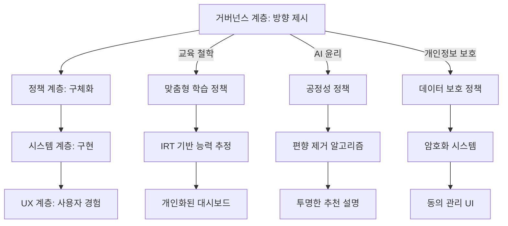

# DreamSeedAI: 거버넌스 계층 - 핵심 요약

**작성일**: 2025-11-07  
**버전**: 1.0.0  
**관련 문서**: 
- [4계층 아키텍처](./4_LAYER_ARCHITECTURE.md)
- [거버넌스 계층 상세 설계](./GOVERNANCE_LAYER_DETAILED.md)
- [거버넌스 계층 운영](./GOVERNANCE_LAYER_OPERATIONS.md)
- [거버넌스 역할과 책임](./GOVERNANCE_ROLES_AND_RESPONSIBILITIES.md)

---

## 개요

거버넌스 계층은 **DreamSeedAI의 행동 헌장**입니다. 

기술적 요소는 아니지만 **기술 구현의 방향을 결정짓는 최상위 계층**이며, 정책/시스템 설계는 모두 이 거버넌스 원칙들을 준수하도록 이끌어집니다.

---

## 1. 핵심 역할

### 1.1 지침 제공 (Direction Setting)

**DreamSeedAI의 전반적인 운영 방향과 목표를 제시**합니다.

```yaml
governance_directions:
  mission: "AI 기반 맞춤형 교육을 통한 학습 효과 극대화"
  
  vision: "모든 학생이 자신의 속도로 최적의 학습 경험을 얻는 교육 환경"
  
  strategic_goals:
    educational_excellence:
      - "학생 개개인의 학습 능력 정확히 파악 (IRT)"
      - "최적화된 맞춤형 학습 콘텐츠 제공"
      - "학습 효과 지속적 측정 및 개선"
      
    ethical_ai:
      - "투명하고 설명 가능한 AI 시스템"
      - "공정하고 편향 없는 추천 알고리즘"
      - "아동 안전 최우선 보호"
      
    stakeholder_trust:
      - "개인정보 보호 철저히 준수"
      - "학부모/교사와의 협력적 관계 구축"
      - "지속적인 피드백 수렴 및 개선"
      
    regulatory_compliance:
      - "모든 관련 법규 100% 준수"
      - "국제 표준 선도적 적용"
      - "투명한 감사 및 보고"
```

**실제 적용 예시**:
```python
# 시스템 설계 시 거버넌스 방향성 반영
class AIRecommendationEngine:
    """
    거버넌스 원칙: "학생 개개인의 학습 능력 정확히 파악"
    → 구현: IRT 기반 능력 추정
    """
    
    def estimate_ability(self, student_id: str) -> float:
        """IRT를 통한 학생 능력 추정 (거버넌스 목표 반영)"""
        
        # 거버넌스 원칙에 따라 정확한 능력 측정
        responses = self._get_student_responses(student_id)
        theta = irt_model.estimate_theta(responses)
        
        # 투명성 원칙: 추정 근거 기록
        self._log_estimation_rationale(student_id, theta, responses)
        
        return theta
```

---

### 1.2 가치 정의 (Value Definition)

**교육 철학, 윤리 원칙, 법규 준수 등 핵심 가치를 정의하고 강조**합니다.

#### 핵심 가치 체계

```yaml
core_values:
  educational_philosophy:
    student_centered:
      principle: "학생 중심 교육"
      definition: "모든 결정은 학생의 최선의 이익을 우선 고려"
      examples:
        - "과도한 학습 부담 방지"
        - "정서적 안정 최우선"
        - "개인 맞춤형 학습 속도 존중"
        
    growth_mindset:
      principle: "성장 마인드셋"
      definition: "실패를 학습 기회로 활용"
      examples:
        - "틀린 문제에 대한 건설적 피드백"
        - "과정 중심 평가 강조"
        - "점진적 난이도 조정"
        
    collaborative_learning:
      principle: "협력적 학습"
      definition: "교사-AI-학생-학부모 협력"
      examples:
        - "교사의 AI 콘텐츠 검토 권한"
        - "학부모 참여 및 모니터링"
        - "학생 피드백 적극 수렴"
        
    holistic_development:
      principle: "전인적 발달"
      definition: "학업뿐 아니라 정서/사회성 발달 지원"
      examples:
        - "정서 상태 모니터링"
        - "스트레스 관리 지원"
        - "균형 잡힌 학습 패턴 권장"
  
  ai_ethics:
    fairness:
      principle: "공정성"
      definition: "모든 학생에게 동등한 기회 제공"
      metrics:
        - "demographic_parity < 0.05"
        - "equal_opportunity > 0.95"
        
    transparency:
      principle: "투명성"
      definition: "모든 AI 결정에 설명 제공"
      requirements:
        - "추천 이유 항상 표시"
        - "능력 추정 근거 공개"
        - "알고리즘 작동 방식 문서화"
        
    accountability:
      principle: "책임성"
      definition: "모든 결정에 책임자 명확히 지정"
      implementation:
        - "감사 로그 모든 작업 기록"
        - "결정 승인 체계 구축"
        - "오류 발생 시 신속 대응"
        
    safety:
      principle: "안전성"
      definition: "학생 보호 최우선"
      measures:
        - "유해 콘텐츠 완전 차단"
        - "개인정보 철저히 보호"
        - "정서적 안정 지속 모니터링"
        
    privacy:
      principle: "프라이버시"
      definition: "개인정보 최소 수집 및 보호"
      practices:
        - "필요 최소한 데이터만 수집"
        - "암호화 및 접근 제어"
        - "보유 기간 제한 및 삭제"
        
    explainability:
      principle: "설명 가능성"
      definition: "AI 결정을 이해 가능하게 설명"
      formats:
        - "학생용: 간단하고 명확한 언어"
        - "교사용: 교육학적 근거 포함"
        - "학부모용: 비전문가도 이해 가능"
  
  legal_compliance:
    data_protection:
      laws: ["GDPR", "COPPA", "FERPA", "CCPA", "개인정보보호법"]
      commitment: "모든 데이터 보호 법규 100% 준수"
      
    educational_standards:
      laws: ["교육기본법", "초중등교육법"]
      commitment: "교육 관련 법규 완전 준수"
      
    children_protection:
      laws: ["아동복지법", "청소년보호법"]
      commitment: "아동 권리 보호 최우선"
      
    ai_regulation:
      laws: ["EU AI Act", "AI 윤리기준"]
      commitment: "AI 규제 선제적 준수"
```

**가치의 실제 구현**:
```python
# 거버넌스 가치 → 코드 구현 예시

class ContentRecommendationService:
    """
    거버넌스 가치: 공정성, 투명성, 설명 가능성
    """
    
    def recommend_content(
        self, 
        student: Student,
        require_explanation: bool = True
    ) -> ContentRecommendation:
        """콘텐츠 추천 (거버넌스 가치 반영)"""
        
        # 1. 공정성: 편향 없는 추천
        candidate_contents = self._get_unbiased_candidates(
            student.theta,
            exclude_bias_factors=['gender', 'region', 'socioeconomic']
        )
        
        # 2. 학생 중심: 최적 난이도
        optimal_contents = self._filter_by_optimal_difficulty(
            candidate_contents,
            student.theta,
            target_success_rate=0.7  # 너무 어렵지도 쉽지도 않게
        )
        
        # 3. 전인적 발달: 정서 상태 고려
        if student.mood_score < 3:  # 기분 좋지 않음
            optimal_contents = self._prioritize_encouraging_content(
                optimal_contents
            )
        
        # 4. 투명성 & 설명 가능성: 추천 이유 제공
        recommendation = ContentRecommendation(
            content=optimal_contents[0],
            reason=self._generate_explanation(
                student,
                optimal_contents[0],
                audience="student"  # 학생이 이해할 수 있는 언어
            )
        )
        
        # 5. 책임성: 감사 로그
        audit_logger.log_ai_decision(
            decision_type="content_recommendation",
            student_id=student.id,
            input_data={"theta": student.theta, "mood": student.mood_score},
            output_data={"content_id": recommendation.content.id},
            explanation=recommendation.reason
        )
        
        return recommendation
    
    def _generate_explanation(
        self,
        student: Student,
        content: Content,
        audience: str
    ) -> str:
        """설명 생성 (거버넌스 원칙: 설명 가능성)"""
        
        if audience == "student":
            return f"""
            이 문제를 추천한 이유:
            1. 지금 네 실력에 딱 맞는 난이도야 (70% 정도 풀 수 있을 거야)
            2. 최근에 배운 '{content.topic}' 개념을 연습하기 좋아
            3. 네가 어제 틀렸던 유형과 비슷해서, 다시 도전해보면 좋을 것 같아!
            """
        
        elif audience == "teacher":
            return f"""
            추천 근거:
            - 학생 능력 추정치 (θ): {student.theta:.2f}
            - 문제 난이도 (b): {content.difficulty:.2f}
            - 예상 정답률: {self._calculate_irt_probability(student.theta, content):.1%}
            - 최근 학습 주제: {content.topic}
            - 오답 패턴 기반 복습 필요 영역
            """
        
        elif audience == "parent":
            return f"""
            AI가 이 학습 콘텐츠를 추천한 이유:
            - 자녀의 현재 수준에 적합한 난이도입니다
            - 최근 학습한 내용을 복습하고 강화하는 데 도움이 됩니다
            - 과도하게 어렵지 않아 자신감을 유지할 수 있습니다
            """
```

---

### 1.3 제약 조건 설정 (Constraint Definition)

**시스템이 따라야 할 윤리적 및 법적 제약 조건을 설정**합니다.

#### 핵심 제약 조건

```yaml
governance_constraints:
  ethical_constraints:
    no_harm:
      constraint: "학생에게 해를 끼치는 콘텐츠 절대 금지"
      implementation:
        - "유해 콘텐츠 완전 차단"
        - "과도한 학습 부담 방지"
        - "정서적 스트레스 모니터링"
        
    informed_consent:
      constraint: "모든 데이터 수집에 명시적 동의 필요"
      requirements:
        - "만 14세 미만: 학부모 동의 필수"
        - "만 14세 이상: 본인 동의 가능"
        - "동의 없는 데이터 수집 절대 금지"
        
    human_oversight:
      constraint: "중요 결정에 반드시 인간 검토 포함"
      scope:
        - "AI 콘텐츠 추천 → 교사 승인 필수"
        - "능력 추정 급격한 변화 → 교사 확인"
        - "이상 행동 감지 → 교사/학부모 통보"
        
    no_discrimination:
      constraint: "어떠한 차별도 금지"
      protected_attributes:
        - "성별, 인종, 지역, 사회경제적 배경"
        - "장애 여부, 종교, 정치적 성향"
      enforcement:
        - "정기적 공정성 감사"
        - "편향 발견 시 즉시 모델 수정"
        
  legal_constraints:
    data_minimization:
      constraint: "필요 최소한의 데이터만 수집"
      principle: "GDPR Article 5(1)(c)"
      examples:
        - "학습 데이터: 필수"
        - "인구통계 데이터: 익명화된 분석 용도만"
        - "위치 정보: 수집 금지"
        
    storage_limitation:
      constraint: "데이터 보유 기간 제한"
      rules:
        - "재학생 학습 데이터: 재학 중 + 졸업 후 1년"
        - "졸업생 데이터: 졸업 후 1년 이내 삭제"
        - "감사 로그: 3년 보관 후 삭제"
        
    purpose_limitation:
      constraint: "수집 목적 외 사용 금지"
      allowed_purposes:
        - "맞춤형 학습 콘텐츠 제공"
        - "학습 효과 측정 및 개선"
        - "시스템 보안 및 감사"
      prohibited_purposes:
        - "마케팅 활용"
        - "제3자 판매"
        - "학생 프로파일링 (학습 외 목적)"
        
    cross_border_transfer:
      constraint: "국경 간 데이터 이전 엄격히 제한"
      rules:
        - "한국 학생 데이터: 국내 서버 보관 원칙"
        - "해외 이전 시: 적정성 결정 또는 표준계약조항"
        - "민감 데이터: 해외 이전 금지"
        
  technical_constraints:
    encryption:
      constraint: "모든 개인정보 암호화 필수"
      standards:
        - "저장 시: AES-256-GCM"
        - "전송 시: TLS 1.3+"
        - "키 관리: Cloud KMS + HSM"
        
    access_control:
      constraint: "역할 기반 접근 제어 필수"
      requirements:
        - "최소 권한 원칙"
        - "직무 분리"
        - "모든 접근 감사 로그"
        
    auditability:
      constraint: "모든 중요 작업 감사 로그 기록"
      scope:
        - "데이터 접근"
        - "AI 결정"
        - "정책 위반"
        - "승인 요청 및 결과"
        
    availability:
      constraint: "시스템 가용성 보장"
      targets:
        - "업타임: 99.9% 이상"
        - "백업: 일일 자동 백업"
        - "복구: RPO 1시간, RTO 4시간"
```

**제약 조건 검증 시스템**:
```python
# 거버넌스 제약 조건 자동 검증

class GovernanceConstraintValidator:
    """거버넌스 제약 조건 검증"""
    
    def validate_data_collection(
        self,
        data_type: str,
        student: Student,
        consent: Consent
    ) -> ValidationResult:
        """데이터 수집 제약 조건 검증"""
        
        violations = []
        
        # 제약 1: Informed Consent
        if student.age < 14 and not consent.parent_approved:
            violations.append({
                "constraint": "informed_consent",
                "message": "만 14세 미만 학생은 학부모 동의 필수"
            })
        
        # 제약 2: Data Minimization
        if data_type not in ESSENTIAL_DATA_TYPES:
            violations.append({
                "constraint": "data_minimization",
                "message": f"{data_type}는 필수 데이터가 아님"
            })
        
        # 제약 3: Purpose Limitation
        if consent.purpose not in ALLOWED_PURPOSES:
            violations.append({
                "constraint": "purpose_limitation",
                "message": f"허용되지 않은 목적: {consent.purpose}"
            })
        
        if violations:
            # 제약 위반 시 즉시 차단
            audit_logger.log_policy_violation(
                violation_type="data_collection_constraint",
                details=violations
            )
            return ValidationResult(valid=False, violations=violations)
        
        return ValidationResult(valid=True)
    
    def validate_ai_decision(
        self,
        decision_type: str,
        input_data: dict,
        output: dict,
        human_approval: bool = False
    ) -> ValidationResult:
        """AI 결정 제약 조건 검증"""
        
        violations = []
        
        # 제약: Human Oversight
        critical_decisions = ["content_recommendation", "ability_adjustment"]
        if decision_type in critical_decisions and not human_approval:
            violations.append({
                "constraint": "human_oversight",
                "message": f"{decision_type}는 교사 승인 필요"
            })
        
        # 제약: No Discrimination
        if self._detect_bias(input_data, output):
            violations.append({
                "constraint": "no_discrimination",
                "message": "편향된 결정 감지"
            })
        
        if violations:
            return ValidationResult(valid=False, violations=violations)
        
        return ValidationResult(valid=True)
```

---

### 1.4 판단 기준 제시 (Decision Criteria)

**정책 및 시스템 설계 시 고려해야 할 핵심 사항들을 명확히 제시**합니다.

#### 의사 결정 프레임워크

```yaml
decision_framework:
  new_feature_evaluation:
    name: "신규 기능 평가 기준"
    
    criteria:
      educational_value:
        weight: 0.30
        questions:
          - "학습 효과를 실질적으로 향상시키는가?"
          - "교육학적 근거가 충분한가?"
          - "교사/학부모가 가치를 인정하는가?"
        threshold: 7/10
        
      student_safety:
        weight: 0.25
        questions:
          - "학생에게 해를 끼칠 가능성은 없는가?"
          - "개인정보 보호가 보장되는가?"
          - "정서적 안정에 부정적 영향은 없는가?"
        threshold: 9/10  # 매우 높은 기준
        veto_power: true  # 기준 미달 시 거부권
        
      fairness:
        weight: 0.20
        questions:
          - "모든 학생에게 공정한가?"
          - "편향이나 차별 가능성은 없는가?"
          - "접근성이 보장되는가?"
        threshold: 8/10
        
      transparency:
        weight: 0.15
        questions:
          - "작동 원리를 설명할 수 있는가?"
          - "학생/학부모가 이해할 수 있는가?"
          - "감사 가능한가?"
        threshold: 7/10
        
      compliance:
        weight: 0.10
        questions:
          - "모든 관련 법규를 준수하는가?"
          - "윤리 가이드라인에 부합하는가?"
          - "계약 조항을 위반하지 않는가?"
        threshold: 10/10  # 100% 필수
        veto_power: true
    
    approval_process:
      phase1: "자가 평가 (개발팀)"
      phase2: "전문가 검토 (교육학자, 법률가)"
      phase3: "거버넌스 위원회 승인"
      phase4: "시범 운영 (제한적 배포)"
      phase5: "전면 배포"
      
  policy_change_evaluation:
    name: "정책 변경 평가 기준"
    
    criteria:
      impact_assessment:
        - "어떤 이해관계자에게 영향을 미치는가?"
        - "긍정적/부정적 영향의 균형은?"
        - "위험 요소는 무엇인가?"
        
      stakeholder_consultation:
        - "교사 의견 수렴"
        - "학부모 의견 수렴"
        - "학생 피드백 (가능한 경우)"
        - "법률 자문"
        
      reversibility:
        - "변경 사항을 되돌릴 수 있는가?"
        - "롤백 계획이 있는가?"
        
      documentation:
        - "변경 이유 명확히 문서화"
        - "예상 효과 및 위험 문서화"
        - "승인 과정 기록"
        
  ai_model_deployment:
    name: "AI 모델 배포 평가 기준"
    
    criteria:
      accuracy:
        metric: "정확도 > 90%"
        validation: "독립적 테스트 데이터셋"
        
      fairness:
        metric: "그룹 간 성능 차이 < 5%"
        groups: ["성별", "지역", "학년"]
        
      explainability:
        requirement: "모든 예측에 설명 제공 가능"
        format: "LIME 또는 SHAP 기반"
        
      safety:
        requirement: "유해 출력 완전 차단"
        validation: "레드팀 테스트 통과"
        
      monitoring:
        requirement: "실시간 성능 모니터링 시스템 구축"
        alerts: "성능 저하 시 즉시 알림"
```

**의사 결정 지원 시스템**:
```python
# 거버넌스 의사 결정 지원 도구

class GovernanceDecisionSupport:
    """거버넌스 의사 결정 지원"""
    
    def evaluate_new_feature(
        self,
        feature: FeatureProposal
    ) -> EvaluationReport:
        """신규 기능 평가"""
        
        scores = {}
        
        # 1. 교육적 가치 평가
        scores['educational_value'] = self._evaluate_educational_value(
            feature.description,
            feature.learning_objectives,
            feature.pedagogical_rationale
        )
        
        # 2. 학생 안전 평가
        scores['student_safety'] = self._evaluate_safety(
            feature.data_collection,
            feature.ai_components,
            feature.user_interactions
        )
        
        # 3. 공정성 평가
        scores['fairness'] = self._evaluate_fairness(
            feature.target_users,
            feature.accessibility,
            feature.bias_mitigation
        )
        
        # 4. 투명성 평가
        scores['transparency'] = self._evaluate_transparency(
            feature.explainability,
            feature.documentation,
            feature.auditability
        )
        
        # 5. 법규 준수 평가
        scores['compliance'] = self._evaluate_compliance(
            feature.legal_analysis,
            feature.privacy_impact,
            feature.contract_alignment
        )
        
        # 가중 평균 계산
        weights = {
            'educational_value': 0.30,
            'student_safety': 0.25,
            'fairness': 0.20,
            'transparency': 0.15,
            'compliance': 0.10
        }
        
        total_score = sum(
            scores[criterion] * weights[criterion]
            for criterion in scores
        )
        
        # 거부권 기준 확인
        veto_criteria = ['student_safety', 'compliance']
        veto_triggered = any(
            scores[criterion] < 9.0
            for criterion in veto_criteria
        )
        
        # 평가 보고서 생성
        report = EvaluationReport(
            feature_name=feature.name,
            scores=scores,
            total_score=total_score,
            recommendation="APPROVE" if total_score >= 7.0 and not veto_triggered else "REJECT",
            veto_triggered=veto_triggered,
            detailed_feedback=self._generate_feedback(scores, weights),
            next_steps=self._determine_next_steps(total_score, veto_triggered)
        )
        
        return report
```

---

## 2. 기술 구현과의 관계

### 2.1 헌장 (Charter)

DreamSeedAI의 거버넌스 계층은 **플랫폼이 따라야 할 헌장**과 같은 역할을 합니다.

```yaml
governance_as_charter:
  definition: "거버넌스 계층은 DreamSeedAI의 최고 규범"
  
  characteristics:
    supreme_authority:
      - "모든 정책과 시스템은 거버넌스 원칙을 준수해야 함"
      - "거버넌스 원칙과 충돌하는 기능은 구현 불가"
      
    permanence:
      - "핵심 가치는 쉽게 변경되지 않음"
      - "변경 시 거버넌스 위원회 만장일치 필요"
      
    universality:
      - "플랫폼의 모든 영역에 적용"
      - "예외 없이 모든 사용자에게 동일하게 적용"
      
  enforcement:
    preventive:
      - "설계 단계에서 거버넌스 원칙 반영"
      - "코드 리뷰 시 거버넌스 준수 확인"
      
    detective:
      - "지속적인 모니터링 및 감사"
      - "위반 사항 자동 감지"
      
    corrective:
      - "위반 발견 시 즉시 시정 조치"
      - "근본 원인 분석 및 재발 방지"
```

**헌장의 실제 적용**:
```python
# 거버넌스 헌장 검증 시스템

class GovernanceCharterEnforcement:
    """거버넌스 헌장 집행"""
    
    def __init__(self):
        # 헌장 로드
        self.charter = self._load_charter()
    
    def validate_code_change(self, code_diff: str) -> ValidationResult:
        """코드 변경 사항이 헌장을 준수하는지 검증"""
        
        violations = []
        
        # 1. 개인정보 처리 검증
        if self._contains_pii_handling(code_diff):
            if not self._validates_encryption(code_diff):
                violations.append({
                    "charter_principle": "개인정보 보호",
                    "violation": "개인정보 암호화 누락"
                })
        
        # 2. AI 결정 검증
        if self._contains_ai_decision(code_diff):
            if not self._validates_explainability(code_diff):
                violations.append({
                    "charter_principle": "투명성",
                    "violation": "AI 결정 설명 기능 누락"
                })
            
            if not self._validates_human_oversight(code_diff):
                violations.append({
                    "charter_principle": "인간 감독",
                    "violation": "교사 승인 절차 누락"
                })
        
        # 3. 데이터 수집 검증
        if self._contains_data_collection(code_diff):
            if not self._validates_consent_check(code_diff):
                violations.append({
                    "charter_principle": "명시적 동의",
                    "violation": "동의 확인 절차 누락"
                })
        
        if violations:
            return ValidationResult(
                valid=False,
                violations=violations,
                action="코드 변경 거부"
            )
        
        return ValidationResult(valid=True)
```

---

### 2.2 방향성 제시 (Direction Setting)

**기술적 구현의 목표와 방향을 제시**하며, 설계 과정 전반에 걸쳐 영향을 미칩니다.



**방향성의 계층별 전파**:
```yaml
direction_propagation:
  example_1:
    governance: "학생 중심 교육"
    policy: "학생 부담 최소화 정책"
    system: "일일 학습량 자동 조절 알고리즘"
    ux: "학습 시간 추천 및 휴식 알림"
    
  example_2:
    governance: "투명성 원칙"
    policy: "AI 설명 제공 의무화"
    system: "SHAP 기반 설명 생성 엔진"
    ux: "추천 이유 항상 표시"
    
  example_3:
    governance: "협력적 학습"
    policy: "교사 승인 필수"
    system: "승인 워크플로우 시스템"
    ux: "교사 검토 대시보드"
```

---

### 2.3 제약 조건 (Constraints)

정책 계층과 시스템 계층은 **거버넌스 계층에서 설정한 제약 조건을 준수**해야 합니다.

```python
# 거버넌스 제약 → 시스템 제약 예시

# 거버넌스 제약: "만 14세 미만은 학부모 동의 필수"
@app.post("/api/students/{student_id}/data-collection")
async def collect_student_data(
    student_id: str,
    data_type: str,
    current_user: User = Depends(get_current_user)
):
    student = db.query(Student).get(student_id)
    
    # 거버넌스 제약 검증
    if student.age < 14:
        consent = db.query(ParentConsent).filter(
            ParentConsent.student_id == student_id,
            ParentConsent.data_type == data_type,
            ParentConsent.status == "approved"
        ).first()
        
        if not consent:
            # 거버넌스 제약 위반 → 차단
            raise HTTPException(
                403,
                "거버넌스 제약 위반: 만 14세 미만 학생은 학부모 동의 필수"
            )
    
    # ... 데이터 수집 진행


# 거버넌스 제약: "AI 결정에 설명 필수"
class AIRecommendationEngine:
    def recommend(self, student_id: str) -> Recommendation:
        recommendation = self._generate_recommendation(student_id)
        
        # 거버넌스 제약: 설명 없이는 반환 불가
        if not recommendation.explanation:
            raise GovernanceConstraintViolation(
                "거버넌스 제약 위반: AI 추천에 설명 필수"
            )
        
        return recommendation


# 거버넌스 제약: "개인정보 암호화 필수"
class StudentDataRepository:
    def save_student(self, student: Student):
        # 거버넌스 제약: PII 암호화
        encrypted_student = Student(
            id=student.id,
            name=encrypt(student.name),  # 필수 암호화
            email=encrypt(student.email),  # 필수 암호화
            school_id=student.school_id,  # 식별자는 암호화 제외
            theta=student.theta  # 학습 데이터는 암호화 제외
        )
        
        db.session.add(encrypted_student)
        db.session.commit()
```

---

## 3. 정책 엔진 및 시스템 동작

### 3.1 집행 수단 (Enforcement Mechanisms)

정책 엔진과 시스템 동작은 **거버넌스 원칙을 실제로 집행하기 위한 수단**입니다.

```yaml
enforcement_layers:
  layer_1_governance:
    name: "거버넌스 계층"
    role: "원칙 정의"
    examples:
      - "개인정보 보호 원칙"
      - "학업 윤리 준수 원칙"
      - "공정성 및 비차별 원칙"
      
  layer_2_policy:
    name: "정책 계층"
    role: "원칙의 구체화"
    examples:
      - "개인정보 보호 정책: AES-256 암호화, RBAC, 로그 보관 3년"
      - "학업 윤리 정책: 표절 금지, 힌트 제공 제한, AI 사용 투명화"
      - "공정성 정책: 편향 지표 < 5%, 정기 감사"
      
  layer_3_system:
    name: "시스템 계층"
    role: "정책의 기술적 구현"
    examples:
      - "PolicyEngine 클래스: check_privacy_policy()"
      - "PlagiarismDetector 클래스: detect_plagiarism()"
      - "FairnessMonitor 클래스: calculate_demographic_parity()"
      
  layer_4_ux:
    name: "UX 계층"
    role: "사용자 경험 제공"
    examples:
      - "동의 관리 UI"
      - "표절 경고 메시지"
      - "추천 이유 표시"
```

---

### 3.2 구현 예시

#### 예시 1: 개인정보 보호 원칙

**거버넌스 → 정책 → 시스템 → UX**

```yaml
privacy_protection_implementation:
  governance_principle:
    name: "개인정보 보호"
    description: "학생의 개인정보를 철저히 보호한다"
    
  policy_specification:
    encryption:
      - "저장 시: AES-256-GCM"
      - "전송 시: TLS 1.3"
      - "키 관리: Cloud KMS"
      
    access_control:
      - "RBAC 적용"
      - "최소 권한 원칙"
      - "모든 접근 로그 기록"
      
    data_lifecycle:
      - "수집: 명시적 동의"
      - "보관: 재학 중 + 졸업 후 1년"
      - "삭제: 안전한 완전 삭제"
      
  system_implementation:
    code: |
      # 암호화
      class EncryptionService:
          def encrypt_pii(self, data: str) -> str:
              return aes_256_gcm_encrypt(data, kms_key)
      
      # 접근 제어
      @require_role("teacher")
      def get_student_data(student_id: str):
          # RBAC 적용
          
      # 감사 로그
      audit_logger.log_data_access(user_id, resource)
      
  ux_experience:
    consent_ui: "명확하고 이해하기 쉬운 동의 관리 화면"
    privacy_settings: "학생/학부모가 직접 제어 가능"
    transparency: "수집된 데이터 항목 및 사용 목적 표시"
```

#### 예시 2: 학업 윤리 준수 원칙

**거버넌스 → 정책 → 시스템 → UX**

```yaml
academic_integrity_implementation:
  governance_principle:
    name: "학업 윤리 준수"
    description: "학생의 정직한 학습을 장려하고 부정행위를 방지한다"
    
  policy_specification:
    plagiarism_prevention:
      - "제출물 표절 검사"
      - "유사도 > 30% 경고"
      - "교사 검토 요청"
      
    ai_assistance_limits:
      - "힌트 제공: 최대 3회"
      - "정답 직접 제공 금지"
      - "AI 사용 기록 투명하게 공개"
      
    cheating_detection:
      - "비정상적인 답변 패턴 감지"
      - "시간 제한 있는 평가"
      
  system_implementation:
    code: |
      # 표절 검사
      class PlagiarismDetector:
          def detect(self, submission: str) -> float:
              similarity = self._calculate_similarity(submission)
              if similarity > 0.3:
                  self._notify_teacher()
              return similarity
      
      # AI 힌트 제한
      class AITutor:
          def provide_hint(self, student_id: str, problem_id: str):
              hint_count = self._get_hint_count(student_id, problem_id)
              if hint_count >= 3:
                  raise HintLimitExceeded()
              # 힌트 제공
      
      # 부정행위 감지
      class CheatingDetector:
          def detect_anomaly(self, submission: Submission) -> bool:
              # 시간, 패턴 분석
              
  ux_experience:
    clear_guidelines: "AI 사용 가이드라인 명확히 표시"
    hint_counter: "남은 힌트 횟수 표시"
    ai_usage_log: "AI 도움 받은 부분 표시"
```

#### 예시 3: 공정성 및 비차별 원칙

**거버넌스 → 정책 → 시스템 → UX**

```yaml
fairness_implementation:
  governance_principle:
    name: "공정성 및 비차별"
    description: "모든 학생에게 공정한 기회를 제공하고 차별을 방지한다"
    
  policy_specification:
    bias_mitigation:
      - "보호 속성: 성별, 지역, 사회경제적 배경"
      - "편향 지표: demographic_parity < 0.05"
      - "정기 감사: 분기별"
      
    equal_opportunity:
      - "동일 능력 학생에게 동일 추천"
      - "접근성 보장 (장애 학생)"
      
    transparency:
      - "추천 알고리즘 공개"
      - "편향 감사 결과 공개"
      
  system_implementation:
    code: |
      # 편향 제거
      class FairRecommendationEngine:
          def recommend(self, student: Student) -> Content:
              # 보호 속성 제외
              features = self._extract_features(
                  student,
                  exclude=['gender', 'region', 'socioeconomic']
              )
              return self._generate_recommendation(features)
      
      # 공정성 모니터링
      class FairnessMonitor:
          def calculate_demographic_parity(self) -> float:
              male_rate = self._recommendation_rate(gender='male')
              female_rate = self._recommendation_rate(gender='female')
              return abs(male_rate - female_rate)
      
      # 감사
      class FairnessAuditor:
          def audit(self):
              parity = fairness_monitor.calculate_demographic_parity()
              if parity > 0.05:
                  alert_governance_board()
                  
  ux_experience:
    transparent_recommendations: "추천 이유 명확히 표시"
    accessibility: "모든 기능 접근 가능"
    feedback_channel: "불공정 신고 채널"
```

---

## 4. 결론

DreamSeedAI의 거버넌스 계층은 **단순히 기술적인 아키텍처의 한 부분이 아니라, 플랫폼의 핵심 가치를 담고 있는 중요한 요소**입니다.

### 4.1 거버넌스 계층의 역할

```yaml
governance_layer_significance:
  as_charter:
    role: "플랫폼의 최고 규범"
    function: "모든 결정의 기준점"
    
  as_compass:
    role: "방향 제시"
    function: "기술 개발의 나침반"
    
  as_guardian:
    role: "가치 보호"
    function: "핵심 원칙 수호"
    
  as_framework:
    role: "의사 결정 체계"
    function: "일관된 판단 기준 제공"
```

### 4.2 핵심 가치 실현

이 계층은 DreamSeedAI가:

1. **교육 혁신 추구**: AI 기술을 활용한 맞춤형 교육
2. **학생 권리 보호**: 개인정보 보호 및 안전 최우선
3. **사회적 책임**: 윤리적이고 공정한 AI 시스템 운영

을 동시에 실현할 수 있도록 **guiding principles를 제공**합니다.

### 4.3 지속 가능한 발전

```yaml
sustainable_development:
  continuous_improvement:
    - "정기적인 거버넌스 원칙 검토"
    - "새로운 윤리적 과제 대응"
    - "이해관계자 피드백 반영"
    
  adaptability:
    - "법규 변화에 신속 대응"
    - "기술 발전에 맞춘 원칙 업데이트"
    - "사회적 기대 변화 반영"
    
  accountability:
    - "투명한 거버넌스 운영"
    - "정기적인 감사 및 보고"
    - "책임 소재 명확화"
```

### 4.4 최종 메시지

> **거버넌스 계층은 DreamSeedAI의 DNA입니다.**
> 
> 기술은 변할 수 있고, 시스템은 업그레이드될 수 있지만,  
> 거버넌스 원칙은 플랫폼의 정체성이자 존재 이유입니다.
> 
> 우리는 기술을 통해 교육을 혁신하지만,  
> 그 과정에서 결코 학생의 권리와 복지를 희생하지 않습니다.

---

## 참조 문서

- [4계층 아키텍처](./4_LAYER_ARCHITECTURE.md)
- [거버넌스 계층 상세 설계](./GOVERNANCE_LAYER_DETAILED.md)
- [거버넌스 계층 운영](./GOVERNANCE_LAYER_OPERATIONS.md)
- [거버넌스 역할과 책임](./GOVERNANCE_ROLES_AND_RESPONSIBILITIES.md)

---

**문서 버전**: 1.0.0  
**최종 업데이트**: 2025-11-07  
**작성자**: DreamSeedAI Governance Board  
**승인**: DreamSeedAI 운영 위원회

---

## 부록: 거버넌스 체크리스트

**신규 기능 개발 시 필수 확인 사항**:

- [ ] 교육적 가치가 명확한가?
- [ ] 학생 안전이 보장되는가?
- [ ] 개인정보 보호 원칙을 준수하는가?
- [ ] 공정하고 편향 없는가?
- [ ] 투명하고 설명 가능한가?
- [ ] 모든 관련 법규를 준수하는가?
- [ ] 교사 검토가 포함되는가?
- [ ] 학부모 동의가 필요한가?
- [ ] 감사 로그가 기록되는가?
- [ ] 거버넌스 위원회 승인을 받았는가?
