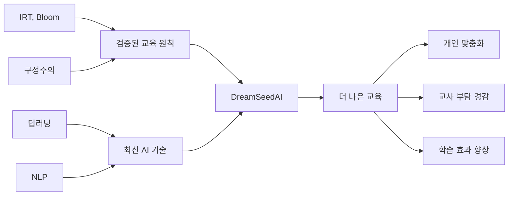

# DreamSeedAI 거버넌스 철학: AI 교육 혁신과 교육 체계의 조화

**작성일**: 2025-11-07  
**버전**: 1.0.0  
**문서 성격**: 거버넌스 비전 및 철학  

---

## 핵심 철학

> **"AI는 교육을 혁명하는 것이 아니라, 진화시킨다"**

DreamSeedAI의 거버넌스 시스템은 다음의 근본적인 철학을 바탕으로 설계되었습니다:

### 1. AI 도입의 목적: 교육 체계 혼란 방지

#### 문제 인식

AI가 교육에 본격적으로 도입될 때 예상되는 문제들:

```yaml
anticipated_challenges:
  teacher_concerns:
    - "AI가 교사를 대체하는가?"
    - "교사의 역할과 정체성은 어떻게 변하는가?"
    - "기존 교수법이 무용지물이 되는가?"
    
  parent_concerns:
    - "AI가 우리 아이를 안전하게 가르칠 수 있는가?"
    - "개인정보는 안전한가?"
    - "AI에게만 맡겨도 되는가?"
    
  school_concerns:
    - "기존 교육과정과 충돌하지 않는가?"
    - "평가 체계를 바꿔야 하는가?"
    - "학교 시스템 전체를 뒤집어야 하는가?"
    
  student_concerns:
    - "AI가 나를 제대로 이해할 수 있는가?"
    - "친구들과 다른 취급을 받지 않을까?"
    - "AI가 틀리면 어떻게 하나?"
```

#### DreamSeedAI의 해법: 거버넌스

**거버넌스는 이러한 혼란을 사전에 방지하는 안전장치입니다.**

```yaml
governance_solutions:
  for_teachers:
    assurance: "AI는 교사를 보조하는 도구"
    mechanism:
      - "모든 중요 결정은 교사 승인 필요"
      - "교사가 최종 권한 보유"
      - "AI는 제안만 하고, 교사가 결정"
    
  for_parents:
    assurance: "학생 안전과 프라이버시 최우선"
    mechanism:
      - "모든 데이터 수집에 명시적 동의 필요"
      - "언제든지 사용 중단 및 데이터 삭제 가능"
      - "투명한 AI 작동 원리 공개"
    
  for_schools:
    assurance: "기존 시스템과 조화롭게 통합"
    mechanism:
      - "현행 교육과정 100% 준수"
      - "점진적 도입 (파일럿 → 확장)"
      - "학교별 자율성 존중"
    
  for_students:
    assurance: "공정하고 안전한 학습 환경"
    mechanism:
      - "모든 학생에게 공정한 추천"
      - "개인정보 철저히 보호"
      - "설명 가능한 AI (왜 이걸 추천했는지 설명)"
```

---

### 2. 레거시 교육 시스템 존중

**DreamSeedAI는 기존 교육 시스템을 대체하는 것이 아니라 강화합니다.**

#### 존중의 원칙

```yaml
respect_for_legacy:
  curriculum_alignment:
    principle: "국가 교육과정 완전 준수"
    implementation:
      - "교과서 기반 콘텐츠"
      - "성취 기준 100% 반영"
      - "학년별 학습 목표 준수"
    
  teacher_authority:
    principle: "교사의 교육 전문성 인정"
    implementation:
      - "AI 추천 = 제안, 교사 승인 = 결정"
      - "교사만이 학생을 진정으로 이해"
      - "AI는 교사의 판단을 보조"
    
  proven_pedagogy:
    principle: "검증된 교육 방법론 활용"
    implementation:
      - "IRT (문항반응이론): 60년 역사"
      - "Bloom의 교육 목표 분류학"
      - "Zone of Proximal Development (근접발달영역)"
    
  school_autonomy:
    principle: "학교 운영 방침 존중"
    implementation:
      - "학교별 정책 커스터마이징 가능"
      - "지역 교육청 정책 우선 적용"
      - "학교 문화 및 특성 반영"
```

#### 혁신과 전통의 균형



---

### 3. 점진적 전환 전략

**AI 교육은 마라톤이지, 단거리 달리기가 아닙니다.**

#### 단계적 도입 로드맵

```yaml
phased_rollout:
  philosophy: "빨리 가려면 혼자, 멀리 가려면 함께"
  
  stage_1_foundation:
    name: "신뢰 구축"
    duration: "0-6개월"
    focus:
      - "소규모 파일럿 (3-5개 학교)"
      - "자원 교사와 함께"
      - "충분한 교육 및 지원"
    goal: "AI 교육의 가능성 입증"
    success_metric: "교사 만족도 > 4.0/5.0"
    
  stage_2_learning:
    name: "학습 및 개선"
    duration: "7-12개월"
    focus:
      - "파일럿 결과 분석"
      - "교사/학부모 피드백 반영"
      - "시스템 개선 및 최적화"
    goal: "검증된 모델 확립"
    success_metric: "학습 효과 향상 입증"
    
  stage_3_expansion:
    name: "점진적 확산"
    duration: "13-24개월"
    focus:
      - "20개 학교로 확대"
      - "전 과목 적용"
      - "거버넌스 고도화"
    goal: "스케일 업 가능성 확인"
    success_metric: "학교당 성공률 > 80%"
    
  stage_4_maturity:
    name: "성숙 및 표준화"
    duration: "25개월 이후"
    focus:
      - "전국 단위 확산"
      - "국제 표준 인증"
      - "모범 사례 공개"
    goal: "AI 교육의 표준 제시"
    success_metric: "타 기관 채택률"
```

#### 각 단계별 거버넌스 활성화

```python
# 단계별 거버넌스 레벨

class GovernancePhaseManager:
    """단계별 거버넌스 활성화 관리"""
    
    PHASE_CONFIGS = {
        'foundation': {
            'level': 1,
            'policies': [
                'privacy_protection',      # 필수
                'content_safety',          # 필수
                'teacher_approval',        # 필수
                'basic_audit_log'          # 필수
            ],
            'features': {
                'auto_approval': False,    # 모든 것을 교사가 검토
                'fairness_monitoring': 'log_only',  # 로그만, 차단 안 함
                'risk_prediction': False   # 아직 데이터 부족
            }
        },
        
        'learning': {
            'level': 1,
            'policies': [
                'privacy_protection',
                'content_safety',
                'teacher_approval',
                'basic_audit_log',
                'transparency_reporting'   # 추가
            ],
            'features': {
                'auto_approval': 'safe_content_only',  # 안전한 콘텐츠만
                'fairness_monitoring': 'alert',  # 이슈 발견 시 알림
                'risk_prediction': False
            }
        },
        
        'expansion': {
            'level': 2,
            'policies': [
                'privacy_protection',
                'content_safety',
                'teacher_approval',
                'advanced_audit_log',      # 고도화
                'transparency_reporting',
                'fairness_enforcement',    # 추가: 편향 차단
                'governance_board_oversight'  # 추가: 위원회 감독
            ],
            'features': {
                'auto_approval': 'high_confidence',  # 높은 신뢰도 콘텐츠
                'fairness_monitoring': 'enforce',  # 편향 발견 시 차단
                'risk_prediction': 'basic'  # 기본 리스크 예측
            }
        },
        
        'maturity': {
            'level': 3,
            'policies': ['all'],  # 모든 정책 활성화
            'features': {
                'auto_approval': 'ml_based',  # ML 기반 자동 승인
                'fairness_monitoring': 'proactive',  # 사전 예방
                'risk_prediction': 'advanced',  # 고급 예측 모델
                'automated_compliance': True,  # 자동화된 준수 검사
                'international_standards': True  # 국제 표준 준수
            }
        }
    }
    
    def get_current_phase(self) -> str:
        """현재 단계 확인"""
        # 운영 개월 수, 학교 수, 성공률 등을 기반으로 판단
        pass
    
    def activate_governance(self, phase: str):
        """해당 단계의 거버넌스 활성화"""
        config = self.PHASE_CONFIGS[phase]
        
        # 거버넌스 레벨 설정
        self._set_governance_level(config['level'])
        
        # 정책 활성화
        for policy in config['policies']:
            self._activate_policy(policy)
        
        # 기능 활성화
        for feature, setting in config['features'].items():
            self._configure_feature(feature, setting)
```

**이점**:
- ✅ 각 단계에서 학습하고 개선
- ✅ 급격한 변화로 인한 혼란 방지
- ✅ 충분한 적응 시간 제공
- ✅ 실패 시 영향 최소화

---

### 4. 미래 확장성: 모든 시스템에 거버넌스 여지

**"지금 당장 모든 것을 완비할 필요는 없지만, 언제든 적용할 수 있어야 한다"**

#### 설계 원칙: Governance-Ready Architecture

```yaml
governance_ready_design:
  principle_1_optional_enforcement:
    description: "거버넌스 기능은 항상 옵션"
    example: |
      # 거버넌스 비활성 시에도 정상 작동
      if governance_enabled:
          check_policy()
      execute_function()
    
  principle_2_configuration_driven:
    description: "코드 수정 없이 설정으로 제어"
    example: |
      # governance.yaml 파일 수정만으로 활성화
      governance:
        enabled: true
        level: 2
    
  principle_3_incremental_activation:
    description: "필요한 정책부터 하나씩 활성화"
    example: |
      policies:
        privacy: true      # 즉시 필요
        fairness: false    # 나중에 활성화
        transparency: true # 즉시 필요
    
  principle_4_backward_compatible:
    description: "거버넌스 추가가 기존 기능을 깨지 않음"
    example: |
      # 기존 코드는 그대로 작동
      result = legacy_function()
      
      # 거버넌스는 추가 레이어
      if governance_enabled:
          validate_result(result)
    
  principle_5_extensible:
    description: "새로운 정책 추가가 용이"
    example: |
      # 플러그인 방식으로 정책 추가
      policy_engine.register_policy(NewPolicy())
```

#### 모든 컴포넌트의 거버넌스 확장 포인트

```python
# 시스템 전체에 거버넌스 확장 포인트 삽입

class ContentRecommendationService:
    """콘텐츠 추천 서비스 (거버넌스 확장 가능)"""
    
    # 확장 포인트 1: 초기화 시
    def __init__(self):
        self.governance = GovernanceLayer.get_instance()
        # 현재는 비활성화 가능, 미래에 활성화
    
    # 확장 포인트 2: 추천 전
    def recommend(self, student_id: str):
        # HOOK: 거버넌스 사전 검증
        if self.governance.enabled:
            self.governance.pre_recommendation_check(student_id)
        
        recommendation = self._generate_recommendation(student_id)
        
        # 확장 포인트 3: 추천 후
        # HOOK: 거버넌스 사후 검증
        if self.governance.enabled:
            recommendation = self.governance.post_recommendation_check(
                recommendation
            )
        
        return recommendation


class AssessmentService:
    """평가 서비스 (거버넌스 확장 가능)"""
    
    def score_student(self, student_id: str, answers: list):
        # 확장 포인트: 평가 전 정책 확인
        if self.governance.enabled:
            self.governance.check_assessment_policy(student_id)
        
        score = self._calculate_score(answers)
        
        # 확장 포인트: 평가 결과 검증
        if self.governance.enabled:
            if not self.governance.validate_score(score):
                # 이상 패턴 감지 시 교사 확인
                self.governance.flag_for_teacher_review(student_id, score)
        
        return score


class DataCollectionService:
    """데이터 수집 서비스 (거버넌스 확장 가능)"""
    
    def collect_student_data(self, student_id: str, data_type: str, data: any):
        # 확장 포인트: 동의 확인 (항상 필요)
        if self.governance.enabled:
            if not self.governance.check_consent(student_id, data_type):
                raise ConsentRequired()
        
        # 확장 포인트: 데이터 최소화 원칙
        if self.governance.enabled:
            if not self.governance.is_essential_data(data_type):
                logger.warning(f"비필수 데이터 수집 시도: {data_type}")
                return  # 수집 안 함
        
        self._store_data(student_id, data_type, data)
```

**결과**:
- ✅ 모든 시스템이 거버넌스 준비 완료
- ✅ 필요할 때 즉시 활성화 가능
- ✅ 단계적 적용 가능
- ✅ 미래 요구사항에 대응 가능

---

### 5. DreamSeedAI: 후발 주자의 교과서

**"우리의 경험이 다른 이들의 길잡이가 된다"**

#### 표준으로서의 DreamSeedAI

```yaml
dreamseedai_as_standard:
  commitment: "AI 교육 거버넌스의 선구자"
  
  what_we_provide:
    documentation:
      - "완전한 거버넌스 프레임워크 문서"
      - "단계별 도입 가이드"
      - "정책 템플릿 (복사해서 사용 가능)"
      
    open_source:
      - "PolicyEngine 코드 공개"
      - "거버넌스 대시보드 오픈소스"
      - "감사 로그 시스템 공유"
      
    case_studies:
      - "성공 사례 (무엇이 효과적이었나)"
      - "실패 사례 (무엇을 피해야 하나)"
      - "교사/학부모 피드백 분석"
      
    metrics:
      - "거버넌스 효과성 측정 방법"
      - "벤치마크 데이터"
      - "ROI 계산 모델"
      
    community:
      - "AI 교육 거버넌스 커뮤니티 구축"
      - "모범 사례 공유 플랫폼"
      - "협력 및 공동 개선"
  
  why_open:
    educational_mission: "교육의 질 향상이 우리의 사명"
    social_responsibility: "AI 교육의 책임 있는 발전"
    ecosystem_building: "함께 성장하는 생태계 구축"
    
  how_others_benefit:
    avoid_mistakes: "우리의 시행착오에서 배움"
    save_time: "처음부터 시작할 필요 없음"
    proven_model: "검증된 거버넌스 모델 사용"
    customizable: "각 기관 상황에 맞게 조정"
```

#### 공개 예정 리소스

```yaml
open_resources_roadmap:
  phase_1_documentation:
    timeline: "2026 Q2"
    content:
      - "거버넌스 프레임워크 완전 문서화"
      - "정책 템플릿 10종"
      - "도입 가이드북"
    license: "CC BY-SA 4.0"
    
  phase_2_code:
    timeline: "2026 Q4"
    content:
      - "PolicyEngine 오픈소스 (Apache 2.0)"
      - "감사 로그 시스템 (MIT)"
      - "거버넌스 대시보드 (GPL 3.0)"
    repository: "github.com/dreamseedai/governance"
    
  phase_3_data:
    timeline: "2027 Q2"
    content:
      - "익명화된 운영 데이터"
      - "거버넌스 효과성 분석"
      - "벤치마크 결과"
    format: "연구 논문, 데이터셋"
    
  phase_4_platform:
    timeline: "2027 Q4"
    content:
      - "AI 교육 거버넌스 플랫폼"
      - "다기관 협력 도구"
      - "모범 사례 공유 커뮤니티"
    model: "오픈 플랫폼"
```

---

## 결론: 거버넌스는 신뢰의 기반

DreamSeedAI의 거버넌스 철학은 다음과 같이 요약됩니다:

```yaml
governance_philosophy_summary:
  purpose: "AI 교육 도입 시 교육 체계 혼란 방지"
  
  approach: "점진적 전환 (혁명이 아닌 진화)"
  
  respect: "레거시 교육 시스템 존중 및 강화"
  
  design: "미래 확장 가능한 아키텍처"
  
  commitment: "후발 주자를 위한 표준 제시"
  
  vision: |
    AI가 교육을 혁신하되,
    교사는 여전히 교육의 중심이고,
    학생의 안전과 권익이 최우선이며,
    학부모는 신뢰하고,
    학교는 자율성을 유지하는
    그런 AI 교육의 미래를 만든다.
```

### 핵심 메시지

> **거버넌스는 선택이 아니라 필수입니다.**
> 
> AI 없는 교육은 미래가 없고,  
> 거버넌스 없는 AI 교육은 신뢰가 없습니다.
> 
> DreamSeedAI는 양쪽 모두를 갖춘 플랫폼이 될 것입니다.

---

## 참조 문서

- [거버넌스 계층 운영](./GOVERNANCE_LAYER_OPERATIONS.md)
- [거버넌스 계층 상세 설계](./GOVERNANCE_LAYER_DETAILED.md)
- [거버넌스 계층 요약](./GOVERNANCE_LAYER_SUMMARY.md)
- [역할과 책임](./GOVERNANCE_ROLES_AND_RESPONSIBILITIES.md)

---

**문서 버전**: 1.0.0  
**최종 업데이트**: 2025-11-07  
**작성자**: DreamSeedAI Governance Board  
**승인**: DreamSeedAI 창립자

---

## 부록: 거버넌스 철학 체크리스트

**모든 의사 결정 시 확인할 질문들**:

### 혼란 방지
- [ ] 이 변경이 기존 교육 관행과 충돌하는가?
- [ ] 교사/학부모/학교가 이해하고 수용할 수 있는가?
- [ ] 충분한 준비 기간과 교육을 제공했는가?

### 레거시 존중
- [ ] 교육과정을 준수하는가?
- [ ] 교사의 권한을 존중하는가?
- [ ] 검증된 교육 원리를 따르는가?

### 점진적 전환
- [ ] 단계적으로 도입 가능한가?
- [ ] 각 단계의 성공 기준이 명확한가?
- [ ] 실패 시 롤백 가능한가?

### 확장성
- [ ] 코드 수정 없이 활성화 가능한가?
- [ ] 설정으로 제어 가능한가?
- [ ] 하위 호환성이 보장되는가?

### 표준화
- [ ] 문서화가 충분한가?
- [ ] 다른 기관이 재현 가능한가?
- [ ] 오픈소스로 공개 가능한가?
