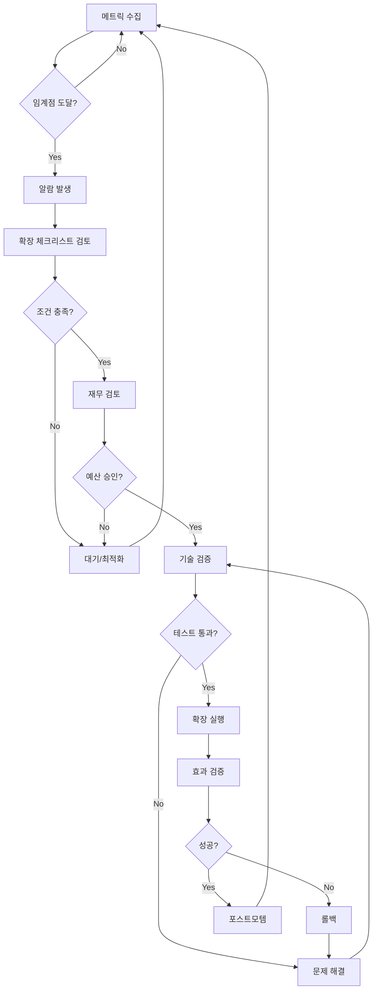

# 📈 확장 전략 상세 가이드 (Scaling Strategy)

> **언제, 어떻게, 왜 확장하는가?**  
> **작성일**: 2025년 11월 11일  
> **목표**: 데이터 기반 확장 의사결정 체계 수립

---

## 📌 Executive Summary

### 확장의 핵심 원칙

> **"측정하지 않으면 확장하지 않는다"**

```yaml
철학:
  - 감이 아닌 데이터로 결정
  - 임계점 도달 시에만 확장
  - 자동화 우선, 수동 최소화
  - 점진적 확장 (한 번에 1단계)
  
목표:
  - 성능 저하 없이 확장
  - 비용 효율 극대화
  - 다운타임 0
  - 롤백 가능한 구조
```

### 확장 트리거 체계

```
📊 메트릭 수집
    ↓
🔍 임계점 도달 확인
    ↓
⚠️ 알람 발생 (Slack)
    ↓
📋 확장 체크리스트 검토
    ↓
✅ 승인 (CTO/CFO)
    ↓
🚀 확장 실행
    ↓
📈 효과 검증
    ↓
📝 포스트모템 작성
```

---

## 🎯 A) Phase별 확장 트리거

### Phase 1 → Phase 2 (1K → 10K)

**확장 시점 판단**:

```yaml
# 다음 조건 중 3개 이상 충족 시 확장

1. 유저 수:
   - 가입자 1,000명 돌파 (7일 연속)
   - DAU 300명 이상 (5일 연속)
   - 주간 성장률 15% 이상 (3주 연속)

2. 성능:
   - GPU 사용률 > 85% (피크타임 3일 연속)
   - API p95 latency > 500ms (2일 연속)
   - LLM 큐 대기 > 10초 (피크타임 1주)
   - 캐시 미스율 > 30% (3일 연속)

3. 비즈니스:
   - 월 수익 > 월 비용 × 3 ($300)
   - 유료 전환율 > 5%
   - 이탈률 < 10%
   - NPS > 40

4. 사용자 피드백:
   - "느리다" 불만 > 10% (주간)
   - 피크타임 접속 실패 보고
   - AI 응답 대기 불만 증가
```

**확장 실행 체크리스트**:

```markdown
# Phase 1 → 2 확장 체크리스트

## 사전 준비 (D-7)
- [ ] GPU 2호기 구매 주문 ($2,000)
- [ ] RAM 32GB 추가 구매 ($200)
- [ ] 전력 용량 확인 (800W → 1,200W)
- [ ] 예산 승인 받기 (월 $180)

## 기술 검증 (D-3)
- [ ] vLLM 2-way 병렬화 테스트 (스테이징)
- [ ] Redis 캐시 정책 최적화
- [ ] Cloud Run min=1 설정 테스트
- [ ] 부하 테스트 (k6 500 동접)

## 재무 확인 (D-1)
- [ ] 월 수익 확인 ($800+)
- [ ] 현금 흐름 확인 (3개월 런웨이)
- [ ] 다음 Phase 예산 확보

## 실행 (D-Day)
- [ ] 09:00 - 전체 시스템 백업
- [ ] 10:00 - GPU 2호기 물리적 설치
- [ ] 11:00 - vLLM 재시작 (2-way)
- [ ] 12:00 - Cloud Run 설정 변경
- [ ] 13:00 - 부하 테스트 (500 VUs)
- [ ] 14:00 - 메트릭 모니터링 (2시간)
- [ ] 16:00 - 롤백 여부 결정
- [ ] 17:00 - 포스트모템 작성

## 사후 검증 (D+1 ~ D+7)
- [ ] GPU 사용률 모니터링 (60~80% 목표)
- [ ] API latency 개선 확인 (p95 < 300ms)
- [ ] 사용자 불만 감소 확인
- [ ] 비용 추이 확인 ($180 ± 10%)
```

**확장 실행 스크립트**:

```bash
#!/bin/bash
# scale_phase1_to_2.sh
# DreamSeedAI Phase 1 → 2 확장 자동화 스크립트

set -e

echo "🚀 DreamSeedAI Phase 1 → 2 확장 시작"
echo "시간: $(date)"

# 1. 사전 백업
echo "📦 Step 1/7: 전체 시스템 백업..."
pg_dump dreamseed > /backup/phase1_to_2_$(date +%Y%m%d_%H%M%S).sql
tar -czf /backup/models_$(date +%Y%m%d_%H%M%S).tar.gz /models
echo "✅ 백업 완료"

# 2. GPU 인식 확인
echo "🔍 Step 2/7: GPU 인식 확인..."
nvidia-smi
GPU_COUNT=$(nvidia-smi --list-gpus | wc -l)
if [ $GPU_COUNT -lt 2 ]; then
    echo "❌ GPU 2대 미만 감지. 하드웨어 확인 필요."
    exit 1
fi
echo "✅ GPU $GPU_COUNT 대 확인"

# 3. vLLM 2-way 병렬화
echo "⚡ Step 3/7: vLLM 2-way 병렬화..."
docker stop vllm-server || true
docker rm vllm-server || true

docker run -d \
  --name vllm-server \
  --gpus all \
  --restart always \
  -p 8000:8000 \
  -v /models:/models \
  vllm/vllm-openai:latest \
  --model /models/Llama-2-13b-chat-hf \
  --tensor-parallel-size 2 \
  --gpu-memory-utilization 0.9 \
  --max-model-len 4096

# vLLM 시작 대기
echo "⏳ vLLM 시작 대기 (60초)..."
sleep 60

# Health check
curl -f http://localhost:8000/health || {
    echo "❌ vLLM 헬스체크 실패"
    docker logs vllm-server
    exit 1
}
echo "✅ vLLM 2-way 병렬화 완료"

# 4. Redis 캐시 정책 업데이트
echo "💾 Step 4/7: Redis 캐시 정책 업데이트..."
docker exec redis redis-cli CONFIG SET maxmemory 16gb
docker exec redis redis-cli CONFIG SET maxmemory-policy allkeys-lru
echo "✅ Redis 설정 완료"

# 5. Cloud Run 확장
echo "☁️ Step 5/7: Cloud Run 설정 변경..."
gcloud run services update dreamseed-api \
  --region asia-northeast3 \
  --min-instances 1 \
  --max-instances 8 \
  --memory 4Gi \
  --cpu 2 \
  --timeout 300

echo "✅ Cloud Run 확장 완료"

# 6. 부하 테스트
echo "🧪 Step 6/7: 부하 테스트..."
k6 run --vus 500 --duration 5m /tests/load_test.js

# 7. 메트릭 확인
echo "📊 Step 7/7: 메트릭 확인..."
echo "GPU 사용률:"
nvidia-smi --query-gpu=utilization.gpu --format=csv,noheader

echo "API Latency (최근 5분):"
curl -s http://localhost:9090/api/v1/query?query=histogram_quantile\(0.95,rate\(http_request_duration_seconds_bucket[5m]\)\) | jq '.data.result[0].value[1]'

echo ""
echo "✅ Phase 1 → 2 확장 완료!"
echo ""
echo "📋 다음 단계:"
echo "1. 2시간 동안 메트릭 모니터링"
echo "2. 이상 있으면 롤백 (rollback_phase2_to_1.sh)"
echo "3. 문제 없으면 포스트모템 작성"
echo ""
echo "📊 Grafana 대시보드: https://grafana.dreamseed.ai"
echo "🔔 Slack 알람 채널: #infrastructure-alerts"
```

**롤백 스크립트**:

```bash
#!/bin/bash
# rollback_phase2_to_1.sh
# Phase 2 → 1 롤백 스크립트 (문제 발생 시)

set -e

echo "⚠️ DreamSeedAI Phase 2 → 1 롤백 시작"
echo "사유: $1"
echo "시간: $(date)"

# 1. vLLM 1-way로 복구
echo "⚡ vLLM 1-way로 복구..."
docker stop vllm-server
docker rm vllm-server

docker run -d \
  --name vllm-server \
  --gpus '"device=0"' \
  --restart always \
  -p 8000:8000 \
  -v /models:/models \
  vllm/vllm-openai:latest \
  --model /models/Llama-2-13b-chat-hf \
  --tensor-parallel-size 1

# 2. Cloud Run 축소
echo "☁️ Cloud Run 설정 복구..."
gcloud run services update dreamseed-api \
  --min-instances 0 \
  --max-instances 3

# 3. 메트릭 확인
echo "📊 롤백 후 메트릭:"
nvidia-smi
curl http://localhost:8000/health

echo "✅ 롤백 완료"
echo "📝 인시던트 리포트 작성 필요"
```

---

### Phase 2 → Phase 3 (10K → 100K)

**확장 트리거**:

```yaml
# 다음 조건 중 4개 이상 충족 시 확장

1. 유저 수:
   - 가입자 10,000명 돌파 (7일 연속)
   - DAU 2,000명 이상 (5일 연속)
   - 주간 성장률 20% 이상 (4주 연속)

2. 성능:
   - GPU 사용률 > 85% (피크타임 5일 연속)
   - API p95 latency > 300ms (3일 연속)
   - LLM 큐 대기 > 15초 (피크타임 1주)
   - DB TPS > 1,000 (피크타임)
   - Redis 메모리 사용 > 80%

3. 비즈니스:
   - 월 수익 > $5,000
   - 유료 전환율 > 8%
   - ARPU > $10
   - LTV/CAC > 2.0

4. 인프라:
   - 디스크 사용률 > 70% (DB)
   - 네트워크 대역폭 > 500 Mbps (피크)
   - API 동시 연결 > 300
```

**확장 작업**:

```bash
#!/bin/bash
# scale_phase2_to_3.sh

set -e

echo "🚀 Phase 2 → 3 확장 시작"

# 1. 백업
pg_dump dreamseed > /backup/phase2_to_3_$(date +%Y%m%d_%H%M%S).sql

# 2. GPU 3대로 증설
docker stop vllm-server
docker run -d \
  --name vllm-server \
  --gpus all \
  -p 8000:8000 \
  vllm/vllm-openai:latest \
  --model /models/Llama-2-13b-chat-hf \
  --tensor-parallel-size 3 \
  --gpu-memory-utilization 0.9

# 3. Redis 클러스터 구축
docker-compose -f redis-cluster.yml up -d

# 4. Kafka 이벤트 스트림 추가
docker-compose -f kafka.yml up -d

# 5. Cloud Run 확장
gcloud run services update dreamseed-api \
  --min-instances 2 \
  --max-instances 15

# 6. DB Read Replica 추가
# (수동 작업 - PostgreSQL Streaming Replication 설정)

echo "✅ Phase 2 → 3 확장 완료"
```

---

### Phase 3 → Phase 4 (100K → 500K)

**확장 트리거**:

```yaml
1. 유저 수:
   - 가입자 100,000명 돌파
   - DAU 20,000명 이상
   - 주간 성장률 25% 이상

2. 성능:
   - GPU 사용률 > 85% (지속)
   - API p95 > 200ms
   - DB TPS > 5,000
   - 네트워크 대역폭 > 1 Gbps

3. 비즈니스:
   - 월 수익 > $50,000
   - 유료 전환율 > 10%
   - 기업 고객 문의 증가
```

**확장 작업**:

```bash
#!/bin/bash
# scale_phase3_to_4.sh

# GPU 4대로 증설 (2 서버로 분산)
# DB HA 구성 (Primary + 4 Replicas)
# 멀티 리전 준비 (서울 + 도쿄)
```

---

### Phase 4 → Phase 5 (500K → 1M)

**확장 트리거**:

```yaml
1. 유저 수:
   - 가입자 500,000명 돌파
   - DAU 100,000명 이상

2. 성능:
   - 모든 지표가 80% 이상

3. 비즈니스:
   - 월 수익 > $500,000
   - 시장 점유율 Top 5
```

---

## 🔧 B) 자동 확장 시스템

### 1️⃣ Auto-scaling 정책

**Cloud Run HPA**:

```yaml
# cloudrun-autoscaling.yaml
apiVersion: serving.knative.dev/v1
kind: Service
metadata:
  name: dreamseed-api
spec:
  template:
    metadata:
      annotations:
        # CPU 기반 확장
        autoscaling.knative.dev/metric: "cpu"
        autoscaling.knative.dev/target: "70"
        
        # 동시 요청 수 기반
        autoscaling.knative.dev/class: "hpa.autoscaling.knative.dev"
        autoscaling.knative.dev/metric: "concurrency"
        autoscaling.knative.dev/target: "100"
        
        # 스케일 범위 (Phase별 조정)
        autoscaling.knative.dev/minScale: "2"   # Phase 3: 2
        autoscaling.knative.dev/maxScale: "15"  # Phase 3: 15
        
        # 스케일 다운 지연
        autoscaling.knative.dev/scaleDownDelay: "5m"
        
        # 스케일 업 속도
        autoscaling.knative.dev/targetBurstCapacity: "200"
```

### 2️⃣ GPU 워커 자동 증설

```python
# gpu_autoscaler.py
import asyncio
from datetime import datetime, timedelta
from dataclasses import dataclass

@dataclass
class GPUMetrics:
    utilization: float  # 0.0 ~ 1.0
    queue_length: int
    avg_latency_ms: float
    timestamp: datetime

class GPUAutoscaler:
    """GPU 자동 확장 시스템"""
    
    def __init__(self):
        self.current_workers = 3
        self.min_workers = 1
        self.max_workers = 5
        
        # 확장 임계점
        self.scale_up_threshold = 0.85
        self.scale_down_threshold = 0.30
        
        # Cooldown 기간 (급격한 변동 방지)
        self.cooldown_period = timedelta(minutes=10)
        self.last_scale_time = datetime.now()
        
        # 연속 알람 카운터
        self.consecutive_high = 0
        self.consecutive_low = 0
    
    async def check_and_scale(self, metrics: GPUMetrics):
        """메트릭 기반 자동 확장 결정"""
        
        # Cooldown 기간 체크
        if datetime.now() - self.last_scale_time < self.cooldown_period:
            return
        
        # Scale Up 조건
        if self._should_scale_up(metrics):
            self.consecutive_high += 1
            self.consecutive_low = 0
            
            # 3번 연속 임계점 초과 시 확장
            if self.consecutive_high >= 3:
                await self._scale_up(metrics)
                self.consecutive_high = 0
        
        # Scale Down 조건
        elif self._should_scale_down(metrics):
            self.consecutive_low += 1
            self.consecutive_high = 0
            
            # 5번 연속 낮은 사용률 시 축소
            if self.consecutive_low >= 5:
                await self._scale_down(metrics)
                self.consecutive_low = 0
        
        else:
            # 정상 범위
            self.consecutive_high = 0
            self.consecutive_low = 0
    
    def _should_scale_up(self, metrics: GPUMetrics) -> bool:
        """확장 필요 여부 판단"""
        return (
            metrics.utilization > self.scale_up_threshold or
            metrics.queue_length > 20 or
            metrics.avg_latency_ms > 5000
        )
    
    def _should_scale_down(self, metrics: GPUMetrics) -> bool:
        """축소 가능 여부 판단"""
        return (
            metrics.utilization < self.scale_down_threshold and
            metrics.queue_length == 0 and
            metrics.avg_latency_ms < 1000
        )
    
    async def _scale_up(self, metrics: GPUMetrics):
        """GPU 워커 증설"""
        if self.current_workers >= self.max_workers:
            await self._alert_max_capacity(metrics)
            return
        
        print(f"🔴 GPU 확장 필요! (현재: {self.current_workers}대)")
        print(f"   사용률: {metrics.utilization:.1%}")
        print(f"   큐 대기: {metrics.queue_length}개")
        print(f"   평균 지연: {metrics.avg_latency_ms:.0f}ms")
        
        # 실제 확장 작업
        # 1. 물리 GPU 추가 (수동 작업 필요)
        await self._notify_oncall("GPU 증설 필요", metrics)
        
        # 2. 임시 조치: GCP Spot GPU 시작
        await self._start_spot_gpu()
        
        self.last_scale_time = datetime.now()
    
    async def _scale_down(self, metrics: GPUMetrics):
        """GPU 워커 감소"""
        if self.current_workers <= self.min_workers:
            return
        
        print(f"🟢 GPU 축소 가능 (현재: {self.current_workers}대)")
        
        # Spot GPU 종료
        await self._stop_spot_gpu()
        
        self.last_scale_time = datetime.now()
    
    async def _alert_max_capacity(self, metrics: GPUMetrics):
        """최대 용량 도달 알람"""
        message = f"""
        🚨 GPU 최대 용량 도달!
        
        현재: {self.current_workers}/{self.max_workers}대
        사용률: {metrics.utilization:.1%}
        큐 대기: {metrics.queue_length}개
        
        조치:
        1. 긴급 GPU 증설 검토
        2. 부하 분산 확인
        3. 캐시 최적화
        """
        
        await send_slack_alert(message, severity="critical")
    
    async def _notify_oncall(self, title: str, metrics: GPUMetrics):
        """온콜 엔지니어 알림"""
        await send_slack_alert(
            f"{title}\n\n사용률: {metrics.utilization:.1%}",
            severity="warning"
        )
    
    async def _start_spot_gpu(self):
        """GCP Spot GPU 인스턴스 시작"""
        import subprocess
        
        subprocess.run([
            "gcloud", "compute", "instances", "create",
            f"gpu-spot-{datetime.now():%Y%m%d%H%M%S}",
            "--zone=us-central1-a",
            "--machine-type=n1-standard-8",
            "--accelerator=type=nvidia-tesla-t4,count=1",
            "--preemptible",
            "--maintenance-policy=TERMINATE",
        ])
        
        print("✅ Spot GPU 인스턴스 시작됨")
    
    async def _stop_spot_gpu(self):
        """Spot GPU 종료"""
        # Spot 인스턴스 목록 조회 및 삭제
        print("🛑 Spot GPU 인스턴스 종료")


# 메인 루프
async def main():
    autoscaler = GPUAutoscaler()
    
    while True:
        # Prometheus에서 메트릭 수집
        metrics = await fetch_gpu_metrics()
        
        # 자동 확장 결정
        await autoscaler.check_and_scale(metrics)
        
        # 30초마다 체크
        await asyncio.sleep(30)

if __name__ == "__main__":
    asyncio.run(main())
```

### 3️⃣ DB Read Replica 자동 추가

```python
# db_autoscaler.py
class DBAutoscaler:
    """DB Read Replica 자동 확장"""
    
    async def check_and_scale(self):
        # Primary DB 부하 확인
        primary_load = await get_db_load()
        
        if primary_load > 0.80:
            # Read Replica 추가
            await add_read_replica()
```

---

## 📊 C) 메트릭 수집 & 모니터링

### 1️⃣ Prometheus 메트릭

```yaml
# prometheus.yml
global:
  scrape_interval: 15s
  evaluation_interval: 15s

scrape_configs:
  # API 서버
  - job_name: 'api-server'
    static_configs:
      - targets: ['localhost:8080']
    metrics_path: '/metrics'
  
  # GPU 메트릭
  - job_name: 'gpu'
    static_configs:
      - targets: ['localhost:9400']
  
  # PostgreSQL
  - job_name: 'postgres'
    static_configs:
      - targets: ['localhost:9187']
  
  # Redis
  - job_name: 'redis'
    static_configs:
      - targets: ['localhost:9121']

# 알람 규칙
rule_files:
  - 'alerts/scaling_rules.yml'
```

### 2️⃣ 확장 알람 규칙

```yaml
# alerts/scaling_rules.yml
groups:
- name: scaling_alerts
  interval: 1m
  rules:
  
  # GPU 확장 필요
  - alert: GPUScaleUpNeeded
    expr: gpu_utilization_percent > 85
    for: 5m
    labels:
      severity: warning
      component: gpu
    annotations:
      summary: "GPU 확장 필요"
      description: "GPU 사용률 {{ $value }}% (임계: 85%)"
      action: "GPU 증설 검토"
  
  # API 확장 필요
  - alert: APIScaleUpNeeded
    expr: rate(http_requests_total[5m]) > 100
    for: 5m
    labels:
      severity: warning
    annotations:
      summary: "API 서버 확장 필요"
      description: "RPS {{ $value }} (임계: 100)"
  
  # DB 확장 필요
  - alert: DBScaleUpNeeded
    expr: pg_stat_database_tup_returned > 10000
    for: 5m
    labels:
      severity: warning
    annotations:
      summary: "DB Read Replica 추가 필요"
  
  # 캐시 확장 필요
  - alert: CacheScaleUpNeeded
    expr: redis_memory_used_bytes / redis_memory_max_bytes > 0.80
    for: 5m
    labels:
      severity: warning
    annotations:
      summary: "Redis 메모리 부족"
      description: "사용률 {{ $value | humanizePercentage }}"
```

### 3️⃣ Grafana 대시보드

```json
{
  "dashboard": {
    "title": "확장 의사결정 대시보드",
    "panels": [
      {
        "title": "GPU 사용률 추이",
        "targets": [{
          "expr": "avg(gpu_utilization_percent)"
        }],
        "thresholds": [
          {"value": 85, "color": "red", "label": "확장 필요"},
          {"value": 30, "color": "green", "label": "축소 가능"}
        ]
      },
      {
        "title": "확장 이벤트 타임라인",
        "type": "annotations",
        "datasource": "Prometheus",
        "query": "ALERTS{alertname=~\".*ScaleUp.*\"}"
      },
      {
        "title": "Phase 전환 예측",
        "type": "graph",
        "targets": [{
          "expr": "predict_linear(total_users[1h], 3600 * 24 * 7)"
        }],
        "annotations": [
          {"value": 10000, "label": "Phase 2 → 3"},
          {"value": 100000, "label": "Phase 3 → 4"}
        ]
      }
    ]
  }
}
```

---

## 🧪 D) 부하 테스트

### 1️⃣ k6 부하 테스트 시나리오

```javascript
// load_test.js - Phase별 부하 테스트
import http from 'k6/http';
import { check, sleep } from 'k6';
import { Rate } from 'k6/metrics';

// 커스텀 메트릭
const errorRate = new Rate('errors');

// Phase별 시나리오
export let options = {
  scenarios: {
    // Phase 1: 100 동접
    phase1: {
      executor: 'constant-vus',
      vus: 100,
      duration: '5m',
      tags: { phase: '1' },
    },
    
    // Phase 2: 500 동접
    phase2: {
      executor: 'ramping-vus',
      startVUs: 0,
      stages: [
        { duration: '2m', target: 500 },
        { duration: '5m', target: 500 },
        { duration: '2m', target: 0 },
      ],
      tags: { phase: '2' },
    },
    
    // Phase 3: 3,000 동접
    phase3: {
      executor: 'ramping-vus',
      startVUs: 0,
      stages: [
        { duration: '5m', target: 3000 },
        { duration: '10m', target: 3000 },
        { duration: '5m', target: 0 },
      ],
      tags: { phase: '3' },
    },
  },
  
  thresholds: {
    'http_req_duration{phase:1}': ['p(95)<500'],  // Phase 1: p95 < 500ms
    'http_req_duration{phase:2}': ['p(95)<300'],  // Phase 2: p95 < 300ms
    'http_req_duration{phase:3}': ['p(95)<200'],  // Phase 3: p95 < 200ms
    'errors': ['rate<0.01'],  // 에러율 < 1%
  },
};

export default function () {
  // API 요청 (문제 조회)
  let res1 = http.get('https://api.dreamseed.ai/v1/questions?subject=math');
  check(res1, {
    'status is 200': (r) => r.status === 200,
    'response time < 500ms': (r) => r.timings.duration < 500,
  }) || errorRate.add(1);
  
  sleep(1);
  
  // AI 피드백 요청 (GPU 사용)
  let res2 = http.post('https://api.dreamseed.ai/v1/feedback', JSON.stringify({
    question_id: 'q123',
    user_answer: 'x = 5',
  }), {
    headers: { 'Content-Type': 'application/json' },
  });
  
  check(res2, {
    'AI feedback success': (r) => r.status === 200,
    'AI response time < 5s': (r) => r.timings.duration < 5000,
  }) || errorRate.add(1);
  
  sleep(2);
}

// 테스트 종료 시 요약
export function handleSummary(data) {
  return {
    'summary.json': JSON.stringify(data),
    stdout: textSummary(data, { indent: ' ', enableColors: true }),
  };
}
```

**실행 방법**:

```bash
# Phase 1 테스트 (100 동접)
k6 run --scenario phase1 load_test.js

# Phase 2 테스트 (500 동접)
k6 run --scenario phase2 load_test.js

# Phase 3 테스트 (3,000 동접)
k6 run --scenario phase3 load_test.js

# 전체 테스트
k6 run load_test.js
```

### 2️⃣ GPU 부하 테스트

```python
# gpu_load_test.py
import asyncio
import aiohttp
import time
from statistics import mean, stdev

async def test_llm_endpoint(session, prompt):
    """LLM 엔드포인트 부하 테스트"""
    start = time.time()
    
    async with session.post(
        'http://localhost:8000/v1/completions',
        json={
            'model': 'Llama-2-13b-chat-hf',
            'prompt': prompt,
            'max_tokens': 200,
        }
    ) as resp:
        result = await resp.json()
        latency = (time.time() - start) * 1000  # ms
        return latency, result

async def run_load_test(concurrent_users=100, duration_seconds=300):
    """동시 사용자 부하 테스트"""
    
    prompts = [
        "이차방정식 x^2 + 5x + 6 = 0을 풀어주세요.",
        "삼각함수의 미분을 설명해주세요.",
        "뉴턴의 운동 법칙을 설명해주세요.",
    ]
    
    latencies = []
    errors = 0
    
    async with aiohttp.ClientSession() as session:
        start_time = time.time()
        
        while time.time() - start_time < duration_seconds:
            # 동시 요청 발생
            tasks = [
                test_llm_endpoint(session, prompts[i % len(prompts)])
                for i in range(concurrent_users)
            ]
            
            results = await asyncio.gather(*tasks, return_exceptions=True)
            
            for result in results:
                if isinstance(result, Exception):
                    errors += 1
                else:
                    latencies.append(result[0])
            
            await asyncio.sleep(1)
    
    # 통계
    latencies.sort()
    p50 = latencies[len(latencies) // 2]
    p95 = latencies[int(len(latencies) * 0.95)]
    p99 = latencies[int(len(latencies) * 0.99)]
    
    print(f"""
    ===부하 테스트 결과===
    동시 사용자: {concurrent_users}명
    테스트 시간: {duration_seconds}초
    총 요청: {len(latencies) + errors}
    성공: {len(latencies)}
    실패: {errors}
    
    지연시간:
    - 평균: {mean(latencies):.0f}ms
    - p50: {p50:.0f}ms
    - p95: {p95:.0f}ms
    - p99: {p99:.0f}ms
    
    에러율: {errors / (len(latencies) + errors) * 100:.2f}%
    """)

if __name__ == "__main__":
    # Phase 1: 100 동접
    asyncio.run(run_load_test(concurrent_users=100, duration_seconds=300))
```

---

## 📋 E) 확장 의사결정 플로우



---

## 📝 F) 포스트모템 템플릿

```markdown
# 확장 포스트모템: Phase X → Y

## 기본 정보
- 날짜: YYYY-MM-DD
- 담당: @engineer
- Phase: X → Y
- 소요 시간: N시간

## 확장 이유
- 트리거된 조건:
  - [ ] 유저 수 임계점
  - [ ] GPU 사용률 > 85%
  - [ ] API latency > Xms
  - [ ] 기타: ___

## 실행 내용
1. GPU: N대 → M대
2. Cloud Run: min=A → min=B
3. 기타: ___

## 결과
### 성능 개선
- API p95: Xms → Yms (-Z%)
- GPU 사용률: X% → Y%
- 에러율: X% → Y%

### 비용 변화
- 예상: $X/월
- 실제: $Y/월
- 차이: $Z/월

## 문제점
- 문제 1: ___
- 해결: ___

## 교훈
1. 잘한 점: ___
2. 개선할 점: ___
3. 다음 확장 시 주의사항: ___

## 액션 아이템
- [ ] 문서 업데이트
- [ ] 모니터링 개선
- [ ] 자동화 스크립트 수정
```

---

## ✅ G) 체크리스트 요약

### 확장 전 체크리스트
- [ ] 메트릭 3개 이상 임계점 도달
- [ ] 예산 승인 (CFO)
- [ ] 기술 검증 (스테이징 테스트)
- [ ] 백업 완료
- [ ] 롤백 계획 수립
- [ ] 온콜 엔지니어 대기

### 확장 중 체크리스트
- [ ] 실시간 모니터링
- [ ] Slack 알람 확인
- [ ] 헬스체크 통과
- [ ] 부하 테스트 실행
- [ ] 사용자 피드백 모니터링

### 확장 후 체크리스트
- [ ] 메트릭 개선 확인
- [ ] 비용 추이 확인
- [ ] 포스트모템 작성
- [ ] 문서 업데이트
- [ ] 다음 Phase 준비

---

## 🎯 다음 문서

확장 전략이 완성되었습니다! 이제 마지막으로:

**DISASTER_RECOVERY.md** (장애 복구 계획)
- 장애 시나리오별 대응
- 백업/복구 절차
- RPO/RTO 목표
- 온콜 가이드

작성하시겠습니까? 🚀

---

**작성**: GitHub Copilot  
**날짜**: 2025년 11월 11일  
**버전**: 1.0  
**이전**: [ARCHITECTURE_MASTERPLAN.md](./ARCHITECTURE_MASTERPLAN.md)  
**다음**: [DISASTER_RECOVERY.md](./DISASTER_RECOVERY.md)
